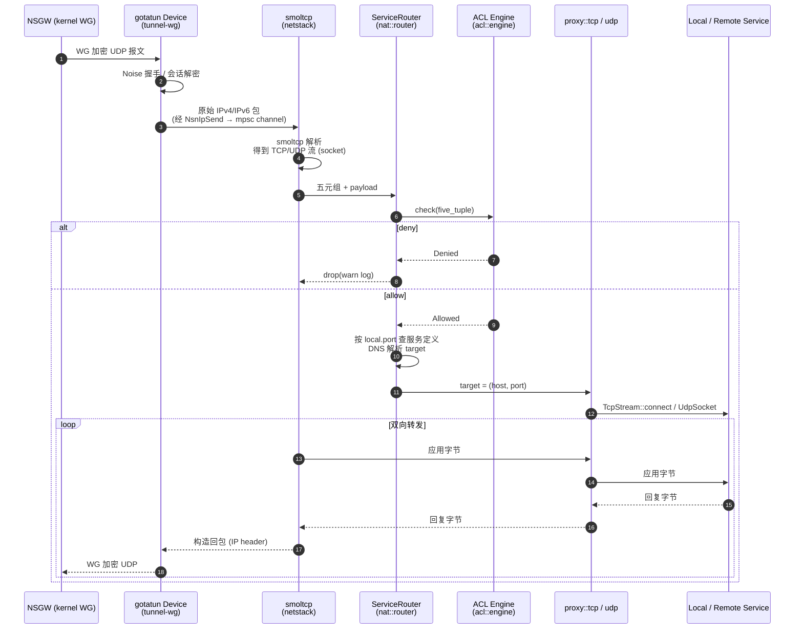
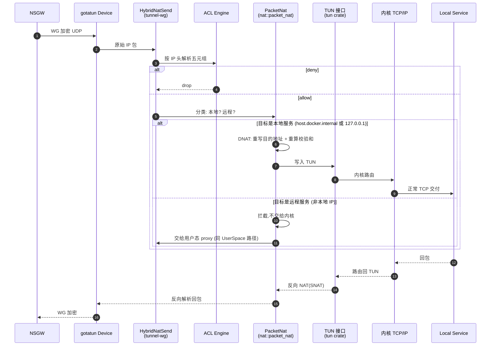
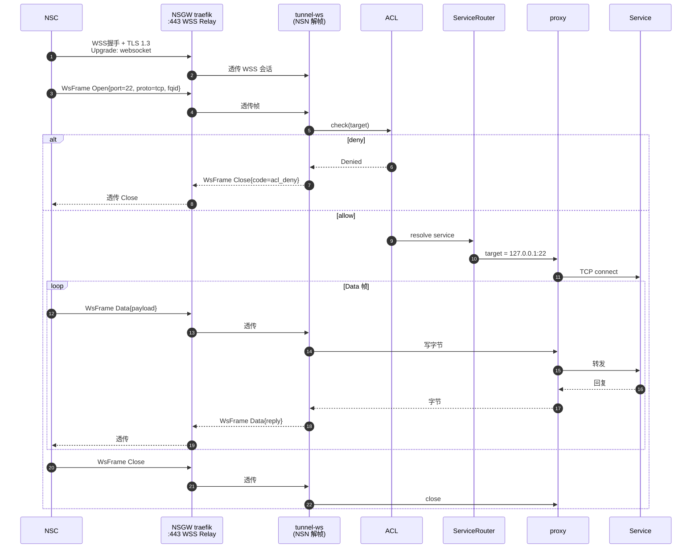
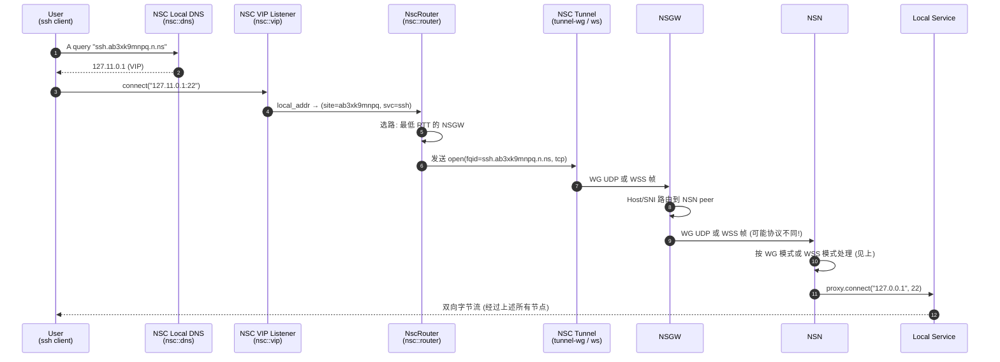

# 数据流: WG 模式 · WSS 模式 · 端到端

> 目标读者: 需要在脑中画出"一个字节从用户键盘到远端 SSH 服务端"完整路径的人。
>
> 本文按"一个包的生命周期"组织,而不是按 crate 依赖。每个阶段都给出源码位置供对照。

## 数据面的三种形态

NSN 支持三种数据面形态,由 CLI 参数 `--data-plane` 选择:

| 模式 | 需要 root / CAP_NET_ADMIN | 使用 WireGuard | 每连接额外 TCP 状态机 | 典型场景 |
|------|:------------------------:|:-------------:|:--------------------:|---------|
| `tun` | ✓ | ✓ | 0(本地服务) / 1(远程服务) | 物理服务器、有特权容器 |
| `userspace`(默认) | ✗ | ✓ | 2(smoltcp + proxy) | 无特权容器、开发机 |
| `wss` | ✗ | ✗ | 1(仅 proxy) | 只能通过 TCP:443 出去的网络 |

> 三种模式的**共同出口**都是 `proxy::tcp` / `proxy::udp` + `ServiceRouter`,这是一个蓄意的设计选择 —— 无论包从哪条路径进来,最终都收敛在同一个 ACL/路由判定点。

下面按模式分别展开。

## WG 模式 (UserSpace)

默认模式,也是生产上**最常用**的部署形态。



### 关键阶段与源码位置

| 阶段 | 做了什么 | 关键类型 / 函数 | 源码 |
|-----|---------|----------------|------|
| ① WG 解密 | Noise 会话解密,吐出原始 IP 包 | `gotatun::Device` | `crates/tunnel-wg/src/lib.rs` |
| ② Device → smoltcp | 通过 `NsnIpSend` 把包送到 mpsc | `NsnIpSend::send` | `crates/tunnel-wg/src/ip_adapter.rs` |
| ③ smoltcp 解析 | TCP/UDP 流重组,提取 (src, dst, proto) | `netstack::stack` | `crates/netstack/src/stack.rs` |
| ④ ACL + 路由 | 合并判定,返回 target | `ServiceRouter::resolve` | `crates/nat/src/router.rs` |
| ⑤ proxy connect | 打开到目标的真实 TCP/UDP | `proxy::tcp::handle` | `crates/proxy/src/tcp.rs` |
| ⑥ 回包 | smoltcp 构造 IP header → gotatun 加密 | 同上反向 | |

### 为什么是"每连接两个 TCP 状态机"

UserSpace 模式中:
- **状态机 #1**(smoltcp): 解析 WG 解密后的 IP 包,把它转换成应用可读的字节流。
- **状态机 #2**(内核): `proxy.connect(target)` 打开一个真正的 TCP,让内核处理到目标服务的连接。

这不是为了性能,而是为了让 ACL 和服务路由能以"字节流 + 五元组"这个高层视角工作,而不是手动处理 IP 分片、TCP 重传、MTU。

## WG 模式 (TUN)

TUN 模式在有 root 或 `CAP_NET_ADMIN` 的环境下更高效 —— 把**内核**重新拉进链路,省掉 smoltcp 这层用户态状态机。



### TUN 模式的价值所在

看似"TUN 更快",但**真正的价值不是性能**:

- **本地服务路径**: 内核直接投递,0 个额外 TCP 状态机 —— 比 UserSpace 少一层(smoltcp)。
- **远程服务路径**: TUN 模式仍然走 proxy,只比 UserSpace 省了一层 —— 还是 1 个状态机。

性能差异在万兆以下网络中微乎其微。TUN 模式的真正目的是:

1. 让"本地服务访问"回归到内核 TCP/IP 栈,**避免用 smoltcp 实现完整 TCP 语义**(拥塞控制、fast retransmit、TSO/GRO 等)。
2. 对包级 NAT 场景(如 UDP 游戏流量)更贴近"真正的网关"行为。

### 为什么还需要 ACL 作用在原始 IP 头

原始 IP 头就有完整的五元组(`src_ip` `dst_ip` `proto` `src_port` `dst_port`),已经足够做 ACL 判定 —— **不需要 smoltcp**。对应解析代码:

```rust
// 概念等价,见 transport-design.md 的说明
let src_ip  = &packet[12..16];
let dst_ip  = &packet[16..20];
let proto   = packet[9];
let ihl     = (packet[0] & 0x0f) as usize * 4;
let src_port = u16::from_be_bytes([packet[ihl], packet[ihl+1]]);
let dst_port = u16::from_be_bytes([packet[ihl+2], packet[ihl+3]]);
```

这是 TUN 模式下"无需 smoltcp 就能做 ACL"的前提。

## WSS 模式

WSS 模式完全不使用 WireGuard。NSGW 只扮演一个 **TLS 1.3 + WebSocket 中继**的角色,NSN 和 NSC 之间通过自定义的 `WsFrame` 二进制协议承载应用流。



### WSS 模式的关键差异

- **不加密两次**: 整条链路只做 TLS 一次(NSC↔NSGW↔NSN 端到端是同一条 WSS)。相比 "TLS(WSS) + Noise(WG)" 双层加密,WSS 模式在握手成本和 CPU 上更省,但**失去了端到端的前向保密**(NSGW 能看到明文 `WsFrame`)。
- **使用 `WsFrame` 二进制协议**: 自定义帧格式,包含 `Open` / `Data` / `Close` / `CloseAck` 四种命令。一条 WSS 连接上可以多路复用多个应用流(stream id)。
- **天然走 :443**: 对严格防火墙友好;几乎无法被区分于普通 HTTPS。

`WsFrame` 定义见 `crates/tunnel-ws/src/lib.rs`。

## 端到端数据流: NSC → NSGW → NSN → Service

把 NSC 这一端补齐,就是一个完整的"用户访问远端服务"链路。



> 图上 `GW` 到 `NSN` 可以与 `NSC` 到 `GW` 使用不同的传输协议。这正是 "两跳独立选路" 的设计初衷,详见 [transport-design.md](./transport-design.md)。

### NSC 侧的关键决策

| 阶段 | 做了什么 | 源码 |
|-----|---------|------|
| 本地 DNS 应答 | 把 `*.n.ns` 解析到 `127.11.x.x` VIP | `crates/nsc/src/dns.rs` |
| VIP listener | 每个 VIP 起一个 TCP/UDP 监听器,accept 后传给 NscRouter | `crates/nsc/src/vip.rs` |
| NscRouter | 按 VIP + 目的端口 → (site, service) | `crates/nsc/src/router.rs` |
| HTTP 代理 | 可选的 HTTP CONNECT / HTTP proxy 入口 | `crates/nsc/src/http_proxy.rs` |

## 回包路径的关键不变量

**入站数据流**经过多跳,**回包**必须走**同一条路径**(same gateway,same tunnel),否则:
- 应用层 TCP 连接会因源地址变化而 reset。
- 状态化的 NAT / connection tracking 在中间节点上无法正确匹配。

`ConntrackTable`(`crates/nat/src/packet_nat.rs:78`)在 TUN 模式下记录每条连接的五元组与反向 NAT 元数据;UserSpace 模式下,smoltcp socket 自身维护同样的"来源→目的"语义。NSGW 端通过 peer 路由天然保证"原路返回"(WG 按 peer 的 allowed-ip 匹配;WSS 按 stream id)。

## 控制面事件如何影响数据面

控制面永远不直接操作数据面的字节。它只**推送配置**,由各 crate 自己订阅并调整行为:

| SSE 事件 | 订阅方 | 触发的动作 |
|---------|--------|-----------|
| `wg_config` | `tunnel-wg` | 通过 gotatun UAPI 动态增删 peer,无需重启 |
| `proxy_config` | `nat::router` | 刷新 `ServiceRouter` 规则表 |
| `acl_policy` | `acl::engine` | 合并后(交集)热加载 ACL |
| `gateway_config` | `connector::multi` | 更新 `MultiGatewayManager` 的网关清单 |
| `routing_config` | `nsc::router` | 更新 FQID → (site, service) 映射 |
| `dns_config` | `nsc::dns` | 刷新本地 DNS 表 |

参考 `crates/control/src/messages.rs` 和 `crates/control/src/merge.rs`。

## 出站 (NSN → 远端) 数据流

上面讨论的都是"入站流量"(远端用户访问站点服务)。出站流量(NSN 自己发起对远程服务的请求)逻辑其实**对称**:

- `services.toml` 中如果配置了 `host = "some-remote.example.com"`,意味着这是一个 **remote service**。
- 入站解密后,`ServiceRouter::resolve` 解析出目标是**远程地址**,`proxy.connect` 会打开到 `example.com` 的真实 TCP —— 这个 TCP 直接通过 NSN 所在机器的内核网络栈出去,**不再回到 WG 隧道**。
- 这让 NSN 既是"站点服务的前门",也是"代理出口"。

TUN 模式下**本地服务**路径需要 SNAT(把源地址改写为 `tun_ip`,让内核从 TUN 原路回包),由 `HybridNatSend` 在封包阶段完成,反向由 `HybridNatRecv` 结合 `ConntrackTable` 还原 —— 见 `crates/nat/src/packet_nat.rs:192`(`HybridNatSend`)与 `crates/nat/src/packet_nat.rs:343`(`HybridNatRecv`)。

## 性能速览

**带宽基准**(`just test-benchmark`,`iperf3`):

| 模式 | 典型吞吐 | 典型延迟开销 |
|------|---------|-------------|
| TUN | 接近物理带宽 | ~0.3 ms |
| UserSpace | 与 TUN 接近(wg 是瓶颈) | ~0.5 ms |
| WSS | 受限于 TCP/TLS 加解密 | ~1 ms + RTT |

> 数字随 CPU 和网卡变化很大,`tests/docker/docker-compose.benchmark.yml` 是可重复的基准环境。

## 给实现者的提醒

- **不要在 `ServiceRouter::resolve` 之外的地方做 ACL 判定**。这是蓄意的单点设计 —— 审计、策略测试、日志都依赖这个不变量。
- **不要把 smoltcp 的 socket 对象跨任务持有**。它不是 `Send + Sync`,应该在单一异步任务内完成读写。
- **不要在 WG 模式下绕过 gotatun 直接操作 UDP**。动态 peer 管理依赖 UAPI,gotatun 的状态轮询给 `/api/tunnels` 提供握手计数。
- **WSS 模式不要重建 WG 状态**。它已经不用 WireGuard,任何尝试维护 peer 表的代码都是 bug。
