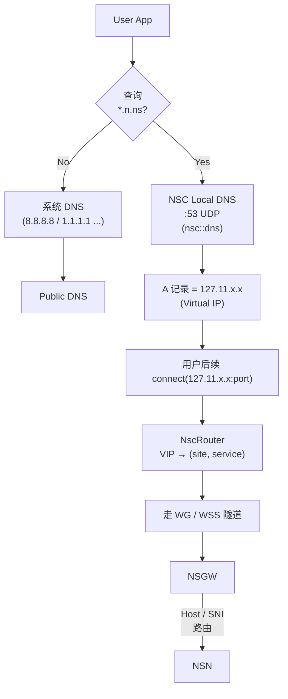
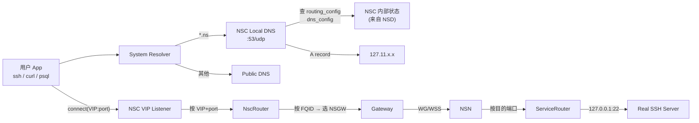

# DNS 命名体系: `.ns` 命名空间

> 目标读者: 所有会在代码、配置、日志里看到 `*.n.ns` 的人。
>
> 本文回答三个问题: **为什么用 `.ns`**、**命名规则是什么**、**谁在何处负责解析**。

## 为什么是 `.ns`

`.ns` 是 NSIO 内部使用的**非真实顶级域名**(TLD)。IANA / ICANN 从未也不会签发 `.ns`,因此:

- **不会与公网 DNS 冲突**: 任何公网 DNS 查询 `*.ns` 都返回 NXDOMAIN。
- **不需要购买域名**: NSIO 用户不需要拥有任何域名所有权。
- **不影响系统 resolver 配置**: 用户不需要把 NSIO 的 DNS 服务器设为系统默认 —— 只有当查询落在 `*.ns` 时才走 NSC 本地 DNS。

与之对比的方案及其问题:
- 用真实 TLD(如 `.nsio.net`): 需要注册费用,DNS 泄漏会把内部拓扑暴露给公网。
- 用 `.local`(mDNS): 语义保留,在 macOS 和 Windows 上与 Bonjour/LLMNR 冲突。
- 用 `.internal`(RFC 8375): 语义是"现场使用",一旦被系统识别会引起额外回退行为。
- 用 IP 直写: 失去人类可读性,无法在配置文件中稳定引用服务。

所以选择一个**保证不会被分配的、短的**字符串。`ns` 同时是 "NSIO 生态" 的天然缩写。

## 命名格式总览

```
{identifier}.{component}.ns

component 四种:
  n.ns    NSN (站点节点) 暴露的服务
  gw.ns   NSGW (网关) 实例端点
  d.ns    NSD (控制中心) 实例端点
  c.ns    NSC (客户端) 侧虚拟地址
```

| 域名模式 | 组件 | 典型用途 | 举例 |
|---------|------|---------|------|
| `{service}.{node_id}.n.ns` | NSN | 暴露给远端用户访问的站点服务 | `ssh.ab3xk9mnpq.n.ns` |
| `{gw_id}.gw.ns` | NSGW | 网关端点,用在 `gateway_config` 事件 | `us-east.gw.ns` |
| `{instance_id}.d.ns` | NSD | NSD 实例端点,用在注册和 SSE URL | `primary.d.ns` |
| `{client_id}.c.ns` | NSC | 客户端标识(日志/审计) | `roy-laptop.c.ns` |

## FQID: NSN 服务的完全限定标识

**FQID**(Fully-Qualified Identifier)是 NSIO 对"跨全网唯一标识一个 NSN 服务"的术语。格式:

```
{service}.{node_id}.n.ns
     │          │       │
     │          │       └─ 固定后缀,表明这是 NSN 服务
     │          └─ NSN 节点的 nanoid(10)
     └─ services.toml 中 [services.NAME] 的 NAME
```

举例:

```toml
# NSN 侧 services.toml
[services.web]
host = "127.0.0.1"
port = 80
proto = "tcp"

[services.ssh]
host = "127.0.0.1"
port = 22
proto = "tcp"

[services.db]
host = "127.0.0.1"
port = 5432
proto = "tcp"
```

假设这台 NSN 的 `node_id = ab3xk9mnpq`,则生成三个 FQID:

- `web.ab3xk9mnpq.n.ns`
- `ssh.ab3xk9mnpq.n.ns`
- `db.ab3xk9mnpq.n.ns`

用户可以直接这样用:

```bash
ssh user@ssh.ab3xk9mnpq.n.ns
psql -h db.ab3xk9mnpq.n.ns -U postgres
curl http://web.ab3xk9mnpq.n.ns/
```

## Node ID 的生成规则

`node_id` 由 **NSD 在注册时生成**,规则:

- **字符集**: `0-9 a-z`(仅小写字母和数字)
- **长度**: `10`
- **算法**: `nanoid`,自定义字母表
- **原因**:
  - 全小写: DNS 查询对大小写不敏感,避免客户端归一化错误。
  - 无特殊字符: 符合 DNS 标签语法([RFC 1035](https://datatracker.ietf.org/doc/html/rfc1035))。
  - 长度 10: 36^10 ≈ 3.6 × 10^15,碰撞概率足够低;同时短到能一口读出来。

参考实现(NSD mock 侧,TypeScript):

```typescript
// tests/docker/nsd-mock/ 中的等价实现
import { customAlphabet } from "nanoid";
const alphabet = "0123456789abcdefghijklmnopqrstuvwxyz";
const nodeId = customAlphabet(alphabet, 10)();
// → "ab3xk9mnpq"
```

为什么**不用 UUID**?
- 太长(36 字符),嵌入域名不友好。
- 含 `-`,虽然在 DNS 标签中合法,但切分视觉不清。
- 随机熵远超需要 —— NSIO 只需要"单个 NSD realm 内不重复"的量级。

## 谁在何处解析这些域名

### `*.n.ns` 的解析路径



> 入站面的另一条路径: 当站点主动把某个 HTTP(S) 服务**对公网暴露**时,NSD 会为它单独签发一个**公网域名**(例如 `myapp.<tenant>.example.com`,CNAME 到 NSGW),浏览器/`curl` 直接 `https://` 访问该域名。NSGW 的 traefik 按 `Host` / SNI 匹配这个公网域名(**不是 `*.n.ns`**)后桥接到目标 NSN,并可在这一层叠加 OIDC / 鉴权 / 限速等中间件。详见 [ecosystem.md 的"无 NSC 入站"](./ecosystem.md#无-nsc-入站-browser--nsgw--nsn)。`*.n.ns` 只在 NSC 本地 DNS 生效,公网 resolver 返回 NXDOMAIN,浏览器**永远到不了** `*.n.ns`。

### `*.gw.ns` / `*.d.ns`

这两类域名主要**出现在控制面配置和日志里**,不出现在用户应用代码里。解析方式:

- 由 NSD 下发的配置事件直接给出 **IP 端点**(`IP:port`),域名只是标签 —— NSN / NSC / NSGW 不需要真正查询 DNS。
- NSC 本地 DNS 会在 debug 模式下为 `*.gw.ns` 和 `*.d.ns` 返回占位 IP,方便 `getent` / `dig` 排障。

### `*.c.ns`

客户端侧标识,主要用在审计日志和 `services_report` 中描述"谁在访问"。实际连接中几乎不用到真实 DNS 解析。

## 为什么 NSC 需要本地 DNS 而不是修改 `/etc/hosts`

两种候选方案,NSIO 明确选了 DNS:

| 方案 | 优点 | 缺点 | 结论 |
|------|------|------|-----|
| `/etc/hosts` | 不需要 root 跑 resolver | 需要 root 写 `/etc/hosts`;无法热更新;对通配符域名支持差 | ✗ |
| 本地 DNS 服务器 | 支持 `*.n.ns` 通配;热更新;跨平台 | 需要让系统 resolver 知道它 | ✓ |

### 如何让系统 resolver 找到 NSC DNS

- **systemd-resolved (Linux)**: NSC DNS 默认监听 `127.53.53.53:53`(四个 53 的助记地址,避开 systemd-resolved 占用的 `127.0.0.53:53`)。让系统把 `*.n.ns` 导向 NSC 有两条路:(1) 把 `127.53.53.53` 放到 `/etc/resolv.conf` 首行;(2) `resolvectl domain <iface> '~n.ns'` + `resolvectl dns <iface> 127.53.53.53`,让 systemd-resolved 按域转发。NSC 本身不动系统配置。
- **macOS**: `/etc/resolver/ns` 文件指向 NSC。
- **Windows**: NRPT(Name Resolution Policy Table)规则把 `.ns` 后缀导向 NSC。

上述由 NSC 二进制在启动时自动配置(可选,需要对应权限)。否则用户需要手动设置 `/etc/resolv.conf` 等效项。

## Virtual IP: `127.11.x.x` (UserSpace/WSS) · `100.64.x.x` (TUN)

NSC 把每个 **site(node_id)** 映射到**一个 VIP**,同一 site 下的多个服务**共享 VIP**,用**端口**区分 —— 分配粒度是 **site,不是 FQID**。

| 模式 | 前缀 | 源码 |
|------|------|-----|
| `userspace` / `wss`(默认) | `127.11.0.0/16` | `VipAllocator::new_userspace`(`crates/nsc/src/vip.rs:19`) |
| `tun` | `100.64.0.0/16` | `VipAllocator::new_tun`(`crates/nsc/src/vip.rs:24`) |

示例(UserSpace,假设 `office` 是先被发现的 site):

| NSC VIP | Site (node_id) | 服务 → VIP:port 示例 |
|---------|---------------|---------------------|
| `127.11.0.1` | `ab3xk9mnpq` | `ssh.ab3xk9mnpq.n.ns` → `127.11.0.1:22`<br/>`db.ab3xk9mnpq.n.ns` → `127.11.0.1:5432`<br/>`web.ab3xk9mnpq.n.ns` → `127.11.0.1:80` |
| `127.11.0.2` | `zf8wr2clqy` | `web.zf8wr2clqy.n.ns` → `127.11.0.2:80` |
| ... | ... | 按 site 顺序递增 |

> 这就是为什么 **`NscRouter::resolve(vip, port)`**(`crates/nsc/src/router.rs:136`)用 `(site, port)` 做主键 —— site 由 VIP 反查,端口区分服务。

### 为什么选 `127.11.0.0/16`

- **`127.0.0.0/8` 全段都是本机回环**: 不需要管理员权限配置任何路由。
- **绝大多数应用不会"认得" `127.11.x.x`**: 不会误以为是"真正的本地"。
- **足够大**: 提供 65534 个 VIP,一个客户端同时连几万个 site 都够。
- **避免 `127.0.0.1`**: 保留给传统本机服务,避免误冲突。

TUN 模式之所以用 `100.64.0.0/16` 而不是 `127.11.0.0/16`,是因为内核路由表不接受把 `127/8` 当作非本地目的地;选 `100.64/16` 是因为 `100.64.0.0/10` 是 [RFC 6598](https://datatracker.ietf.org/doc/html/rfc6598) 保留的 **CGNAT 共享地址段**,不应出现在任何企业或家庭 LAN,与用户本机既有 RFC 1918 网段(`10/8` · `172.16/12` · `192.168/16`)的冲突概率远低 —— Tailscale、NetBird 等覆盖网方案也采用同一段。

### VIP 的分配时机

- 第一次在 `routing_config` 事件中出现的 site,`VipAllocator::allocate` 按顺序从 `prefix.0.1` 开始分配下一个 VIP(`crates/nsc/src/vip.rs:38`)。
- 重入同一个 `site` 返回已分配的 VIP(`HashMap<String, Ipv4Addr>` 命中)。
- **VIP 不持久化**: 源码注释明确 `IPs are per-session only — not persisted across restarts`(`crates/nsc/src/vip.rs:6`)。进程重启后,VIP 会重新按新的顺序分配,站点到 VIP 的映射可能不同。
- **分配器没有回收**: 达到 `prefix.255.254` 后 `octet3` 走 `wrapping_add(1)`,会覆盖之前的映射 —— 实际使用中单机几乎不可能触及 `65534` 个 site 的上限。

> 实现上的"不持久化"并非缺陷而是刻意的 —— VIP 只是"让应用能用 IP 连接"的壳,真正的身份是 FQID / `(site, service)`;跨重启稳定的是 FQID,不是 VIP。如果上层脚本硬编码了 VIP(例如 `psql -h 127.11.0.1`),重启后可能需要重新 `nsc status` 查看。

NSC 的 VIP 管理代码在 `crates/nsc/src/vip.rs`,路由聚合在 `crates/nsc/src/router.rs`。

## 解析行为速查

| 场景 | 域名 | 查询发起方 | 答复者 | 典型返回值 |
|-----|------|----------|-------|-----------|
| 用户 SSH 到站点 | `ssh.{nid}.n.ns` | 用户 App | NSC Local DNS | `127.11.x.x`(VIP) |
| 浏览器直连公网 HTTPS | `web.{nid}.n.ns` | 浏览器 | 公网 DNS | NXDOMAIN(失败) |
| NSC 启动列服务 | `ssh.{nid}.n.ns` | `nsc status` | 本进程内路由表 | `(site={nid}, svc=ssh)` |
| NSGW 接入 TLS 请求 | `myapp.<tenant>.example.com`(由 NSD 签发的公网域名) | 浏览器 | 公网 DNS → NSGW traefik | 命中 Host/SNI 路由,走中间件后桥接到 NSN;**与 `*.n.ns` 无关** |
| NSN 识别自己的 FQID | `*.{nid}.n.ns` | NSN 启动时 | 本进程(已知 nid) | 内部常量 |
| 系统 `dig` 查询 | `primary.d.ns` | 工具 | 不查真实 DNS,仅 NSC 辅助查询时命中 | 仅 debug 模式非 NXDOMAIN |

## 命名空间约束 (给实现者)

- **NSD 生成 `node_id` 必须重试唯一性**: 同一 realm 内 `node_id` 冲突必须拒绝注册,而不是覆盖。
- **`service` 段允许的字符**: ASCII 字母数字加连字符(`[a-z0-9-]+`),小写,不以连字符开头/结尾。
- **FQID 在所有日志和 API 响应中使用完整形式**: 不要单独打印 `node_id` 或 `service`,以免歧义。
- **大小写归一**: 所有 DNS 比较在小写空间做(DNS 本身不区分大小写,但代码要显式 `to_ascii_lowercase()`)。
- **`.ns` 后缀不做**域名有效性**校验**: 不要 trailing dot 规范化检查,因为这是一个"伪 TLD"。

## DNS 流程图



## 使用示例

```bash
# 查看 NSC 当前知道的站点与服务
nsc status
  Sites:
    ab3xk9mnpq    127.11.0.1    *.ab3xk9mnpq.n.ns
      web    :80   web.ab3xk9mnpq.n.ns
      ssh    :22   ssh.ab3xk9mnpq.n.ns
      db     :5432 db.ab3xk9mnpq.n.ns

# 直接用 FQID 访问
ssh user@ssh.ab3xk9mnpq.n.ns
psql -h db.ab3xk9mnpq.n.ns -p 5432 -U postgres
curl -v http://web.ab3xk9mnpq.n.ns/

# 查看本地 DNS 是否工作
dig @127.53.53.53 ssh.ab3xk9mnpq.n.ns A  # NSC 默认监听地址
# 应返回 127.11.0.1 或类似 VIP

# 公网查询应该失败
dig @8.8.8.8 ssh.ab3xk9mnpq.n.ns A
# 应返回 NXDOMAIN (或超时)
```

## 术语速查

| 术语 | 全称 / 含义 |
|------|------------|
| FQID | Fully-Qualified Identifier(`{service}.{node_id}.n.ns`) |
| Node ID | NSN 节点的 10 位 nanoid,NSD 注册时签发 |
| VIP | Virtual IP(`127.11.x.x`,由 NSC 分配) |
| Realm | NSD 的逻辑认证域 —— Cloud 共享 / 自建独立 |
| Host alias | ACL 中用"人类可读名"替代 IP 的别名(见 `crates/acl/src/matcher.rs`) |
