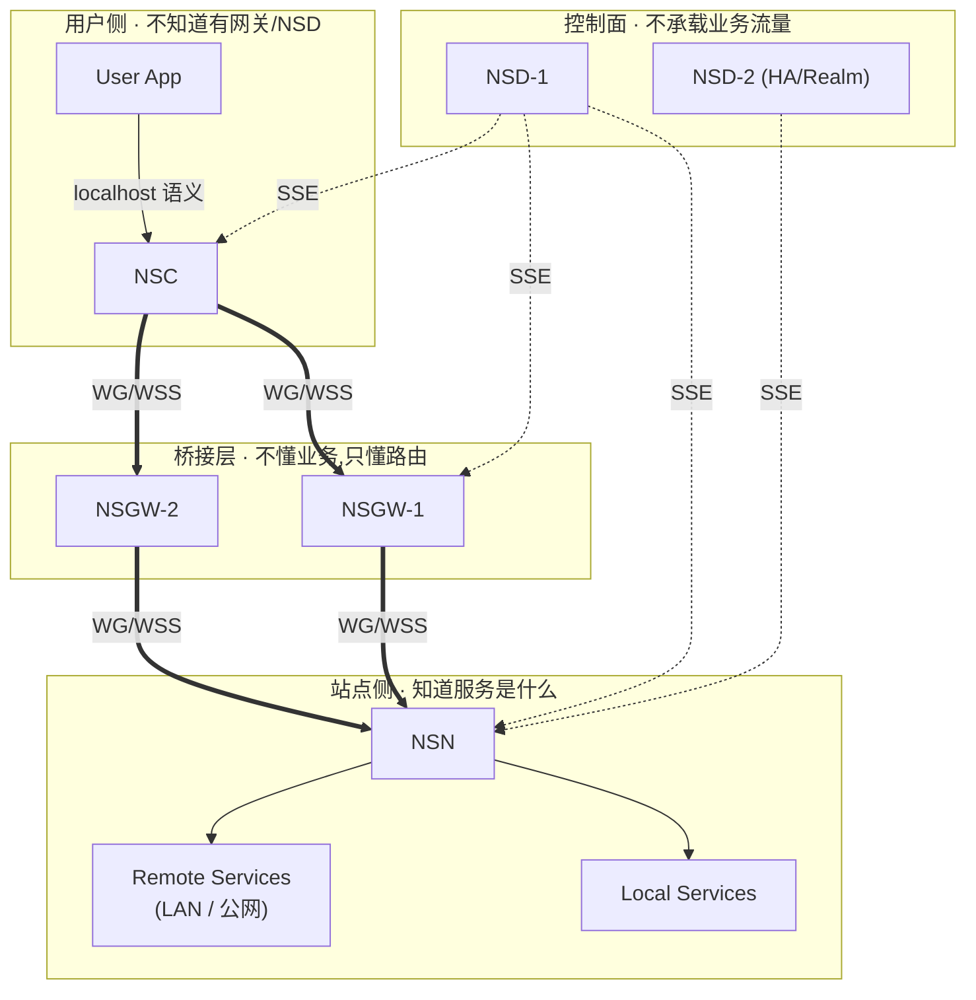
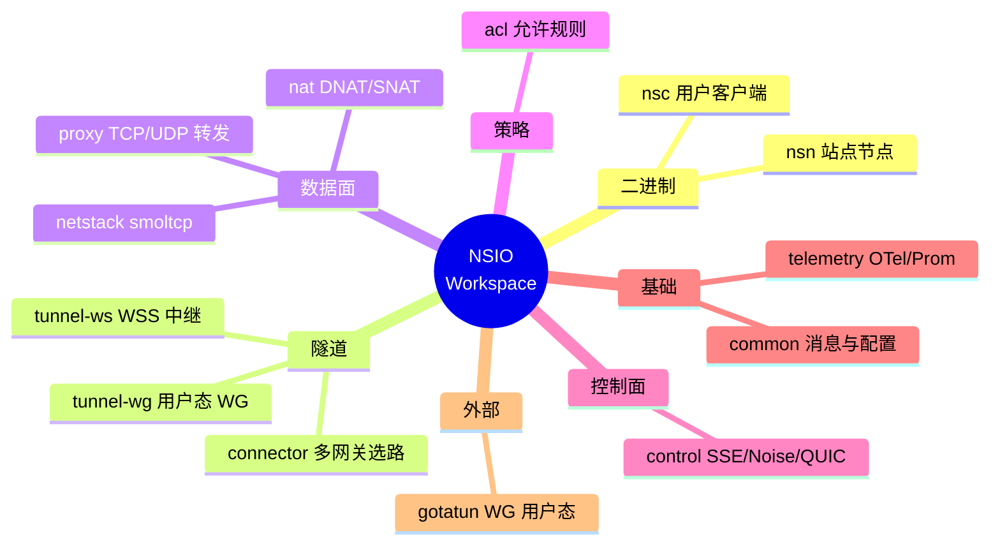
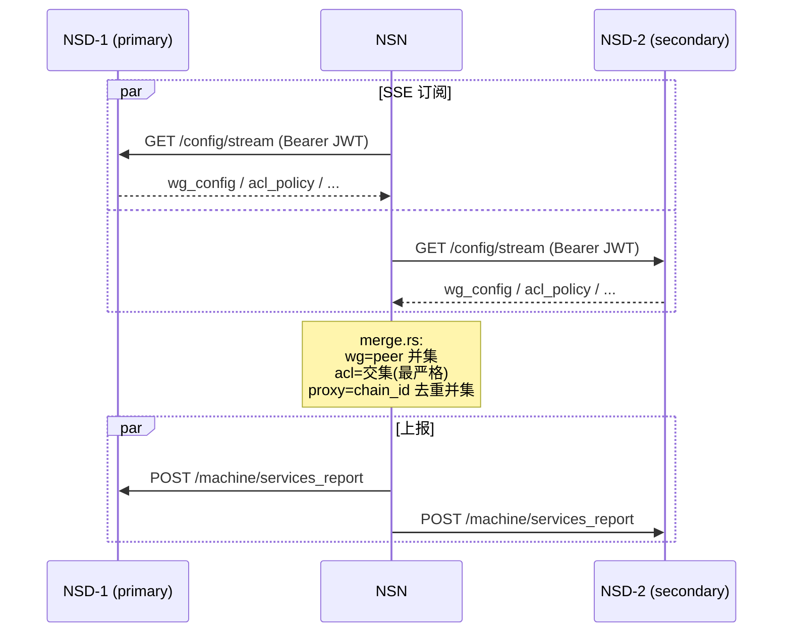
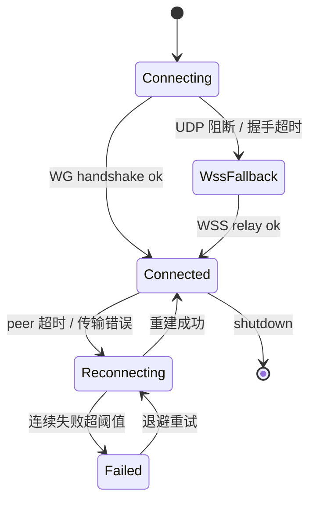

# NSIO 生态: 四组件职责与关系

> 目标读者: 想清晰区分"这件事应该由哪个组件负责"的架构师与产品设计者。
>
> 本文不讲实现细节,只讲边界。实现细节在各模块目录下的 `design.md` 里。

## 为什么是四个组件,不是三个或五个

可以把 NSIO 看作一组对"VPN 集中网关"模式的拆解:

- 传统"一端 VPN 客户端 + 一端 VPN 服务器"把**认证、控制、数据转发**都混在一起。
- NSIO 把这三件事解耦成三个关注点:
  - **认证 + 策略 + 配置分发** → **NSD**(控制中心)
  - **跨协议 / 跨区域的数据面桥接** → **NSGW**(网关)
  - **把站点内部服务映射为可被寻址的命名资源** → **NSN**(站点节点)
- 对称地,用户侧还需要一个"让远程服务看起来像本地"的组件 → **NSC**(客户端)。

这四个组件各自对外只暴露很窄的接口,使得"替换其中任何一个的实现"都不至于牵动全网。



> 对应源文件: [`diagrams/ecosystem.mmd`](./diagrams/ecosystem.mmd)

## 职责边界对照表

| 职责 | NSD | NSGW | NSN | NSC |
|------|:---:|:----:|:---:|:---:|
| 注册 / 签发身份 | ✓ 唯一来源 | | | |
| 持有 ACL 策略源文件 | ✓ | | | |
| 推送配置 (SSE) | ✓ | | | |
| 承载业务流量 | ✗ | ✓ 中继 | ✓ 终结点 | ✓ 发起点 |
| 执行 ACL(入站) | | 可选(按部署) | ✓ 强制执行 | ✗ |
| 持有 `services.toml` 真源 | | | ✓ 唯一来源 | |
| DNS `*.n.ns` 解析 | | ✓(入站 Host/SNI 路由) | | ✓(本地 DNS) |
| 分配虚拟 IP `127.11.x.x` | | | | ✓ |
| 终结 TLS | | ✓(L7 入口 :443 —— 形态见 nsgw-vision) | | |
| WireGuard peer 对端 | | ✓(内核 WG) | ✓(gotatun 用户态) | ✓(gotatun 用户态) |
| TCP 状态机 | | 内核(中继时) | smoltcp / 内核 | 内核 |
| 需要 root / CAP_NET_ADMIN | | 是(内核 WG + 绑定 :443 / 低端口) | 仅 TUN 模式需要 | 否 |
| 运行环境假设 | 公网可达 | 公网可达 + 静态 IP | 任意 NAT 后 | 任意 NAT 后 |

### 要点摘录

- **NSD 永远不接触业务字节流**。即使是 "经 NSGW 中继" 的配置,它也只下发端点信息,让 NSN/NSC 自己建立 WG/WSS 隧道。这让 NSD 的多实例 HA 可以做得很简单 —— 只需要合并广播。
- **NSGW 对业务完全不可知**。它只认识 `FQID` / `Host` / `SNI` 这三种标识符,按路由表把帧转给目标 peer。它不知道里面是 SSH 还是 HTTP。
- **NSN 是唯一执行 ACL 的地方**(默认部署下)。把 ACL 下沉到 NSGW 是可选优化,不是必需。`ServiceRouter::resolve` 把 "ACL 检查 + 服务查找 + DNS 解析" 合并成一个原子操作,使得审计边界单一。
- **NSC 故意保持"薄"**。它不维护状态、不持久化 ACL、不知道自己在跟哪个 NSGW 讲话 —— 这些都由控制面和 NscRouter 在运行时决定。

## 技术栈对照

| 组件 | 主要实现语言 / 运行时 | 关键第三方依赖 | 外部观察接口 |
|------|----------------------|----------------|-------------|
| NSD | 规划 Rust 或 Go 实现;当前仅 Bun/TypeScript mock + 嵌入的 Rust 子 crate `nsd-mock/quic-proxy` 用于 E2E | quinn 0.11(QUIC 终结) / rcgen 0.13(自签证书) / Bun 的 SSE | `:3001`(SSE) `:4001`(Noise) `:4002`(QUIC) `:3002`(HTTPS SSE) |
| NSGW | mock: traefik v3.6.13 + 内核 WireGuard + Bun WSS 中继;生产形态正在[再审视](../11-nsd-nsgw-vision/nsgw-vision.md#架构再审视--是否需要-traefik) —— 倾向自研轻量 Proxy(WG + WSS + HTTP 转发 + L4 端口映射),保留向 Envoy 演进的路径 | `wg-tools`(内核 WG) + (路线 A)自研 HTTP/L4 转发器 / (路线 B)Envoy | `:443`(HTTPS) `:51820/udp`(WG) `:9443`(WSS) + 动态 L4 端口(如 `:2222/tcp` 用于 SSH) |
| NSN | Rust 2024 · 12 crates · `nsn` 二进制 | `gotatun`(用户态 WG) · `smoltcp` 0.12 · `tokio` 1.x · `rustls` 0.23 · `quinn` 0.11 · `snow` 0.9 · `tun` 0.8.6 | `127.0.0.1:9090`(监控 HTTP) |
| NSC | Rust 2024 · `nsc` 二进制 | `gotatun` / `rustls` / (同 NSN 但少 `nat` `netstack` `nsn`) | 本地 DNS `127.0.0.53:53` · VIP `127.11.0.0/16` |

引用:
- 工作空间成员: [`Cargo.toml`](../../../nsio/Cargo.toml) 的 `[workspace] members`
- NSN / NSC 二进制依赖: `crates/nsn/Cargo.toml` / `crates/nsc/Cargo.toml`

## Crate 架构分层

先看"每个 crate 属于哪一层"的脑图,再看精确的依赖表。



### 精确依赖关系

| Crate | 作用 | 依赖(内部) | 外部关键依赖 |
|-------|------|-----------|-------------|
| `nsn` | 站点节点二进制 | `common` `control` `acl` `connector` `nat` `netstack` `proxy` `telemetry` `tunnel-wg` `tunnel-ws` | — |
| `nsc` | 客户端二进制 | `common` `control` `acl` `connector` `proxy` `telemetry` `tunnel-wg` `tunnel-ws` | — |
| `connector` | 多网关管理 · 两跳独立选路 | `acl` `common` `control` `tunnel-wg` `tunnel-ws` | — |
| `tunnel-wg` | WG 隧道实现 | `acl` `common` `control` `nat` | `gotatun` |
| `tunnel-ws` | WSS 隧道实现 | `acl` `common` | — |
| `nat` | DNAT / SNAT / HybridNatSend | `acl` `common` `control` | `gotatun` |
| `netstack` | smoltcp VirtualDevice | `common` | `smoltcp` |
| `proxy` | TCP / UDP 双向转发 | `common` `telemetry` | — |
| `acl` | 仅允许 ACL 引擎 | `common` | — |
| `control` | SSE / Noise / QUIC 控制面 | `acl` `common` | `quinn` `snow` |
| `telemetry` | OTel / Prometheus | — | `opentelemetry` |
| `common` | 消息 schema / 配置 / 类型(叶子) | — | `serde` |

**关键观察**:

- **`common` 是叶子**,几乎所有 crate 都依赖它 —— 单一事实源的 schema 层,改它会触发最大的重编译范围。
- **`nsc` 依赖 8 个内部 crate**,不是一个轻量客户端 —— 对 NSC 的架构/安全评审几乎等同于评审整个数据面栈。
- **`nat` 和 `tunnel-wg` 都直接依赖外部 `gotatun`**,是 WireGuard 用户态的两个消费者;这也是为什么 `netstack` 不依赖 `gotatun`—— 它走 `tun` crate 的内核 TUN 路径,与用户态 WG 是并列的两套数据面。
- **`control` 只依赖 `acl + common`**,说明控制面协议(外壳 SSE/Noise/QUIC)与数据面完全解耦 —— 换 transport 不影响业务逻辑。

## 多控制面 (多 NSD) 架构

NSIO 天生考虑了 NSD 高可用与"Cloud + Self-Hosted"共存。

NSN 通过 `control::MultiControlPlane`(`crates/control/src/multi.rs:51`)同时订阅多个 NSD,**配置合并策略明确**:

| 事件类型 | 合并策略 | 理由 |
|---------|---------|------|
| `wg_config` | 所有 NSD 的 peer 取**并集** | 不同 NSD 可能掌管不同站点,合并后得到所有可连的 peer |
| `proxy_config` | 所有 NSD 的规则取**并集**(按 `(chain_id, resource_id)` 去重) | 同一个 chain 下的同名规则认为是同一条,谁先到以谁为准 |
| `acl_policy` | 取**交集**(最严格优先) | 安全默认立场: 任何一个 NSD 拒绝,结果就是拒绝 |
| `services_report` | **广播给所有 NSD** | 每个 NSD 都要看到这台 NSN 声明的服务白名单 |
| `gateway_report` | **广播给所有 NSD** | 每个 NSD 都要知道网关健康状况 |

合并逻辑在 `crates/control/src/merge.rs`。NSN 对多 NSD 的态度是: "谁下发配置我都听,但只要有一个拒绝我就拒绝"。



> 为什么 ACL 取交集?安全默认立场的代价最小 —— 如果任一 NSD 被攻破并下发了"放行全部"的策略,只要还有一个诚实 NSD 在,最终生效策略就不会被放宽。

## 多网关 (多 NSGW) 架构

NSN 通过 `connector::MultiGatewayManager`(`crates/connector/src/multi.rs:152`)并发连接多个 NSGW。关键设计点:

### 选路策略

```rust
// crates/connector/src/multi.rs:84
pub enum GatewayStrategy {
    LowestLatency,     // 按测量 RTT 选最低 (默认)
    RoundRobin,        // 轮询
    PriorityFailover,  // 主备切换
}
```

- 默认 `LowestLatency`: 用实测 RTT 做连接级负载均衡。
- `services.toml` 可以在每条服务规则上**强制指定网关**(`gateway = "nsgw-us-east"`),即使它不是最快的。用于"SSH 必须走审计网关"这类场景。

### 每网关独立传输

每个 `GatewayEntry`(`crates/connector/src/multi.rs:97`)维护独立的 WG + WSS 状态。



对应事件在 `GatewayEvent`(`crates/connector/src/multi.rs:24`)上冒泡,被 NSN `AppState` 采集后通过 `/api/gateways` 暴露。

### 两跳独立选路

一个**关键事实**: NSC→NSGW 和 NSGW→NSN 分别独立挑选协议。

```
用户家里的咖啡馆 Wi-Fi 封 UDP:
  NSC --WSS--> NSGW --WG--> NSN  (NSN 侧 UDP 可用)

办公室企业防火墙封入站 UDP:
  NSC --WG--> NSGW --WSS--> NSN  (NSN 侧只能 TCP)

两端都被封:
  NSC --WSS--> NSGW --WSS--> NSN
```

NSGW 在中间做协议桥接,对两端透明。这比"全链路统一协议"更有弹性,因为两端的网络环境没有关联。

详细的传输选型见 [transport-design.md](./transport-design.md)。

## 组件交互矩阵

```
         NSD        NSGW       NSN        NSC
NSD      ──        manage     manage     manage
NSGW    report      ──        tunnel     tunnel
NSN     control    tunnel      ──       (via GW · 直连规划中)
NSC     control    tunnel  (via GW · 直连规划中)  ──
```

| 连接对 | 协议 | 用途 | 源码位置 |
|--------|------|------|---------|
| NSN ↔ NSD | SSE/Noise/QUIC(控制) | 认证、配置、策略、`services_report`、`gateway_report` | `crates/control/src/transport/` |
| NSN ↔ NSGW | WG(UDP) / WSS(TCP:443) | 业务流量隧道 | `crates/tunnel-wg/src/lib.rs` / `crates/tunnel-ws/src/lib.rs` |
| NSC ↔ NSD | SSE | 认证、映射配置、网关发现 | `crates/control/src/sse.rs` |
| NSC ↔ NSGW | WG / WSS | 用户流量隧道 | (同 NSN) |
| NSD ↔ NSGW | 内部 API | 网关注册、健康检查、指标 | NSD 侧(不在本仓库)|
| Browser / curl ↔ NSGW | 公网 HTTPS :443 | **无 NSC 入站 (L7)**: NSD 下发的公网域名 + 中间件链,按 `Host` / SNI 路由到 NSN | 见下文"无 NSC 入站" |
| SSH / psql / 任意 TCP ↔ NSGW | 公网 TCP `:<map_port>` | **无 NSC 入站 (L4)**: NSD 下发端口映射表,`nsgw:2222 → nsn:22` 直透 | 见下文"无 NSC 入站" |

> **直连路径的现状**: `tunnel-wg` 的 `PeerConfig` (`pubkey + endpoint + allowed_ips`) 不区分 NSGW 与 NSN,WireGuard 机制层面支持 NSC 与 NSN 直接对等。当前**缺少**的是控制面的 `direct_peers` 事件 —— NSD 还没有向 NSC 下发"把 NSN 当作直接 peer"的配置,也没有打洞信令流程。`transport-design.md` 的 [直连与 P2P](./transport-design.md#直连与-p2p-未来设计) 描述了这个规划中的补全方向。

### 无 NSC 入站 (Browser / SSH Client → NSGW → NSN)

当站点希望把某个服务暴露给**没有安装 NSC 的最终用户**(浏览器、`curl`、移动端 webview、第三方 webhook 发送方、命令行 SSH 用户等) 时,NSIO 通过 NSGW 提供两条"不走客户端"的入站路径:

- **L7 · HTTP(S) 公网域名入口**: 用于 dashboard / webhook / OAuth 回调等 HTTP 服务;TLS 在 NSGW 终结,可叠加中间件。
- **L4 · 端口映射入口**: 用于 SSH / psql / redis / 任意 TCP(UDP)协议;NSGW 在指定端口上做纯透传,不解 TLS、不看内容。

```
# L7 路径
Browser / curl ──→ https://<NSD 签发的公网域名>/  ──→  NSGW :443
                                                       ↓ TLS 终结 + 中间件链
                                                       ↓   (OIDC / 基本鉴权 /
                                                       ↓    限速 / WAF / 请求改写)
                                                       ↓ 按 Host / SNI 查公网域名 → NSN peer
                                                       ↓ WG / WSS 桥接
                                                       NSN → proxy + ACL → 本地服务

# L4 路径 (示例: ssh 到站点内部主机)
ssh user@nsgw-host -p 2222  ──→  NSGW :2222 (TCP listener)
                                  ↓ 不解密 · 不审内容
                                  ↓ 按 NSD 下发的 gateway_l4_map 查目标
                                  ↓ WG / WSS 桥接
                                  NSN → proxy + ACL → 本地 sshd :22
```

**L7 公网域名与 L4 端口映射都由 NSD 统一签发 / 下发,与 `*.n.ns` 完全独立**:

- `*.n.ns` 是 NSC 内部命名空间 —— 只在 NSC 本地 DNS 生效,公网 resolver 返回 NXDOMAIN,因此浏览器**永远到不了** `web.<nid>.n.ns`。
- **L7(公网域名)**: 站点管理员在 NSD 控制台开启"公网发布 · HTTP"后,**NSD 负责分配公网域名** —— 默认情况下从 NSIO 持有的公共 apex(例如 `*.<tenant>.nsio.app`)签发一个子域,其权威 DNS 由 NSD 管控;即使站点选择 BYO 自有域名(通过 CNAME 指向 NSGW),该域名的启用/禁用、路由目标、TLS 策略仍然**统一在 NSD 里登记**,NSGW 不接受"在本地 `services.toml` 或文件里私自声明"的公网域名。
- **L4(端口映射)**: 同理,`nsgw-host:<port>` 的映射表(`{listen_port, proto, target_nsn, target_port, acl_ref}`)只存在于 NSD 中;NSD 通过 `gateway_l4_map` SSE 事件把条目推送给被分配到该端口的 NSGW 实例,NSGW 打开 listener 并开始转发。端口冲突、租户抢注、allow-list 校验都在 NSD 侧完成。
- NSD 把 "公网域名 → NSN peer + 中间件链 + TLS 策略" 整体作为**一条 SSE 配置事件**推送给对应的 NSGW 实例,NSGW 据此打开路由(自研轻 Proxy 或 Envoy,见 [nsgw-vision 架构再审视](../11-nsd-nsgw-vision/nsgw-vision.md#架构再审视--是否需要-traefik))并热加载。
- TLS 证书由 NSGW 申请(ACME / Let's Encrypt 走 DNS-01 或 HTTP-01)或由站点自带,证书的申请/续期状态回报给 NSD 做可见。

**为什么集中在 NSD 签发 / 下发** —— 易于控制:

- **一键启停**: 管理员在 NSD 上切换开关,SSE 事件到达 NSGW 后 traefik 立即移除路由,不会出现"站点侧以为已经关、但 NSGW 还在解析 Host"的漂移。
- **集中吊销**: 跑路、离职、合规要求下架时,NSD 删掉映射即可;不依赖站点方配合。
- **轮换安全**: 公网域名 / TLS 证书 / 中间件参数(OIDC client secret 等)都由 NSD 统一轮换,站点侧无须感知。
- **统一审计**: 谁在什么时候发布了什么域名、挂了哪条 ACL、调整了哪个限速阈值 —— 全部落在 NSD 的操作日志里,一个审计面就够了。
- **防止越权**: 站点方**不能自己捏造公网域名**让 NSGW 放行;必须经过 NSD 授权。租户 A 无法抢注属于租户 B 的域名,也无法绕过平台级 WAF 规则。
- **全局一致性**: 多 NSGW PoP 的路由表由 NSD 广播同步,新增 PoP 直接从 NSD 拉全量配置;不会出现"A 区 PoP 有这条路由、B 区 PoP 没有"的分裂。

**L7 路径可以叠加的中间件**(根据 NSGW 形态由自研轻 Proxy 或 Envoy 承载):

| 中间件 | 作用 | 典型场景 |
|--------|------|---------|
| OIDC / OAuth2 | 在 NSGW 前置身份验证,未登录用户被重定向到 IdP | 给内部 dashboard 加 SSO |
| 基本鉴权 / API Key | `Authorization` 头校验 | 保护 webhook / API |
| 限速 (rate limit) | 按 IP / 用户 / token 限流 | 防刷 |
| WAF / 请求过滤 | OWASP 规则、IP 黑白名单 | 基础安全加固 |
| 请求改写 / 头注入 | 加 `X-Forwarded-User` 等 | 把身份信息透传给后端 |
| 审计日志 | 谁访问了什么、何时、结果 | 合规 |

这是 `*.n.ns` 内部路径(NSC → NSGW → NSN)**无法做到**的:内部路径是端到端加密的 L4 隧道,NSGW 只看得到加密后的字节,身份和内容信息要么在 NSC 侧(客户端不一定可信),要么在 NSN 侧(站点侧),中间网关没有机会插手。L7 公网域名入口正相反 —— TLS 在 NSGW 终结,HTTP 明文可见,于是身份认证和流量治理才能下沉到这个共享层。

**L4 端口映射与 L7 的差异**: L4 路径在 NSGW 上是**透明转发**,不解 TLS、不读 payload,因此无法做 OIDC / WAF 这类基于**内容**的中间件 —— 但**连接级中间件仍然必需**,由 NSD 通过 `gateway_l4_map` 事件统一下发到 NSGW,而不是散落在各站点的本地配置里:

| L4 中间件 | 作用 | 典型场景 |
|-----------|------|---------|
| IP 白名单 / 黑名单 | 握手前按源 IP 放行或拒绝 | `ssh` 只允许公司出口 IP 段;禁止已知恶意 IP |
| GeoIP 限制 | 按地区放行 | 合规要求只接受特定国家 / 区域来源 |
| 连接限速 | 每源 IP / 每租户的新建连接速率上限 | 防 SSH 暴力破解连接洪水 |
| 并发连接数上限 | 每源 IP / 每端口映射的同时在线连接数 | 防止单源吃光文件描述符 |
| fail2ban 式封禁 | 异常模式触发的临时/永久 block | 握手失败率超阈值自动拉黑 |
| 连接配额 | 每租户 / 每映射每日连接数配额 | 计费与滥用防护 |
| 审计日志 | 连接元数据(源 IP / 时长 / 字节数 / 关闭原因) | 合规与追溯 |
| mTLS / PROXY Protocol v2 | 透传客户端身份指纹给后端 NSN / 上游 | SSH CA 信任链 / 应用识别真实来源 |

协议级认证(SSH 密钥、psql 密码等)仍由后端服务完成 —— **L4 中间件做"谁能连进来",后端协议做"进来后能做什么"**。NSD 下发的 `gateway_l4_map` 事件因此携带 `conn_limits + allow_cidr + deny_cidr + geo_rules + audit_sink` 等连接级策略字段,NSGW 在 listener 层强制执行,站点侧无须各自配置 `iptables` / `sshd` 限制。这样既集中治理,又不破坏 L4 的透明性:字节流本身仍然端到端加密(适合 SSH 这类协议自带加密认证的场景)。

**下发通道: 与 ACL 同构的 SSE 事件**

站点本地的 `services.toml` **只负责**声明"本机上有哪些服务、跑在什么地址端口上" —— 它是 NSN 做 `proxy.connect(target)` 时的查表数据源,**不**描述"这个服务是否对外发布 / 挂哪些中间件 / 占用哪个 NSGW 端口"。"公网域名 + 中间件链 + L4 端口映射 + ACL" 是一整套策略,由 NSD 统一管理、通过 SSE 事件精准下发到受影响的数据面节点:

- **ACL → NSN**: `AclConfig` SSE 事件(`crates/control/src/messages.rs` 已定义),由 NSN 的 `acl` crate 在 `ServiceRouter::resolve` 里执行。
- **L7 公网域名 + 中间件链 → NSGW**: 规划中的 `gateway_http_config` SSE 事件;NSGW 把它翻译为路由/中间件动态配置(自研轻 Proxy 或 Envoy xDS),热加载无须重启。
- **L4 端口映射 → NSGW**: 规划中的 `gateway_l4_map` SSE 事件,携带 `{listen_port, proto, target_nsn, target_port, acl_ref, conn_limits}`;NSGW 据此开关 listener。
- **事件幂等 + 版本号**: SSE 事件带 `chain_id` / 版本号,断连重连后 NSD 会推当前完整状态,NSGW / NSN 按照"最后一条胜出"应用,不会漂移。

控制面是单一事实源,数据面只做执行;站点方改完配置立刻生效,不需要 SSH 到每台 NSN/NSGW 改文件。

**代价 / 约束**:

- **L7 失去端到端加密**。NSGW 能读到明文 HTTP —— 这是启用中间件的前提,也是它与内部路径的本质区别。L4 路径不解 TLS,协议自身加密(如 SSH)仍保持端到端。
- **L4 无法做 L7 中间件**。端口映射只做连接级治理(限速 / 封禁 / 配额),应用层认证仍由后端负责。
- **需要显式发布**。管理员要在 NSD 上声明"这个服务公网暴露"(L7 填域名、L4 填端口),NSD 才会触发公网域名签发 / 端口分配、NSGW 路由下发、以及对应的 ACL 放行;默认仍是 `*.n.ns` 内部可见。
- **ACL 仍然生效**。即使 NSGW 侧中间件或端口放行,NSN 的 `acl` 依然会按 NSD 下发的 `AclConfig` 做最后一道检查 —— 这与内部路径共用同一套 ACL,没有"公网路径绕过 ACL"的口子。
- **NSGW 端口是共享资源**。L4 端口由 NSD 在租户间协调分配,避免抢占;部署方预留一段端口区间(如 `20000-29999`)给 NSD 调度。

为什么这条路径存在:许多站点只想发布一个 dashboard、一个 webhook 入口、一个 OAuth 回调,或者给运维开一个 `ssh` 跳板,强制所有访问者装 NSC 是过度设计。把 L7 发布(域名 + 身份认证)与 L4 映射(任意 TCP)下沉到 NSGW,站点侧只需要照常运行服务 —— 不用管 TLS、不用管 SSO、不用管公网端口怎么暴露。

## 部署拓扑模板

### 单人开发 / Homelab

```
1 × NSD(自建,单实例)
1 × NSGW(云 VPS 或 DDNS 家宽)
1 × NSN(家里的 NAS / 服务器)
N × NSC(笔记本、手机客户端未来版本)
```

整个栈可以跑在一台 2C4G 的 VPS 上(NSD + NSGW 共用)。

### 多区域 SaaS

```
2 × NSD(Active-Active,各自独立 realm 或共享 realm)
N × NSGW(每个 PoP 一个,traefik 前面挂 Anycast)
M × NSN(客户站点,通常自助部署)
K × NSC(客户的用户,跨区域)
```

NSC 的 `MultiGatewayManager` 自动选出最低 RTT 的 NSGW。

### 对抗 DPI 的受限网络

```
NSD:  HTTPS :3001 (总入口)
      QUIC :4002  (对抗 HTTPS 阻断)
      Noise :4001 (对抗 SNI 指纹)

NSN: --control-mode=quic 或 noise
     --data-plane=userspace
     仅出站 443/TCP 也能跑通

NSGW: 仅保留 WSS 路径,关闭 WG UDP 入口
```

三种控制面传输共享同一个 SSE 事件解析器(`crates/control/src/sse.rs`),切换只是选择外壳。

## 职责边界 FAQ

**Q: NSN 是不是必须装在服务所在机器上?**
不一定。NSN 只需要能**通过 TCP/UDP 访问到目标服务**即可。`services.toml` 可以指向 `192.168.1.10:5432`(同网段数据库)或 `db.internal.company:5432`(内网 DNS 名)。只要 NSN 走内核网络栈能连上,代理就能工作。

**Q: 为什么 ACL 放在 NSN 而不是 NSGW?**
- NSGW 是**区域共享**资源,把 ACL 下放会让不同站点互相影响。
- NSN 是**站点所有者自己部署**的,他们才有权决定自己的服务如何暴露。
- 把 ACL 集中在 `ServiceRouter::resolve`(单一判定点)也便于审计与策略测试。
- 把 ACL 在 NSGW 再做一层是可选优化(策略下发经由 `acl_policy` 事件也发给 NSGW),不是必需。

**Q: NSD 如果宕机,业务会断吗?**
不会。控制面断开后,NSN / NSC / NSGW 都会继续使用最后一次收到的配置。WG / WSS 隧道状态是本地维护的。NSD 只在"配置变更"时才是关键路径。

**Q: NSC 需要 root 权限吗?**
默认模式(`--data-plane userspace`)不需要 —— 它只在 `127.11.x.x` 上监听 socket,并在 `127.0.0.53:53` 起本地 DNS。`tun` 模式需要,但这是可选的高级模式。

**Q: `services.toml` 是给谁看的?**
**给 NSN 本身看的白名单**。严格模式(默认)下,如果 NSD 下发的规则指向一个不在 `services.toml` 中的服务,NSN 会拒绝它并通过 `services_ack` 回报"未匹配"。这是一道**本地保险丝**: 即便 NSD 被接管,也不能未经站点所有者明示就暴露新服务。
