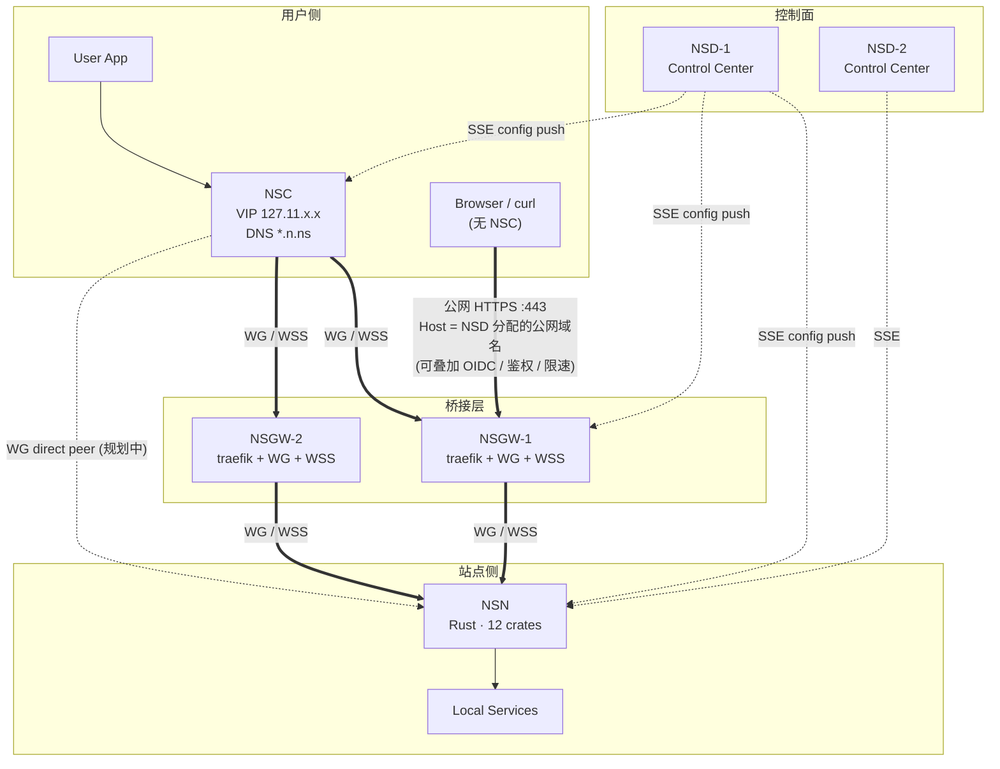

# 01 · 系统总览与 NSIO 架构

> 适用读者: 产品设计者 / 系统架构师 / 第一次接触 NSIO 的工程师。
>
> 目标: 在 30 分钟内建立对 NSIO 生态的整体心智模型 —— 四个组件的职责边界、两种数据面形态、一张控制面事件流图、以及 `.ns` 内部命名空间。

## NSIO 是什么

**NSIO 是一个"站点—客户端"对称的覆盖网络生态**。它把传统 VPN 中"一端连接网关"的模型扩展为"两端各自通过网关访问对方的服务",并把网关做成可水平扩展、区域分布、协议可替换的中继层。

核心目标:

1. **让站点的私有服务成为可被寻址的命名资源** —— 不是一个 IP:port,而是 `ssh.ab3xk9mnpq.n.ns`。
2. **让用户客户端不需要修改系统路由表或 DNS** —— 每个远端服务在本地得到一个 `127.11.x.x` 虚拟 IP 和本地 DNS 响应。
3. **让运营者可以选择任意的传输协议组合** —— UDP 被封就走 WSS,HTTPS 被深包检测就走 Noise 或 QUIC。
4. **让控制面和数据面彻底解耦** —— 控制面只做认证、配置分发、策略合并,不承载一字节业务流量。

整个仓库是一个 **Rust workspace**,包含 12 个 crate,产出两个二进制: `nsn`(站点节点) 与 `nsc`(用户客户端)。源码位置: `/app/ai/nsio/`,crate 定义见 [`Cargo.toml`](../../../nsio/Cargo.toml)。

## 四个组件: NSD · NSGW · NSN · NSC

> 图中 NSC↔NSN 虚线表示**机制已支持、控制面尚未下发**的直连路径: `tunnel-wg` 的 `PeerConfig` 只关心 `pubkey + endpoint + allowed_ips`,对 NSGW 与 NSN 无区别;当 NSD 未来下发 `direct_peers` 事件(两端可达或打洞成功)时,NSC 可以把 NSN 当作直接 WG peer,不再经由 NSGW 中继。详见 [transport-design.md 的"直连与 P2P"](./transport-design.md#直连与-p2p-未来设计)。
>
> 图中 Browser → NSGW 实线是**不装 NSC 的入站路径**: 这条路径**不使用 `*.n.ns`**(该命名空间只在 NSC 本地 DNS 生效,公网 resolver 返回 NXDOMAIN)。NSD 会为需要公网暴露的服务**单独签发一个公网域名**(例如 `myapp.<tenant>.example.com`,CNAME 指向 NSGW),把它登记到 NSGW 的 traefik 路由表里;traefik 按 `Host` / SNI 匹配后桥接到对应 NSN。由于 TLS 在 NSGW 终结,可以在这一层叠加 **OIDC / 基本鉴权 / 限速 / WAF / 请求改写**等 traefik 中间件 —— 这是 `*.n.ns` 内部路径(NSC→NSGW→NSN)无法做到的(后者是端到端加密的 L4 隧道,NSGW 看不到明文 HTTP)。代价: 公网路径丢失 VIP 隔离、TLS 仅到 NSGW、只承载 HTTP(S);适合 dashboard / webhook / OAuth 回调这类站点主动发布的场景。详见 [ecosystem.md 的"无 NSC 入站"](./ecosystem.md#无-nsc-入站-browser--nsgw--nsn)。

| 组件 | 中文名 | 定位 | 语言/技术栈 | 部署位置 |
|------|--------|------|-------------|---------|
| **NSD** | 控制中心 | 注册中心 + 策略引擎 + 配置分发(SSE) | 规划 Rust 或 Go 实现;当前 Bun/TS mock + Rust QUIC 子进程用于 E2E | Cloud / Self-Hosted |
| **NSGW** | 网关 | 数据面桥接 + 协议转换 + Host/SNI 路由 | traefik v3.6.13 + 内核 WG + Bun WSS 中继 | 多地区 PoP |
| **NSN** | 站点节点 | 用户态 WireGuard 客户端 + TCP/UDP 代理 + ACL 执行点 | Rust (12 crates, edition 2024) | 站点侧(机房 / 办公室 / 家庭服务器) |
| **NSC** | 客户端 | 虚拟 IP + 本地 DNS + 按服务路由 | Rust (依赖 8 个内部 crate) | 用户终端(笔记本 / CI runner) |

四个组件的完整职责边界、协议矩阵、以及为什么要这样切分,见 [ecosystem.md](./ecosystem.md)。

## 读者路径

根据你的关注点,选一条路径往下读:

### 我是产品设计者 / 决策者

1. **本文件** —— 建立整体心智模型。
2. [ecosystem.md](./ecosystem.md) —— 读懂四个组件在不同场景下的职责。
3. [transport-design.md](./transport-design.md) —— 理解"为什么需要 WG + WSS + Noise + QUIC 四种传输"的设计取舍。

### 我是系统架构师

1. **本文件** → [ecosystem.md](./ecosystem.md) → [data-flow.md](./data-flow.md) —— 先看宏观,再看数据面如何拆分 TUN / UserSpace / WSS 三种形态。
2. [transport-design.md](./transport-design.md) —— 理解"协议解耦"与"两跳独立选路"。
3. 进入模块深入: [../02-control-plane/index.md](../02-control-plane/index.md) 控制面 → [../03-data-plane/index.md](../03-data-plane/index.md) 隧道 → [../05-proxy-acl/index.md](../05-proxy-acl/index.md) 代理与 ACL。

### 我是新入职工程师

1. **本文件** → [dns-naming.md](./dns-naming.md) —— 先把 `.ns` 命名和 `FQID` 搞清楚,看代码才不会迷路。
2. [data-flow.md](./data-flow.md) —— 跟着一个包走一遍,建立"解密→ACL→路由→代理"的直觉。
3. 直接挑一个你负责的 crate 读: [../07-nsn-node/index.md](../07-nsn-node/index.md)(入口) / [../04-network-stack/index.md](../04-network-stack/index.md)(smoltcp) / [../06-nsc-client/index.md](../06-nsc-client/index.md)(VIP/DNS)。

## 本目录文档索引

| 文档 | 内容 |
|------|------|
| [index.md](./index.md) | 本文件: 生态全景 + 读者路径 |
| [ecosystem.md](./ecosystem.md) | NSD / NSGW / NSN / NSC 四组件职责边界、组件交互矩阵、多控制面与多网关架构 |
| [data-flow.md](./data-flow.md) | WG 模式 (TUN + UserSpace) 与 WSS 模式的端到端数据流、关键代码位置 |
| [dns-naming.md](./dns-naming.md) | `*.n.ns` / `*.gw.ns` / `*.d.ns` / `*.c.ns` 命名体系、FQID、nanoid 规则 |
| [transport-design.md](./transport-design.md) | 数据面 UDP↔WSS fallback、控制面 SSE/Noise/QUIC 可插拔、两跳独立选路 |
| [diagrams/](./diagrams/) | 本目录所有 Mermaid 源文件 (ecosystem / data-flow-wg / data-flow-wss / control-plane) |

## 其他模块文档

NSIO 的 Rust 工作空间按"关注点"切分成 12 个 crate,文档也按同样边界组织:

| 文档目录 | 对应 crate | 核心内容 |
|---------|-----------|---------|
| [02-control-plane/](../02-control-plane/index.md) | `common`, `control` | machinekey/peerkey 认证、SSE/Noise/QUIC 传输、MultiControlPlane 配置合并 |
| [03-data-plane/](../03-data-plane/index.md) | `tunnel-wg`, `tunnel-ws`, `connector` | gotatun UAPI、WsFrame 二进制协议、MultiGatewayManager 选路 |
| [04-network-stack/](../04-network-stack/index.md) | `netstack`, `nat` | smoltcp VirtualDevice、PacketNat DNAT/SNAT、HybridNatSend |
| [05-proxy-acl/](../05-proxy-acl/index.md) | `proxy`, `acl` | TCP/UDP 双向转发、HTTP Host 嗅探、TLS SNI 嗅探、仅允许 ACL 引擎 |
| [06-nsc-client/](../06-nsc-client/index.md) | `nsc` | 127.11.x.x VIP、本地 DNS 解析、NscRouter、HTTP 代理 |
| [07-nsn-node/](../07-nsn-node/index.md) | `nsn`, `telemetry` | 二进制入口、AppState、监控 HTTP API、OTel/Prometheus |

## 一张图看懂关键取舍

| 决策 | 选择 | 理由 |
|------|------|------|
| 控制面协议 | SSE (单向推送) | 比 WebSocket 简单;与 HTTP/2 / CDN / TLS 栈完全兼容;可在被动透明代理后工作 |
| 数据面协议 | WireGuard + WSS | WG 提供最优延迟和加密性能;WSS 保底穿越严格防火墙;由 `connector` 自动回退 |
| TCP 状态机 | UserSpace 模式每连接 2 个;TUN 模式每连接 0~1 个 | UserSpace 无 root 友好;TUN 借内核省掉一层状态机(不是为性能,是为状态管理一致性) |
| NAT 实现 | "代理即 NAT" | 不改写 IP 头,只做端口→服务查找 + `proxy.connect(target)`;本地服务和远程服务逻辑同构 |
| ACL 定位 | 仅允许规则,默认拒绝 | 更简单的安全模型;避免规则顺序带来的分析复杂度 |
| 服务定义 | `services.toml` 严格模式 | 默认 fail-closed,显式白名单;拒绝"意外暴露" |
| DNS 命名空间 | `.ns` (非真实 TLD) | 永不与公网 DNS 冲突;用户无需修改系统 resolver |
| NSC 寻址方式 | `127.11.x.x` 回环 VIP | 不需要 TUN / 管理员权限 / 改 hosts;每个服务都有固定本地地址 |
| 控制面可插拔传输 | SSE / Noise / QUIC | 外层抗 DPI,内层复用同一个 SSE 事件解析器 |

## 规模速览

- **代码**: 12 个内部 crate + `gotatun` 外部 WireGuard 用户态实现
- **测试**: 约 300 个单元/集成测试,4 套 Docker E2E overlay (WG / WSS / Noise / QUIC)
- **安全基线**: 所有 crate `#![forbid(unsafe_code)]`;TLS 仅使用 rustls;私钥通过 `secrecy` 包装,`Debug` 中自动打码
- **监控**: NSN 在 `127.0.0.1:9090` 暴露 11 条 HTTP API(`/healthz` `/api/status` `/api/node` `/api/gateways` `/api/control-planes` `/api/tunnels` `/api/services` `/api/acl` `/api/nat` `/api/connections` `/api/metrics`)

具体数字的单点事实来源:
- crate 清单: [`crates/*/Cargo.toml`](../../../nsio/Cargo.toml) 与 [`Cargo.toml`](../../../nsio/Cargo.toml) 的 `members` 数组。
- 监控路由注册: `crates/nsn/src/main.rs:533`;handler 实现: `crates/nsn/src/monitor.rs`。
- 测试矩阵: [`justfile`](../../../nsio/justfile) 与 `tests/docker/docker-compose.*.yml`。
