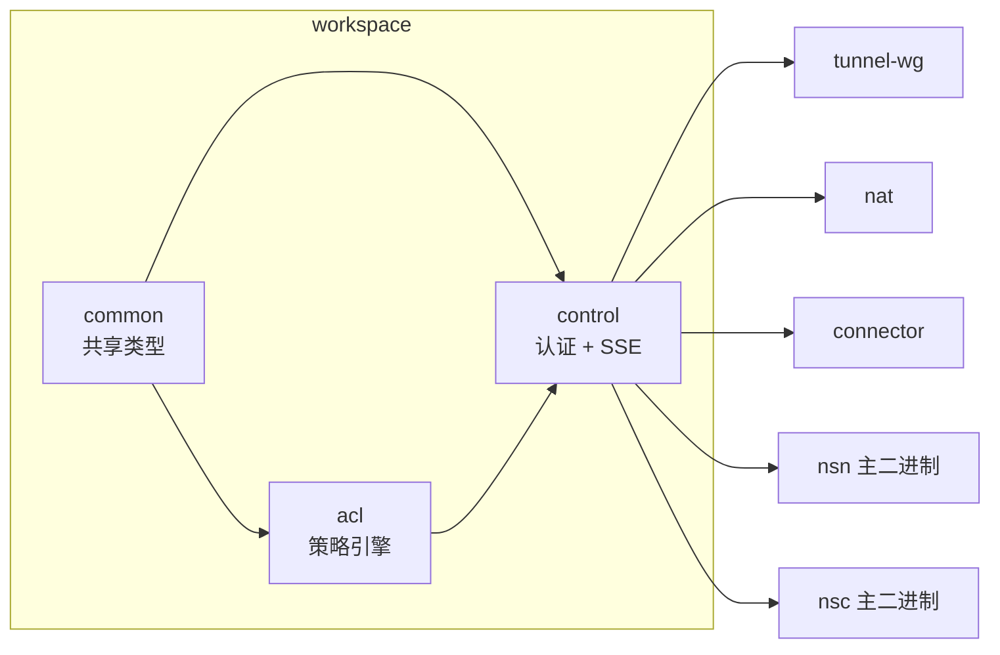

# 控制面实现 (Implementation)

> 本页按 crate / 文件展开实现细节；契约与流程见 [design.md](./design.md)。

## 1. crate 关系图



`control` 仅依赖 `common` + `acl`。下游通过 `mpsc::Receiver<*Config>` 拉取配置，跨 crate 解耦。

## 2. `crates/control/src/lib.rs` — 控制面入口

### 2.1 关键类型

* `Error`（`lib.rs:42`）：单一错误枚举，统一封装 `Auth/Connect/Sse/Decode/Http/Noise/Quic`。
* `ControlPlane`（`lib.rs:61`）：单 NSD 控制面 actor。字段：
  * `config: Arc<ConnectorConfig>`
  * `auth_client: AuthClient`
  * `services_report: ServiceReport`（启动快照，重连时复用）
  * 7 个 `mpsc::Sender<*Config>` + 1 个 `Sender<String>`（token_refresh）
  * `transport: Option<Box<dyn ControlTransport>>` —— `Some` 走 Noise/QUIC 路径，`None` 走默认 SSE。

### 2.2 构造与运行

`ControlPlane::new()` (`lib.rs:85`) 一次性创建所有 mpsc 通道（容量 8）并把 `Receiver` 端作为元组返回，方便上层（`nsn` 主二进制）把它们派发给各个数据面 crate。

```text
let (plane, wg_rx, proxy_rx, acl_rx, gw_rx, routing_rx, dns_rx, token_rx)
    = ControlPlane::new(cfg, services_report, auth);
tokio::spawn(plane.run());
tunnel_wg::start(wg_rx, ...);
nat::start(proxy_rx, ...);
acl::start(acl_rx, ...);
...
```

`ControlPlane::run()` (`lib.rs:159`) 流程：

```text
authenticate() ──► token
        │
        ▼
  transport.is_some()?
   yes ─► run_noise(token)   (Noise/QUIC 内层 SSE)
   no  ─► run_sse(token)     (reqwest 默认 SSE)
```

### 2.3 dispatch_message 表

`ControlPlane::dispatch_message()` (`lib.rs:345`) 是控制面的中央分流器。映射：

| 入站消息 | 处置 |
|----------|------|
| `WgConfig(cfg)`     | `wg_config_tx.send(cfg)`，下游 drop 即返回 `Ok(true)` |
| `ProxyConfig(cfg)`  | `proxy_config_tx.send(cfg)` |
| `AclConfig(cfg)`    | `acl_config_tx.send(cfg)` |
| `GatewayConfig(cfg)`| `gateway_config_tx.send(cfg)`，附带 `gateways=N` info 日志 |
| `RoutingConfig(cfg)`| `routing_config_tx.send(cfg)`，附带 `routes=N` |
| `DnsConfig(cfg)`    | `dns_config_tx.send(cfg)`，附带 `records=N` |
| `TokenRefresh{token}` | `*token = new`；调 `sse.set_token()`（Noise 路径在 caller 比对前后 token 后再调 `noise_ctl.set_token()`，`lib.rs:314`）；同时 fire `token_refresh_tx.send()` |
| `ServicesAck(ack)`  | 仅记录：`matched` info、`unmatched` warn、`rejected` warn |
| `ServicesReport(_)` | 不应出现，warn 后忽略 |
| `Ping`              | 静默忽略（SSE 单向） |
| `Pong`              | 不应出现，静默忽略 |

### 2.4 URL 工具

`strip_url_scheme` / `url_to_tcp_endpoint` / `url_to_host`（`lib.rs:481`+）专门处理 `noise://` 与 `quic://` 这两种自定义 scheme：把 URL 拆成 `host:port`（缺端口补 `:443`）和 `Host` 头值。覆盖 4 条单元测试（`lib.rs:516`）。

## 3. `crates/control/src/auth.rs` — 注册 / 认证 / 心跳

| 类型 | 入口方法 | 说明 |
|------|----------|------|
| `AuthClient` (`auth.rs:125`) | `new(base_url, MachineState)` | 内部 `reqwest::Client`：connect 5s / overall 15s 超时 |
| | `set_system_info(info)` | 注入 SystemInfo，下次 register 携带 |
| | `is_registered()`、`peer_key_priv_bytes()` | 转发到 `MachineState` |
| | `heartbeat_client()` | 在移交所有权给 `ControlPlane` 前抽出 `HeartbeatClient` 给后台 task |
| | `register(auth_key)` | `POST /api/v1/machine/register`，`auth_key` 写在 body |
| | `register_with_token(access_token)` | 同上但走 `Authorization: Bearer <access_token>`（device-flow 路径） |
| | `authenticate()` | `POST /api/v1/machine/auth`，签名 `"{machine_id}:{unix}"` 换 JWT |
| `HeartbeatClient` (`auth.rs:58`) | `heartbeat(uptime_secs, local_ips)` | `POST /api/v1/machine/heartbeat`，调用方决定频率 |
| `discover_nsd_info(base_url)` (`auth.rs:281`) | — | `GET /api/v1/info`，404 时回退 `NsdInfo{ SelfHosted, "default", [AuthKey] }` |
| `to_http_base(url)` (`auth.rs:15`) | — | `noise://` / `quic://` 重写为 `http://`，HTTP API 复用 |

## 4. `crates/control/src/device_flow.rs`

仅一个公开函数 `request_device_code_and_poll(base_url) -> Result<String, Error>`（`device_flow.rs:52`）：

* 内部用临时 `reqwest::Client::new()`（不复用 `AuthClient` 的 client）。
* `client_id` 硬编码 `"nsio-connector"`，方便服务端在审计日志中分类。
* stdout 打印块直接展示 `verification_uri_complete`（带 user_code 的 URL）；如缺失则退回 `verification_uri`。
* 轮询循环 deadline = `now + expires_in + 5s`，每次循环先 `sleep(interval)`，再查询。错误分类见 [design.md §2.3](./design.md#23-oauth2-device-authorization-grant)。

## 5. `crates/control/src/sse.rs`

### 5.1 `SseControl` (`sse.rs:55`)

字段：

| 字段 | 类型 | 用途 |
|------|------|------|
| `base_url` | `String` | 已经经过 `to_http_base()` |
| `token` | `String` | Bearer JWT，`set_token()` 可热替换 |
| `client` | `reqwest::Client` | 仅设置 connect 超时 5s（无整体 timeout，因 SSE 长连接） |
| `response` | `Option<reqwest::Response>` | 当前 SSE 流；`None` 表示未连接 |
| `buffer` | `String` | 跨 `chunk()` 累积的未完整事件文本 |
| `rate_limiter` | `TokenBucket` | 每秒事件数上限 |
| `max_message_size` | `usize` | 单事件 payload 上限 |

方法链：`new()` → `post_services_report()` → `connect()` → 循环 `next_message()`。

### 5.2 `NoiseControl` (`sse.rs:245`)

* 用 `Arc<dyn ControlTransport>` 在每次 `post_services_report()` / `connect()` 时**新建一条** `BoxStream`（避免长连接复用 NSD 端 Noise 解复用复杂度）。
* 手卷 HTTP/1.1 报文，固定头部：`Host`、`Authorization: Bearer ...`、`Connection: close`（POST）/`keep-alive`（GET）、`Accept: text/event-stream`、`Cache-Control: no-cache`。
* `read_http_status()` (`sse.rs:444`) 单字节读取直到 `\r\n\r\n`，硬上限 16 KiB，解析首行得到 `u16` status。
* SSE 解析与限流逻辑与 `SseControl` 等价（共享同一份 `parse_event` 逻辑模板）。

### 5.3 `TokenBucket` (`sse.rs:14`)

经典 token bucket：`capacity == rate == max_per_sec`（一秒可累满），`try_consume()` 在 refill 后扣 1。被 5 个单测覆盖（`sse.rs:488`+），含 capacity 边界、refill 过满截断、`rate=1`/秒等场景。

## 6. `crates/control/src/merge.rs`

| API | 行为 |
|-----|------|
| `merge_wg_configs(&[WgConfig]) -> Option<WgConfig>` | 空切片 → `None`；以首条为底，peers 按 `public_key` 去重并集；`ip_address`/`listen_port` 取首条 |
| `merge_proxy_configs(&[ProxyConfig]) -> Option<ProxyConfig>` | 空 → `None`；规则按 `resource_id` 去重并集；`chain_id` 取首条 |
| `merge_acl_configs(&[AclConfig]) -> Option<AclConfig>` | 空 → `None`；hosts/acls/tests 取**并集**按等价键去重（ACL 等价键忽略 src/dst 顺序，`proto=None` 视作 `*`），合并结果的每条条目带来源 NSD 标注；**运行时放行还会与本地 `services.toml` ACL 取交集** —— 见 [multi-realm.md §4.5](../08-nsd-control/multi-realm.md#45-本地-acl-作为保底) |
| `NsdConfigStore` | `wg/proxy/acl: HashMap<nsd_id, Config>` + 三个 `merged_*` 便捷函数 |

合并被 9 个单测覆盖（`merge.rs:247`+），含「重复 key 取首条」「不同 IP 时取 base」「ACL host 别名 web=192.168.1.0/24 在两 NSD 都相同则保留，db 取值不同则丢弃」等关键不变量。

## 7. `crates/control/src/multi.rs`

### 7.1 `MultiControlPlane`（`multi.rs:51`）

构造签名：

```rust
fn new(
    entries: Vec<(ControlCenterConfig, AuthClient, ServiceReport)>,
    base_config: Arc<ConnectorConfig>,
) -> MultiControlPlaneInit;  // (Self, 8 个 Receiver)
```

`MultiControlPlaneInit` (`multi.rs:67`) 是 9 元组：`Self + wg_rx + proxy_rx + acl_rx + gateway_rx + routing_rx + dns_rx + status_rx + token_refresh_rx`。

### 7.2 `run()`（`multi.rs:131`）

为每条 entry：
1. 克隆 `base_config`，覆盖 `server_url = entry.url`。
2. 调 `ControlPlane::new()` 拿 8 个 `Receiver`。
3. 派生 7 个 task，每个把对应 `Receiver` 桥接到 `update_tx`，并在 wg/proxy/acl/gateway 路径上额外触发一次 `status_tx.send(nsd_id)`，用于 `/api/status` 显示在线 NSD。
4. 最后再 `tokio::spawn(plane.run())`，错误分类记录（Auth → error；其它 → warn）。

主循环（`multi.rs:295`）按消息类型分流：
* `Wg/Proxy/Acl` → 写入 `NsdConfigStore` 并立刻 `merged_*()` 后下推；
* `Gateway/Routing/Dns/TokenRefresh` → 直接转发，不做合并；
* 任一下游 `mpsc::Sender::send` 失败 → 整体退出。

> 行为含义：`gateway_config` 在多 NSD 模式下采用「最后一个胜出」策略而非合并，因为 NSGW 列表是 NSD 全局视角且通常各 NSD 一致；如需更严格语义需在 NSD 侧约定。

## 8. `crates/control/src/messages.rs`

```mermaid
classDiagram
    class ControlMessage {
        +WgConfig(WgConfig)
        +ProxyConfig(ProxyConfig)
        +AclConfig(AclConfig)
        +GatewayConfig(GatewayConfig)
        +RoutingConfig(RoutingConfig)
        +DnsConfig(DnsConfig)
        +TokenRefresh{token}
        +ServicesReport(ServiceReport)
        +ServicesAck(ServicesAck)
        +Ping / Pong
    }
    ControlMessage --> WgConfig
    ControlMessage --> ProxyConfig
    ControlMessage --> AclConfig
    ControlMessage --> GatewayConfig
    ControlMessage --> RoutingConfig
    ControlMessage --> DnsConfig
    ControlMessage --> ServiceReport
    WgConfig --> PeerConfig
    ProxyConfig --> SubnetRule
    SubnetRule --> RewriteTarget
    AclConfig --> AclPolicy : 来自 acl crate
    GatewayConfig --> GatewayInfo
    RoutingConfig --> RouteEntry
    DnsConfig --> DnsRecord
    ServiceReport --> ServiceInfo
```

约束（由测试守住）：

* `WgConfig` 序列化**一定不含 `private_key`**（`messages.rs:262`）。
* `ServiceInfo.description = None` 必须从 JSON 中省略（`messages.rs:331`）。
* `tunnel`/`gateway` 缺省解码为 `Auto`（`messages.rs:441`）。
* JWT 形如 `header.payload.signature`（`messages.rs:614`）。

`ServiceReport::from(&ServicesConfig)`（`messages.rs:98`）把内部 `ServiceDef` 投影成可序列化的 `ServiceInfo`，自动复制 `tunnel`/`gateway` 偏好。`system_info` 字段在 `From` 中**始终为 `None`**——由 `nsn` 主进程在采集后通过结构构造时填入，避免 `From` 内部做 IO。

## 9. `crates/control/src/transport/`

```
transport/
├── mod.rs   ── ControlTransport trait + BoxStream + AnyStream blanket impl
├── sse.rs   ── SseTransport (tokio-rustls + webpki-roots)
├── noise.rs ── NoiseTransport + NoiseStream (snow Noise_IK over TCP)
└── quic.rs  ── QuicTransport + QuicStream (quinn + 自定义 PubkeyVerifier)
```

### 9.1 `ControlTransport` (`mod.rs:85`)

```rust
pub trait ControlTransport: Send + Sync {
    fn connect<'a>(&'a self, endpoint: &'a str)
        -> BoxFuture<'a, Result<BoxStream, crate::Error>>;
    fn name(&self) -> &str;
}
```

`BoxStream`（`mod.rs:34`）通过 `pub(crate) trait AnyStream: AsyncRead + AsyncWrite + Send + Unpin` 做擦除，blanket impl 让任意 `tokio` 流都能装箱。

### 9.2 `noise.rs`

* 帧格式：`[u16 BE length][Noise ciphertext]`，`MAX_PAYLOAD = 65519`（`noise.rs:29`）。
* 状态机 `ReadState::Len` ↔ `ReadState::Data`（`noise.rs:32`），半增量读取避免缓冲全帧导致内存毛刺。
* 握手：标准 IK pattern：
  * → `e, es, s, ss`（客户端先手）
  * ← `e, ee, se`（服务端响应，并验证客户端静态公钥）
  * 进入 transport mode（`noise.rs:296`）。
* 单测：`noise_transport_stores_keys` 验证字段持久化。

### 9.3 `quic.rs`

* `PubkeyVerifier`（`quic.rs:43`）：
  * `verify_server_cert` 把 end-entity DER 算 SHA-256 与 `expected_fingerprint` 比对；
  * `verify_tls12_signature` / `verify_tls13_signature` 复用 `rustls::crypto::ring` 默认实现；
  * 完全跳过 CA chain / SNI 校验。
* 0-RTT 优先，1-RTT 兜底（见文件头注释）。
* `QuicTransport::new(fingerprint)` 构造（`lib.rs:475` 解析 `nsd_pubkey` hex）。

### 9.4 `sse.rs` (transport)

* `SseTransport::with_webpki_roots()` 一次性安装 `ring` crypto provider 并加载 `webpki-roots`。
* `connect(endpoint)`：拆 `host:port`，TCP 连接 → TLS 握手（SNI = host）→ 包成 `BoxStream`。

> 注意：`crates/control/src/sse.rs`（顶层）是**协议层** SSE 客户端；`crates/control/src/transport/sse.rs` 是**传输层** TLS 适配器。两者职责分离，命名巧合。

## 10. `crates/common/` —— 共享类型

### 10.1 `lib.rs`

| 类型 | 说明 |
|------|------|
| `ConnectorConfig` (`lib.rs:71`) | 顶层配置；fields 见 [design.md §8](./design.md#8-配置入口connectorconfig) |
| `ControlCenterConfig` (`lib.rs:42`) | `{id, url, priority}` |
| `GatewayConfig` (`lib.rs:54`) | `{id, endpoint, priority, transport_mode, enabled}` |
| `effective_control_centers()` / `effective_gateways()` | 把 `server_url` 单端点回退合并到 list 中并按 priority 排序 |
| `Protocol`、`IpNet` | 协议枚举与 CIDR 类型（`IpNet` 转出 `ipnet::IpNet`） |

### 10.2 `state.rs`

| 类型 | 说明 |
|------|------|
| `MachineIdentity` (`state.rs:71`) | 全局 keypair（仅识别用，不参与运行时方法） |
| `MachineState` (`state.rs:116`) | 运行时使用的合并视图：identity + per-realm registration |
| `RealmRegistration` (`state.rs:83`) | per-realm 字段：machine_id / registered / server_peer_pub / server_endpoint |
| `NsdInfo` / `NsdType` / `AuthMethod` (`state.rs:39`+) | `GET /api/v1/info` 返回的 discovery 信息 |
| `MachineState::load_or_create_for_realm()` (`state.rs:147`) | 加载或创建 identity + 加载 realm 注册（不存在则空） |
| `MachineState::from_credentials(auth_key, machine_id)` (`state.rs:215`) | SHA-512 派生密钥的无状态模式 |
| `MachineState::sign(message)` (`state.rs:280`) | Ed25519 签名，`auth.rs:252` 调用 |
| `MachineState::set_registered(...)` (`state.rs:297`) | 注册成功后写入 server_pub/endpoint/domain_base |
| `validate_realm_name()` (`state.rs:334`) | `[A-Za-z0-9._-]+` 白名单 |

state 文件布局：

```
{state_dir}/
├── machinekey.json                        全局 keypair (0600)
└── registrations/
    ├── default.json                       per-realm 注册元数据
    └── {realm}.json
```

### 10.3 `services.rs`

| 类型 | 说明 |
|------|------|
| `ServicesConfig` (`services.rs:210`) | 解析 services.toml；`load()` fail-closed（文件不存在或无 services 时严格模式） |
| `ServiceDef` (`services.rs:138`) | 单服务条目：`protocol/host/port/domain/description/enabled/tunnel/gateway` |
| `TunnelPreference` (`services.rs:69`) | `Auto`/`Wg`/`Ws` |
| `GatewayPreference` (`services.rs:86`) | `Auto`/`Specific(id)`，自定义 ser/de（`auto` 字面量 vs 任意字符串） |
| `ServiceSettings` (`services.rs:115`) | `strict: bool`（默认 `true`） |
| `ServicesConfig::is_allowed()` / `is_cidr_allowed()` / `is_allowed_in_range()` | 5 元组校验，给 `nat`/`acl` 用 |
| `ServicesConfig::find_by_port()` / `find_named_by_port()` / `find_by_domain()` | 反向查找 |
| `ServiceDef::is_local()` / `fqid()` | 判定本机服务、生成 `{name}.{node_id}.n.ns` |

### 10.4 `tunnel.rs`

仅 17 行：

* `TransportType { WireGuard, WebSocket }`；
* `Tunnel` trait（`transport_type()` + `is_connected()`），由 `tunnel-wg`/`tunnel-ws` 实现以供数据面选路。

## 11. 关键交互流（伪代码）

### 11.1 NSN 启动序列

```rust
// nsn/src/main.rs（简化版）
let cfg = ConnectorConfig::load(...)?;
let services = ServicesConfig::load(&cfg.services_file)?;

let mut auth = AuthClient::new(&cc.url, MachineState::load_or_create_for_realm(...).await?);
auth.set_system_info(SystemInfo::collect());

if !auth.is_registered() {
    if let Some(key) = &cfg.auth_key {
        auth.register(key).await?;
    } else {
        let token = device_flow::request_device_code_and_poll(&cc.url).await?;
        auth.register_with_token(&token).await?;
    }
    auth.state.save(&cfg.state_dir).await?;
}

// 构造控制面（多 NSD 走 MultiControlPlane）
let entries = cfg.effective_control_centers().into_iter()
    .map(|cc| (cc, build_auth(cc), ServiceReport::from(&services)))
    .collect();

let (mcp, wg_rx, proxy_rx, acl_rx, gw_rx, routing_rx, dns_rx, status_rx, token_rx)
    = MultiControlPlane::new(entries, Arc::new(cfg));

tokio::spawn(mcp.run());
tunnel_wg::start(wg_rx, ...);
nat::start(proxy_rx, ...);
acl::start(acl_rx, ...);
connector::start(gw_rx, ...);
nsgw::start(routing_rx, ...);
nsc::start(dns_rx, ...);
monitor::on_status(status_rx);
heartbeat::start(token_rx);
```

### 11.2 JWT 自更新

```rust
// 在 ControlPlane::dispatch_message
ControlMessage::TokenRefresh { token: new_token } => {
    info!("refreshing auth token");
    *token = new_token.clone();
    if let Some(s) = &mut sse { s.set_token(new_token.clone()); }
    let _ = self.token_refresh_tx.send(new_token).await;  // 监控/心跳同步
}
```

`run_noise()` 路径（`lib.rs:251`）则在每次 `dispatch_message` 后比较 token 前后值，必要时调 `noise_ctl.set_token()`。

## 12. 测试覆盖矩阵

| 层 | 测试 | 数量 / 位置 |
|----|------|-------------|
| URL helpers | `lib.rs:512`+ | 4 |
| Auth: URL scheme rewrite | `auth.rs:330`+ | 4 |
| TokenBucket 限流 | `sse.rs:484`+ | 5 |
| 配置合并（wg/proxy/acl + store） | `merge.rs:177`+ | 9 |
| MultiControlPlane 边界 | `multi.rs:391` | 1 |
| Messages 序列化不变量 | `messages.rs:230`+ | 13（含 JWT 形态） |
| Noise transport 字段持久化 | `transport/noise.rs:343` | 1 |
| ServicesConfig（在 common 内） | `services.rs` 测试块 | 见 common/src/services.rs |

> 整体在 `cargo test -p control -p common` 中跑通；E2E 路径走 `just test-noise` / `just test-quic` 等 docker compose overlay。

## 13. 常见陷阱备忘

* **不要在 SSE 路径上回 `Pong`**：协议是单向的，回包会让 reqwest 报 `BodyWrite`；服务端的 `Ping` 仅作为 keep-alive 标记。
* **`auth_key` 切换 NSD 时不复用**：每个 NSD 独立 register；`ConnectorConfig.auth_key` 仅与首个未注册 entry 生效。
* **多 NSD 模式下 `services_report` 会被 POST 多次**（每 NSD 一次），后端去重逻辑由 NSD 自身负责。
* **`control_mode = "noise"|"quic"` 时 HTTP API 仍走明文 HTTP**（注册 / 心跳 / discovery）。这是设计妥协：HTTP API 只在公网 NSD 前面有 TLS LB 时用，自托管场景需自行加 TLS 反代。
* **`base_config.server_url` 在 `MultiControlPlane::run()` 中会被覆盖**（`multi.rs:141`）。如果别处读到 `server_url` 想得到「主 NSD」请改用 `effective_control_centers()` 后取首项。
