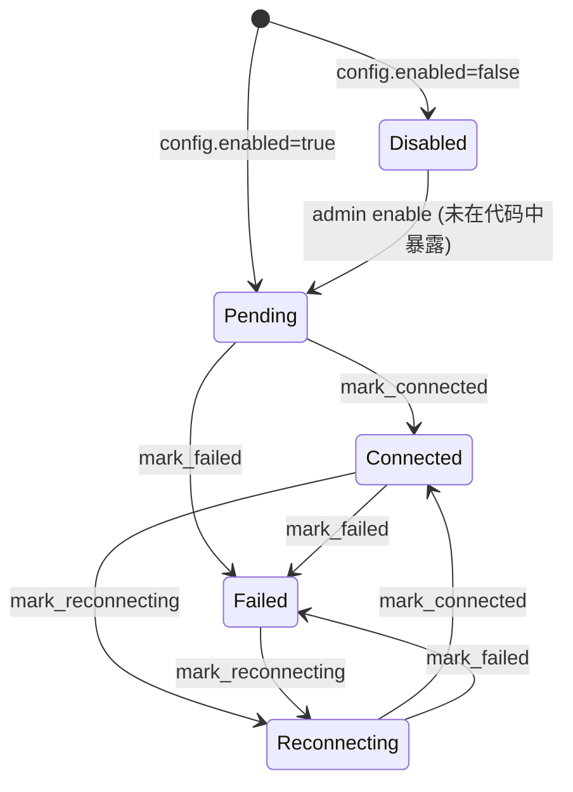
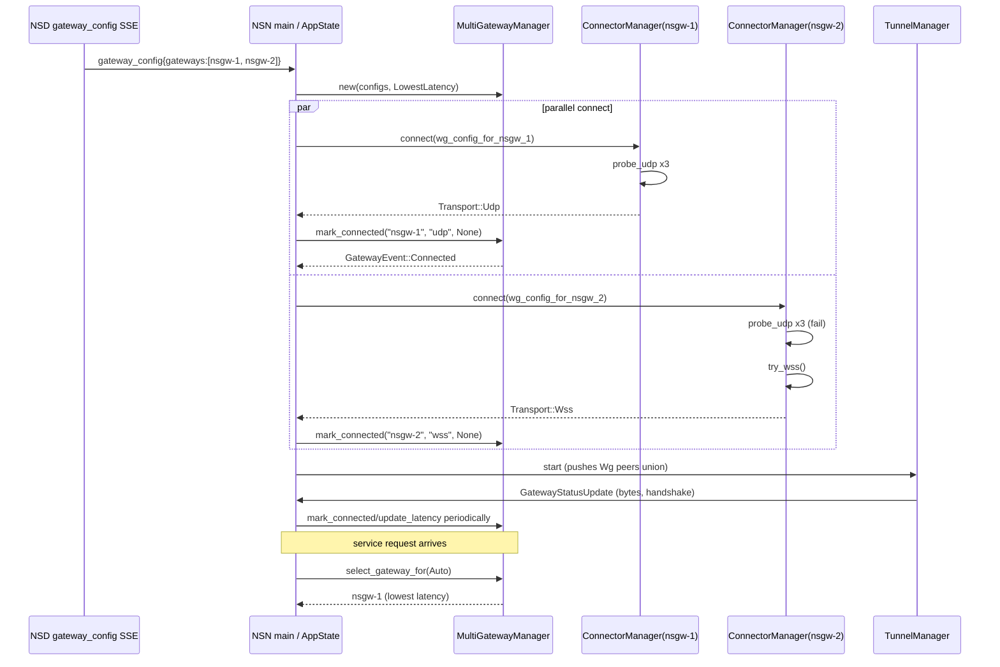

# 多网关连接器（connector）

`crates/connector/` 负责"怎么连到 NSGW"——选路、传输模式决策、健康探测、多网关 failover、状态外发。它**不搬运用户数据**：WireGuard 的加解密由 [`tunnel-wg`](./tunnel-wg.md) 的 `TunnelManager` 做，WSS 代理的帧分发由 [`tunnel-ws`](./tunnel-ws.md) 的 `WsTunnel` 做。connector 只决定 "**哪条路、哪个网关、用哪种协议**"，并将选定结果交给这两个下层模块执行。

本文档覆盖两部分：

1. `ConnectorManager`（`lib.rs`）—— 单连接传输模式管理器（UDP/WSS），一个实例只盯一组 peer。
2. `MultiGatewayManager`（`multi.rs`）—— N 个网关的并发连接状态机 + 选路策略 + 事件广播。

UDP↔WSS 的切换时序、触发条件与对数据面的影响单独放在 [`transport-fallback.md`](./transport-fallback.md)。

---

## 1. `ConnectorManager`：单连接状态机

### 1.1 数据结构

```rust
// crates/connector/src/lib.rs:67
pub struct ConnectorManager {
    config: Arc<ConnectorConfig>,
    token: Arc<RwLock<String>>,                          // Bearer JWT，可热刷新
    active: Option<Transport>,                           // Udp | Wss(Box<WsTunnel>)
    services: Arc<common::ServicesConfig>,
    acl: Arc<RwLock<Option<Arc<AclEngine>>>>,            // 传给 WsTunnel
    wss_relay_url: Option<String>,                       // 来自 gateway_config SSE
    conn_event_tx: Option<mpsc::Sender<WssConnectionEvent>>,
}
```

```rust
// lib.rs:47
pub enum Transport {
    Udp,                  // TunnelManager 在外部驱动
    Wss(Box<WsTunnel>),   // 由 ConnectorManager.run() 驱动
}
```

`Udp` 变体只是一个占位 —— 真正的 WireGuard 状态由 `TunnelManager`（`tunnel-wg` 模块）拥有。ConnectorManager 在 UDP 模式下等效于"等关停信号"。

### 1.2 四种入口

| API | 路径 | 用途 |
|---|---|---|
| `connect()` | `lib.rs:205` | 自动：先试 3 次 UDP（每次间隔 3 s）再回退 WSS |
| `connect_forced_udp()` | `lib.rs:181` | `TRANSPORT_MODE=udp`，禁止 fallback |
| `connect_forced_wss()` | `lib.rs:192` | `TRANSPORT_MODE=wss`，直接走 relay |
| `run()` | `lib.rs:304` | 驱动当前 transport 直到 shutdown 或升级 |

三次 UDP 重试的必要性：**网关需要时间把我方 peer 加入自己的 WG 配置**（通过 NSD → NSGW SSE），首次握手可能在网关 peer 表就绪前就发起。见 `lib.rs:200` 注释。

### 1.3 UDP 探活：`probe_udp`

```rust
// lib.rs:241 （节选）
let socket = UdpSocket::bind("0.0.0.0:0").await?;
let probe = vec![0u8; 148];                  // 模仿 WG handshake-initiation 长度
socket.send_to(&probe, peer.endpoint).await?;
match tokio::time::timeout(Duration::from_secs(5), socket.recv_from(&mut buf)).await {
    Ok(Ok(_)) => Ok(()),                     // 收到任何回复即认为通
    Ok(Err(e)) => Err(ConnectorError::Io(e)),// ICMP unreachable 等
    Err(_) => Ok(()),                        // 5s 超时仍视为"可能可达"
}
```

这是一次**轻量连通性探测**，不是真握手——真实握手由 `TunnelManager` 在稳定期做，或由 `tunnel_wg::probe_handshake()`（`tunnel-wg/src/lib.rs:432`）显式探测。超时 5 s 即返回 `Ok(())` 的妥协是为了放过那些"静默不回"的网关（NAT 中间盒可能吞掉非法 UDP 包），依赖后续真握手 5 s 超时兜底。

### 1.4 WSS 建连：`try_wss`

```rust
// lib.rs:271
let url = if let Some(base) = &self.wss_relay_url {
    format!("{base}/relay")
} else {
    // 从 server_url 派生（https→wss, http→ws）
    let ws_url = self.config.server_url
        .replacen("https://", "wss://", 1)
        .replacen("http://", "ws://", 1);
    format!("{ws_url}/api/v1/nsn/relay")
};
WsTunnel::connect(&url, &token, services, acl).await
```

#### <a id="wss-relay-url"></a>WSS relay URL 的三个来源

1. `set_wss_relay_url(url)`（`lib.rs:115`）由 `gateway_config` SSE 事件主动推送，格式 `ws://172.18.0.5:9443`，追加 `/relay` 后连。
2. 未推送则 fallback 到 `config.server_url`，即 NSD 的 HTTP(S) 地址复用（适合 mock / 合一部署）。
3. 若 `Authorization: Bearer <token>` 失败，`tungstenite` 返回 `Error::Http(401)`，`WsTunnel::connect` 超时 15 s（`tunnel-ws/src/lib.rs:322`）。

### 1.5 Token 热刷新

`token: Arc<RwLock<String>>` 通过 `set_token_refresh_rx(rx)`（`lib.rs:169`）挂一个 mpsc 通道接收 NSD 下发的 `TokenRefresh` 事件：

```rust
// lib.rs:170
tokio::spawn(async move {
    while let Some(new_token) = rx.recv().await {
        *token.write().unwrap() = new_token;
    }
});
```

新 token 在**下次** WSS 重连时生效，不会打断正在跑的流（已建立的 WSS 连接继续走旧 JWT；一旦对端因过期拒绝，connector 重建时拿到新 token）。

### 1.6 ACL / services 热更新

`acl_handle()` 返回同一个 `Arc<RwLock<Option<Arc<AclEngine>>>>` 给控制面任务。`WsTunnel` 在每个 `Open` 帧评估时读锁一次（`tunnel-ws/src/lib.rs:450`），因此新策略**立即生效**，无需重连。详见 [`tunnel-ws.md §4.1`](./tunnel-ws.md#41-热更新)。

---

## 2. `MultiGatewayManager`：N 网关并发状态机

`crates/connector/src/multi.rs` 不持有 tokio task，也不做 I/O —— 它是一个**纯状态容器 + 事件总线**。NSN 主进程（`nsn` crate）为每个 `GatewayConfig` 单独起 ConnectorManager；manager 把连上 / 断开 / 握手等事件用 `mark_*` 回填到 `MultiGatewayManager`，后者再广播给 Monitor API 与 NSD reporter。

### 2.1 GatewayStatus 状态机

```rust
// multi.rs:50
pub enum GatewayStatus {
    Connected { since: Instant },
    Reconnecting { attempt: u32 },
    Failed { reason: String, since: Instant },
    Disabled,                                      // 配置 enabled=false
    Pending,                                       // 尚未尝试
}
```

触发 API 与转移：

| 事件 API | 源 | 目标状态 | 伴随 GatewayEvent |
|---|---|---|---|
| `mark_connected(id, transport, latency)` `multi.rs:210` | Pending / Reconnecting / Failed | `Connected{since=now}` | `Connected{id, transport, latency}` |
| `mark_failed(id, reason)` `multi.rs:228` | Connected / Reconnecting | `Failed{reason, since=now}` | `Disconnected{id, error}` |
| `mark_reconnecting(id, attempt)` `multi.rs:248` | Failed / Connected | `Reconnecting{attempt}` | `Reconnecting{id, attempt}` |
| `update_latency(id, lat)` `multi.rs:259` | 保持不变 | — | `LatencyUpdate{id, latency}` |



> 源码里不区分 "healthy / degraded / failed" 三档。**"healthy"** 对应 `Connected`；**"degraded"** 并未建模——策略层通过 latency 阈值 / 带宽配额自行判断；**"failed"** 对应 `Failed`。这与 NSIO 现有实现保持一致，不做臆测扩展。

### 2.2 健康探测机制

`MultiGatewayManager` 自身有一个 `health_interval: Duration`（`multi.rs:157`，默认 `Duration::from_secs(30)`）成员，但**当前标注了 `#[allow(dead_code)]`**：健康探测的驱动仍在上层完成，路径组合如下：

| 层次 | 实际周期 | 动作 |
|---|---|---|
| `probe_udp` 初始 3 次 | 每次间隔 3 s、超时 5 s | UDP 可达性 |
| `TunnelManager` UAPI 轮询 | 5 s（`tunnel-wg/src/lib.rs:546`） | 读 `last_handshake_time_sec`、`tx/rx_bytes` |
| WSS 升级探测 | 300 s（`connector/src/lib.rs:328`） | 在 WSS 模式下试 UDP 以升级回 UDP |
| 上层 NSN 主循环 | `gateway_report` 默认按配置节奏 | 聚合 GatewayEvent → 发 NSD |

触发 failover 的阈值因此是**事件驱动**而非定时器驱动：

- **UDP→WSS fallback**：`connect()` 前置 3 次 UDP 探测全部失败（`lib.rs:222`）。
- **WSS→UDP upgrade**：`run()` 的 300s tick 探测成功（`lib.rs:353`）。
- **Gateway 整体失败**：上层检测到 `TunnelManager` handshake 超时、WSS 连接关闭（`proxy_done_rx` 收到 `Err`/`Ok`），调用 `mark_failed`。

### 2.3 GatewayStrategy：选路策略

```rust
// multi.rs:84
pub enum GatewayStrategy {
    LowestLatency,       // min_by_key(latency.unwrap_or(u128::MAX))
    RoundRobin,          // rr_cursor 递增取模
    PriorityFailover,    // 按 config.priority 升序取首个 Connected
}
```

实现：

| 策略 | 位置 | 核心语义 |
|---|---|---|
| `LowestLatency` | `multi.rs:313` | 过滤 `Connected`，按 latency 最小取出；`None` latency 视为最大（排最后） |
| `RoundRobin` | `multi.rs:320` | 对 `Connected` 子集按 `rr_cursor % len()` 选，cursor 每次 `wrapping_add(1)` |
| `PriorityFailover` | `multi.rs:338` | 对 `Connected` 子集按 `config.priority` 升序，取首个（数字越小优先级越高） |

#### 每服务选路：`select_gateway_for`

`services.toml` 可按服务指定：`gateway = "auto"` 或 `gateway = "nsgw-1"`。对应 `common::GatewayPreference`（`multi.rs:285`）：

```rust
match pref {
    Auto               => self.select_gateway(),
    Specific(id) if id connected => Some(entry),
    Specific(id) otherwise       => None,     // 不 fallback 到其它网关
}
```

**关键行为**：`Specific` 指定的网关断开时，返回 `None` —— 调用方（`ServiceRouter`）会把该服务视为不可用，而不会 silently 换到其它网关。这是一个有意的安全选择：跨网关可能跨安全域。

### 2.4 GatewayEvent 广播

```rust
// multi.rs:24
pub enum GatewayEvent {
    Connected        { id, transport, latency },
    Disconnected     { id, error },
    Reconnecting     { id, attempt },
    LatencyUpdate    { id, latency },
    BytesTransferred { id, tx, rx },
    HandshakeCompleted { id, timestamp },
}
```

事件通过 `with_event_sender(mpsc::Sender)`（`multi.rs:185`）注入；发送语义为 `try_send`（`multi.rs:191`）——**满则丢，不阻塞数据面**。订阅者通常是：

- **AppState**：维护实时 `/api/gateways` 视图。
- **NSD reporter**：把 `Connected` / `Disconnected` / `BytesTransferred` 打包发 `gateway_report`（控制面定义在 [`../02-control-plane/`](../02-control-plane/)）。
- **Monitor 日志**：审计 / 诊断。

`BytesTransferred` 和 `HandshakeCompleted` 事件由 `tunnel-wg` 的 `GatewayStatusUpdate`（`tunnel-wg/src/lib.rs:67`）经上层转换产生；`multi.rs` 本身只定义事件类型，实际发送由上层桥接。

---

## 3. 完整流程：N 个网关并发上线



---

## 4. `MultiGatewayManager` 与 `ConnectorManager` 的分工

| 关注点 | ConnectorManager | MultiGatewayManager |
|---|---|---|
| 指向几个网关 | **一个**（`wg_config.peers[0]` 上的 endpoint） | **全部**（`gateways: Vec<GatewayEntry>`） |
| 拥有 I/O | 是（UdpSocket、WsTunnel） | 否（纯状态） |
| 决策 transport | 是（`probe_udp` 失败 → WSS） | 否（只记录结果） |
| 决策 gateway | 否 | 是（`select_gateway*`） |
| 事件发送 | 是（`WssConnectionEvent`） | 是（`GatewayEvent`） |
| 生命周期 | 每个网关一个实例 | 进程内单例 |

为什么这样拆？—— connect/handshake 是 I/O heavy 的异步状态机；健康看板是同步共享的数据结构。把两者合进一个 actor 会让状态视图跟着 I/O 重量级锁，不利于 Monitor API 的低延迟读取。

---

## 5. 关键源码索引

### ConnectorManager

| 主题 | 位置 |
|---|---|
| `ConnectorManager::new` | `crates/connector/src/lib.rs:93` |
| `connect` (3x UDP → WSS) | `crates/connector/src/lib.rs:205` |
| `connect_forced_udp` | `crates/connector/src/lib.rs:181` |
| `connect_forced_wss` | `crates/connector/src/lib.rs:192` |
| `probe_udp` | `crates/connector/src/lib.rs:241` |
| `try_wss` | `crates/connector/src/lib.rs:271` |
| `run` (WSS driver + upgrade loop) | `crates/connector/src/lib.rs:304` |
| `probe_upgrade_loop` | `crates/connector/src/lib.rs:380` |
| `set_wss_relay_url` | `crates/connector/src/lib.rs:115` |
| `set_token_refresh_rx` | `crates/connector/src/lib.rs:169` |
| `acl_handle` | `crates/connector/src/lib.rs:152` |

### MultiGatewayManager

| 主题 | 位置 |
|---|---|
| `GatewayEvent` enum | `crates/connector/src/multi.rs:24` |
| `GatewayStatus` enum | `crates/connector/src/multi.rs:50` |
| `GatewayStrategy` enum | `crates/connector/src/multi.rs:84` |
| `GatewayEntry` + `info()` | `crates/connector/src/multi.rs:97` |
| `MultiGatewayManager::new` | `crates/connector/src/multi.rs:166` |
| `mark_connected` / `mark_failed` / `mark_reconnecting` | `crates/connector/src/multi.rs:210` / `:228` / `:248` |
| `select_gateway` | `crates/connector/src/multi.rs:272` |
| `select_gateway_for` | `crates/connector/src/multi.rs:285` |
| `select_lowest_latency` / `select_round_robin` / `select_priority_failover` | `crates/connector/src/multi.rs:313` / `:320` / `:338` |

---

## 6. 相关阅读

- [`tunnel-wg.md`](./tunnel-wg.md) —— UDP 模式下真正做 WireGuard 的模块。
- [`tunnel-ws.md`](./tunnel-ws.md) —— WSS 模式下的 `WsTunnel` 实现（本模块 `Transport::Wss` 的内容物）。
- [`transport-fallback.md`](./transport-fallback.md) —— UDP↔WSS 切换时序、per-service 选路影响。
- [`../02-control-plane/`](../02-control-plane/) —— `gateway_config`、`TokenRefresh`、`gateway_report`。
- [`../05-proxy-acl/`](../05-proxy-acl/) —— `services.toml` 与 `GatewayPreference` 定义。
- [`../01-overview/`](../01-overview/) —— 多网关架构整体。
