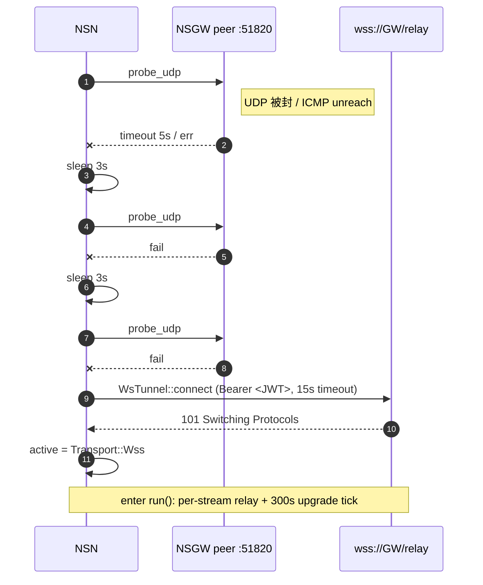
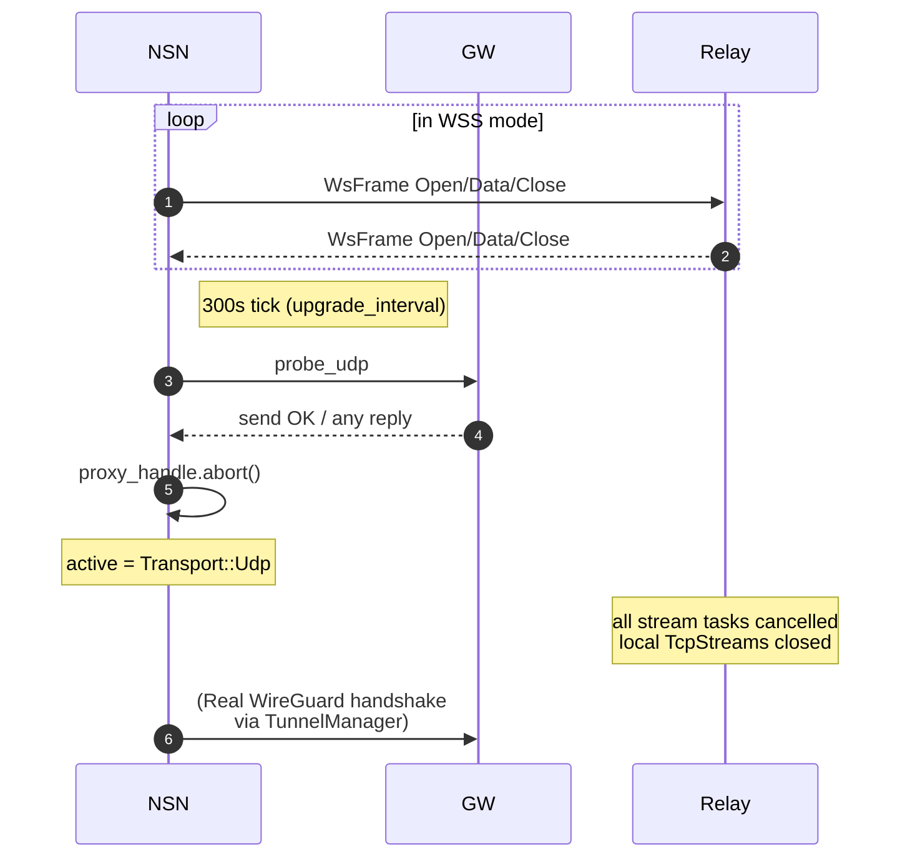

# 传输回退：UDP ↔ WSS

NSN 的数据面提供两条等价通道：

- **UDP / WireGuard**（`tunnel-wg`） —— 默认主路径，最低开销、最低延迟。
- **TCP / WSS**（`tunnel-ws`） —— fallback，穿透严格防火墙（TLS 443 几乎不会被封）。

两条通道在运行期可以**无感切换**：`ConnectorManager` 负责探测、切换和复位；切换只影响"送到哪个 socket"，不影响用户级服务的存在性（ACL、services.toml 列表、`ServiceRouter` 对上层完全不变）。

本文档聚焦切换行为本身：触发条件、每服务独立选路、切换对已建流的影响。实现细节分别见 [`connector.md`](./connector.md)、[`tunnel-wg.md`](./tunnel-wg.md)、[`tunnel-ws.md`](./tunnel-ws.md)。

---

## 1. 三种运行模式

由 `ConnectorConfig.transport_mode`（`common` crate）决定，常见值 `auto | udp | wss`：

| 模式 | 启动入口 | fallback | upgrade | 场景 |
|---|---|---|---|---|
| `auto`（默认） | `connect()` `connector/src/lib.rs:205` | UDP 失败 3 次 → WSS | WSS 模式下每 300 s 探 UDP | 无特殊约束的常规部署 |
| `udp` | `connect_forced_udp()` `:181` | 关 | 关 | 已知 UDP 可达、拒绝 TCP fallback |
| `wss` | `connect_forced_wss()` `:192` | 关（直接 WSS） | 关 | 网络确定封 UDP，省去探测 |

> 具体字段名称在 `common::ConnectorConfig.transport_mode: String`（见 [`../01-overview/`](../01-overview/) 的配置章节）；三个入口在 `ConnectorManager` 中分开暴露，由 NSN 主循环按配置选择其一调用。

---

## 2. 触发条件一览

### 2.1 UDP → WSS（fallback）

`auto` 模式下 `connect()` 执行的初始化决策：

```rust
// connector/src/lib.rs:208
for attempt in 0u32..3 {
    if attempt > 0 { tokio::time::sleep(Duration::from_secs(3)).await; }
    match self.probe_udp(wg_config).await {
        Ok(()) => { self.active = Some(Transport::Udp); return Ok(()); }
        Err(e) => warn!(error=%e, attempt=attempt+1, "UDP probe failed"),
    }
}
warn!("UDP unavailable after 3 attempts, falling back to WSS");
let proxy = self.try_wss().await?;
self.active = Some(Transport::Wss(Box::new(proxy)));
```

| 判据 | 来源 |
|---|---|
| 3 次 `probe_udp` 全失败 | `lib.rs:208` |
| 每次超时 5 s（静默返回 `Ok` 的情形不算失败） | `lib.rs:257` |
| 每两次探测间隔 3 s（给网关 SSE 同步本端 peer 的时间） | `lib.rs:210` |
| `try_wss()` 自身 15 s TLS/upgrade 超时 | `tunnel-ws/src/lib.rs:322` |

总最坏耗时：`5+3+5+3+5 = 21s` 后开始 WSS，加 15 s WSS 握手 → ≤ 36 s。

### 2.2 WSS → UDP（upgrade）

进入 WSS 模式后，`run()` 启动一个 300 s 周期的探测（`lib.rs:328`）：

```rust
// lib.rs:327
let mut upgrade_interval = tokio::time::interval_at(
    tokio::time::Instant::now() + Duration::from_secs(300),
    Duration::from_secs(300),
);
loop { tokio::select! {
    () = &mut shutdown => { proxy_handle.abort(); break; }
    result = proxy_done_rx.recv() => { /* WSS 断开 */ break; }
    _ = upgrade_interval.tick() => {
        if probe_udp(wg_config).await.is_ok() {
            proxy_handle.abort();
            self.active = Some(Transport::Udp);
            break;
        }
    }
}}
```

| 判据 | 说明 |
|---|---|
| 周期 300 s | 保守值：频繁 UDP 探测可能触发中间盒限速 |
| 一次成功即切换 | 无需多次确认——若 UDP 此刻通，值得立刻升级 |
| `proxy_handle.abort()` | 先撤销 WSS 驱动任务，再把状态切到 `Udp` |
| `probe_upgrade_loop` 另有独立入口 | `lib.rs:380`，供非 WSS 模式外部调用（currently未被 run() 复用） |

### 2.3 隐式触发：WSS 连接自身断开

```rust
// lib.rs:344
result = proxy_done_rx.recv() => {
    match result {
        Some(Err(e)) => warn!("WSS proxy closed with error: {e}"),
        Some(Ok(()))  => info!("WSS proxy closed"),
        None          => warn!("WSS proxy task ended unexpectedly"),
    }
    break;
}
```

`WsTunnel::run()` 返回即 connector `run()` 退出 —— 此时 `active` 仍为 `Transport::Wss(_)`（已经 `take()` 了实际值），上层（NSN 主循环）检测到退出后**应重新调用 `connect()`**。重连时会再走一遍 `auto` 决策：UDP 可能已恢复。

---

## 3. 切换对数据面的影响

### 3.1 单条流是否会被保留？—— **否**

两种通道在协议层面互斥：

- **UDP 模式**下，TCP/UDP 通过 gotatun encrypt → WireGuard → NSGW → …
- **WSS 模式**下，TCP/UDP 通过 `WsFrame Open/Data/Close` → wss:// → NSGW → …

切换时：
1. UDP→WSS：`TunnelManager` 的 device 在下一次 `WgConfig` 重建时才会停；**WSS 建立前 UDP 仍可短暂工作**。fallback 本质是 `ConnectorManager` 的 `active` 从 `Udp`（占位）变成 `Wss(WsTunnel)` —— 真正的用户流量由哪条路走取决于 `ServiceRouter` 在每次新连接时查询"网关当前 transport"字段。
2. WSS→UDP：`proxy_handle.abort()` 会中断 `WsTunnel::run()`，**所有 `DashMap` 里的 stream_id 对应的 relay task 被取消**（tokio 会 cancel），已连的本地 TcpStream 立即关闭。下游会看到 TCP RST / UDP 静默。

> 当前实现**不做 in-flight 流的搬移**。Fallback 与 upgrade 都不是"0-RTT 续接"，上层（应用 / 代理客户端）需要应对短暂断流——在 300 s 升级节奏下，这通常被认为是可接受的。

### 3.2 每服务独立选路

`services.toml` 每条服务可以独立指定 `gateway` 与 `tunnel` 偏好（见 [`../05-proxy-acl/`](../05-proxy-acl/) 的 services.toml 详解）。本文档聚焦 **选路如何影响 transport**：

| 服务偏好 | 行为 |
|---|---|
| `gateway = "auto"` | `MultiGatewayManager::select_gateway()` 按策略选：`Connected` 优先，低延迟 / priority 居中 |
| `gateway = "nsgw-X"` | 若该网关未 `Connected`，`select_gateway_for` 返回 `None` → 连接失败（不 fallback 到其它网关） |
| `tunnel = "wg"` | 仅允许该服务走 UDP；若所选网关当前 transport=`"wss"`，ServiceRouter 应拒绝 |
| `tunnel = "ws"` | 仅允许走 WSS |
| `tunnel = "auto"` | 跟随所选网关的当前 transport |

`GatewayEntry.transport`（`connector/src/multi.rs:103`）在 `mark_connected` 时被设置为 `"udp"` 或 `"wss"`，是 ServiceRouter 做 `tunnel` 策略判断的单一数据源。

### 3.3 并行多网关共存两种 transport

`MultiGatewayManager` 允许 **nsgw-1 在 UDP、nsgw-2 在 WSS** 并存：

```
+-----------+       UDP (fast)          +--------+
|   NSN     | <-----------------------> | nsgw-1 |
|           |                           +--------+
|           |       WSS (fallback)      +--------+
|           | <-----------------------> | nsgw-2 |
+-----------+                           +--------+
```

每个 ConnectorManager 各自做 fallback 决策；`MultiGatewayManager.gateway_infos()` 返回两个 entry，各自带 `transport: Some("udp"|"wss")`。上游 Monitor API 因此可以直接显示"nsgw-1: udp | nsgw-2: wss"。

---

## 4. 时序图

### 4.1 正常 auto 启动 + fallback



### 4.2 WSS→UDP 升级



完整版：[`diagrams/fallback.mmd`](./diagrams/fallback.mmd)。

---

## 5. 配置与调参

| 项 | 位置 | 默认 | 调整含义 |
|---|---|---|---|
| `transport_mode` | `ConnectorConfig` (`common`) | `"auto"` | 强制 `udp`/`wss` 跳过决策 |
| UDP 重试次数 | `connector/src/lib.rs:208` | 3 | 代码常量，未暴露配置 |
| UDP 重试间隔 | `lib.rs:210` | 3 s | 等待 NSGW SSE 同步本端 peer |
| UDP 探测超时 | `lib.rs:257` | 5 s | `tokio::time::timeout` |
| WSS 握手超时 | `tunnel-ws/src/lib.rs:322` | 15 s | 含 TCP + TLS + WebSocket upgrade |
| WSS→UDP 探测周期 | `connector/src/lib.rs:328` | 300 s | 降低增加频率可能触发 NAT 限速 |
| `ws_max_messages_per_sec` | `ConnectorConfig` | — | WSS 速率限制（防滥用） |
| `ws_max_message_size` | `ConnectorConfig` | 1 048 576 | 单帧上限 |

最后两项由 WsTunnel 的更上层（NSN 应用层）执行；`tunnel-ws` 内部未强制。

---

## 6. 监控维度

`ConnectorManager` + `MultiGatewayManager` + `TunnelManager` 协作产生的可观测信号：

| 信号 | 来源 | 含义 |
|---|---|---|
| `GatewayEvent::Connected{transport}` | `MultiGatewayManager::mark_connected` | 一次上线；`transport` 字符串区分 `"udp"` / `"wss"` |
| `GatewayEvent::Disconnected` | `mark_failed` | 失败（含 WSS 意外关闭） |
| `GatewayEvent::LatencyUpdate` | `update_latency` | 单网关延迟样本 |
| `GatewayEvent::BytesTransferred` | `tunnel-wg` `GatewayStatusUpdate` 经桥接 | 累积 TX/RX 字节 |
| `GatewayEvent::HandshakeCompleted` | 同上，基于 `last_handshake_time_sec` 跳变 | 握手次数 |
| `WssConnectionEvent::Open/Close` | `tunnel-ws/src/lib.rs:47` | 单条逻辑流生命周期 |
| `/api/gateways` | Monitor API | 聚合所有 entry |

切换事件可以通过观察 `gateway.transport` 变化或 `LatencyUpdate` 的数量级跳变（UDP 通常 < 10 ms，WSS ≥ 30 ms）识别。

---

## 7. 关键源码索引

| 主题 | 位置 |
|---|---|
| 3x UDP → WSS fallback 主逻辑 | `crates/connector/src/lib.rs:205` |
| 300s WSS→UDP upgrade 循环 | `crates/connector/src/lib.rs:327` |
| `probe_upgrade_loop` 独立循环 | `crates/connector/src/lib.rs:380` |
| `probe_udp` 5s timeout | `crates/connector/src/lib.rs:241` |
| `try_wss` 15s connect timeout | `crates/tunnel-ws/src/lib.rs:322` |
| `WsTunnel::run` 退出→connector 退出 | `crates/connector/src/lib.rs:344` |
| `GatewayEntry.transport` 字符串 | `crates/connector/src/multi.rs:103` |

---

## 8. 相关阅读

- [`connector.md`](./connector.md) —— 实现本文所述决策的两个 manager。
- [`tunnel-wg.md`](./tunnel-wg.md) —— UDP 路径上的真正工作负载。
- [`tunnel-ws.md`](./tunnel-ws.md) —— WSS 路径上的帧与流。
- [`../02-control-plane/`](../02-control-plane/) —— `gateway_config` 事件如何改变可用网关集。
- [`../05-proxy-acl/`](../05-proxy-acl/) —— `services.toml` 的 per-service `gateway`/`tunnel` 字段。
- [`../01-overview/`](../01-overview/) —— 系统总体视图与各 hop 的 transport 选取。
