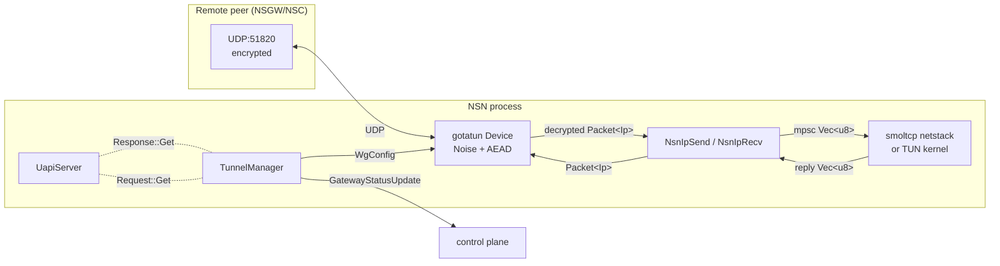

# WireGuard 用户态隧道（tunnel-wg）

`crates/tunnel-wg/` 封装 **gotatun** 的用户态 WireGuard 实现，为 NSN 数据面提供加密隧道。一个 `TunnelManager` 实例管理一条 gotatun `Device`，动态响应控制面下发的 `WgConfig` 事件（peer 列表、endpoint、`allowed_ips`、keepalive）并维护 handshake / 加密 / 解密状态机。

不同于直接调用 `boringtun::noise::Tunn` 的旧实现，tunnel-wg 依赖 gotatun 内置的 **UAPI**（WireGuard 用户空间配置协议）：device 通过 `UapiServer` 暴露 `GET`/`SET` 接口，所有 peer 状态查询与动态增删都走这个通道。

> **定位**：本模块只负责"WireGuard 报文加解密 + 动态 peer 管理"；UDP socket 由 gotatun 的 `UdpSocketFactory` 负责，传输选路由上层 [connector](./connector.md) 决定；报文 payload（IP 层之上）交给 [netstack（smoltcp）](../04-network-stack/) 或 kernel TUN 处理。

---

## 1. 双数据面模式：UserSpace vs TUN

`TunnelManager` 根据 `DataPlaneMode` 选择两种拓扑之一（`crates/tunnel-wg/src/lib.rs:265`）。

```rust
// lib.rs:44
type WgDeviceUserSpace = Device<(UdpSocketFactory, NsnIpSend, NsnIpRecv)>;
type WgDeviceTun       = Device<(UdpSocketFactory,
                                 HybridNatSend<TunDevice>,
                                 HybridNatRecv<TunDevice>)>;
```

| 模式 | 解密出口 | 加密入口 | 目标 | 适用场景 |
|---|---|---|---|---|
| **UserSpace** | `NsnIpSend` → mpsc → smoltcp/NAT | smoltcp → mpsc → `NsnIpRecv` | 无 root / 容器 | 默认；NSN/NSC 通用 |
| **TUN** | `HybridNatSend` (DNAT+SNAT+conntrack) → kernel TUN | kernel TUN → `HybridNatRecv` | 消除冗余 TCP 状态机 | 有 `CAP_NET_ADMIN` 的 NSN 服务器 |

TUN 模式下，**本地服务**（`127.0.0.1`）经 DNAT 直接交给内核；**远端服务** 仍需进入 smoltcp 代理管线（`proxy_tx` 通道，`lib.rs:367`）。相关设计动机见 [`../01-overview/`](../01-overview/) 对 "TCP state-machine elimination" 的说明，以及 `crates/nsio/docs/transport-design.md` §Data Plane Modes。

### 1.1 UserSpace 报文路径

```
┌────────┐    UDP    ┌────────┐  decrypted ┌─────────┐  mpsc  ┌────────┐
│  NSGW  │──────────▶│ gotatun│───────────▶│NsnIpSend│───────▶│smoltcp │
│  :51820│           │ Device │            └─────────┘        │  /NAT  │
│        │◀──────────│        │◀───────────┌─────────┐◀───────│        │
└────────┘  encrypted│        │  encrypt   │NsnIpRecv│        └────────┘
                     └────────┘            └─────────┘
                                          mpsc(capacity=256)
```

- `NsnIpSend::send(packet)`（`ip_adapter.rs:25`）将解密后的 `Packet<Ip>` 序列化为 `Vec<u8>` 送入 `decrypted_tx`。
- `NsnIpRecv::recv()`（`ip_adapter.rs:50`）从 `encrypt_rx` 取一包，`Packet::from_bytes().try_into_ip()` 后提交给 gotatun 加密。
- MTU 固定 1420（`MtuWatcher::new(1420)`，`lib.rs:312`），为 WireGuard 头部留 80 字节裕量。

### 1.2 TUN Hybrid 报文路径

`HybridNatSend` 在 `crates/nat` 中实现（本目录不展开），核心职责：

- **本地服务**（`host=127.0.0.1`）：五元组匹配 `ServicesConfig` → DNAT+SNAT → conntrack 记录 → 写 TUN fd。
- **远端服务**（`host=192.168.x.x` 等）：仍要走 smoltcp，因此转到 `proxy_tx` 通道进入 `decrypted_tx`。

`HybridNatRecv` 对称反向：TUN 读取内核返回包 → 反查 conntrack → 恢复原地址 → gotatun 加密。`smoltcp_out_tx` 通道（`lib.rs:380`）专门用于把 smoltcp 生成的回复包塞进加密路径。

---

## 2. UAPI —— 动态 peer 管理协议

### 2.1 什么是 UAPI

UAPI（[WireGuard User-Space API](https://www.wireguard.com/xplatform/#configuration-protocol)）是 wireguard-go / boringtun / gotatun 共用的配置协议：通过键值对 `set=1` / `get=1` 请求读写 peer 表，替代需要 root 权限的 netlink。NSN 的 `wg show` 风格观测、handshake 探活、实时 byte counter 全靠 UAPI。

gotatun 提供进程内 UAPI 客户端，无需 unix socket：

```rust
// lib.rs:315
let (uapi_client, uapi_server) = UapiServer::new();
let builder = DeviceBuilder::new()
    .with_uapi(uapi_server)
    .with_private_key(StaticSecret::from(peer_key_priv));
```

### 2.2 TunnelManager 如何使用 UAPI

`TunnelManager::run()` 本身并不手工做 handshake；gotatun Device 接管了所有 Noise_IKpsk2 状态机、重放窗口、timer。NSN 唯一需要的 UAPI 操作是周期性 `GET`：

```rust
// lib.rs:548
let resp = match uapi_client.send(Request::Get(Get::default())).await {
    Ok(Response::Get(r)) if r.errno == 0 => r,
    _ => continue,
};
```

返回的 `GetResponse.peers[]` 每条包含：`public_key`、`endpoint`、`last_handshake_time_sec`（绝对 Unix 秒）、`tx_bytes` / `rx_bytes`、`persistent_keepalive_interval`。

### 2.3 动态 peer 更新策略

控制面推送新的 `WgConfig` 时，NSN **不使用** UAPI 的 `set` 增量更新，而是**重建整个 Device**（`lib.rs:218`）：

```text
WgConfig arrives
  └─ stop old device (drops all peers, closes UDP socket)
  └─ build_device_{tun,userspace}(&cfg)
  └─ iterate cfg.peers, builder = builder.with_peer(build_peer(p))
  └─ builder.build().await  // gotatun starts fresh
```

这样做避免了"中间态"（旧 peer 尚未删除、新 peer 尚未握手）带来的报文错路由；代价是会重做一次 handshake（≤ 5s）。在 NSIO 的场景下 `WgConfig` 变化频率低（通常只在网关扩缩容时触发），重建成本可接受。

---

## 3. TunnelManager 生命周期

```rust
// lib.rs:117
pub struct TunnelManager {
    wg_config_rx: mpsc::Receiver<WgConfig>,
    peer_key_priv: [u8; 32],
    gateway_infos: Vec<GatewayInfo>,
    status_tx: mpsc::Sender<GatewayStatusUpdate>,
    mode: DataPlaneMode,
    tun_ip: Ipv4Addr,
    services: Arc<ServicesConfig>,
    acl_handle: Arc<RwLock<Option<Arc<AclEngine>>>>,
    decrypted_tx: mpsc::Sender<Vec<u8>>,
    to_encrypt_rx: mpsc::Receiver<Vec<u8>>,
}
```

`run()` 主循环（`lib.rs:186`）用 `biased` select 保证优先处理配置事件：

```
loop {
  select! biased {
    cfg = wg_config_rx.recv()        -> rebuild device
    pkt = to_encrypt_rx.recv()       -> forward to gen_encrypt_tx (UserSpace only)
  }
}
```

关键不变式：

1. **双通道分层**：外部稳定通道 `decrypted_tx` / `to_encrypt_rx` 对调用方可见；每次 device 重建后内部产生 `gen_decrypted_tx` / `gen_encrypt_tx`，通过 spawned bridge 任务（`lib.rs:331`）桥接到稳定通道，调用方无需关心 device 代际。
2. **TUN 模式无加密桥**：`gen_encrypt_tx = None`（`lib.rs:405` 返回 `Some(smoltcp_out_tx)` 仅用于 smoltcp→加密），`to_encrypt_rx` 在 TUN 模式下不被消费。
3. **status_handle 跟随 device 重建**：每次 rebuild 先 `status_handle.take().abort()`（`lib.rs:208`），再 `spawn_status_poller`（`lib.rs:516`）。

### 3.1 Handshake 探活：`probe_handshake`

`connector` 层需要在 fallback 决策前确认 UDP 可达、Noise 能完成握手。`probe_handshake()`（`lib.rs:432`）临时构造一个 Device，每 500 ms 轮询 UAPI：

```rust
// lib.rs:469
if let Ok(Response::Get(resp)) = uapi_client.send(Request::Get(Get::default())).await {
    let any_connected = resp.peers.iter()
        .any(|p| p.last_handshake_time_sec.is_some());
    if any_connected { return Ok(()); }
}
```

`timeout` 到期则返回 `Error::HandshakeTimeout`（默认 5 s，见 [`connector.md`](./connector.md)）。

### 3.2 状态上报：`spawn_status_poller`

5 秒周期（`lib.rs:546`）调用一次 UAPI `GET`，并按需发送 `GatewayStatusUpdate`：

| 事件 | 触发条件 | `bytes_tx/rx` |
|---|---|---|
| **连接状态跳变** | `connected != was_connected[i]` | `None` |
| **周期性字节计数** | 每轮总是发送 | `Some(tx_bytes, rx_bytes)` |
| **Handshake 计数+1** | `curr_hs_sec > prev_hs_sec + 10` | —（含在上面两类） |

`handshake_count` 在 `curr > prev + 10` 时递增（`lib.rs:572`），避免 5s 轮询抖动导致重复计数。`gateway_id` 通过 `find_gateway_id_by_port`（`lib.rs:619`）按 peer endpoint 端口匹配 `GatewayInfo.wg_endpoint`。

```mermaid
stateDiagram-v2
    [*] --> Starting
    Starting --> Awaiting: TunnelManager::new()
    Awaiting --> Building: wg_config_rx.recv()
    Building --> Active: build_device() Ok
    Building --> Awaiting: build fail (warn, keep old device None)
    Active --> TearDown: next WgConfig arrives
    TearDown --> Building: stop old, build new
    Active --> Polling: every 5s UAPI GET
    Polling --> StatusEmit: connected_changed or tick
    StatusEmit --> Active
    Active --> Stopped: wg_config_rx closed
    Stopped --> [*]
```

---

## 4. ACL 过滤（acl_ip_adapter）

`AclFilteredSend<S>`（`acl_ip_adapter.rs:80`）是一个 `IpSend` 装饰器，用于在包进入下一级前丢弃不允许的流量。当前策略极简（`acl_ip_adapter.rs:71`）：

```rust
pub fn is_packet_allowed(packet: &[u8]) -> bool {
    parse_five_tuple(packet).is_some()
}
```

即 **仅保留可解析的 IPv4 TCP/UDP 报文**，丢弃 ICMP、IPv6、截断帧。这是第一道硬过滤；细粒度的 five-tuple ACL 在更上层（smoltcp 代理侧）执行，参见 [`../05-proxy-acl/`](../05-proxy-acl/)。

### 4.1 Five-tuple 解析

`parse_five_tuple`（`acl_ip_adapter.rs:37`）按 RFC 791 固定偏移解析，避免引入 `pnet` 等重型包。流程：

1. `len < 20` → None（最小 IPv4 头）。
2. `packet[0] >> 4 != 4` → None（非 IPv4）。
3. `ihl = (packet[0] & 0x0f) * 4`；`protocol = packet[9]`。
4. `protocol ∉ {TCP=6, UDP=17}` → None。
5. 源/目 IP 从 `[12..16]`、`[16..20]`；端口从 `[ihl..ihl+4]`。

该函数完全不依赖 smoltcp；TUN 模式下没有 smoltcp 也能做 ACL，这是 NSIO "ACL without smoltcp" 设计的关键（参见 `transport-design.md` §ACL Without smoltcp）。

---

## 5. 报文流总览（Mermaid）



完整版见 [`diagrams/wg-tunnel.mmd`](./diagrams/wg-tunnel.mmd)。

---

## 6. 关键源码索引

| 入口 | 位置 | 说明 |
|---|---|---|
| `TunnelManager::new` | `crates/tunnel-wg/src/lib.rs:149` | 构造 + 外部通道 |
| `TunnelManager::run` | `crates/tunnel-wg/src/lib.rs:186` | 主循环 |
| `build_device_userspace` | `crates/tunnel-wg/src/lib.rs:297` | UserSpace 构建 |
| `build_device_tun` | `crates/tunnel-wg/src/lib.rs:351` | TUN hybrid 构建 |
| `probe_handshake` | `crates/tunnel-wg/src/lib.rs:432` | Handshake 探活 |
| `spawn_status_poller` | `crates/tunnel-wg/src/lib.rs:516` | UAPI GET 轮询 |
| `NsnIpSend` / `NsnIpRecv` | `crates/tunnel-wg/src/ip_adapter.rs:14` / `:38` | gotatun ↔ mpsc 适配 |
| `AclFilteredSend` | `crates/tunnel-wg/src/acl_ip_adapter.rs:80` | 包级 ACL 过滤 |
| `parse_five_tuple` | `crates/tunnel-wg/src/acl_ip_adapter.rs:37` | 无依赖 five-tuple |
| `build_peer` | `crates/tunnel-wg/src/lib.rs:483` | PeerConfig → gotatun Peer |

---

## 7. 相关阅读

- [`connector.md`](./connector.md) —— 多网关 / UDP↔WSS 选路；调用本模块的 `probe_handshake`。
- [`tunnel-ws.md`](./tunnel-ws.md) —— 当 UDP 不可用时的 fallback。
- [`transport-fallback.md`](./transport-fallback.md) —— 两种 transport 的统一调度。
- [`../04-network-stack/`](../04-network-stack/) —— UserSpace 模式下解密包的去向（smoltcp + NAT）。
- [`../02-control-plane/`](../02-control-plane/) —— `WgConfig` 事件来源（SSE `wg_config`）。
- [`../01-overview/`](../01-overview/) —— 整体架构背景。
