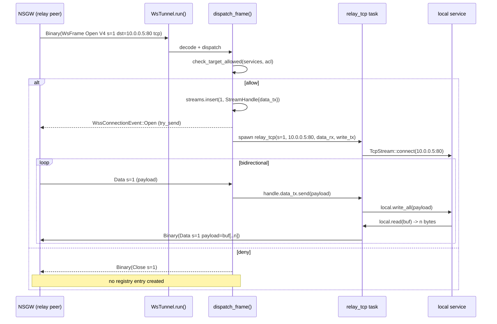
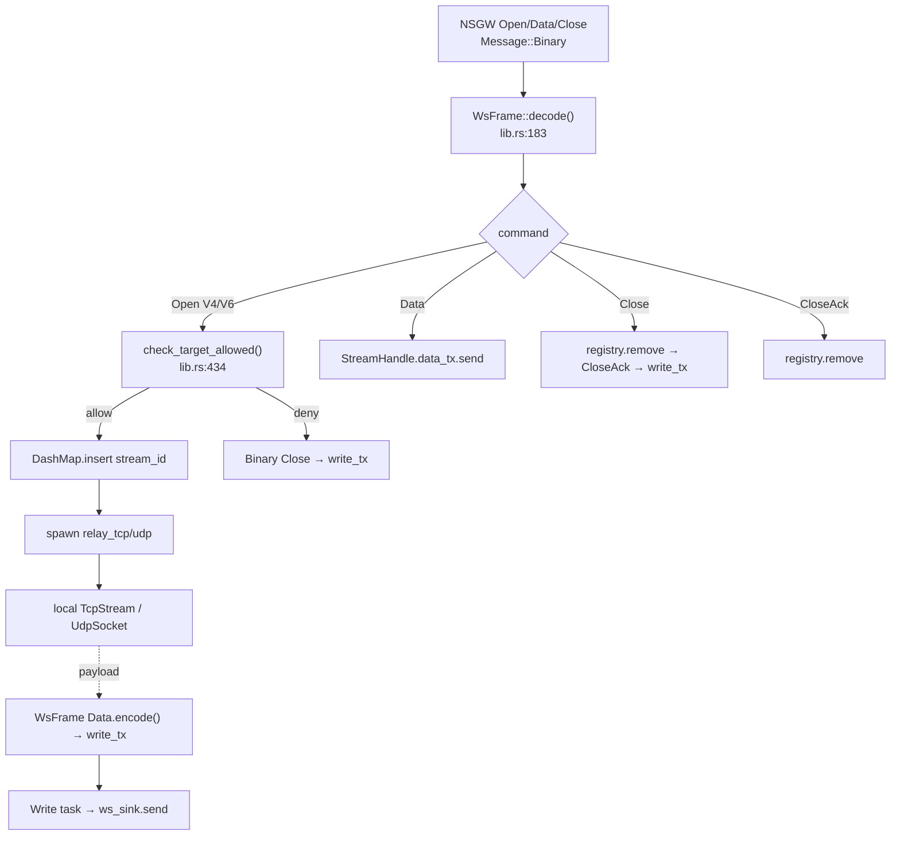

# WSS 中继隧道（tunnel-ws）

`crates/tunnel-ws/` 实现 **纯 WebSocket 代理**：在单条 `wss://` 长连接上复用任意多条 TCP/UDP 逻辑流，完全旁路 WireGuard（不走 gotatun / smoltcp / NAT 引擎）。这是 NSN 在 UDP 被阻断时的 fallback 通道，也是 NSC（浏览器 / 轻量客户端）常驻的唯一数据面。

> 默认 relay URL：`wss://{server}/api/v1/nsn/relay`；若 `gateway_config` SSE 事件提供了显式 `wss_relay_url`，则使用 `{wss_relay_url}/relay`（参见 [connector.md §WSS relay URL](./connector.md#wss-relay-url)）。

---

## 1. 架构速览

```
       ┌───────────────────── single wss:// connection ─────────────────────┐
       │                                                                   │
 NSGW  │  ┌────────────────┐    ┌────────────────┐    ┌────────────────┐  │  NSN
 relay │  │ Open s_id=1 TCP│ ─▶ │  WsFrame mux   │ ─▶ │ relay_tcp s=1  │──┼─▶ svc:80
 peer  │  │ Open s_id=2 UDP│    │  (single conn) │    │ relay_udp s=2  │──┼─▶ svc:53
       │  │ Data s_id=1 …  │ ─▶ │                │ ─▶ │ forward bytes  │  │
       │  │ Data s_id=2 …  │    │                │    │                │  │
       │  └────────────────┘    └────────────────┘    └────────────────┘  │
       └───────────────────────────────────────────────────────────────────┘
```

- 一条 `WebSocketStream<MaybeTlsStream<TcpStream>>`（`lib.rs:272`）承载所有流。
- 每条逻辑流对应一个 `u32 stream_id`；关闭靠 `Close` / `CloseAck` 显式两阶段。
- **服务端（NSGW 侧）** 主动发 `Open`，NSN 负责回应并中继；不支持客户端主动开流——这保持了"ACL 入口在 NSGW"的安全模型。

---

## 2. WsFrame 二进制协议

所有应用数据都封装为 `WsFrame`，用 `Message::Binary` 在 WebSocket 上传递。字节序：**big-endian**（`lib.rs:140`）。

### 2.1 通用头部

| Offset | Size | 字段 | 说明 |
|---|---|---|---|
| 0 | 4 | `stream_id` | `u32 BE`，WsTunnel 会话内唯一，由服务端分配 |
| 4 | 1 | `command` | 命令码（见下表） |
| 5 | N | `payload` | 取决于命令码 |

> **未使用字段**：协议无 `magic` / `version` / `length` 字段。长度由外层 `Message::Binary` 的 WebSocket 帧边界决定（message-oriented，无须二次分帧）。版本由 `Authorization: Bearer <JWT>` 中的 NSD 发行信息约束，升级时通过 URL path 切换。

### 2.2 命令码 & payload 布局

| Cmd | 值 | 方向 | Payload | 含义 |
|---|---|---|---|---|
| `CMD_OPEN_V4` | `0x01` | 服务端→NSN | `4B ip · 2B port · 1B proto [· TLV source]` | 打开 IPv4 流（proto: 0=TCP, 1=UDP）；可选尾部 TLV 携带 **source identity**（见 §2.4） |
| `CMD_OPEN_V6` | `0x02` | 服务端→NSN | `16B ip · 2B port · 1B proto [· TLV source]` | 打开 IPv6 流；可选 source TLV 同上 |
| `CMD_DATA` | `0x10` | 双向 | `raw bytes ...` | 数据分段（TCP 连续字节 / UDP 单个 datagram） |
| `CMD_CLOSE` | `0x20` | 双向 | `（空）` | 主动关闭，需对端 `CloseAck` |
| `CMD_CLOSE_ACK` | `0x21` | 双向 | `（空）` | 关闭确认，接收后从 registry 删除 |

常量定义在 `crates/tunnel-ws/src/lib.rs:86-94`。

#### OPEN_V4 帧（16 B）

```
┌──────────────┬──────┬────────────────┬──────────┬──────────┐
│  stream_id   │ 0x01 │  dst IPv4 (4B) │  port    │  proto   │
│   (u32 BE)   │      │                │ (u16 BE) │ (u8 0/1) │
└──────────────┴──────┴────────────────┴──────────┴──────────┘
     4B           1B         4B             2B          1B     = 12B + 0B payload = 12B
```

> 上表总计 12 B。规范下限校验：`if data.len() < 5` 拒绝（`lib.rs:184`）；对 OPEN_V4 还需 `rest.len() >= 7`（`lib.rs:197`），即总帧至少 12 B。

#### OPEN_V6 帧（24 B）

```
┌──────────────┬──────┬────────────────────────────────┬──────────┬──────────┐
│  stream_id   │ 0x02 │         dst IPv6 (16B)         │   port   │   proto  │
│   (u32 BE)   │      │                                │ (u16 BE) │ (u8 0/1) │
└──────────────┴──────┴────────────────────────────────┴──────────┴──────────┘
     4B           1B                16B                      2B          1B     = 24B
```

#### DATA 帧（≥ 5 B）

```
┌──────────────┬──────┬────────────────────────────────────────────┐
│  stream_id   │ 0x10 │               payload (N bytes)            │
└──────────────┴──────┴────────────────────────────────────────────┘
     4B           1B                       N ≥ 0
```

- **TCP**：payload 是任意长度的字节片段，由 relay 使用 `READ_BUF = 65536`（`lib.rs:97`）大小的缓冲读取；一个 `Data` 帧与 TCP 字节流**不一定** 1:1，对应 `AsyncReadExt::read()` 一次返回的片段。
- **UDP**：每个 `Data` 帧对应**恰好一个 datagram**（`lib.rs:648` `relay_udp`），payload 即为用户数据包。WebSocket 本身是 message-oriented，无需二次分段。

#### CLOSE / CLOSE_ACK 帧（5 B）

```
┌──────────────┬──────┐
│  stream_id   │ 0x20 │   （或 0x21）
└──────────────┴──────┘
     4B           1B
```

### 2.3 编解码实现

- `WsFrame::encode()`（`lib.rs:140`）：`Vec::with_capacity(64)` 预分配，按 cmd 分支追加字段。
- `WsFrame::decode()`（`lib.rs:183`）：校验 `len >= 5` → 取 `stream_id` → 按 cmd 分支解析，未知 cmd 返回 `Error::FrameDecode("unknown command byte: 0x??")`。
- 未实现校验和 / MAC：信任外层 `wss://` 的 TLS AEAD。

### 2.4 Open 帧的 Source Identity 扩展

为让 NSN 的 ACL 能识别"发起端到底是哪个 NSC"，`OPEN_V4` / `OPEN_V6` 的必填段之后允许追加一段 **TLV**（Type-Length-Value）可选扩展，专门承载 **source identity**。这是 NSGW → NSN 方向使用的单向扩展；NSN 不会回发 Open，因此协议上不对称。

**为什么不依赖包头 src_ip？** WSS 中继路径完全脱离 IP 层：Open 帧只带**目的**，而 NSN 从帧层看不到真正的"发起者 IP"——最近的 hop 永远是 NSGW 自己。把身份放在应用层 TLV 里, 由 NSGW 基于它已验过的 NSC JWT (Bearer token) 直接断言, 这是让 ACL 的"subject"维度能在 WSS 路径生效的唯一出路（见 [05 · ACL · §4 主体匹配](../05-proxy-acl/acl.md#4-主体匹配-subject)）。

**TLV 布局（追加在 Open 尾部）**：

```
┌──────┬──────┬────────────────────────┐
│ type │ len  │        value           │
│ (u8) │ (u16 BE) │    (len 字节)        │
└──────┴──────┴────────────────────────┘
```

| type | 名称 | value 编码 | 必填 |
|------|------|------------|------|
| `0x01` | `GATEWAY_ID` | UTF-8 字符串 (≤64B)，即 NSGW 自身的 `gateway_id` | 是 |
| `0x02` | `MACHINE_ID` | UTF-8 字符串 (≤64B)，即发起 NSC 的 `machine_id` | 是 |
| `0x03` | `USER_ID` | UTF-8 字符串 (≤64B)，生产 NSD 的 RBAC 用户标识 | 否（mock 省略） |

**解码规则**：
- 读完 OPEN 的必填段后, 若仍有字节, 按 TLV 循环解析; 每段 `len` 上限 64, 总扩展 ≤ 256B（防止巨帧）。
- 缺失 `GATEWAY_ID` + `MACHINE_ID` 任一项 → 帧合法但 ACL 侧看到的 subject 不完整, 直接 **fail-closed**（回 `Close`, 不建流）。
- 未知 type 字节 → 跳过该条 TLV（向前兼容新增字段），但触发 `warn!("unknown open TLV type: 0x??")` 一次。

**信任模型**：NSN 不对 TLV 做签名校验——WSS 连接本身已在 TLS/Noise 层 pin 到 NSGW 的身份（`wss_endpoint` 来自 NSD 下发的 `gateway_config`），等于"这条 wss 连接上发来的所有 Open 的 source 都由该 NSGW 背书"。因此安全前提是：**NSGW 必须在 /client 侧已验证 NSC 的 JWT 并拒绝冒名**。NSGW 的 `connectorStreamToClient` 反查表（`tests/docker/nsgw-mock/src/wss-relay.ts`）是这个断言的来源。

**向后兼容性**：老 NSGW 发出的无 TLV 的 Open 帧仍能解码，但 NSN 侧 ACL 无法组装 `Subject::User`；这种请求在 `check_target_allowed` 里走 fail-closed 分支（即"没有 source → 一律拒绝"），等同于把老 NSGW 从 WSS 路径下线。这是**刻意**的 breakage-on-upgrade：否则 ACL 的 user/group 规则可以被一个未升级的 NSGW 旁路。运维层面上，要求 NSGW 先于 NSN 升级。

---

## 3. 多路复用与流生命周期

### 3.1 数据结构

```rust
// lib.rs:265
struct StreamHandle {
    data_tx: mpsc::Sender<Vec<u8>>,  // 把 Data payload 递交给 relay task
}

// lib.rs:371 —— 共享流表（无锁并发）
let streams: Arc<DashMap<u32, StreamHandle>> = Arc::new(DashMap::new());
```

`DashMap` 允许多个 dispatch 协程安全并发 insert/remove；每条流只有一个 owner —— 该流的 relay task 结束时 `registry.remove(&stream_id)`（`lib.rs:548`）。

### 3.2 单写者模式

WebSocket sink 不允许多任务并发 `send`；`WsTunnel::run`（`lib.rs:353`）启动唯一的 **write task**：

```rust
// lib.rs:361
let (write_tx, mut write_rx) = mpsc::channel::<Message>(256);
let write_task = tokio::spawn(async move {
    while let Some(msg) = write_rx.recv().await { ws_sink.send(msg).await...; }
});
```

所有 relay task 将 `Message::Binary(frame.encode())` 推送到 `write_tx`，write task 串行化出网。

### 3.3 开流流程（Open）



### 3.4 关流两阶段

```
A → B: Close s=X        (主动方)
B → A: CloseAck s=X     (对端确认)
```

`dispatch_frame`（`lib.rs:470`）中：

- 收到 `Close`（`lib.rs:572`）：`streams.remove(stream_id)` → 回送 `CloseAck`。
- 收到 `CloseAck`（`lib.rs:584`）：`streams.remove(stream_id)`，本地已完成清理。
- relay task 自己退出时（对端 EOF / 错误）：主动发 `Close`（`lib.rs:546`），然后 `registry.remove`，再发 `WssConnectionEvent::Close`。

---

## 4. 策略拦截：`check_target_allowed`

每个 `Open` 帧在接受前都要过**三道关**（`lib.rs:434`）：

| 检查 | 源 | 说明 |
|---|---|---|
| **Source identity 完整性** | `OPEN` 帧 §2.4 的 TLV 扩展 | 必须同时带 `GATEWAY_ID` + `MACHINE_ID`；缺失任一即 fail-closed（回 `Close`，不建流），防止未升级 NSGW 或伪造帧旁路 ACL |
| **Services 白名单** | `ServicesConfig` | 严格模式下要求 target IP:port:proto 在 services.toml 登记；hostname 条目经 DNS 解析后与 `Open` 携带的 IP 比对 |
| **ACL 引擎** | `Arc<RwLock<Option<Arc<AclEngine>>>>` | `None` 即 "尚未从控制面接收到策略" —— **默认拒绝** |

ACL 评估的 `AccessRequest` 采用 `Subject::User { gateway_id, machine_id }` 维度（来自 TLV 扩展），而不是五元组里的 `src_ip`。策略作者写 `subject: ["user:ab3xk9mnpq"]` 或 `subject: ["group:eng"]` 就能直接命中发起 NSC；详见 [05 · ACL · §4.1 主体形式](../05-proxy-acl/acl.md#41-主体形式)。锁上下文关键约束：

```rust
// lib.rs:450 —— 只在"services 异步检查之后"拿读锁，且锁持有期间不跨 await
let acl_guard = acl.read().unwrap();
```

这条约束避免了 `RwLock` 与 `tokio::spawn` 组合下常见的 `Send` 编译失败。

### 4.1 热更新

`Arc<RwLock<Option<Arc<AclEngine>>>>` 是"指针的指针"：

- NSN 主循环在收到新 `acl_policy` SSE 事件后 `*acl.write() = Some(Arc::new(engine))`。
- 正在运行的 `WsTunnel` 下一次 `Open` 读到新引擎，**无需重连**。
- 旧引擎的 `Arc` 由仍在处理中的上一帧自然释放，不会被中途替换。

---

## 5. TCP / UDP relay 细节

### 5.1 `relay_tcp`（`lib.rs:593`）

```rust
let mut local = TcpStream::connect(target).await?;
loop {
    tokio::select! {
        incoming = data_rx.recv() => match incoming {
            Some(data) => local.write_all(&data).await?,  // GW → svc
            None => break,                                 // channel closed
        }
        n = local.read(&mut buf) => match n? {
            0 => {  // svc closed
                write_tx.send(Binary(Close.encode())).await?;
                break;
            }
            n => write_tx.send(Binary(Data(buf[..n]).encode())).await?,
        }
    }
}
```

要点：
- **无显式背压**：依赖 tokio mpsc 的 buffered channel（`data_tx` 容量 64，`lib.rs:509`）天然排队；超过容量则 `send().await` 阻塞该流，其他流不受影响。
- **半关**：对端 EOF（read=0）直接 `Close`+break；无 TCP half-close 语义，符合代理用例。

### 5.2 `relay_udp`（`lib.rs:648`）

```rust
let socket = UdpSocket::bind("0.0.0.0:0").await?;
socket.connect(target).await?;   // pin remote, filter replies
loop {
    tokio::select! {
        incoming = data_rx.recv() => socket.send(&data).await?,
        result = socket.recv(&mut buf) => write_tx.send(Binary(Data(buf[..n]).encode())).await?,
    }
}
```

要点：
- `socket.connect(target)` 把 UDP socket 绑定到固定对端，`recv()` 只接该 target 的回包，回避伪造源。
- 每个 `Data` 帧 **恰好** 1 个 datagram，无需 fragmentation。

---

## 6. 连接事件：`WssConnectionEvent`

调用方（connector / AppState）可通过 `WsTunnel::with_event_sender(tx)`（`lib.rs:343`）挂载 mpsc，获得：

```rust
// lib.rs:47
pub struct WssConnectionEvent {
    pub stream_id: u32,
    pub gateway_id: String,   // 从 relay URL 主机名提取（extract_gateway_id, lib.rs:74）
    pub protocol: String,     // "tcp" | "udp"
    pub target: SocketAddr,
    pub kind: WssConnectionEventKind,  // Open | Close
}
```

用于 Monitor API 统计、`gateway_report` 回报、以及审计日志。`try_send` 语义：channel 满则丢事件，不阻塞数据面。

---

## 7. WsFrame mux 总览（Mermaid）



完整版见 [`diagrams/ws-tunnel.mmd`](./diagrams/ws-tunnel.mmd)。

---

## 8. 关键源码索引

| 主题 | 位置 |
|---|---|
| 命令码常量 | `crates/tunnel-ws/src/lib.rs:86` |
| `WsFrame` 结构 | `crates/tunnel-ws/src/lib.rs:128` |
| `WsFrame::encode` | `crates/tunnel-ws/src/lib.rs:140` |
| `WsFrame::decode` | `crates/tunnel-ws/src/lib.rs:183` |
| `WsTunnel::connect` | `crates/tunnel-ws/src/lib.rs:308` |
| `WsTunnel::run` | `crates/tunnel-ws/src/lib.rs:353` |
| `dispatch_frame` | `crates/tunnel-ws/src/lib.rs:470` |
| `check_target_allowed` | `crates/tunnel-ws/src/lib.rs:434` |
| `relay_tcp` | `crates/tunnel-ws/src/lib.rs:593` |
| `relay_udp` | `crates/tunnel-ws/src/lib.rs:648` |
| `extract_gateway_id` | `crates/tunnel-ws/src/lib.rs:74` |
| `WssConnectionEvent` | `crates/tunnel-ws/src/lib.rs:47` |

---

## 9. 相关阅读

- [`connector.md`](./connector.md) —— 谁创建 `WsTunnel`、在哪些条件下选用 WSS。
- [`transport-fallback.md`](./transport-fallback.md) —— UDP↔WSS 切换时机。
- [`tunnel-wg.md`](./tunnel-wg.md) —— 对称的 WG 通道。
- [`../05-proxy-acl/`](../05-proxy-acl/) —— ACL 引擎与 services 白名单详解。
- [`../02-control-plane/`](../02-control-plane/) —— `gateway_config` / `acl_policy` SSE 事件。
- [`../01-overview/`](../01-overview/) —— 全局架构。
