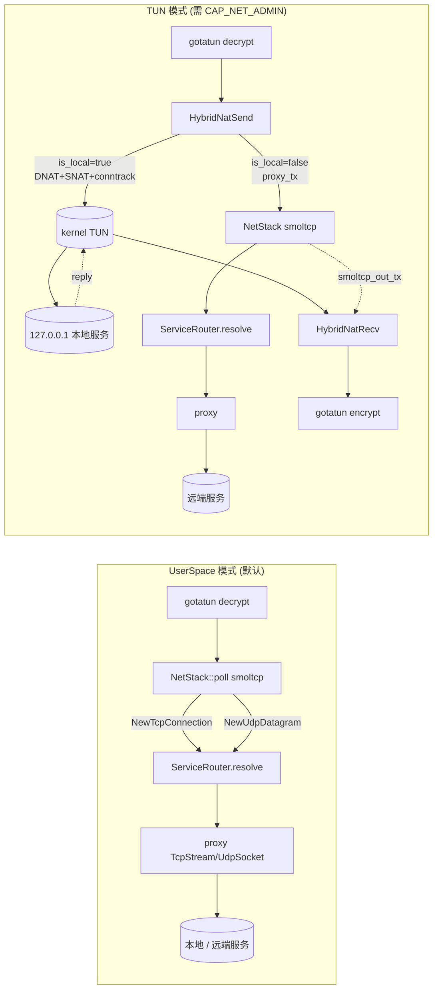

# TUN vs UserSpace 数据面模式对比

NSN 支持两种数据面模式。两者在**控制面与 ACL 语义上完全一致**，差别仅在「谁来终结 TCP」以及「报文最终由哪条路径到达服务」。本文档基于 `crates/tunnel-wg/src/lib.rs`、`crates/nat/src/packet_nat.rs`、`crates/netstack/src/stack.rs`、`crates/nsn/src/main.rs` 做一次完整对比，便于部署与容量规划时选型。

参考任务：`docs/task/TUN-001.md`（TUN 模式 + 自动降级到 smoltcp 的验收标准）。
参考架构：`docs/architecture.md` 中「Data Plane」小节。

## 要点速览

| 维度 | **TUN 模式** | **UserSpace 模式** |
|------|--------------|---------------------|
| 默认启用 | 否（需 `CAP_NET_ADMIN` + `/dev/net/tun`） | 是（零特权） |
| TCP 状态机 | 本地服务 → **Linux 内核**；远端服务 → smoltcp | smoltcp 用户态 |
| 入向处理核心 | `HybridNatSend` (`crates/nat/src/packet_nat.rs:225`) | `NetStack::poll` (`crates/netstack/src/stack.rs:66`) |
| 出向处理核心 | `HybridNatRecv` (`crates/nat/src/packet_nat.rs:396`) | 同上 `NetStack::poll` TX 段 |
| 每连接内存 | 约 0（内核 socket buffer） | ~130 KiB (65 535 + 65 535 smoltcp 缓冲) |
| 性能（本地服务吞吐） | 接近裸内核（单次 DNAT 改写 + checksum） | 受限于 smoltcp + user/kernel 切换 |
| 远端服务路径 | `proxy_tx → netstack → proxy` | `netstack → proxy` |
| 需要 conntrack | 是（`DashMap`，`crates/nat/src/packet_nat.rs:78`） | 否 |
| 是否依赖 IPv4 字面量 host | **是**（见 `crates/nat/src/packet_nat.rs:275`） | 否（可用 domain） |
| 调试可观察性 | `tracing::debug` 命中 `TUN: ACL denied` / `TUN NAT: host not IPv4` | `netstack` 默认 `warn` 噪音低；ACL 在 `ServiceRouter` 层统一 |
| 平台 | 仅 Linux（/dev/net/tun） | Linux / macOS / Windows（只要 gotatun 能运行） |
| 预期使用场景 | 受信生产环境、需高吞吐对本地服务 | 开发机、容器、非 root Sidecar、CI E2E |

## 数据通路对比

### UserSpace 模式（默认）

```text
NSGW → gotatun decrypt → mpsc(inject)        ↘
                                              NetStack::poll (smoltcp)
                                              ├─ TCP: NewTcpConnection → relay_*
                                              └─ UDP: NewUdpDatagram  → relay_datagram
                                                                      ↓
                                                        ServiceRouter.resolve
                                                        (ACL + find + DNS)
                                                                      ↓
                                                        TcpStream / UdpSocket to backend
```

- 所有 TCP 状态机都在 smoltcp 中。
- **本地服务**：ServiceRouter 返回 `127.0.0.1:<real_port>`，proxy 层与本机服务走 loopback。
- **远端服务**：ServiceRouter 返回路由可达的 `SocketAddr`（可能是域名解析结果），proxy 层走机器真实网络栈。
- 装配代码见 `crates/nsn/src/main.rs:1005-1050`。

### TUN 模式（需 root）

```text
NSGW → gotatun decrypt → HybridNatSend
                         ├─ 本地 (is_local=true):
                         │   DNAT + SNAT + conntrack → inner.send(TUN)
                         │                                 ↓
                         │                        Linux kernel → 本地 service
                         │                                 ↓
                         │                        service reply → TUN
                         │                                 ↓
                         │   HybridNatRecv ← inner.recv → apply_reverse_nat
                         │   → gotatun encrypt → NSGW
                         │
                         └─ 远端 (is_local=false):
                             proxy_tx → netstack::inject_rx
                             ├─ 同 UserSpace 模式的 smoltcp 流水线
                             └─ smoltcp 出向 → smoltcp_out_tx → HybridNatRecv → gotatun encrypt
```

- 本地服务路径零 proxy、零 user-space TCP 状态机——吞吐接近裸 loopback，仅付出 DNAT + checksum + conntrack 查表的开销。
- 远端服务路径复用 UserSpace 的全部代码，因此两种模式共享同一套 proxy / ACL / telemetry 实现。
- 装配代码见 `crates/tunnel-wg/src/lib.rs:381-391` 的 `HybridNatSend::new` + `HybridNatRecv::new`。

### 模式对比图



> 完整拓扑参见 [`diagrams/modes.mmd`](./diagrams/modes.mmd)。

## 能力需求

| 需求 | TUN | UserSpace |
|------|-----|-----------|
| Linux capability | `CAP_NET_ADMIN` + `CAP_NET_RAW`（创建 TUN 设备） | 无 |
| 设备节点 | `/dev/net/tun` 可写 | 无 |
| 平台 | 仅 Linux | Linux / macOS / Windows |
| 运行时用户 | 通常 root 或设置了 file capabilities 的用户 | 普通用户 |
| 容器 | 需要 `--cap-add NET_ADMIN --device /dev/net/tun`（Docker） | 普通容器即可 |
| Service 声明限制 | 本地服务 `host` 必须是 IPv4 字面量（`crates/nat/src/packet_nat.rs:275`） | 无此限制，允许 domain |
| services.toml 字段 | 跨模式一致 | 跨模式一致 |

启动时如何选择：`TUN-001.md` 要求 `--data-plane tun|userspace|auto` 三态；`auto` 行为是能拿到 TUN 就用 TUN、否则降级到 UserSpace（实现代码见 `nsn` 主流程）。

## 性能与资源

| 指标 | TUN（本地服务） | UserSpace（所有服务） |
|------|-----------------|------------------------|
| 单连接峰值内存 | 约 0（复用内核 TCP 缓冲） | ~130 KiB (smoltcp `tcp::SocketBuffer` 2×65 535) |
| CPU 关键热点 | `recalc_ip_checksum` + `recalc_transport_checksum`（O(len)） | smoltcp `iface.poll`（含 TCP 重组） |
| 每连接额外分配 | 1 条 conntrack entry（key+val ≈ 32 B） | 2 条 mpsc channel（256 cap）+ socket slot |
| 丢包边界条件 | conntrack miss → 静默 drop（`apply_reverse_nat` → `None`） | mpsc 通道满 → `tracing::warn!` + 丢 UDP 包 |
| 上行 MTU | 取自 gotatun → TUN (`mtu()` 委托) | smoltcp 固定 `MTU=1500`（`VirtualDevice::capabilities`） |
| 吞吐上限（本地服务） | 接近内核 loopback | 受 smoltcp 单线程 poll 限制 |
| 吞吐上限（远端服务） | 同 UserSpace（走同一代码路径） | 同列 |

> 没有在代码里测过 benchmark 数字，所以这里列的是**方向性**差异，不是具体数值。生产压测建议监控 `/api/nat` 的 conntrack 条数、`/api/connections` 的并发连接，以及 `netstack` 的 `tracing::warn` 噪音。

## 兼容性与特性差异

| 能力 | TUN | UserSpace |
|------|-----|-----------|
| IPv6 入向 | ❌（`parse_five_tuple` 只识别 IPv4，见 `packet_nat.rs:104`） | ❌（`udp_info` / `tcp_dst_port` 只识别 IPv4） |
| ICMP | ❌（`parse_five_tuple` 返回 None → drop） | ❌（netstack 不持有 ICMP socket） |
| 非 TCP/UDP | ❌ 丢弃 | ❌ 丢弃 |
| ACL 在报文级拦截 | ✅ 在 `HybridNatSend` 层 (`packet_nat.rs:250`) | ⚠️ 只在连接级 / HTTP 级（`ServiceRouter::resolve`），报文不预过滤 |
| HTTP Host / TLS SNI 路由 | ✅（远端服务经 smoltcp → proxy → `resolve_by_host` / `resolve_by_sni`） | ✅（同） |
| 对本地服务的二级 DNS | ❌（host 必须 IPv4 字面量） | ✅ |
| 修改 src IP 留痕 | service 看到 `tun_ip`（SNAT） | service 看到 `127.0.0.1`（proxy 发起） |
| 可观察性 | `/api/nat` + tracing `nat`/`tunnel-wg` target | `/api/connections` + tracing `netstack` target |

## 何时选哪个

- **选 UserSpace**：容器化部署、开发与 CI、无法授予 NET_ADMIN、需要用域名直接声明本地服务、需要在 macOS / Windows 上运行。
- **选 TUN**：生产环境、已有可信主机、对本地服务吞吐敏感（如大文件下载、数据库备份）、希望 service 看到稳定 `tun_ip` 做自己的白名单。

`--data-plane auto` 是大多数情况下的正确选择：同一份二进制既能在受限环境里自动跑 UserSpace，也能在生产机上升级到 TUN，无需重打包。

## 遗留事项 / 需关注

1. **conntrack 没有过期回收**（`crates/nat/src/packet_nat.rs:78`）。TUN 模式长周期运行时条目只增不减；建议上层加 TTL 清理或在 RST/FIN 观察到后调 `remove`。监控指标：`/api/nat`。
2. **`AclFilteredSend` 在 UserSpace 路径上未接线**（见 `architecture.md` 注释），目前 UserSpace 模式的 ACL 只发生在 `ServiceRouter::resolve`；若要求"被拒绝的 IP 包根本进不了 smoltcp"需要额外工作。
3. **IPv6 全线未支持**，NSC 当前也是 `127.11.x.x` 的 IPv4 虚拟 IP，改造需要同时动 VIP 映射、parse、netstack、nat 四处。
4. **`svc.host` IPv4 字面量限制**只影响 TUN 路径；若希望 TUN 模式支持域名，需要在 NSN 启动时预解析并存储，而不是每包 DNS。
5. **conntrack / netstack 不做速率限制**；上游 gotatun 的背压传递到 mpsc 通道 (`inject_rx` 容量 256) 是唯一的保护，任何下游慢消费都会导致丢包。生产应配套 telemetry 报警。
