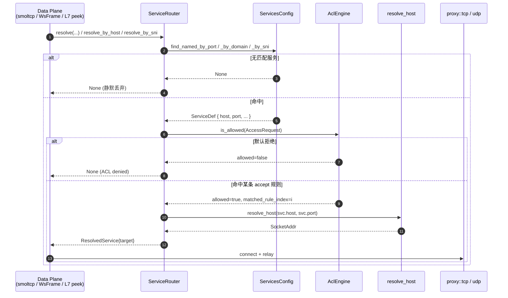

# ACL 引擎 (accept-only, default deny)

> 源码: `crates/acl/` — `lib.rs` (42), `engine.rs` (542), `matcher.rs` (289), `policy.rs` (107)

NSN 的访问控制采用 **Tailscale 风格的 accept-only 模型**: 策略里只写 `accept` 规则, 没有 `deny`; 未命中任何规则一律 **默认拒绝**。本文档描述该引擎的数据模型、匹配算法、host alias 展开、集成点与 policy test 能力。

## 1. 设计总原则

| 原则 | 体现 |
|------|------|
| Accept-only | `AclAction` enum 只有 `Accept` 一个变体 (`crates/acl/src/policy.rs:41`); `"deny"` 会反序列化失败 (`crates/acl/src/policy.rs:102`) |
| Default deny | `AclEngine::is_allowed` 在规则列表耗尽后返回 `allowed=false` (`crates/acl/src/engine.rs:167`) |
| 首次命中即返回 | 规则按文件顺序编译, `for .. in compiled_rules` 发现首个匹配就 `return` (`crates/acl/src/engine.rs:142`) |
| 策略自验证 | `AclPolicy.tests` 在 `load()` 时跑一次, 失败直接 `Error::TestsFailed` 拒绝上线 (`crates/acl/src/engine.rs:118`) |
| 单入口校验 | 运行时只有 `ServiceRouter::resolve*` 三个函数会调 `AclEngine::is_allowed`, 没有数据面旁路 |

## 2. 数据模型

```rust
// crates/acl/src/policy.rs
pub struct AclPolicy {
    pub hosts: HashMap<String, String>,  // alias → CIDR 字符串
    pub acls:  Vec<AclRule>,             // 顺序敏感
    pub tests: Vec<AclTest>,             // load 时自检
}

pub struct AclRule {
    pub action: AclAction,               // 永远是 Accept
    pub src:    Vec<String>,             // "*" | CIDR | alias
    pub dst:    Vec<String>,             // "host:ports" 形式
    pub proto:  Option<String>,          // "tcp" | "udp" | None (任意)
}

pub struct AclTest {
    pub src:   String,                   // 单个 IP
    pub dst:   String,                   // "ip:port"
    pub allow: bool,                     // 期望决策
}
```

NSD 以 JSON (见 `crates/acl/src/policy.rs:75` 的 round-trip 测试) 下发该结构, `ServiceRouter::load_acl` 原子替换引擎 (`crates/nat/src/router.rs:56`)。

## 3. 匹配流程

```
AccessRequest { src_ip, dst_ip, dst_port, protocol }
        │
        ▼
  for each CompiledRule in order:
    src 列表里任一匹配 src_ip?      ← SrcMatcher: Any 或 Cidr
    dst 列表里任一匹配 (dst_ip,port)? ← DstMatcher: host ∧ port
    proto 匹配?                    ← None / Tcp / Udp
        │
        ├── 全部是: Allow, 记录 matched_rule_index
        └── 否则: 继续下一条
        │
        ▼ (规则耗尽)
  Deny, reason = "denied: no matching accept rule"
```

实现分三层 (`crates/acl/src/engine.rs:52`, `crates/acl/src/matcher.rs:17`, `:49`):

```rust
// CompiledRule.matches
if !self.src.iter().any(|m| m.matches(req.src_ip)) { return false; }
if !self.dst.iter().any(|m| m.matches(req.dst_ip, req.dst_port)) { return false; }
match self.proto {
    None => true,
    Some(Protocol::Both) => true,
    Some(proto) => proto == req.protocol,
}
```

流程图: [diagrams/acl-matcher.mmd](./diagrams/acl-matcher.mmd)。

## 4. 源 / 目的 语法

### 4.1 Source (`src`)

| 形式 | 语义 | `parse_src` 分支 |
|------|------|------------------|
| `*` | 任意源 | `SrcMatcher::Any` (`crates/acl/src/matcher.rs:76`) |
| `10.0.0.0/24` | CIDR (IPv4/IPv6) | `SrcMatcher::Cidr` 经 `common::IpNet` 解析 (`crates/acl/src/matcher.rs:79`) |
| `web` | host alias → 对应 CIDR | 查 `hosts` map (`crates/acl/src/matcher.rs:82`) |

未知 alias 会在 `AclEngine::load` 阶段 `Error::UnknownAlias` (`crates/acl/src/lib.rs:34`)。

### 4.2 Destination (`dst`)

格式固定为 `host:ports`, `rfind(':')` 拆分 (`crates/acl/src/matcher.rs:98`)。

| 形式 | 语义 |
|------|------|
| `*:*` | 任意主机 + 任意端口 |
| `192.168.0.0/24:80` | CIDR + 单端口 |
| `alias:5432` | alias + 单端口 |
| `alias:80,443` | alias + 端口列表 (`PortMatcher::List`, `matcher.rs:133`) |
| `alias:8000-8999` | alias + 端口范围 (`PortMatcher::Range`, `matcher.rs:145`; 反序范围会报错 `matcher.rs:152`) |
| `alias:*` | alias + 任意端口 |

### 4.3 Protocol

- 省略 `proto` (JSON 里不写字段) → 匹配 TCP 和 UDP;
- `"tcp"` / `"udp"` → 精确匹配 (`crates/acl/src/matcher.rs:165`)。
- `common::Protocol::Both` (来自 `ServicesConfig`) 也会被视为"任意匹配" (`crates/acl/src/engine.rs:62`), 用于 `services.toml` 里同时暴露 TCP+UDP 的服务。

## 5. Host alias 展开

`AclEngine::load` 里 `resolve_hosts` 把 alias→CIDR 字符串全部预解析成 `IpNet`, 失败报 `Error::InvalidCidr` (`crates/acl/src/engine.rs:229`)。alias 展开的关键性质:

| 性质 | 说明 |
|------|------|
| 展开时机 | 在 `load()` 阶段一次性完成, 后续 `is_allowed` 零字符串操作 |
| 作用域 | `src` 和 `dst.host` 都可以引用 alias |
| 不级联 | alias 的值必须是 CIDR 字符串, 不能是另一个 alias |
| 精确到段 | alias 可以表示 `/32` 单机, 也可以表示一个子网 `/24` |
| 更新即全替 | NSD 下发新的 `AclPolicy` 时, `AclEngine::load` 重编译, 整个引擎 `RwLock::write` 替换 (`crates/nat/src/router.rs:58`) |

决策表 (accept-only + default deny):

| 规则匹配情况 | 决策 | 备注 |
|--------------|------|------|
| 策略为空 (`acls = []`) | **Deny** | `crates/acl/src/engine.rs` test `empty_policy_denies_everything` (`:293`) |
| 任意一条 `accept` 规则匹配 | **Allow**, `matched_rule_index = i` | `:142` |
| 全部规则都不匹配 | **Deny**, `matched_rule_index = None` | `:167` |
| 规则 proto=tcp, 请求是 udp | 当前规则跳过, 继续找下一条 | `:60` |
| src alias 未知 (加载期) | `AclEngine::load` 返回 `Error::InvalidPolicy("rule N src: ...")` | `:93` |
| 内建测试不通过 | `Error::TestsFailed { count }` | `:129` |

## 6. ServiceRouter 集成



三个 resolve 函数都走同一个模式 (`crates/nat/src/router.rs:71`, `:117`, `:162`):

```rust
// 1. 服务查找
let (name, svc) = services.find_named_by_*()?;

// 2. ACL 校验 (accept-only / default deny)
let acl_guard = self.acl_engine.read().await;
if let Some(acl) = acl_guard.as_ref() {
    let req = acl::AccessRequest {
        src_ip, dst_ip,
        dst_port: <port>,            // resolve: dst_port; resolve_by_host: 80; resolve_by_sni: 443
        protocol: <proto>,           // resolve: proto;    resolve_by_host: Tcp; resolve_by_sni: Tcp
    };
    if !acl.is_allowed(&req).allowed {
        tracing::debug!(...);
        return None;                 // 直接丢弃连接, 不回错给客户端
    }
}

// 3. DNS 解析 backend 地址
let target = resolve_host(&svc.host, svc.port).await?;
```

几个重要事实:

- **`acl_engine` 是 `Option`**: 未下发策略时 `acl_engine = None`, resolve 不做 ACL 检查 (**只**发生在启动早期, NSD SSE 尚未推送)。生产部署应确保至少有一条初始策略随 `services_ack` 一起到达, 否则早期连接相当于放行。
- **ACL 决策不依赖域名 / SNI**: 对 L7 路由, ACL 用的是虚拟端口 80/443, 和 [http-host-routing.md §5](./http-host-routing.md#5-acl-在-http-路由中的语义) 一致。
- **拒绝静默丢弃**: 拒绝后不回 TCP RST / ICMP, 客户端看到的是"连接挂起直到超时", 这是"不泄露网络拓扑"的刻意设计。
- **多 NSD 合并**: 多个 NSD 推送的策略在 `control` 层取交集 (最严格胜出, 见 `docs/architecture.md:259`), 合并后的单一 `AclPolicy` 才送到 `AclEngine::load`。

## 7. Policy test — 不跑流量就验证策略

`AclPolicy.tests` 让策略作者在下发前就断言"哪些流应该通/阻", 避免部署后才发现规则漏洞。

```rust
// crates/acl/src/policy.rs:48
pub struct AclTest {
    pub src:   String,      // "10.0.0.2"
    pub dst:   String,      // "192.168.1.5:80"
    pub allow: bool,        // 期望结果
}
```

执行路径 (`crates/acl/src/engine.rs:175`):

1. 对每个 `AclTest` 解析 `src` 为 `IpAddr`, 拆 `dst` 为 `(IpAddr, u16)` (`crates/acl/src/engine.rs:242`);
2. 构造 `AccessRequest { protocol: Protocol::Tcp, .. }` (测试默认走 TCP, proto 为空的规则会 match TCP 也 match UDP);
3. 调 `self.is_allowed(&req)`;
4. 若 `decision.allowed != test.allow` 追加一条 `AclTestFailure`, 附详细 reason (`crates/acl/src/engine.rs:211`);
5. `AclEngine::load` 在发现任何失败时直接返回 `Error::TestsFailed`, 引擎不会被装载。

工作流示例:

```yaml
# 在 NSD 侧或本地编写策略
hosts:
  db: 192.168.1.10/32
acls:
  - action: accept
    src: ["10.0.0.0/24"]
    dst: ["db:5432"]
    proto: tcp
tests:
  - { src: "10.0.0.2",  dst: "192.168.1.10:5432", allow: true  }  # 合法访问
  - { src: "10.0.0.2",  dst: "192.168.1.10:6379", allow: false } # 端口外应拒
  - { src: "172.16.0.5", dst: "192.168.1.10:5432", allow: false } # src 段外应拒
```

NSD 把策略推给 NSN 时, NSN 的 `ServiceRouter::load_acl` 会触发 `AclEngine::load`, 若任一 test 失败:

- 日志输出 `"ACL policy test failed"` (`crates/acl/src/engine.rs:121`), 带 `src=/dst=/expected=/reason=` 四个字段;
- `load_acl` 返回 `Err(AclError)`, ServiceRouter 保留**旧**策略继续工作 (原子替换的正确性保证);
- 运维可以在 `/api/acl` 端点看到 "pending" 状态。

> 这是一个非常弱的 "canary": 它只能证伪显式写出的断言, 不能证明策略全局正确。真实防线还是需要通过测试环境回放真实流量, 配合 `/api/connections` 观察 ACL 拒绝率。

## 8. 运行时观测

- 日志: accept 走 `debug` (`crates/acl/src/engine.rs:144`), deny 走 `warn` (`crates/acl/src/engine.rs:160`, `"ACL deny: no matching rule"`), 可以用 `RUST_LOG=acl=warn` 把日志压缩成"只显示拒绝";
- Monitor API: NSN 通过 `/api/acl` 暴露当前策略快照与最近若干拒绝事件 (详见 [07 · NSN 节点](../07-nsn-node/README.md));
- 端到端事实: `/api/connections` 记录每条连接的 ACL 决策和匹配规则下标, 便于审计回放。

## 9. 错误表

`crates/acl/src/lib.rs:27`:

| Error | 触发场景 |
|-------|----------|
| `InvalidCidr { addr, reason }` | `hosts.*` 或 `src/dst` 中的 CIDR 语法非法 |
| `InvalidDst { dst, reason }` | `dst` 缺 `:`、端口非数字、范围反转等 |
| `UnknownAlias(name)` | `src/dst` 引用了未在 `hosts` 中定义的 alias |
| `TestsFailed { count }` | 内建 `tests` 至少一条未通过 |
| `InvalidPolicy(msg)` | 其他编译期错误 (规则字段组合非法等) |

所有错误都在 `load()` 阶段抛出, 运行时 `is_allowed` 是零失败接口。

## 10. 测试矩阵

`crates/acl/src/engine.rs:260` 的单元测试覆盖:

- 默认拒绝 (`empty_policy_denies_everything`)
- 通配 `*:*` 允许任意 (`wildcard_rule_allows_any_connection`)
- CIDR 内/外区分 (`cidr_rule_allows_in_range_denies_outside`)
- host alias 解析 (`host_alias_resolves_correctly`)
- TCP/UDP 过滤 (`proto_tcp_rule_rejects_udp`, `no_proto_rule_matches_tcp_and_udp`)
- 端口 range / list (`port_range_rule`, `port_list_rule`)
- 优先级按规则顺序 (`first_matching_rule_wins`)
- 内建 tests 的正反路径 (`builtin_tests_pass_on_valid_policy`, `builtin_tests_fail_returns_error`)
- 错误路径 (`invalid_host_alias_in_rule_returns_error`, `invalid_cidr_in_hosts_returns_error`)

`crates/acl/src/matcher.rs:176` 补充细粒度的 `parse_src` / `parse_dst` / `parse_protocol` 语法测试。

## 11. 延伸阅读

- [proxy.md](./proxy.md) — `handle_tcp_connection` / `handle_udp` 底层原语
- [http-host-routing.md](./http-host-routing.md) — :80 路由在 ACL 侧为何用固定端口
- [sni-routing.md](./sni-routing.md) — :443 路由同理
- [02 · 控制面](../02-control-plane/README.md) — NSD 如何下发 `AclConfig` 与多源合并策略
