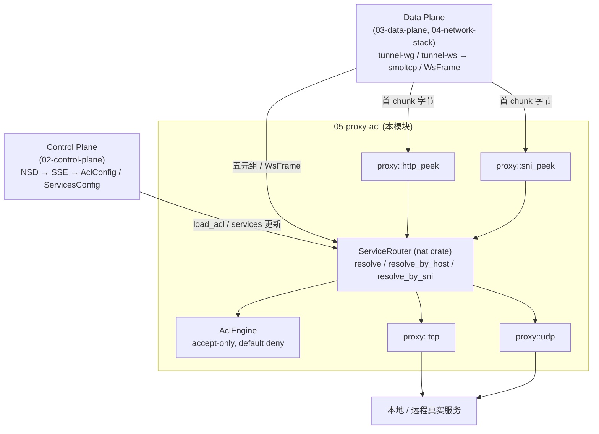

# 05 · 代理与 ACL 模块 (proxy + acl)

> 源码范围: `crates/proxy/` (TCP/UDP 中继 + HTTP/SNI peek) 和 `crates/acl/` (accept-only 策略引擎)
> 上游调用方: `crates/nat/src/router.rs` (ServiceRouter) 与 `crates/nsn/src/main.rs` (relay_connection)

## 1. 模块职责

| 模块 | 职责 | 关键文件 |
|------|------|----------|
| `proxy` | 端到端 TCP / UDP 字节中继; 提供 HTTP/1.1 Host 头和 TLS SNI 的**只读**协议解析 (peek) | `crates/proxy/src/tcp.rs`, `udp.rs`, `http_peek.rs`, `sni_peek.rs` |
| `acl` | 在 NSD 下发的 `AclPolicy` 基础上构建运行时匹配引擎; 采用 **accept-only + 默认拒绝** 语义, 支持 host alias 展开和内建策略测试 | `crates/acl/src/engine.rs`, `matcher.rs`, `policy.rs` |

两个 crate 都不主动持有数据面连接, 而是被 `nat::ServiceRouter` 和 `nsn` 二进制在 **三条解密后的数据通路**(TUN / UserSpace / WSS) 上统一调用。

## 2. 本目录文档索引

| 文件 | 主题 |
|------|------|
| [proxy.md](./proxy.md) | TCP / UDP 中继原语, `copy_bidirectional` 与 UDP 单流回环, 指标计数器 |
| [http-host-routing.md](./http-host-routing.md) | `:80` 端口按 HTTP `Host` 头路由, 字节级解析规则, `relay_http_connection` 链路 |
| [sni-routing.md](./sni-routing.md) | `:443` 端口按 TLS ClientHello SNI 路由, ClientHello 字节布局, `relay_https_connection` 链路 |
| [acl.md](./acl.md) | ACL 引擎: accept-only / default deny 语义, host alias 展开, policy test 能力, `ServiceRouter` 集成点 |

Mermaid 源文件位于 [`diagrams/`](./diagrams/):

- `proxy-arch.mmd` — `ServiceRouter → ACL → resolve → proxy → local service` 端到端架构
- `sni-peek.mmd` — TLS ClientHello 解析时序
- `http-peek.mmd` — HTTP/1.1 Host 解析时序
- `acl-matcher.mmd` — ACL 匹配流程

## 3. 与其他模块的关系



纯文本视图:

```
┌────────────────────────────────────────────────────────────┐
│ Control Plane (docs/02-control-plane)                       │
│   NSD → SSE → AclConfig / ServicesConfig                    │
└──────────────────┬─────────────────────────────────────────┘
                   │ (ServiceRouter::load_acl)
                   ▼
┌────────────────────────────────────────────────────────────┐
│ Data Plane (docs/03-data-plane) + Network Stack (04)        │
│  tunnel-wg (TUN 或 UserSpace) / tunnel-ws                   │
│     │                                                        │
│     ├─ smoltcp (netstack) → 五元组 → ServiceRouter          │
│     └─ WsFrame → ServiceRouter                              │
└──────────────────┬─────────────────────────────────────────┘
                   │
                   ▼
┌────────────────────────────────────────────────────────────┐
│ 本目录: 05-proxy-acl                                         │
│   ServiceRouter (nat) → ACL check → resolve_host            │
│     └─ proxy::tcp::handle_tcp_connection                    │
│     └─ proxy::udp::handle_udp                               │
│     └─ proxy::http_peek::parse_http_host  (L7 :80)          │
│     └─ proxy::sni_peek::parse_tls_sni     (L7 :443)         │
└────────────────────────────────────────────────────────────┘
```

跨模块跳转:

- [01 · 系统总览](../01-overview/index.md) — NSIO 生态与数据流概述
- [02 · 控制面](../02-control-plane/index.md) — `AclPolicy` / `ServicesConfig` 的下发
- [03 · 数据面隧道](../03-data-plane/index.md) — WG/WSS 如何交付原始字节给本模块
- [04 · 网络栈](../04-network-stack/index.md) — smoltcp 与 PacketNAT, 在 UserSpace 模式下把 IP 包变成 `NewTcpConnection`
- [06 · NSC 客户端](../06-nsc-client/index.md) — 另一侧的 VIP / NscRouter, 触发本模块的流量
- [07 · NSN 节点](../07-nsn-node/index.md) — `relay_connection` 如何在 `:80` / `:443` / 其他端口间分派

## 4. 核心原则

1. **Proxy-as-NAT**: UserSpace/WSS 路径不做 IP 包改写, 由 `ServiceRouter` 把流量解析成 `(src_ip, dst_port, proto)`, 然后 `proxy.connect(target)` 建立一条新的后端连接来中继 (参见 [proxy.md](./proxy.md))。
2. **Accept-only ACL**: 策略语言里没有 `deny` 规则, 未命中任何 `accept` 规则就是默认拒绝 (`crates/acl/src/engine.rs:141`)。好处是审计简单 — 任何"允许"都必须在策略里显式写出。
3. **L7 peek 只读, 不改写**: `parse_http_host` / `parse_tls_sni` 只读解析首个数据块, 解析完**完整原样**转发给后端 (`crates/nsn/src/main.rs:1225`, `:1297`), 避免协议状态被污染。
4. **单一决策点**: `ServiceRouter::resolve*` 是 ACL 校验的唯一入口, 没有散落在数据面各处的 "绕过" 路径, 便于在 `/api/acl` 与 `validate_tests()` 里回放。

## 5. 命名与端口约定

| 场景 | 端口 | L7 键 | 解析函数 | 路由函数 |
|------|------|-------|----------|----------|
| HTTP | `:80` | HTTP `Host:` 头 | `parse_http_host` (`crates/proxy/src/http_peek.rs:11`) | `ServiceRouter::resolve_by_host` (`crates/nat/src/router.rs:117`) |
| HTTPS | `:443` | TLS SNI (ClientHello) | `parse_tls_sni` (`crates/proxy/src/sni_peek.rs:13`) | `ServiceRouter::resolve_by_sni` (`crates/nat/src/router.rs:162`) |
| 其他 TCP/UDP | 任意 | 无 L7 | — | `ServiceRouter::resolve` (`crates/nat/src/router.rs:71`) |

详情见 [proxy.md §3](./proxy.md#3-relay_connection-的三路分派)。

## 6. 阅读顺序建议

1. 先读 [proxy.md](./proxy.md) 掌握"字节进 / 字节出"的中继原语;
2. 再读 [acl.md](./acl.md) 理解策略模型 (规则、host alias、测试);
3. 最后阅读两份 L7 路由文档 [http-host-routing.md](./http-host-routing.md) 与 [sni-routing.md](./sni-routing.md), 它们把 proxy + acl 拼装成真正的按域名/SNI 路由能力。
