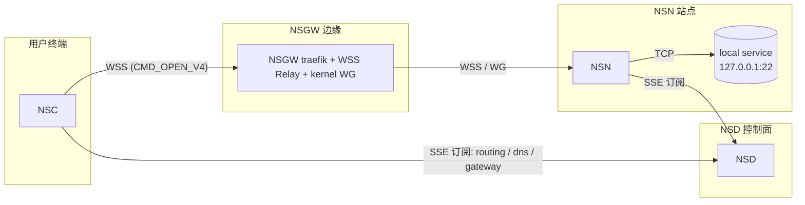

# NSC 设计

> 读完本文你应能回答：NSC 做什么？和 NSN/NSD 的关系？三种数据面模式差别在哪？主循环是怎样驱动的？

## 定位

NSC 是**用户侧代理**。它的目标和 NSN 恰好相反——NSN 在站点侧把本地服务**暴露**出去，NSC 在用户侧把远端服务**拉**过来。用户在终端看到：

- 一个本地环回地址（比如 `127.11.0.1`）对应某个 NSN 站点；
- 一个形如 `ssh.ab3xk9mnpq.n.ns` 的域名解析到该 VIP；
- 不需要任何本机路由或权限——userspace 模式直接在 `127.11.x.x:port` 上监听。

本质上 NSC 做了三件事：**发现（SSE）、落地（VIP/DNS）、代理（WSS 隧道）**。

## 与 NSN / NSD 的关系



- **NSD → NSC**: 通过 SSE 下发 `routing_config`（哪些 site/service 存在）、`dns_config`（自定义域名映射）、`gateway_config`（可用 NSGW 列表）。`ControlMessage` 的定义见 `crates/control/src/messages.rs:137`。
- **NSC → NSGW**: 走 WSS relay（默认 userspace 模式），或 WG UDP（TUN 模式）。鉴权复用与 NSN 相同的 machinekey+peerkey 模型。
- **NSC → NSN**: NSC 从不直连 NSN，始终经 NSGW 中转。

NSC 和 NSN 共享以下 crate（见 `crates/nsc/Cargo.toml` 的依赖），因此 NSC **不是**一个轻量级独立 crate，而是几乎继承了 NSN 的整个栈：

```
common / control / auth / acl / tunnel-wg / tunnel-ws / transport / proxy / telemetry
```

## 启动与主循环

入口在 `crates/nsc/src/main.rs:106`。启动逻辑（简化）：

```
1. 解析 CLI / 初始化 tracing
2. MachineState::load_or_create(state_dir)         ─ machinekey
3. AuthClient::new(server_url, state)
   if !registered: register(auth_key) 或报错退出
4. 构造 ConnectorConfig → ControlPlane::new(...)
   拿到 7 个 receiver: wg_rx, proxy_rx, acl_rx, gw_rx,
                       routing_rx, dns_rx, token_rx
5. VipAllocator::{new_userspace | new_tun}
6. 新 Arc<RwLock<NscRouter>> 和 DnsRecords
7. spawn: dns::run_dns_server(records)
8. spawn: control.run()          # 建立 SSE + 鉴权 + 推送事件
9. ProxyManager::new(router, token)
10. 可选 spawn: http_proxy::run_http_proxy(...)
11. 主循环 tokio::select! {
      routing_rx → router.update_routing + allocator.allocate + dns.insert + proxy_mgr.update()
      gw_rx       → router.update_gateway
      dns_rx      → dns.insert（仅对已有 VIP 的 site）
    }
```

`wg_rx`、`proxy_rx`、`acl_rx`、`token_rx` 是从控制面传过来的，但当前实现**没有消费**（用 `_` 前缀忽略）——见 `crates/nsc/src/main.rs:195`。这意味着 NSC 目前：

- **不使用**从 NSD 下发的 ACL 配置；
- **不建立** WireGuard 隧道（TUN 模式是占位）；
- **不使用** NSD 的 proxy 配置（proxy 行为由 `NscRouter` + WSS relay 驱动）。

见下面的「实现状态」章节。

## 三种数据面模式

CLI 参数 `--data-plane {tun|userspace|wss}`，默认 `userspace`。

| | TUN | UserSpace | WSS |
|---|---|---|---|
| 需要 root | 是（要 TUN 设备） | 否 | 否 |
| VIP 段 | `100.64.0.0/16` | `127.11.0.0/16` | `127.11.0.0/16` |
| 捕获方式 | 内核路由到 TUN | 在 VIP:port 上 `bind()` | 同 userspace |
| WG 隧道 | 计划用 `tunnel-wg` | 否（WSS） | 否 |
| 当前实现 | **仅改了 VIP 段前缀** | **完整可用** | **与 userspace 行为一致** |
| 适用 | 路由型客户端 | 默认 | 防火墙严格、UDP 被封 |

真正的分支只在 `VipAllocator` 初始化那一行（`crates/nsc/src/main.rs:199`）：

```rust
let mut allocator = match cli.data_plane {
    DataPlane::Tun => VipAllocator::new_tun(),
    DataPlane::Userspace | DataPlane::Wss => VipAllocator::new_userspace(),
};
```

其余流程（DNS / proxy / router）三种模式共用。TUN 模式的 kernel route 尚未安装，当前等价于 userspace 加了个不同的 VIP 段，见 `/app/ai/nsio/docs/nsc.md` 第 45 行的明确声明。

### UserSpace 模式（默认）

```
用户进程                    NSC                         NSGW              NSN
  │                          │                           │                 │
  │  DNS query               │                           │                 │
  │ ssh.site.n.ns ───────────▶ DNS (127.53.53.53:53 默认)│                 │
  │ ◀───── 127.11.0.1 ──────                             │                 │
  │                          │                           │                 │
  │  TCP connect             │                           │                 │
  │ 127.11.0.1:22 ───────────▶ proxy listener            │                 │
  │                          │                           │                 │
  │                          │ router.resolve → route    │                 │
  │                          │                           │                 │
  │                          │  WSS + CMD_OPEN_V4        │                 │
  │                          │  (127.0.0.1:22, TCP) ────▶│ traefik relay   │
  │                          │                           │ ───── WG ──────▶│
  │                          │                           │                 │  127.0.0.1:22
  │ ◀────── 双向 bridging ──────────────────────────────────────────────── │
```

### WSS 模式

语义和 userspace 相同；`main.rs` 里两者分在一起（`DataPlane::Userspace | DataPlane::Wss`）。区别在语义承诺：WSS 模式**保证**不走 UDP（用于穿透严苛防火墙）。当前代码里 userspace 本来就只走 WSS，所以两者当前行为一致。

### TUN 模式（未完整实现）

设计上：

1. 创建 TUN 设备 `tun0`，地址 `100.64.0.2/16`；
2. 内核路由 `100.64.0.0/16 dev tun0`；
3. 进入 NSC 的数据面读 TUN → ACL → `gotatun` WG 加密 → UDP 发送到 NSGW；
4. WG 回包 → smoltcp 解析 → 写回 TUN。

好处：零额外 TCP 状态机，任意协议（TCP/UDP/ICMP），对应用透明。落地待 `NSC-001` 后续。

## 鉴权

复用 `control::auth::AuthClient`。状态目录 `/var/lib/nsio-nsc` 下：

```
machinekey.json              # Ed25519 + X25519，全局身份
registrations/               # 每个 realm 一份
  <realm>.json
```

首次启动必须 `--auth-key key-xxx` 或 `--auth-key realm=key-xxx`（可重复）。`--device-flow` 在当前 NSC 里**未实现**，会直接报错退出（见 `crates/nsc/src/main.rs:172`）。

## 输出位置

- 默认 stdout（`tracing_subscriber::fmt::layer()`）；
- `--log-dir /path` 开启 JSON 文件日志（每日轮转，`nsc.log`）；
- 启动后会 `println!` 一份 site → VIP → 域名 的表格（`print_sites`），对终端用户是主要反馈。

## 与 NSN 的对照

| 维度 | NSN | NSC |
|---|---|---|
| 定位 | 站点侧暴露服务 | 客户端侧访问服务 |
| 流量方向 | 入站（接收） | 出站（发起） |
| WG 角色 | 服务端 peer | 客户端 peer |
| 隧道入口 | NSGW → NSN | NSC → NSGW |
| 包路径 | 解密 → 解包 → 路由到本地 | 捕获 → 封帧 → 发送 |
| smoltcp 角色 | 解析入站 IP 包 | （TUN 模式）解析回包 |
| TUN 角色 | 接收解密后的包 | 捕获出站包 |
| ACL | 按 src/dst 过滤入站 | 按 dst service 过滤出站（未实现） |
| 服务来源 | 本地 `services.toml` | 从 NSD SSE 自动发现 |
| NAT | service lookup + proxy | 虚拟 IP → tunnel 映射 |

关键差异：**NSN 对应 DNAT，NSC 对应 SNAT**。数据面组件（gotatun / smoltcp / ACL / proxy）可复用，但方向相反。详见 `/app/ai/nsio/docs/nsc.md:257`。

## 实现状态

| 能力 | 状态 |
|---|---|
| 默认 userspace 模式 + WSS relay | ✅ 可用 |
| `127.11.0.0/16` 分配 + 本地 DNS | ✅ 可用 |
| `--http-proxy` 本地 HTTP 代理(直连 NSGW,不走 VIP listener) | ✅ 可用（见 [http-proxy.md](./http-proxy.md)） |
| `--dns-listen` 可配置 DNS 监听地址(默认 `127.53.53.53:53`,避让 systemd-resolved 的 `127.0.0.53`) | ✅ 可用 |
| SSE: routing / gateway / dns | ✅ 消费 |
| SSE: wg / proxy / acl / token_refresh | ⚠️ 接收但忽略 |
| TUN 数据面 | ❌ 仅改了 VIP 前缀，未建 TUN 设备 |
| WSS-only 强约束（对比 userspace） | ⚠️ 当前两者等价 |
| `nsc status` 子命令 | ⚠️ 仅打印占位字符串 |
| `--device-flow` | ❌ 直接报错退出 |
| ACL 出站过滤 | ❌ 未连 |

参考路标：`/app/ai/nsio/docs/task/NSC-001.md`。
