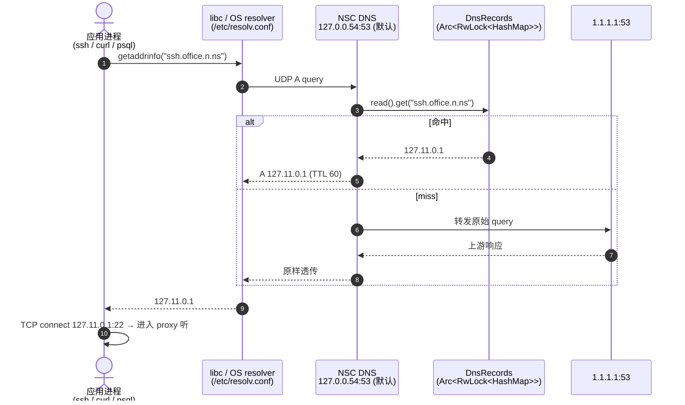

# 本地 DNS

> 关注：OS resolver → NSC DNS → VIP 的解析链路、监听点选择、回退策略、wire format 细节。

## 解析链



关键事实：

- NSC DNS 是**必经路径**。`/etc/resolv.conf` 里需要把 `nameserver 127.0.0.54`(默认监听地址)放在最前,或用 `resolvectl domain <iface> '~n.ns'` 让 systemd-resolved 把 `*.n.ns` 转发给 NSC。NSC 本身**不修改**系统配置,由用户或部署脚本负责。
- 未命中的查询**原样转发**到 `1.1.1.1:53`，不做 split-horizon。对于普通域名行为和本机默认解析一致。
- 所有查询都走 UDP，包 ≤512 字节。不支持 TCP fallback、不支持 EDNS、不支持 DNSSEC。

## 监听地址

```rust
// 默认值(crates/nsc/src/dns.rs:18)
pub const DNS_LISTEN_DEFAULT: &str = "127.0.0.54:53";
const UPSTREAM_DNS: &str = "1.1.1.1:53";
const UPSTREAM_TIMEOUT_SECS: u64 = 2;
```

### 为什么**不**用 `127.0.0.53:53`

`127.0.0.53:53` 是 **systemd-resolved 的 stub resolver 地址**,Ubuntu 18.04+ / Debian 12 / Fedora / Arch 默认就把它占着。如果 NSC 也去 bind,**一定冲突**:

```
$ ss -lntup | grep :53
UNCONN 0 0 127.0.0.53%lo:53 0.0.0.0:* users:(("systemd-resolve",pid=812,fd=14))
```

强行停掉 systemd-resolved 会破坏系统其它 DNS 解析(尤其是 VPN / DHCP 推下来的 search domain)。所以 NSC 默认**不**抢这个地址,而是用 `127.0.0.54:53`——紧邻 systemd-resolved 的下一个环回 IP,**几乎不会有别的服务用**,同时仍保留端口 53 让 `/etc/resolv.conf` 零改写(不需要写 `:port`)。

> **权限提示**:端口 < 1024 需 `CAP_NET_BIND_SERVICE`。Linux 下非 root 启动 NSC 时要么 `sudo setcap 'cap_net_bind_service=+ep' $(which nsc)`,要么直接用 `systemd.exec` 的 `AmbientCapabilities=CAP_NET_BIND_SERVICE`。若嫌麻烦,改到非特权端口:`--dns-listen 127.0.0.54:5353`(但此时 `/etc/resolv.conf` 无法表达 port,需要借助 systemd-resolved 的 `DNSStubListenerExtra` 或 dnsmasq 转发)。

### 和 systemd-resolved 共存的三种方式

| 方案 | 做法 | 适用 |
|------|------|------|
| **A. 并列(默认)** | NSC 监听 `127.0.0.54:53`;把它**加到 `/etc/resolv.conf` 首行**,systemd-resolved 作为 fallback | 本机只想让 `*.n.ns` 走 NSC,其余解析维持原状 |
| **B. 让 systemd-resolved 转发** | `resolvectl dns <iface> 127.0.0.54`,`resolvectl domain <iface> '~n.ns'` —— 仅 `*.n.ns` 的查询转发到 NSC | 想完全由 systemd-resolved 主导,NSC 做域特化 resolver |
| **C. 停用 systemd-resolved,NSC 抢 `127.0.0.53:53`** | `systemctl disable --now systemd-resolved` 后 `--dns-listen 127.0.0.53:53` | 不推荐,除非你明确想这么做;会丢 systemd 的 search-domain 管理能力 |

### 监听地址可配置

如果 `127.0.0.54:53` 也被别的服务占用(罕见),或你想用方案 C,可通过 CLI 或配置覆盖:

| 来源 | 形式 | 示例 |
|------|------|------|
| CLI 参数 | `--dns-listen <addr:port>` | `nsc --dns-listen 127.0.0.55:5353` |
| 环境变量 | `NSC_DNS_LISTEN` | `NSC_DNS_LISTEN=127.0.0.55:53` |
| 配置文件 | `[dns] listen = "..."` | 同上 |

优先级:CLI > 环境变量 > 配置文件 > 默认值。绑定失败时打印诊断:

```
cannot bind DNS server on 127.0.0.54:53 — another resolver may be running
hint: check `ss -lntup | grep :53`, then use `--dns-listen <free-addr:port>`
      or switch to unprivileged port (e.g. 127.0.0.54:5353)
```

> **提示**:改了监听地址后,系统 `/etc/resolv.conf`(或对应平台机制)也要跟着指到新地址,否则应用仍然问默认 resolver,就绕过 NSC 了。这一步**NSC 不自动做**——见下文"已知限制"。

- **macOS**:没有 systemd-resolved,但有 mDNSResponder 把 `127.0.0.1:53` 留给自己。NSC 默认 `127.0.0.54:53` 同样不冲突;需要通过 `/etc/resolver/n.ns` 文件写一行 `nameserver 127.0.0.54` 让 `*.n.ns` 特化解析走 NSC。这一步 NSC 当前不自动做,由用户/部署脚本负责。

## 记录来源

`DnsRecords` 是一个共享的 `Arc<RwLock<HashMap<String, Ipv4Addr>>>`，两条路径会往里写：

### 路径 1: `routing_config` 自动派生（主要来源）

主循环在收到 `RoutingConfig` 时，对每条 `RouteEntry` 执行：

```rust
if let Some(vip) = r.vip_for_site(&entry.site) {
    dns.insert(entry.domain.to_lowercase(), vip);
}
```

见 `crates/nsc/src/main.rs:258`。域名由 NSD 生成，形如 `{service}.{site}.n.ns`（见 [01 概述里的 DNS 命名约定](../01-overview/index.md)或 `/app/ai/nsio/docs/dns-naming.md`）。

### 路径 2: `dns_config` 显式下发（自定义域）

NSD 管理员可以配置额外的公共域名，同样映射到某个 site 的 VIP：

```
dns_records: [
  { domain: "git.company.com", site: "office", ... },
  { domain: "wiki.company.com", site: "office", ... },
]
```

处理在 `crates/nsc/src/main.rs:279`。对每条 `DnsRecord`：

```rust
if let Some(vip) = r.vip_for_site(&rec.site) {
    dns.insert(rec.domain.to_lowercase(), vip);
} else {
    warn!("DNS record for unknown site (no VIP allocated yet)");
}
```

**注意顺序问题**：如果 `dns_config` 先于对应 site 的 `routing_config` 到达，这条 DNS 记录会被丢弃并打 warn。NSD 侧应保证推送顺序，或等下一轮 `dns_config` 重试。

### 命名形态

```
web.ab3xk9mnpq.n.ns      ← NSD 自动生成：{service}.{node_id}.n.ns
git.company.com          ← dns_config 手配
OFFICE.N.NS              ← 查询时大小写不敏感（handle_query 会 to_lowercase）
```

## 协议实现

DNS wire format 手写，不依赖 `trust-dns-*` 等库（避免引入近千依赖）。完整实现在 `crates/nsc/src/dns.rs`，约 200 行有效代码。

### 支持的查询

- **QTYPE=1 (A)** 和 **QTYPE=255 (ANY)**：会命中查表；
- 其他 QTYPE（AAAA / MX / TXT / SRV / …）：不命中直接转发上游；
- **QR=1（响应包）**：忽略；
- **QDCOUNT=0**：忽略；
- **压缩指针（0xC0…）** 在 question 部分：直接报错（NSC 只接受首个 label-by-label 编码的 QNAME）。

### 响应构造

`build_a_response`（`crates/nsc/src/dns.rs:172`）：

```
Header:
  ID          = 原 query ID
  Flags       = 0x8400 | (RD_bit_from_query)     // QR=1, AA=1
  QDCOUNT = 1, ANCOUNT = 1, NSCOUNT = 0, ARCOUNT = 0

Question: 从原 query 直接拷贝（12 到 question_end_abs 字节）

Answer RR:
  NAME      = 0xC0 0x0C (压缩指针，指向 offset 12 处的 QNAME)
  TYPE      = 1 (A)
  CLASS     = 1 (IN)
  TTL       = 60 秒
  RDLENGTH  = 4
  RDATA     = 4 字节 IP
```

TTL 固定 60 秒——NSC 希望 VIP 变动（重启）后客户端能很快拿到新值。对绝大多数 NSC 用户，这些记录几乎总是被命中的（应用一直在访问同一个站点）。

### 并发模型

- 单个 `UdpSocket` 收所有查询；
- 每个查询 `tokio::spawn` 一个独立 task 处理（`crates/nsc/src/dns.rs:60`）——这样上游慢或超时不会阻塞后续查询；
- 记录表使用 `Arc<RwLock<HashMap>>`：写者是主循环（低频），读者是每个 DNS 请求（高频），RwLock 能让读并发。

### 上游转发

```rust
async fn forward_query(query: &[u8]) -> Result<Vec<u8>>
```

见 `crates/nsc/src/dns.rs:204`。流程：

1. 新开一个临时 `UdpSocket::bind("0.0.0.0:0")`；
2. `send_to(query, "1.1.1.1:53")`；
3. `recv_from` 包到 512-byte 缓冲区；
4. 2 秒超时后放弃（`tokio::time::timeout`）。

上游地址 `1.1.1.1:53` 当前是硬编码（`UPSTREAM_DNS` 常量），未来可以做成配置或从 NSD 下发。

## 与应用路径的协作

DNS 只是第一步；解析完成后应用会向 VIP 发 TCP，由 [proxy 模块](./router.md)接管。两者通过共享的 `DnsRecords` 和 `NscRouter` 状态协调：

- **HTTP 代理侧** (`crates/nsc/src/http_proxy.rs:245`)：直接读 `DnsRecords`，命中就把目标从 `host` 换成 `vip`；未命中走 OS 解析直连。详见 [http-proxy.md](./http-proxy.md)。
- **VIP 代理侧** (`crates/nsc/src/proxy.rs`)：不依赖 DNS——它只监听 VIP:port，应用在 DNS 解析后**必然**命中该 listener。

## 已知限制

| 项 | 现状 | 影响 |
|---|---|---|
| IPv6 | 不支持 AAAA 命中 | 应用必须能 fall back 到 IPv4 |
| TCP DNS | 不支持 | 极少触发（响应包永远 ≤512 bytes） |
| EDNS0 | 不支持 | 某些客户端可能发 OPT 记录，上游转发时会带过去 |
| DNSSEC | 不支持 | 不验证上游签名 |
| mDNS / LLMNR | 不拦截 | `*.local` 查询不经 NSC（由 avahi/resolved 处理） |
| 上游 timeout | 硬编码 2s | 上游慢链路下可能 false-negative |
| `/etc/resolv.conf` 自动配置 | NSC 不改 | 需用户/部署脚本把监听地址(默认 `127.0.0.54`,或 `--dns-listen` 指定值)放到首位;或用 `resolvectl domain` 让 systemd-resolved 按域转发到 NSC |

## 代码引用

- 入口：`crates/nsc/src/dns.rs:30` (`run_dns_server`)
- 查询处理：`crates/nsc/src/dns.rs:87` (`handle_query`)
- 上游转发：`crates/nsc/src/dns.rs:204` (`forward_query`)
- 响应构造：`crates/nsc/src/dns.rs:172` (`build_a_response`)
- 记录更新（主循环）：`crates/nsc/src/main.rs:258`（来自 routing）、`crates/nsc/src/main.rs:281`（来自 dns_config）
