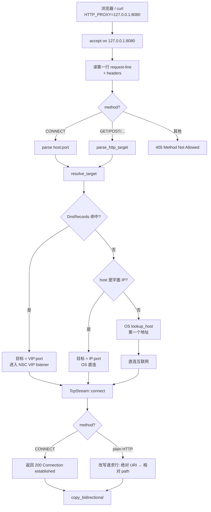
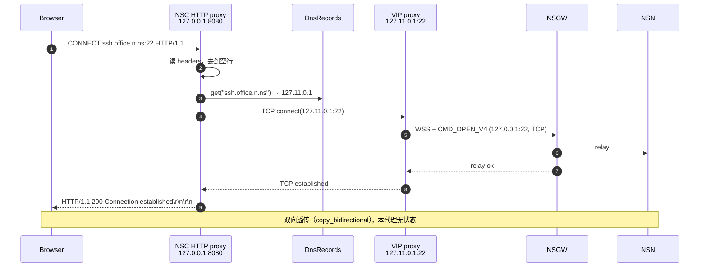

# 本地 HTTP 代理

> 位置：`crates/nsc/src/http_proxy.rs`。可选组件，由 `--http-proxy 127.0.0.1:8080` 开启。

## 为什么要有 HTTP 代理

VIP + 本地 DNS 已经可以让命令行工具透明访问远端服务，为什么还要 HTTP 代理？

1. **浏览器不走 `/etc/resolv.conf`**：Chrome / Firefox 通常自己做 DoH / DoT / secure DNS，绕过系统解析器，因此本地 DNS 对浏览器**无效**。HTTP 代理可以把浏览器的请求强制引过来。
2. **企业环境惯例**：开发者常已配置 `http_proxy` / `https_proxy` 环境变量，NSC 做成 HTTP 代理可以无缝融入现有工具链（curl / git / apt / docker login 等）。
3. **不想/不能改系统 DNS**：尤其 macOS 用户、CI 机器、Docker 容器内——只需 `HTTP_PROXY=127.0.0.1:8080` 即可。
4. **域名按需分流**：HTTP 代理**同时**处理 NSC 域名和普通域名——NSC 命中的走隧道，其他走直连。用户不必管理两个代理。

## 支持的请求形态

```
CONNECT foo.n.ns:22 HTTP/1.1       ← HTTPS / SSH / 任意 TCP 的隧道入口
GET http://foo.n.ns/path HTTP/1.1  ← 明文 HTTP 转发
POST / PUT / DELETE / HEAD / OPTIONS / PATCH 同上
其他方法 → 405 Method Not Allowed
```

（`crates/nsc/src/http_proxy.rs:113`）

## 分流决策



### `resolve_target` 的优先级

`crates/nsc/src/http_proxy.rs:245`：

```rust
// 1. NSC DNS 命中 → 用 VIP（走本机 VIP listener → WSS 隧道）
if let Some(&vip) = guard.get(&host.to_lowercase()) { return SocketAddr(vip, port); }

// 2. host 本身是字面 IP → 直接解析
if let Ok(ip) = host.parse::<IpAddr>() { return SocketAddr(ip, port); }

// 3. OS DNS 解析 → 第一个地址
match tokio::net::lookup_host(...).await { ... }
```

**关键**：第 1 步用的是**共享的** `DnsRecords`，也就是 `dns.rs` 里那张表——HTTP 代理直接读，**不发** DNS 查询。因此：

- NSC 命中的域名**立刻**走 VIP，不产生任何 DNS 流量；
- 未命中的域名走 OS 解析（libc / resolver），和用户本机默认一致。

### 走 VIP 的「双跳」架构

NSC 命中的流量路径看起来是：

```
browser → NSC HTTP proxy (127.0.0.1:8080)
        ↓ 内部 TCP 连接
        → NSC VIP listener (127.11.0.1:80)
        ↓ WSS + CMD_OPEN_V4
        → NSGW → NSN → 本地服务
```

注意 HTTP 代理**没有自己**连 NSGW——它只是把目标 IP 换成 VIP，复用了 `proxy.rs` 已经建好的 listener。这样：

- HTTP 代理代码里**零**隧道逻辑；
- 同一个 listener 同时服务 VIP 直连和 HTTP 代理两种入口；
- 新增 service 时只需 router/listener 侧感知，HTTP 代理自动跟上。

## `CONNECT` 流程



对 HTTPS 的处理完全透明——客户端发出的 TLS 握手直接被隧道转发到远端服务，NSC 不解包、不看内容、不做 MITM。

## 明文 `GET` 流程（绝对 URI）

浏览器/curl 发出 `GET http://foo.n.ns/path HTTP/1.1`，NSC 需要把它改写成 `GET /path HTTP/1.1` 再发给上游（否则远端服务看到绝对 URI 会不认识）。

请求改写逻辑（`crates/nsc/src/http_proxy.rs:178`）：

1. 解析绝对 URI → `(host, port, path)`；
2. `resolve_target` 拿 SocketAddr；
3. TCP 连上游；
4. 重建 request：
   - 请求行：`{METHOD} {path} HTTP/1.1\r\n`；
   - 复制原 headers，但丢弃 `Proxy-Connection:` / `Proxy-Authorization:`；
   - 若原 headers 没有 `Host:`，追加 `Host: {host}\r\n`；
   - 最后 `Connection: close\r\n\r\n`（简化 relay 生命周期）。
5. `copy_bidirectional` 透传 body 和响应。

### 边缘情况

| 情况 | 行为 |
|---|---|
| `GET /path HTTP/1.1`（相对路径，未经代理标准协议） | `parse_http_target` 返回 `("localhost", 80, "/path")`，走直连 localhost |
| `GET https://foo.com/...` 进代理 | 当前实现会按 HTTP 处理（`parse_http_target` 只看 scheme 是否有 `http://` 或 `https://`，后者也接受），但**不会**建立 TLS；浏览器/客户端一般不会这么发，它们对 HTTPS 总是用 `CONNECT` |
| IPv6 字面地址 `[::1]:8080` | `parse_host_port` 支持；`parse_http_target` 未处理方括号，需要通过 `CONNECT` 用 |
| 上游连接失败 | 返回 `502 Bad Gateway` |
| `parse_host_port` 失败 | 返回 `400 Bad Request` |
| 其他方法 | `405 Method Not Allowed` |

## 使用示例

```bash
# 启动 NSC 并打开 HTTP 代理
nsc --auth-key cloud.nsio=key-xxx --http-proxy 127.0.0.1:8080

# 浏览器：设置系统代理为 127.0.0.1:8080 即可
# 命令行：
export http_proxy=http://127.0.0.1:8080
export https_proxy=http://127.0.0.1:8080
curl http://web.ab3xk9mnpq.n.ns     # 命中 NSC → VIP → WSS → NSN
curl http://example.com             # 未命中 → 直连
```

## 与 VIP 直连方式的对比

| 场景 | VIP 直连（`127.11.0.1:22`） | HTTP 代理（`127.0.0.1:8080`） |
|---|---|---|
| 是否需要改客户端配置 | 改 DNS（`127.0.0.53`）or `/etc/hosts` | 改 `http_proxy` / `https_proxy` 环境变量或系统代理 |
| 浏览器可用性 | 可能被 secure DNS 绕过 | 100% 生效 |
| 非 HTTP 协议（SSH/DB/Redis） | 直接可用 | 可用（通过 `CONNECT`） |
| 运维复杂度 | 需修改系统 resolver | 零系统改动 |
| 适合场景 | 命令行为主的服务器/开发机 | 浏览器 + 多样化工具链 |

两者**不互斥**——可以同时启用。HTTP 代理内部最终也经过 VIP listener 出去。

## 代码引用

- 入口：`crates/nsc/src/http_proxy.rs:40` (`run_http_proxy`)
- 请求解析：`crates/nsc/src/http_proxy.rs:71` (`handle_client`)
- `CONNECT` 隧道：`crates/nsc/src/http_proxy.rs:136` (`handle_connect`)
- 明文 HTTP 转发：`crates/nsc/src/http_proxy.rs:178` (`handle_http`)
- 目标解析（含 NSC DNS 查表）：`crates/nsc/src/http_proxy.rs:245` (`resolve_target`)
- `host:port` 解析：`crates/nsc/src/http_proxy.rs:270`
- 绝对 URI 解析：`crates/nsc/src/http_proxy.rs:288`
- 主循环启动：`crates/nsc/src/main.rs:230`
