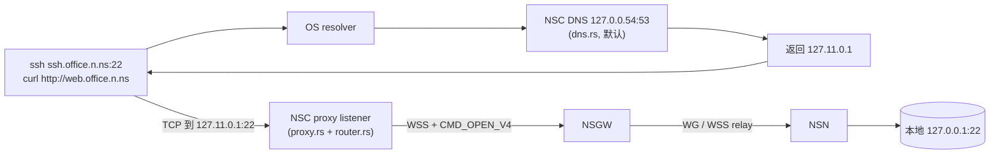

# 06 · NSC 用户客户端

NSC (Network Site Client) 是 NSIO 生态中运行在**用户终端**上的 Rust 二进制。它把远端 NSN 站点上的服务「拉到本地」——用户看到的就是几个 `127.11.x.x` 的环回 IP 和一串 `*.n.ns` 域名，`ssh`、`curl`、`psql` 可以像访问本机服务一样访问远端。

与 NSN 共享控制面、鉴权、ACL、隧道、代理等 crate；独有的部分只在 `crates/nsc/` 下（6 个 `.rs` 文件 ≈ 1 860 行，含测试），专注于**客户端侧的落地**：虚拟 IP 分配、本地 DNS、路由决策、出站代理、HTTP 代理。

## 职责边界

| 层 | 组件 | 实现位置 |
|---|---|---|
| CLI / 守护进程 | 参数解析、日志、主循环 | `crates/nsc/src/main.rs` |
| VIP 分配 | 给每个 site 分配 `127.11.x.x`（或 TUN 模式 `100.64.x.x`） | `crates/nsc/src/vip.rs` |
| 本地 DNS | 监听 `127.0.0.54:53`(默认,避让 systemd-resolved;可 `--dns-listen` 覆盖),解析 `*.n.ns` 和自定义域 | `crates/nsc/src/dns.rs` |
| 路由决策 | 维护 site→VIP、(site, port)→gateway 映射 | `crates/nsc/src/router.rs` |
| 出站代理 | 在每个 `VIP:port` 上监听 TCP，进入 WSS 隧道 | `crates/nsc/src/proxy.rs` |
| HTTP 代理 (可选) | 本地 HTTP/CONNECT 代理，按域名分流 | `crates/nsc/src/http_proxy.rs` |

所有 SSE 事件（路由、网关、DNS）由共用的 `ControlPlane` 驱动，NSC 只在主循环里消费 `routing_rx`、`gw_rx`、`dns_rx`，见 `crates/nsc/src/main.rs:195`。

## 文档索引

| 文档 | 关注点 |
|---|---|
| [design.md](./design.md) | NSC 的整体架构、与 NSN/NSD 的关系、三种数据面模式、工作原理 |
| [vip.md](./vip.md) | `127.11.0.0/16` 段的分配策略、与 TUN 模式 `100.64.0.0/16` 的差异、生命周期 |
| [dns.md](./dns.md) | `*.n.ns` 解析链路、OS resolver → NSC DNS → VIP 的全流程 |
| [router.md](./router.md) | `NscRouter` 的数据结构与分流决策（客户端 NAT 一侧） |
| [http-proxy.md](./http-proxy.md) | 可选的本地 HTTP/CONNECT 代理，按 NSC DNS 命中与否分流 |

每份文档内嵌至少一张 Mermaid 图；源码位于 [`diagrams/`](./diagrams/)：

- [`diagrams/nsc-arch.mmd`](./diagrams/nsc-arch.mmd) — NSC 整体架构
- [`diagrams/vip-lifecycle.mmd`](./diagrams/vip-lifecycle.mmd) — VIP 分配与刷新
- [`diagrams/dns-resolve.mmd`](./diagrams/dns-resolve.mmd) — `*.n.ns` 解析时序
- [`diagrams/router-decision.mmd`](./diagrams/router-decision.mmd) — 分流决策

## 与其他模块的关系

- **[01 系统总览](../01-overview/index.md)** — NSC 是 NSIO 四大组件之一（NSD / NSGW / NSN / NSC），用户侧入口。
- **[02 控制面](../02-control-plane/index.md)** — NSC 复用 `ControlPlane`，通过 SSE 订阅 `routing_config` / `dns_config` / `gateway_config`。
- **[03 数据面](../03-data-plane/index.md)** — NSC `proxy.rs` 和 NSN 共用相同的 WsFrame 协议（`CMD_OPEN_V4` / `CMD_DATA` / `CMD_CLOSE`）；TUN 模式复用 `tunnel-wg`。
- **[05 代理与 ACL](../05-proxy-acl/index.md)** — NSC 的 proxy 是**出站方向**，与 NSN 的入站代理方向相反；ACL 过滤待实现（见 design.md 的限制章节）。
- **[07 NSN 节点](../07-nsn-node/index.md)** — NSC 和 NSN 都是 Rust 二进制，共享控制面/鉴权/隧道栈，但流量方向相反，参考 design.md 末尾的对照表。

## 快速心智模型

这是默认的 userspace 模式；TUN / WSS-only 模式的差异见 [design.md](./design.md#三种数据面模式)。完整的组件图见 [`diagrams/nsc-arch.mmd`](./diagrams/nsc-arch.mmd)。
