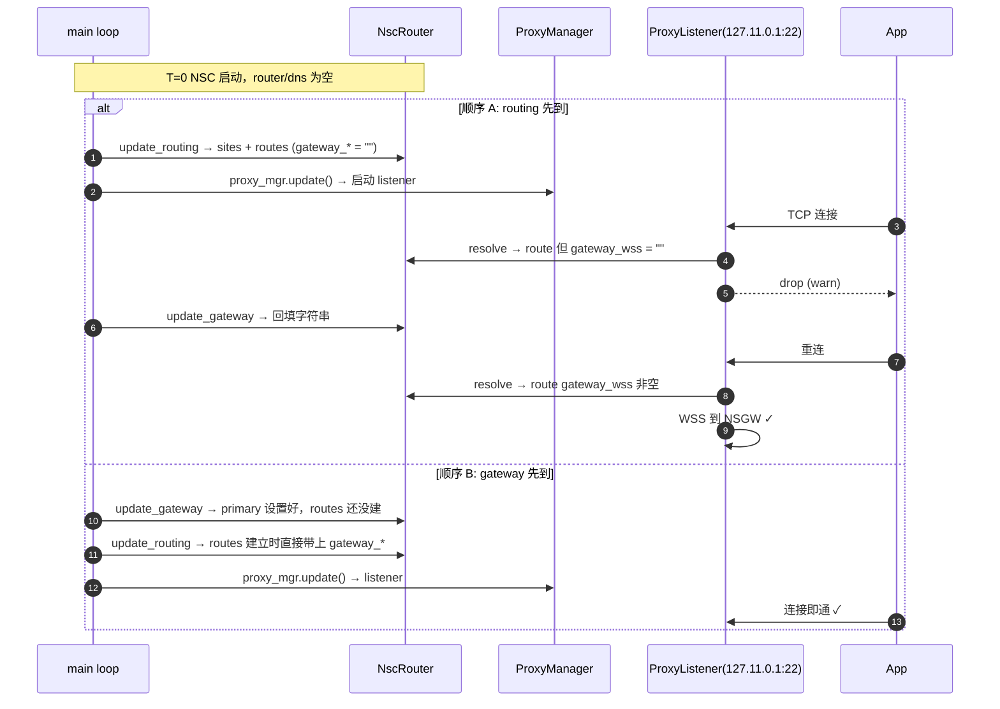

# NscRouter 路由决策

> 关注：客户端侧「NAT」逻辑——把「VIP:port」翻译成「NSGW + service port」，并在 SSE 事件到达时保持一致。

## 位置

`crates/nsc/src/router.rs`，结构 `NscRouter`（`crates/nsc/src/router.rs:56`）。主循环持有 `Arc<RwLock<NscRouter>>`，由 proxy 模块、HTTP 代理、DNS 记录补齐三方读写。

## 职责

NscRouter 既是**路由表**又是**出站 NAT 表**。对应用来说，入口是 `127.11.x.x:port`；出口是 `NSGW WSS URL + NSN 服务端口`。NscRouter 负责把两端粘起来。

```
+------------+                     +----------------+                   +---------+
| app        | --(VIP:port)----->  |  NscRouter     |  --(gateway+      |  NSGW   |
| (ssh/curl) |                     |                |     service port) |         |
+------------+                     +----------------+                   +---------+
                                       ▲         ▲
                                       │         │
                            routing_config     gateway_config
                               (NSD SSE)         (NSD SSE)
```

## 数据结构

```rust
pub struct NscRouter {
    sites_by_name:  HashMap<String, SiteInfo>,          // "office" → {vip, domain}
    sites_by_vip:   HashMap<IpAddr, String>,            // 127.11.0.1 → "office"
    routes:         HashMap<(String, u16), NscRoute>,   // ("office", 22) → NscRoute
    gateways:       HashMap<String, (String, String)>,  // "gw-1" → (wss, wg)
    primary_gateway_id: Option<String>,
}
```

- `SiteInfo`（`crates/nsc/src/router.rs:15`）：`{ vip, domain }`，`domain` 是 `format!("{site}.n.ns")`；
- `NscRoute`（`crates/nsc/src/router.rs:24`）：`{ site, service, fqid, port, gateway_wss, gateway_wg }`——`fqid` 是服务级的全限定域名（`"ssh.office.n.ns"`），来自 `RouteEntry.domain`；
- `gateways` 目前没有优先级/延迟排序，`primary_gateway_id` = **gateways 列表的第一个**（`crates/nsc/src/router.rs:125`）。

## 事件驱动的更新

### `update_routing(&RoutingConfig, &mut VipAllocator)`

（`crates/nsc/src/router.rs:83`）每次 `routing_config` SSE 到达主循环，对每条 `RouteEntry`：

1. `allocator.allocate(&entry.site)` — 幂等；
2. 若 `sites_by_name` 里没有 → 插入 `SiteInfo { vip, domain: "{site}.n.ns" }`；
3. 若 `sites_by_vip` 里没有 → 插入 `vip → site`；
4. `routes.insert((site, port), NscRoute { ..., gateway_wss, gateway_wg })`。

gateway 端点取自当前的 `primary_gateway_endpoints()`——**在 gateway_config 到达之前**，这里会写入两个空字符串。随后 proxy 尝试连接会看到 `gateway_wss.is_empty()` 并丢弃连接（见下方「冷启动」）。

### `update_gateway(&GatewayConfig)`

（`crates/nsc/src/router.rs:117`）

```rust
self.gateways.clear();
for gw in &gateway.gateways { self.gateways.insert(gw.id, (gw.wss, gw.wg)); }
self.primary_gateway_id = gateway.gateways.first().map(|g| g.id.clone());

// 把所有已有 route 的 gateway_* 刷新为新主网关
for route in self.routes.values_mut() { ... }
```

两个关键设计：

- **全量替换**：`gateways.clear()` 后重建，NSD 侧的 gateway 下线会被完整同步；
- **主路由刷新**：已经建立好的 `NscRoute` 也会被**更新**（不是仅影响新建的连接）。因为 `NscRoute` 存的是字符串值，所以已建立的 WSS 连接不受影响（见「连接时解析」）。

### 查询接口

```rust
fn resolve(&self, vip: IpAddr, port: u16) -> Option<&NscRoute>
fn vip_for_site(&self, site: &str) -> Option<Ipv4Addr>
fn route_count(&self) -> usize
fn route_snapshots(&self) -> Vec<(IpAddr, u16, NscRoute)>
fn status_snapshot(&self) -> Vec<SiteStatus>
```

`route_snapshots` 的用途是 `ProxyManager::update` 遍历它并为每个 `(VIP, port)` 启动一个 TCP listener（`crates/nsc/src/proxy.rs:80`）。

`status_snapshot` 被 `main.rs` 在每次 routing 更新后用于 `print_sites` 终端输出。

## 分流决策图

```mermaid
flowchart TD
  App[应用发起 TCP 到 127.11.x.x:port] --> LOOKUP

  subgraph NscRouter
    LOOKUP{sites_by_vip[vip]?}
    LOOKUP -->|命中| SITE[取 site_name]
    LOOKUP -->|未命中| DROP1[返回 None]
    SITE --> ROUTE{routes[(site, port)]?}
    ROUTE -->|未命中| DROP2[返回 None]
    ROUTE -->|命中| GW{gateway_wss 非空?}
    GW -->|空| DROP3[冷启动/未收到 gateway_config]
    GW -->|非空| RELAY[返回 NscRoute]
  end

  RELAY --> PROXY[proxy.rs: WSS 到 gateway_wss + CMD_OPEN_V4]
  DROP1 --> LOG1[debug: proxy connection closed]
  DROP2 --> LOG2[warn: no route found]
  DROP3 --> LOG3[warn: no gateway configured yet]
```

路径在 `crates/nsc/src/proxy.rs:142`：

```rust
let route = r.resolve(vip, port).cloned();
match route {
    Some(r) if !r.gateway_wss.is_empty() => { /* 正常走 WSS */ }
    Some(_) => { warn!("no gateway configured yet — dropping connection"); return Ok(()); }
    None    => { warn!("no route found for connection"); return Ok(()); }
}
```

## 连接时解析（lazy binding）

重要细节：`NscRoute` 是在**每次新 TCP 连接到达 listener 时**才从 router 读取的，**不是** listener 启动时快照。

```rust
// crates/nsc/src/proxy.rs:144
let route = {
    let r = router.read().await;
    r.resolve(vip, port).cloned()
};
```

好处：

- `gateway_config` 切换后，新连接立即用新 gateway，旧连接继续在老 gateway 上；
- 新增 service 的 listener 在 routing 到达后才 bind，避免空转；
- `route.gateway_wss` 的更新是字符串 clone，锁粒度小。

## 与客户端侧 NAT 的类比

NSN 做的是**入站 DNAT**：来自隧道的 `{site, service port, proto}` → 本地 `127.0.0.1:port`。
NSC 做的是**出站 SNAT + PAT**：本地 `127.11.x.x:port` → `{site (via NSGW), service port}`。

两边都把 (目标 IP, 端口) 作为路由键，但走的方向相反：

| | NSN | NSC |
|---|---|---|
| 路由键 | inbound packet `(dst_ip, dst_port, proto)` | `(vip, dst_port)` |
| 目标信息 | local service listener | remote NSN service port via NSGW |
| 状态源 | 本地 `services.toml` + NSD ACL | NSD SSE `routing_config` + `gateway_config` |

详见 [05 代理与 ACL](../05-proxy-acl/README.md) 的 NSN 侧路由章节。

## 冷启动时序

NSC 启动瞬间，router 和 dns_records 都是空的。事件可能乱序到达：



所以用户在启动后立刻连接可能会遇到一两次 `warn: no gateway configured yet`，这不是 bug——等几百毫秒重试即可。后续**不会**再触发，因为 `gateway_config` 到达是一次性的。

## 一致性保证

- **site → VIP 幂等**：`sites_by_name.entry(...).or_insert_with(...)`，同一 site 永不改 VIP；
- **VIP → site 幂等**：同上；
- **(site, port) → route 幂等 on site/service/port**，但 gateway 字段会被 `update_routing` / `update_gateway` 覆盖——这是特性，不是 bug，用于 gateway 切换；
- **没有 TTL / eviction**：NSD 不下发「删除 site」的消息，NSC 也不主动清理。如果某个 site 下线，其 `NscRoute` 会一直留着，新建连接会打到失联的 NSGW 并 WSS 握手失败。

## 代码引用

- 结构定义：`crates/nsc/src/router.rs:56`
- `update_routing`：`crates/nsc/src/router.rs:83`
- `update_gateway`：`crates/nsc/src/router.rs:117`
- `resolve`：`crates/nsc/src/router.rs:136`
- `route_snapshots`：`crates/nsc/src/router.rs:152`
- proxy 侧消费：`crates/nsc/src/proxy.rs:79` (`ProxyManager::update`) / `crates/nsc/src/proxy.rs:142` (连接时解析)
- 主循环消费：`crates/nsc/src/main.rs:251` / `crates/nsc/src/main.rs:273`
