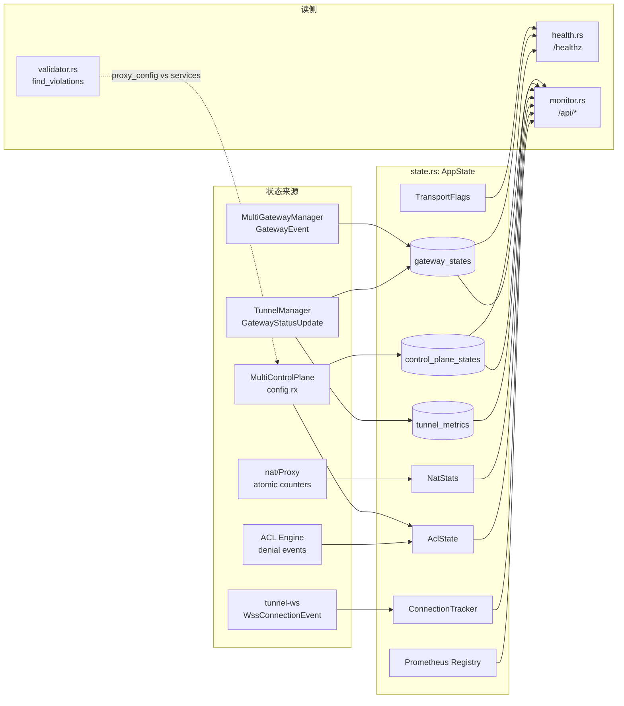
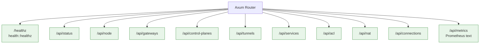

# health / monitor / validator / state: 职责边界

> 源码:
> - [`crates/nsn/src/state.rs`](../../../nsio/crates/nsn/src/state.rs) (660 行)
> - [`crates/nsn/src/health.rs`](../../../nsio/crates/nsn/src/health.rs) (121 行)
> - [`crates/nsn/src/monitor.rs`](../../../nsio/crates/nsn/src/monitor.rs) (430 行)
> - [`crates/nsn/src/validator.rs`](../../../nsio/crates/nsn/src/validator.rs) (331 行)

这 4 个模块共同组成 **nsn 的可观测层**。`state` 是共享状态；`health` / `monitor` 是只读暴露面；`validator` 是 NSD→NSN 规则对账器。



## 1. `state.rs` — AppState

`AppState` ([`state.rs:310`](../../../nsio/crates/nsn/src/state.rs)) 是 nsn 的共享运行时状态：

```rust
pub struct AppState {
    pub start_time: Instant,
    pub config: Arc<ConnectorConfig>,
    pub services: Arc<ServicesConfig>,
    pub node_info: NodeInfo,
    pub data_plane: DataPlaneMode,
    pub system_info: SystemInfo,
    pub transport: Arc<TransportFlags>,
    pub gateway_states: DashMap<String, GatewayState>,
    pub control_plane_states: DashMap<String, ControlPlaneState>,
    pub tunnel_metrics: DashMap<String, TunnelMetrics>,
    pub nat_stats: Arc<NatStats>,
    pub acl_state: RwLock<AclState>,
    pub connection_tracker: Arc<ConnectionTracker>,
    pub routing_config: RwLock<Option<RoutingConfig>>,
    pub dns_config: RwLock<Option<DnsConfig>>,
    pub metrics_registry: Arc<Registry>,
}
```

### 1.1 状态分区

| 字段 | 并发原语 | 写入者 | 读取者 |
| ---- | -------- | ------ | ------ |
| `transport: TransportFlags` | `AtomicBool` ([`state.rs:272`](../../../nsio/crates/nsn/src/state.rs)) | `main.rs` 在 transport 建立后 set_wg / set_wss | `/healthz`, `/api/status` |
| `gateway_states` | `DashMap` (lock-free) | `apply_gateway_event` ([`main.rs:1062`](../../../nsio/crates/nsn/src/main.rs)) 与 `upsert_gateway` ([`state.rs:376`](../../../nsio/crates/nsn/src/state.rs)) | `/api/gateways`, `/healthz` |
| `control_plane_states` | `DashMap` | `mark_control_plane_connected` ([`state.rs:428`](../../../nsio/crates/nsn/src/state.rs)) | `/api/control-planes`, `/healthz` |
| `tunnel_metrics` | `DashMap` | `gw_status_rx` 循环（运行于 nsn::main，消费 tunnel-wg 发送的 `GatewayStatusUpdate`）([`main.rs:967-989`](../../../nsio/crates/nsn/src/main.rs)) | `/api/tunnels` |
| `nat_stats` | `AtomicU64` ([`state.rs:117`](../../../nsio/crates/nsn/src/state.rs)) | NAT 引擎直接写 | `/api/nat`, `/api/status`, `/api/metrics` |
| `acl_state` | `RwLock<AclState>` | `mark_acl_loaded` ([`state.rs:439`](../../../nsio/crates/nsn/src/state.rs)) + 拒绝事件 | `/api/acl`, `/api/status` |
| `connection_tracker` | 内部 `RwLock` + `AtomicU64` | `WssConnectionEvent` 循环 ([`main.rs:760-788`](../../../nsio/crates/nsn/src/main.rs)) | `/api/connections`, `/api/status`, `/api/metrics` |

### 1.2 关键类型

- `NodeInfo` ([`state.rs:257`](../../../nsio/crates/nsn/src/state.rs)) — 静态身份字段 (`machine_id`, `machine_key_pub`, `peer_key_pub`, `hostname`, `os`, `version`, `registered`, `state_dir`)。私钥永远不会出现在 `AppState` 里。
- `GatewayState` ([`state.rs:60`](../../../nsio/crates/nsn/src/state.rs)) — 每网关的 `status` / `transport` / `connected_since` / 字节计数 / 握手时间 / 错误。
- `TunnelMetrics` ([`state.rs:101`](../../../nsio/crates/nsn/src/state.rs)) — WG 握手与字节计数快照。
- `ConnectionRecord` ([`state.rs:173`](../../../nsio/crates/nsn/src/state.rs)) + `ConnectionTracker` ([`state.rs:193`](../../../nsio/crates/nsn/src/state.rs)) — 代理连接滑动窗口 (最多 `MAX_CONNECTIONS = 500` 条)。
- `AclState` ([`state.rs:138`](../../../nsio/crates/nsn/src/state.rs)) — `loaded` / `rule_count` / `host_aliases` / `default_action` / `recent_denials` (ring buffer 100 条)。

### 1.3 辅助方法

- `upsert_gateway(id, endpoint, status, transport)` — 容器化初始化 / 状态切换 ([`state.rs:376`](../../../nsio/crates/nsn/src/state.rs))。
- `mark_gateway_connected` / `mark_all_gateways_connected` / `mark_control_plane_connected` / `mark_acl_loaded` — 薄包装，便于其他模块只调函数不直写字段。
- `now_rfc3339()` / `unix_secs_to_rfc3339()` ([`state.rs:29-55`](../../../nsio/crates/nsn/src/state.rs)) — 自实现的 UTC 格式化，避免额外 chrono 依赖。

## 2. `health.rs` — 轻量探针

只暴露一条 `GET /healthz` ([`health.rs:72`](../../../nsio/crates/nsn/src/health.rs))。响应体 `HealthResponse` ([`health.rs:56`](../../../nsio/crates/nsn/src/health.rs)) 兼容原始 schema，并扩展了 per-NSD / per-gateway 状态：

```json
{
  "wg_connected": true,
  "wss_connected": false,
  "transport": "udp",
  "uptime_secs": 12,
  "services_count": 4,
  "strict_mode": true,
  "data_plane": "userspace",
  "control_centers": [{"id": "nsd-1", "connected": true}],
  "gateways":       [{"id": "gw-1",  "connected": true, "transport": "udp", "latency_ms": 8}]
}
```

- 仅读 `AppState`，零副作用。
- Gateway 按 `id` 字典序排序以稳定输出 ([`health.rs:108`](../../../nsio/crates/nsn/src/health.rs))。
- `transport` 来自 `TransportFlags::active_transport()` ([`state.rs:294`](../../../nsio/crates/nsn/src/state.rs))，取值 `"udp"` / `"wss"` / `"connecting"`。

### 何时使用

- systemd `Type=notify` 以外的存活检查。
- k8s liveness / readiness probe。
- 自动化 E2E 启动就绪检测。

## 3. `monitor.rs` — 丰富只读 API



每个 handler 形状一致 —— `State(state): State<Arc<AppState>>` + 直接 `Json(...)`。详细响应字段见 [monitor-api.md](./monitor-api.md)。

### 3.1 响应数据流

- `/api/status` 做了最多的派生聚合 ([`monitor.rs:39`](../../../nsio/crates/nsn/src/monitor.rs))：枚举网关 / 控制面 / ACL / NAT 计数后合并成一份概览。
- `/api/services` 通过 `build_services_response` ([`monitor.rs:185`](../../../nsio/crates/nsn/src/monitor.rs)) 把 `ServicesConfig` 转成带 `fqid` 的响应；**包含 `enabled=false` 项** 以便运维区分 "禁用" vs "未配置"。
- `/api/metrics` ([`monitor.rs:306`](../../../nsio/crates/nsn/src/monitor.rs)) 先 `TextEncoder::encode_to_string` 输出 OTel 侧所有指标，再追加手写的 `nsn_*` 汇总指标 (见 [telemetry.md](./telemetry.md))。

### 3.2 安全策略

- 默认绑定 `127.0.0.1:9090` ([`main.rs:85`](../../../nsio/crates/nsn/src/main.rs))：外部暴露需显式 `--monitor-addr 0.0.0.0:9090` 并自行加鉴权 (反向代理)。
- 全部只读，无 mutation 路径。
- `NodeInfo` 只含 `machine_key_pub` / `peer_key_pub`；私钥 (`peer_key_priv`) 在注册后只存在于 `TunnelManager` 内部的 `peer_key_priv_bytes` ([`main.rs:450-461`](../../../nsio/crates/nsn/src/main.rs))，不会进入 `AppState`。

## 4. `validator.rs` — Proxy 规则对账

NSD 下发 `ProxyConfig { chain_id, rules: Vec<SubnetRule> }`；`validator::find_violations` ([`validator.rs:19`](../../../nsio/crates/nsn/src/validator.rs)) 对每条规则逐一核对本地 `ServicesConfig`：

```rust
fn rule_is_allowed(services, rule) -> bool {
    match &rule.rewrite_to {
        RewriteTarget::Ip(ip)     => host + port + protocol 精确匹配
        RewriteTarget::Domain(n)  => host eq_ignore_ascii_case(n) + port + protocol
        RewriteTarget::Cidr(cidr) => services.is_cidr_allowed(cidr, port_range, protocol)
    }
}
```

- 返回 `Vec<RuleViolation>` ([`common::services`](../../../nsio/crates/common/src/services.rs))。
- **mode-agnostic** — 总是返回全部违规；调用方根据 `services.is_strict()` 决定是 log-only 还是真的拒绝 ([`main.rs:668-693`](../../../nsio/crates/nsn/src/main.rs))。
- 当前 main.rs 里只做 `tracing::warn!`，并不实际把违规规则从 `ProxyConfig` 中过滤掉；路由决策始终走本地 `ServiceRouter` ([`main.rs:666-669`](../../../nsio/crates/nsn/src/main.rs) 注释)。这保证了 "local whitelist is the source of truth"。

### 4.1 对账点覆盖

- IP 目标：[`validator.rs:42-50`](../../../nsio/crates/nsn/src/validator.rs)
- 域名目标：[`validator.rs:51-55`](../../../nsio/crates/nsn/src/validator.rs)
- CIDR 目标：[`validator.rs:56`](../../../nsio/crates/nsn/src/validator.rs) → `ServicesConfig::is_cidr_allowed`
- `host_eq` 支持 IP 规范化对比 ([`validator.rs:62`](../../../nsio/crates/nsn/src/validator.rs))
- 禁用服务不计入匹配 ([`validator.rs` 测试 `disabled_service_is_not_matched`](../../../nsio/crates/nsn/src/validator.rs))

## 5. 职责边界速查表

| 模块 | 读 `AppState`? | 写 `AppState`? | 外部 IO | 依赖 crate |
| ---- | -------------- | -------------- | ------- | ---------- |
| `state` | n/a | 提供所有写方法 | 仅时间戳 | `common`, `control::messages`, `prometheus`, `dashmap`, `tokio::sync` |
| `health` | 是 | 否 | 响应 JSON | `axum`, `serde` |
| `monitor` | 是 | 否 | 响应 JSON / Prometheus text | `axum`, `serde`, `prometheus` |
| `validator` | 否 | 否 | 只做纯函数计算 | `common`, `control::messages` |

## 6. 相关文档

- [monitor-api.md](./monitor-api.md) — 端点字段表
- [lifecycle.md](./lifecycle.md) — 启动顺序 & 配置流
- [services-report.md](./services-report.md) — `services.toml` → NSD 上报
- [telemetry.md](./telemetry.md) — OTel / Prometheus 装配
