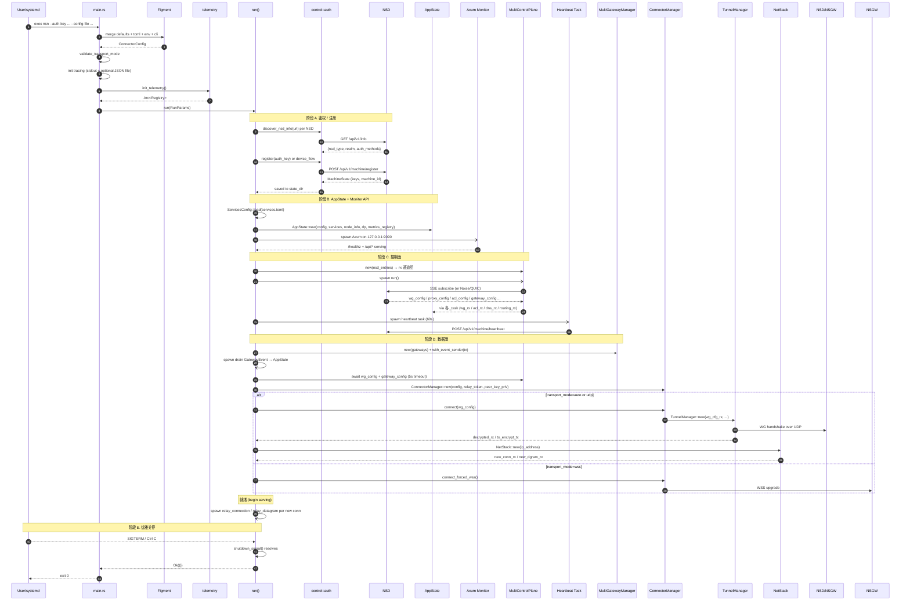

# 生命周期: 启动 / 配置流 / 优雅关停

> 源码: [`crates/nsn/src/main.rs`](../../../nsio/crates/nsn/src/main.rs) 里的 `main` + `run()` + `shutdown_signal()`
>
> 本文档说明 nsn 从启动到退出的完整时序，以及运行期配置热更新如何流入 `AppState`。

## 1. 启动时序图



阶段对应源码：

- 阶段 A [`main.rs:337-431`](../../../nsio/crates/nsn/src/main.rs)
- 阶段 B [`main.rs:462-559`](../../../nsio/crates/nsn/src/main.rs)
- 阶段 C [`main.rs:561-749`](../../../nsio/crates/nsn/src/main.rs)
- 阶段 D [`main.rs:751-1054`](../../../nsio/crates/nsn/src/main.rs)
- 阶段 E [`main.rs:1544-1574`](../../../nsio/crates/nsn/src/main.rs)

> 完整的 Mermaid 源码存于 [`diagrams/nsn-startup.mmd`](./diagrams/nsn-startup.mmd)。

## 2. 启动顺序的关键约束

### 2.1 先 Monitor API 后控制面

Monitor API 在控制面连接之前就已经 spawn ([`main.rs:529-559`](../../../nsio/crates/nsn/src/main.rs))，因此：

- `/healthz` 一启动就能响应，便于 systemd / k8s 的 readiness 判断。
- `gateways_total = 0` / `control_planes_connected = 0` 是合法的初始态——外部轮询应等待字段变化。
- 启动过程中的 config 注入错误只会记录 `tracing::warn!`，不会阻止 Monitor 暴露状态。

### 2.2 先 WgConfig 后 GatewayConfig

```rust
let wg_config = wg_config_rx.recv().await.context(...)?;          // 必须
tokio::time::timeout(5s, gateway_config_rx.recv()).await { ... }  // 尽力
```

- **wg_config** 是启动阻塞点：NSD 不下发则 `run()` 返回错误 ([`main.rs:817-820`](../../../nsio/crates/nsn/src/main.rs))。
- **gateway_config** 是 best-effort：超时 5s 后 WSS 回退使用 `server_url` ([`main.rs:826-847`](../../../nsio/crates/nsn/src/main.rs))。

### 2.3 先 ACL 后 Transport

```rust
match tokio::time::timeout(Duration::from_secs(2), acl_config_rx.recv()).await { ... }
// 然后把 AclEngine 注入 transport.acl_handle() 才 connect()
```

- 初始 ACL 等待上限 2s ([`main.rs:796-804`](../../../nsio/crates/nsn/src/main.rs))，避免把 "无 ACL" 状态暴露给 WSS transport。
- 超时后继续启动，但 WSS 链路会在拿到 ACL 前默认 deny。

## 3. 配置热更新管线

`MultiControlPlane::new` 返回 8 个 `mpsc::Receiver`，每一个对应一类 NSD 推送的配置：

| Channel | 消费者 | 作用 |
| ------- | ------ | ---- |
| `wg_config_rx` | `TunnelManager` ([`main.rs:878-889`](../../../nsio/crates/nsn/src/main.rs)) | WireGuard peer / allowed_ips 热替换 |
| `proxy_config_rx` | `validator::find_violations` + log ([`main.rs:668-693`](../../../nsio/crates/nsn/src/main.rs)) | NSD→NSN 代理规则白名单对账 |
| `acl_config_rx` | `router.load_acl` + `acl_handle` ([`main.rs:806-815`](../../../nsio/crates/nsn/src/main.rs)) | ACL 引擎热更新 + `AppState.acl_state` |
| `gateway_config_rx` | `record_gateway_config` + `transport.set_wss_relay_url` ([`main.rs:826-847`](../../../nsio/crates/nsn/src/main.rs)) | 网关拓扑更新 |
| `routing_config_rx` | `app_state.routing_config.write().await = Some(cfg)` ([`main.rs:727-735`](../../../nsio/crates/nsn/src/main.rs)) | DNS / 路由表 |
| `dns_config_rx` | `app_state.dns_config.write().await = Some(cfg)` ([`main.rs:737-745`](../../../nsio/crates/nsn/src/main.rs)) | 全局 DNS 记录 |
| `control_status_rx` | `app_state.mark_control_plane_connected` ([`main.rs:718-725`](../../../nsio/crates/nsn/src/main.rs)) | 控制面连通事件 |
| `token_refresh_rx` | `transport.set_token_refresh_rx` ([`main.rs:754`](../../../nsio/crates/nsn/src/main.rs)) | WSS session token 刷新 |

所有 `_task` 都是独立的 `tokio::spawn`，`recv().await` 阻塞读，配置变更 → 状态写入 `AppState` 即可被 Monitor API 观察到。

## 4. 心跳与系统信息

`heartbeat` 后台任务固定 **60 秒** 周期 ([`main.rs:590-605`](../../../nsio/crates/nsn/src/main.rs))：

```rust
let interval = std::time::Duration::from_secs(60);
loop {
    tokio::time::sleep(interval).await;
    let uptime_secs = start_time.elapsed().as_secs();
    let local_ips = common::SystemInfo::collect_local_ips();
    for client in &heartbeat_clients {
        client.heartbeat(uptime_secs, local_ips.clone()).await.ok();
    }
}
```

- 失败只 `tracing::debug!`，不阻塞。
- `uptime_secs` / `local_ips` 在每个 tick 实时计算 (非启动时快照)。
- 初次 `SystemInfo::collect` 在启动时只跑一次 ([`main.rs:142`](../../../nsio/crates/nsn/src/main.rs))，后续字段 (如 uptime) 由消费端实时刷新。

## 5. 优雅关停

关停由 `shutdown_signal()` ([`main.rs:1544-1574`](../../../nsio/crates/nsn/src/main.rs)) 驱动：

```rust
tokio::select! {
    () = ctrl_c => {},
    () = terminate => {},  // SIGTERM (unix)
}
```

两条分支：

| 模式 | 关停点 |
| ---- | ------ |
| UDP (WG) | `shutdown_signal().await` 在主协程阻塞 ([`main.rs:1046`](../../../nsio/crates/nsn/src/main.rs))，返回后 `run()` 结束，所有 `tokio::spawn` 的后台 task 被 runtime drop |
| WSS | `transport.run(&wg_config, Box::pin(shutdown_signal())).await` ([`main.rs:1051`](../../../nsio/crates/nsn/src/main.rs))，shutdown future 由 transport 自己 select |

退出路径：

1. `ctrl_c` 或 `SIGTERM` → `shutdown_signal()` 返回。
2. `run()` 返回 `Ok(())` → `main()` 返回 → `tokio::main` 关闭 runtime。
3. Axum / TunnelManager / 背景 task 全部被 Drop；`_file_guard` 的 non-blocking writer 先 flush 日志再退出 ([`main.rs:243-258`](../../../nsio/crates/nsn/src/main.rs))。

> **注意**: 当前实现没有主动发送 "NSN 离线" 消息给 NSD。NSD 侧通过心跳超时感知 (默认心跳周期 60s，常量见 [`main.rs:593`](../../../nsio/crates/nsn/src/main.rs))。

## 6. 失败分支与早退

| 条件 | 源码 | 行为 |
| ---- | ---- | ---- |
| 未配置 `server_url` 与 `control_centers` | [`main.rs:231-235`](../../../nsio/crates/nsn/src/main.rs) | `anyhow::bail!("no endpoint configured")` |
| 未注册且未提供 auth_key / device_flow | [`main.rs:418-425`](../../../nsio/crates/nsn/src/main.rs) | `anyhow::bail!("machine is not registered for realm '…'")` |
| `services.toml` 文件不存在 | `ServicesConfig::load` 返回 strict-empty，日志警告 | 启动成功但所有规则被拒 |
| `transport_mode` 未知 | `validate_transport_mode` 在早期失败 | 立即退出 |
| TUN 模式无权限 | [`main.rs:892-897`](../../../nsio/crates/nsn/src/main.rs) | `anyhow::bail!("TUN mode requires root or CAP_NET_ADMIN")` |
| `ConnectorManager::connect` 失败 | [`main.rs:853-867`](../../../nsio/crates/nsn/src/main.rs) | `context("failed to establish transport")` |

所有早期失败都通过 `anyhow::Error` 冒泡到 `main()`，最终 `std::process::exit(1)`，systemd / k8s 会按重启策略拉起。
