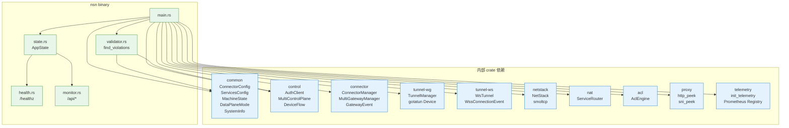

# nsn 二进制: main / CLI / 模块装配

> 源码: [`crates/nsn/src/main.rs`](../../../nsio/crates/nsn/src/main.rs) (1627 行)
>
> nsn 是 NSIO 站点侧的运行时二进制。一个 `main.rs` 汇聚了 10 个内部 crate 与 1 个外部 crate (gotatun)，形成一个可独立运行的 WireGuard 隧道 + TCP/UDP 代理节点。

## 1. 入口

```rust
#[tokio::main]
async fn main() -> Result<()> {
    let cli = Cli::parse();
    // 1. 解析 CLI / 构建 figment config
    // 2. 初始化日志 + telemetry
    // 3. run(params) 内完成所有模块装配
}
```

- `#![forbid(unsafe_code)]` —— 全程禁止 unsafe ([`main.rs:1`](../../../nsio/crates/nsn/src/main.rs))
- 使用 `clap` 解析 CLI ([`main.rs:39`](../../../nsio/crates/nsn/src/main.rs))，与 `figment` 分层合并配置
- 入口函数只负责参数 + 日志 + telemetry 初始化，业务装配全部下沉到 `run()` ([`main.rs:310`](../../../nsio/crates/nsn/src/main.rs))

## 2. CLI 标志

| 标志 / 环境变量 | 含义 | 源码 |
| --------------- | ---- | ---- |
| `--auth-key <k>` 或 `<realm>=<k>` / `AUTH_KEY` | 首次注册的一次性 key，支持多 realm | [`main.rs:52`](../../../nsio/crates/nsn/src/main.rs) |
| `--machine-id` / `MACHINE_ID` | 无状态模式下的固定设备 ID | [`main.rs:59`](../../../nsio/crates/nsn/src/main.rs) |
| `--device-flow` / `DEVICE_FLOW` | OAuth2 device authorization 交互注册 | [`main.rs:63`](../../../nsio/crates/nsn/src/main.rs) |
| `--state-dir` / `STATE_DIR` | 机器状态目录 (默认 `/var/lib/nsio`) | [`main.rs:67`](../../../nsio/crates/nsn/src/main.rs) |
| `--server-url` / `SERVER_URL` | 主 NSD URL (与 `[[control_centers]]` 二选一) | [`main.rs:71`](../../../nsio/crates/nsn/src/main.rs) |
| `--config-file` / `CONFIG_FILE` | TOML 配置文件路径 | [`main.rs:79`](../../../nsio/crates/nsn/src/main.rs) |
| `--monitor-addr` / `MONITOR_ADDR` | 监控 HTTP 绑定地址，默认 `127.0.0.1:9090` | [`main.rs:85`](../../../nsio/crates/nsn/src/main.rs) |
| `--transport-mode` | `auto` / `udp` / `wss` | [`main.rs:89`](../../../nsio/crates/nsn/src/main.rs) |
| `--services-file` / `SERVICES_FILE` | 本地服务白名单 TOML | [`main.rs:93`](../../../nsio/crates/nsn/src/main.rs) |
| `--log-dir` / `LOG_DIR` | 结构化 JSON 日志目录 (按日滚动) | [`main.rs:98`](../../../nsio/crates/nsn/src/main.rs) |
| `--permissive` | 关闭严格验证 (仅 dev / test) | [`main.rs:102`](../../../nsio/crates/nsn/src/main.rs) |
| `--snat-addr` / `SNAT_ADDR` | 远程服务回包的 SNAT 源 IP | [`main.rs:108`](../../../nsio/crates/nsn/src/main.rs) |
| `--data-plane` / `DATA_PLANE` | `userspace` (默认) / `tun` / `wss` | [`main.rs:113`](../../../nsio/crates/nsn/src/main.rs) |
| `--control-mode` / `CONTROL_MODE` | `sse` (默认) / `noise` / `quic` | [`main.rs:121`](../../../nsio/crates/nsn/src/main.rs) |
| `--nsd-pubkey` / `NSD_PUBKEY` | Noise/QUIC 所需 NSD X25519 公钥 (32 字节 hex) | [`main.rs:129`](../../../nsio/crates/nsn/src/main.rs) |

## 3. 配置分层 (Figment)

`main.rs` 采用 **defaults → TOML → env → CLI** 的分层合并：

```
ConnectorConfig::defaults()        # crates/common 默认值
    .merge(Toml::file(config_file))
    .merge(Env::raw().only([...]))
    .merge(Serialized::default("key", cli.value))
```

关键代码 [`main.rs:144-225`](../../../nsio/crates/nsn/src/main.rs)。

- 非表达为标量的多端点 (`CONTROL_CENTERS` / `GATEWAYS` / `GATEWAYS_WSS`) 通过 `apply_env_list_overrides` CSV 解析覆盖 ([`main.rs:1373`](../../../nsio/crates/nsn/src/main.rs))。
- `validate_transport_mode` 在启动阶段就拒绝未知值 ([`main.rs:1534`](../../../nsio/crates/nsn/src/main.rs))。

## 4. 模块装配

`run()` 按顺序把 10 个内部 crate 组装成一条运行时管线。见 [`diagrams/nsn-modules.mmd`](./diagrams/nsn-modules.mmd)。



### 4.1 `run()` 里装配的任务

| 阶段 | 源码 | 产物 |
| ---- | ---- | ---- |
| 1. 发现 NSD / per-realm 注册 | [`main.rs:337-431`](../../../nsio/crates/nsn/src/main.rs) | `nsd_states: HashMap<nsd_id, MachineState>` |
| 2. 心跳客户端 | [`main.rs:436-442`](../../../nsio/crates/nsn/src/main.rs) | `Vec<HeartbeatClient>` |
| 3. 加载 `services.toml` | [`main.rs:465`](../../../nsio/crates/nsn/src/main.rs) | `ServicesConfig` |
| 4. 构造 `AppState` | [`main.rs:519-526`](../../../nsio/crates/nsn/src/main.rs) | `Arc<AppState>` |
| 5. 启动 Monitor API (spawn) | [`main.rs:529-559`](../../../nsio/crates/nsn/src/main.rs) | Axum 9 条路由 + `/healthz` + `/api/metrics` |
| 6. 启动 `MultiControlPlane` (spawn) | [`main.rs:576-749`](../../../nsio/crates/nsn/src/main.rs) | 9 条 config 接收 task |
| 7. 60s 心跳 (spawn) | [`main.rs:590-605`](../../../nsio/crates/nsn/src/main.rs) | `POST /api/v1/machine/heartbeat` |
| 8. `MultiGatewayManager` + `GatewayEvent` drain | [`main.rs:608-640`](../../../nsio/crates/nsn/src/main.rs) | 网关状态实时更新 |
| 9. `ServiceRouter` 构造 | [`main.rs:660`](../../../nsio/crates/nsn/src/main.rs) | 本地服务查表 + ACL 入口 |
| 10. 等待首份 ACL / WgConfig / GatewayConfig | [`main.rs:796-847`](../../../nsio/crates/nsn/src/main.rs) | 首次握手依赖顺序 |
| 11. `ConnectorManager::connect` | [`main.rs:849-869`](../../../nsio/crates/nsn/src/main.rs) | 根据 `transport_mode` 选 UDP / WSS |
| 12. WG 分支: `TunnelManager` + `NetStack` + relay | [`main.rs:876-1045`](../../../nsio/crates/nsn/src/main.rs) | smoltcp / TUN + TCP/UDP relay |
| 13. WSS 分支: `transport.run()` | [`main.rs:1047-1054`](../../../nsio/crates/nsn/src/main.rs) | 纯 WebSocket relay 模式 |
| 14. 等 Ctrl-C / SIGTERM | [`main.rs:1046,1544`](../../../nsio/crates/nsn/src/main.rs) | 优雅退出 |

## 5. 二进制模块划分

| 模块 | 文件 | 暴露项 |
| ---- | ---- | ------ |
| `state` | [`state.rs`](../../../nsio/crates/nsn/src/state.rs) | `AppState` / `NodeInfo` / `GatewayState` / `ControlPlaneState` / `TunnelMetrics` / `AclState` / `ConnectionTracker` / `NatStats` / `TransportFlags` |
| `health` | [`health.rs`](../../../nsio/crates/nsn/src/health.rs) | `healthz` handler + `HealthResponse` 向后兼容 schema |
| `monitor` | [`monitor.rs`](../../../nsio/crates/nsn/src/monitor.rs) | `/api/status` / `/api/node` / `/api/gateways` / `/api/control-planes` / `/api/tunnels` / `/api/services` / `/api/acl` / `/api/nat` / `/api/connections` / `/api/metrics` |
| `validator` | [`validator.rs`](../../../nsio/crates/nsn/src/validator.rs) | `find_violations(services, proxy_config)` — 服务端规则 vs 本地白名单 |

后续章节按照 "启动生命周期 / health & monitor / services_report / telemetry / monitor API" 展开。

## 6. 相关文档

- [lifecycle.md](./lifecycle.md) — 启动时序、config 热更新、优雅关停
- [health-monitor.md](./health-monitor.md) — 4 个模块的职责边界
- [monitor-api.md](./monitor-api.md) — HTTP 端点表
- [services-report.md](./services-report.md) — `services.toml` 到 NSD 的流向
- [telemetry.md](./telemetry.md) — OTel / Prometheus 装配
