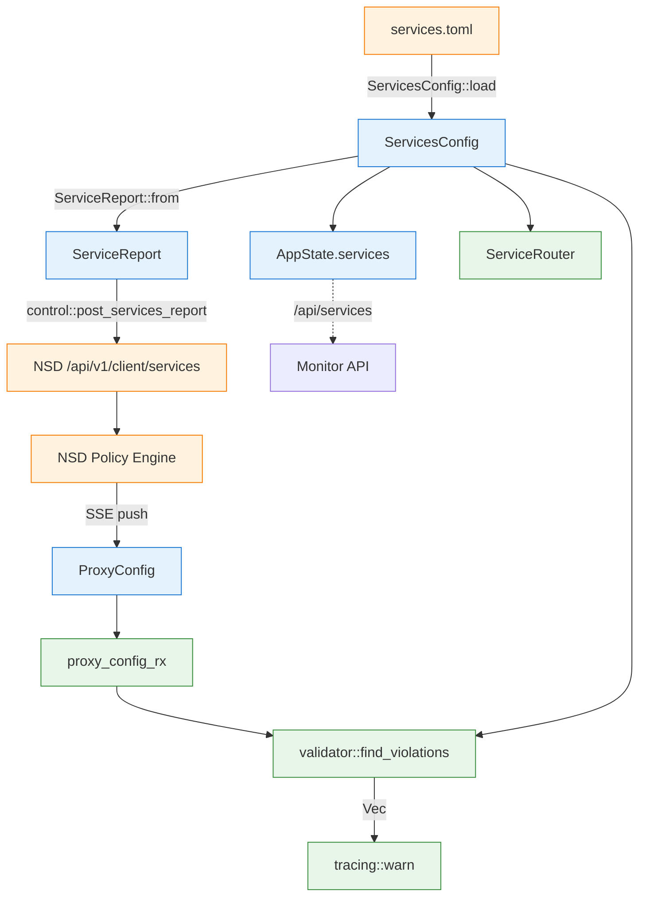

# services.toml + services_report

> 相关源码:
> - `ServicesConfig`: [`crates/common/src/services.rs`](../../../nsio/crates/common/src/services.rs)
> - `ServiceReport` 消息: [`crates/control/src/messages.rs:88`](../../../nsio/crates/control/src/messages.rs)
> - 装配点: [`crates/nsn/src/main.rs:465`](../../../nsio/crates/nsn/src/main.rs) 与 [`main.rs:562-574`](../../../nsio/crates/nsn/src/main.rs)
> - 上行: [`crates/control/src/sse.rs:104`](../../../nsio/crates/control/src/sse.rs)
> - 校验: [`crates/nsn/src/validator.rs`](../../../nsio/crates/nsn/src/validator.rs)

本文档说明 **本地白名单** 是如何定义、加载、上报给 NSD，以及 NSD 回推的 proxy 规则如何与本地白名单对账。

## 1. 设计约束

- **本地是权威**：NSN 从不让 NSD 告诉它 "可以代理什么"。相反，NSN 先把自己允许什么上报给 NSD，再由 NSD 基于这个清单下发匹配的 proxy 规则。
- **fail-closed**：没有 `services.toml` 或 `services.toml` 为空 → 严格空配置 → 全部拒绝 ([`common/src/services.rs:228-236`](../../../nsio/crates/common/src/services.rs))。
- **strict 默认 true** ([`common/src/services.rs:123`](../../../nsio/crates/common/src/services.rs))；`--permissive` 仅作开发/测试的一次性逃生舱。
- **只暴露元数据**：上报给 NSD 的 `ServiceReport` 不含密钥、不含机器 ID 以外的敏感身份。

## 2. 数据流

```mermaid
sequenceDiagram
    autonumber
    participant FS as services.toml
    participant NSN as nsn run()
    participant CFG as ServicesConfig
    participant AP as AppState
    participant MCP as MultiControlPlane
    participant NSD as NSD
    participant VAL as validator

    NSN->>FS: ServicesConfig::load(path)
    FS-->>NSN: TOML → ServicesConfig
    NSN->>NSN: enabled_count / disabled_count log
    NSN->>AP: AppState::new(services, ...)
    NSN->>CFG: ServiceReport::from(&services_config)
    CFG-->>NSN: ServiceReport { services, strict_mode, system_info }
    NSN->>MCP: pass to entries: Vec<(cc, auth, ServiceReport)>
    MCP->>NSD: POST /api/v1/client/services (before SSE subscribe)
    NSD-->>MCP: ServicesAck { matched, unmatched, rejected }
    NSD-->>MCP: SSE push ProxyConfig { rules }
    MCP-->>NSN: proxy_config_rx.recv()
    NSN->>VAL: find_violations(services, proxy_config)
    VAL-->>NSN: Vec<RuleViolation>
    NSN->>NSN: tracing::warn! per violation; accepted/total counts
```

- 绑定点：`ServiceReport::from(&services_config)` ([`control/src/messages.rs:98`](../../../nsio/crates/control/src/messages.rs))。
- system_info 在发送前由 `main.rs` 注入 ([`main.rs:562-563`](../../../nsio/crates/nsn/src/main.rs))。
- `MultiControlPlane` 使用同一份 `ServiceReport` 复制到每个 NSD entry ([`main.rs:573`](../../../nsio/crates/nsn/src/main.rs))。
- 上报协议：`SseClient::post_services_report` ([`control/src/sse.rs:104`](../../../nsio/crates/control/src/sse.rs))；调用位点位于 `control::lib.rs` 在建立订阅前触发 ([`control/src/lib.rs:187`](../../../nsio/crates/control/src/lib.rs))。
- Violation 日志：[`main.rs:675-690`](../../../nsio/crates/nsn/src/main.rs)。

## 3. services.toml 结构

```toml
[settings]
strict = true            # 默认 true；false 进入 permissive 模式

[services.web]
protocol = "tcp"         # tcp / udp / both / http / https
host     = "127.0.0.1"   # IP 或域名
port     = 80
# 可选字段:
description = "internal web"
enabled     = true        # 默认 true
tunnel      = "auto"      # auto / wg / ws
gateway     = "auto"      # auto 或具体网关 id (如 "nsgw-1")

[services.db]
protocol = "tcp"
host     = "192.168.1.50"   # 远程服务 → 需要 --snat-addr
port     = 5432

[services.api]
protocol = "https"
host     = "10.0.0.5"
port     = 443
domain   = "api.internal"   # https 必需: TLS SNI 匹配值
```

关键类型:

- `ServiceSettings` ([`services.rs:116`](../../../nsio/crates/common/src/services.rs)) — `strict` 布尔。
- `ServiceDef` ([`services.rs:138`](../../../nsio/crates/common/src/services.rs)) — 单条服务定义。
- `TunnelPreference` ([`services.rs:69`](../../../nsio/crates/common/src/services.rs)) — `Auto` / `Wg` / `Ws`。
- `GatewayPreference` ([`services.rs:86`](../../../nsio/crates/common/src/services.rs)) — `Auto` / `Specific(id)`。
- `Protocol` 取值支持 `http` / `https` 以启用 L7 路由 (HTTP Host / TLS SNI)。

### 3.1 `fqid` 约定

```rust
pub fn fqid(&self, name: &str, node_id: &str) -> String {
    format!("{}.{}.n.ns", name, node_id)
}
```

([`services.rs:190`](../../../nsio/crates/common/src/services.rs))

例如 `services.web` + `machine_id = "ab3xk9mnpq"` → `web.ab3xk9mnpq.n.ns`。NSC 用这个 FQDN 通过本地 DNS 解析到虚 IP，全链路唯一标识一个服务。

### 3.2 本地 vs 远程服务

- `is_local()` ([`services.rs:177`](../../../nsio/crates/common/src/services.rs)) — 只有 `127.0.0.1` / `localhost` / `0.0.0.0` / `::1` 视为本地。
- 远程服务 (LAN / 域名) 需要 `--snat-addr` ([`main.rs:108`](../../../nsio/crates/nsn/src/main.rs))，否则回包从 "虚拟隧道 IP" 送出，远程宿主无法路由回来。

## 4. ServiceReport 消息

```rust
pub struct ServiceReport {
    pub services:    HashMap<String, ServiceInfo>,  // key = service name
    pub strict_mode: bool,
    pub system_info: Option<SystemInfo>,            // 仅首次与重连时填充
}

pub struct ServiceInfo {
    pub protocol:    Protocol,
    pub host:        String,
    pub port:        u16,
    pub enabled:     bool,
    pub description: Option<String>,
    pub tunnel:      TunnelPreference,
    pub gateway:     GatewayPreference,
}
```

([`control/src/messages.rs:68-122`](../../../nsio/crates/control/src/messages.rs))

### 4.1 确认应答 `ServicesAck`

NSD 响应把服务名按匹配关系分到三类 ([`messages.rs:125-133`](../../../nsio/crates/control/src/messages.rs))：

- `matched`: 该服务至少有一条 NSD 端的 proxy 规则指向它。
- `unmatched`: 服务已上报，但 NSD 没有规则—可能策略未绑定。
- `rejected`: NSD 端有指向本 NSN、但 service 名称不在本地白名单—策略配置错误，需要运维修正。

日志位于 `control::lib.rs` 的 `services_report` 发送点 ([`control/src/lib.rs:187`](../../../nsio/crates/control/src/lib.rs))。

## 5. 下发 ProxyConfig vs 本地白名单

### 5.1 执行策略

| 情况 | strict=true | strict=false (permissive) |
| ---- | ----------- | -------------------------- |
| Rule 命中本地服务 | 接受，记日志 | 接受 |
| Rule 未命中本地服务 | **日志 warn**，路由仍走 `ServiceRouter` | 日志 warn，路由仍走 `ServiceRouter` |
| 本地无服务 | 全部命中失败 | 同左 |

重要事实：`validator::find_violations` 在两种 mode 下行为一致，只返回违规列表 ([`validator.rs:19`](../../../nsio/crates/nsn/src/validator.rs))。是否执行过滤由调用方决定 —— 当前 `main.rs:668-693` 的实现 **始终只 log**，实际路由由 `ServiceRouter::resolve*` 基于本地 `services.toml` 独立决策。这意味着：

> 无论 NSD 如何下发，NSN 不可能代理 `services.toml` 之外的目标。

### 5.2 日志示例

```
WARN nsn::main — proxy rule rejected rule_id=abc-123 reason="target 10.0.0.5:3306 does not match any local service"
INFO nsn::main — proxy rules validated accepted=7 total=8 mode=strict
```

## 6. Monitor API `/api/services`

对应 handler: `monitor::services` ([`monitor.rs:230`](../../../nsio/crates/nsn/src/monitor.rs))。

响应体包含 **全部** 服务 (含 `enabled=false`)，键为 `fqid`，值为：

```json
{
  "strict_mode": true,
  "services": {
    "web.ab3xk9mnpq.n.ns": {
      "protocol": "tcp",
      "host": "127.0.0.1",
      "port": 80,
      "enabled": true,
      "tunnel": "auto",
      "gateway": "auto"
    },
    "forbidden.ab3xk9mnpq.n.ns": {
      "protocol": "tcp",
      "host": "192.168.99.99",
      "port": 22,
      "enabled": false,
      "tunnel": "auto",
      "gateway": "auto"
    }
  }
}
```

测试 `services_response_lists_disabled_entries_with_enabled_false` ([`monitor.rs:387`](../../../nsio/crates/nsn/src/monitor.rs)) 固化了 "禁用项必须列出" 的契约。

## 7. 图: 白名单数据流



## 8. 关键决策点

| 决策 | 位置 | 说明 |
| ---- | ---- | ---- |
| 本地白名单是唯一信任根 | [`validator.rs` 注释 + `main.rs:666-668` 注释](../../../nsio/crates/nsn/src/main.rs) | 防止 NSD 端策略错误扩大 NSN 攻击面 |
| strict 默认 true | [`services.rs:123`](../../../nsio/crates/common/src/services.rs) | fail-closed |
| services.toml 缺失不阻止启动 | [`services.rs:229-236`](../../../nsio/crates/common/src/services.rs) | 但所有规则被拒绝 |
| system_info 随首次 ServiceReport 上报 | [`main.rs:562-563`](../../../nsio/crates/nsn/src/main.rs) | NSD 即可在管理界面看到节点基本信息 |

## 9. 相关文档

- [health-monitor.md](./health-monitor.md) — `validator.rs` 的 API
- [monitor-api.md](./monitor-api.md) — `/api/services` 字段表
- [lifecycle.md](./lifecycle.md) — config 热更新管线
