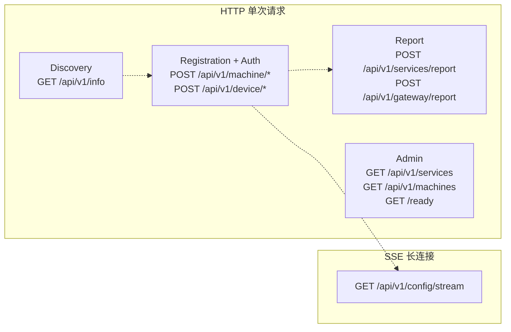
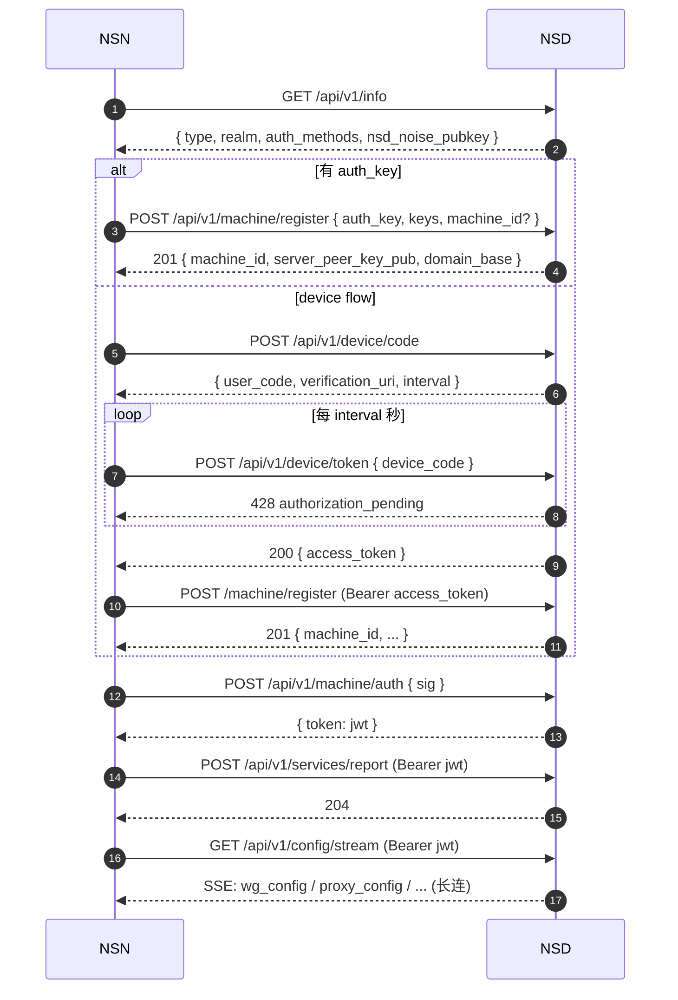

# NSD API 契约

> 所有契约来源：`tests/docker/nsd-mock/src/` 与 `crates/control/src/`。生产 NSD 通常会在这张表之上增加管理员路由、审计日志路由、IdP 路由等，**但 mock 实现定义的是"数据面必须看到"的最小契约**。本章只罗列源码可证实的接口——不做猜测。

## 1. API 分类总览



## 2. 发现与健康检查

| Method | Path | Request | Response | Auth | 触发时机 | 源 |
|--------|------|---------|----------|------|---------|---|
| GET | `/api/v1/info` | — | `NsdInfoResponse` | 无 | 启动、每次重连前 NSN 调用 `discover_nsd_info()` | `tests/docker/nsd-mock/src/auth.ts:316` · `crates/control/src/auth.rs:281` |
| GET | `/ready` | — | `"ok"` 200 | 无 | 容器健康检查 / Kubernetes probe | `tests/docker/nsd-mock/src/auth.ts:337` |

`NsdInfoResponse` 关键字段（`tests/docker/nsd-mock/src/types.ts:159`）：

```jsonc
{
  "type": "cloud" | "selfhosted",
  "realm": "default",
  "auth_methods": ["auth_key", "o_auth2", "device_flow"],
  "provider": "nsd-mock",
  "version": "0.0.0-test",
  "nsd_noise_pubkey": "hex(32)",   // 可选：Noise IK 静态公钥
  "nsd_quic_pubkey":  "hex(32)"    // 可选：QUIC 证书 SHA-256 指纹
}
```

**契约强度**：生产 NSD 必须返回 `type` / `realm` / `auth_methods` 三个字段。NSN 侧在 404 时会 fallback 成 `SelfHosted / realm=default` （`crates/control/src/auth.rs:298-307`），所以老版本 NSD 也兼容。

## 3. 注册与认证

| Method | Path | Request Body | Response | Auth | 触发时机 | 源 |
|--------|------|--------------|----------|------|---------|---|
| POST | `/api/v1/machine/register` | `RegisterRequest` | `RegisterResponse` (201) | `auth_key` in body **或** `Authorization: Bearer <device_flow_token>` | 首次注册、auth_key 模式每次幂等启动 | `tests/docker/nsd-mock/src/auth.ts:91` · `crates/control/src/auth.rs:176-207` |
| POST | `/api/v1/machine/auth` | `MachineAuthRequest` | `AuthResponse` (`token`) | 无（靠签名） | 每次启动、JWT 即将过期 | `tests/docker/nsd-mock/src/auth.ts:174` · `crates/control/src/auth.rs:237-272` |
| POST | `/api/v1/device/code` | `DeviceCodeRequest` | `DeviceCodeResponse` | 无 | 无 authkey 且 NsdInfo 支持 device_flow | `tests/docker/nsd-mock/src/auth.ts:224` · `crates/control/src/device_flow.rs:52` |
| POST | `/api/v1/device/token` | `DeviceTokenRequest` | `DeviceTokenResponse` (200 成功 / 428 `authorization_pending` / 400 `expired_token`) | 无 | 轮询 `interval` 间隔 | `tests/docker/nsd-mock/src/auth.ts:271` · `crates/control/src/device_flow.rs:100` |
| POST | `/api/v1/machine/heartbeat` | `HeartbeatRequest` | 204 | 无（未来应要求 JWT） | 定时（NSN 后台任务） | `tests/docker/nsd-mock/src/auth.ts:376` · `crates/control/src/auth.rs:83` |

### 3.1 RegisterRequest

```jsonc
// tests/docker/nsd-mock/src/types.ts:189
{
  "auth_key":        "ak_...",        // optional
  "machine_id":      "ab3xk9mnpq",    // optional；提供时 NSD 必须幂等采纳
  "machine_key_pub": "hex(32)",       // Ed25519 pub
  "peer_key_pub":    "hex(32)",       // X25519 (WG) pub
  "hostname":        "site-a",
  "os":              "linux",
  "version":         "0.x.x",
  "type":            "connector" | "gateway",
  "system_info":     { /* SystemInfo */ }
}
```

### 3.2 RegisterResponse

```jsonc
// tests/docker/nsd-mock/src/types.ts:212
{
  "machine_id":          "ab3xk9mnpq",
  "server_peer_key_pub": "hex(32)",
  "server_endpoint":     "10.0.0.1:51820",
  "domain_base":         "ab3xk9mnpq.n.ns",
  "nsd_noise_pubkey":    "hex(32)",   // 可选
  "nsd_quic_pubkey":     "hex(32)"    // 可选
}
```

### 3.3 MachineAuthRequest

```jsonc
// tests/docker/nsd-mock/src/types.ts:227
{
  "machine_id":      "ab3xk9mnpq",
  "machine_key_pub": "hex(32)",
  "timestamp":       1713000000,        // unix secs
  "signature":       "hex(64)"          // Ed25519(sha256 hash internal)("{machine_id}:{timestamp}")
}
```

NSD 验证逻辑（`tests/docker/nsd-mock/src/auth.ts:192-212`）：
1. 查 `machines[machine_id]`，不存在→401。
2. 时间戳 skew ≤ 300 秒，否则→401。
3. 用 registry 里的 `machine_key_pub` 验签 `"{machine_id}:{timestamp}"`，不通过→401。
4. 通过则签发 JWT（mock 为 `alg: none`，生产必须 RS256 / ES256）。

## 4. 数据面上报

| Method | Path | Request Body | Response | Auth | 触发时机 | 源 |
|--------|------|--------------|----------|------|---------|---|
| POST | `/api/v1/services/report` | `ServiceReport` | 204 | `Authorization: Bearer <jwt>` | SSE 连接建立前 & services.toml 变更 | `tests/docker/nsd-mock/src/index.ts:82` · `crates/control/src/sse.rs:103` |
| POST | `/api/v1/gateway/report` | `GatewayReport` | 204 | 建议 JWT（mock 不校验） | NSGW 启动 & WG endpoint 变化 | `tests/docker/nsd-mock/src/index.ts:93` |

### 4.1 ServiceReport（NSN → NSD）

```jsonc
// crates/control/src/messages.rs:88
{
  "services": {
    "web":  { "protocol": "tcp", "host": "127.0.0.1", "port": 80,  "enabled": true, "tunnel": "auto", "gateway": "auto" },
    "ssh":  { "protocol": "tcp", "host": "127.0.0.1", "port": 22,  "enabled": true, "tunnel": "wg",   "gateway": "gw-eu-west" }
  },
  "strict_mode": true,
  "system_info": { /* SystemInfo (可选) */ }
}
```

NSD 副作用（`tests/docker/nsd-mock/src/registry.ts:364-388`）：
- 更新 `nsnServices[machine_id]` 记录。
- SSE push 对应 NSN：`wg_config + gateway_config + proxy_config + services_ack + dns_config`。
- SSE broadcast 给所有 NSGW：`wg_config`（更新 peer 列表） + `routing_config`（新路由）。
- SSE broadcast 给所有非 gateway 订阅者：`dns_config`。

### 4.2 GatewayReport（NSGW → NSD）

```jsonc
// tests/docker/nsd-mock/src/types.ts:73
{
  "gateway_id":   "nsgw-1",
  "wg_pubkey":    "hex(32)",
  "wg_endpoint":  "nsgw-1.example:51820",   // NSD 会 DNS 解析成 ip:port
  "wss_endpoint": "wss://nsgw-1.example:9443"
}
```

NSD 副作用（`tests/docker/nsd-mock/src/registry.ts:395-412`）：
- DNS 解析 `wg_endpoint` 的 hostname 到 IP（Rust 侧把 endpoint 解成 `SocketAddr`，需要 IP）。
- 更新 `gateways[gateway_id]` 记录。
- SSE broadcast 给所有已上报 services 的 NSN：更新 `wg_config`（新 peer 列表）。
- SSE broadcast 给所有非 gateway 订阅者：`gateway_config`（网关列表）。

## 5. 配置流（SSE）

| Method | Path | Request | Response | Auth | 触发时机 | 源 |
|--------|------|---------|----------|------|---------|---|
| GET | `/api/v1/config/stream` | — | `text/event-stream` (长连) | `Authorization: Bearer <jwt>` | NSN/NSC/NSGW 启动完毕 | `tests/docker/nsd-mock/src/index.ts:103` · `crates/control/src/sse.rs:128` |

**响应头**（`tests/docker/nsd-mock/src/index.ts:119-125`）：

```
Content-Type: text/event-stream
Cache-Control: no-cache
Connection: keep-alive
X-Accel-Buffering: no
```

**身份解析**：优先从 `Authorization: Bearer <JWT>` 中解出 `sub` claim 作为 `machine_id`；测试路径允许 `?machine_id=` query 参数（`tests/docker/nsd-mock/src/index.ts:104-107`）。

**连接后的推送**见 [sse-events.md](./sse-events.md)。

## 6. 管理/Admin 端点

| Method | Path | Response | 用途 | 源 |
|--------|------|----------|------|---|
| GET | `/api/v1/services` | `Record<machineId, { services }>` | 看全网 NSN 服务注册快照（调试 / 监控） | `tests/docker/nsd-mock/src/index.ts:77` · `registry.ts:418` |
| GET | `/api/v1/machines` | `Array<{ machine_id, type, system_info, last_heartbeat }>` | 看所有已注册机器 | `tests/docker/nsd-mock/src/auth.ts:359, 408` |

mock 不做 admin 鉴权；生产 NSD 必须加 session + RBAC 检查，这套结构在 `tmp/control/server/routers/*/index.ts` 中随处可见。

## 7. 头部与错误语义总表

| HTTP | 语义 | 典型触发 |
|------|------|---------|
| 200 / 201 / 204 | 成功 | 注册 201、services_report 204、auth 200 |
| 400 | 请求参数错 | JSON 解析失败、`machine_key_pub` 缺失 |
| 401 | 鉴权失败 | 无 auth_key 也无 Bearer、未注册 `machine_id`、签名无效、时间戳漂移 >300s |
| 404 | 端点不存在 | `/api/v1/info` 老版本未实现（NSN 会 fallback） |
| 405 | 方法不允许 | 用 GET 访问 POST-only 端点 |
| 428 | device flow 未完成 | device_code 已发但 user 未授权（RFC 8628 `authorization_pending`） |



## 8. mock 缺失 / 简化的契约

| 契约 | mock | 生产 | 影响 |
|------|------|------|------|
| JWT 验证 | `alg: none`（`auth.ts:61`），从 base64 payload 解出 `sub` | 必须 RS256/ES256，JWKs 端点 | 生产需要 `/.well-known/jwks.json` |
| auth_key 校验 | 只要不空就通过 | 查 `authKeys` 表、单次使用、过期 | 实际的一次性预共享密钥语义 |
| device_flow 自动批准 | 2 秒后自动批准（`auth.ts:247`） | 需要用户在浏览器点击授权 | 生产必有 `/device` 页面 |
| `heartbeat` 鉴权 | 只检查 `machine_id` 在 registry | 必须携带 JWT 并验证 `sub == machine_id` | 防止第三方冒充 |
| `gateway/report` 鉴权 | 完全不鉴权 | 应检查 gateway 的 JWT | mock 简化 |
| ACL 下发 | 不下发 `AclConfig` | 通过 roles/userResources 合成 | NSN 侧收不到 `acl_config` 事件 |
| 证书管理 | 无 | `certificates` 路由器 + Let's Encrypt | traefik 动态证书 |

这张表是做"从 mock 迁移到生产"或"自己实现 NSD"时的风险清单。
