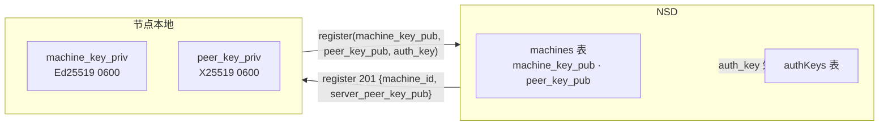
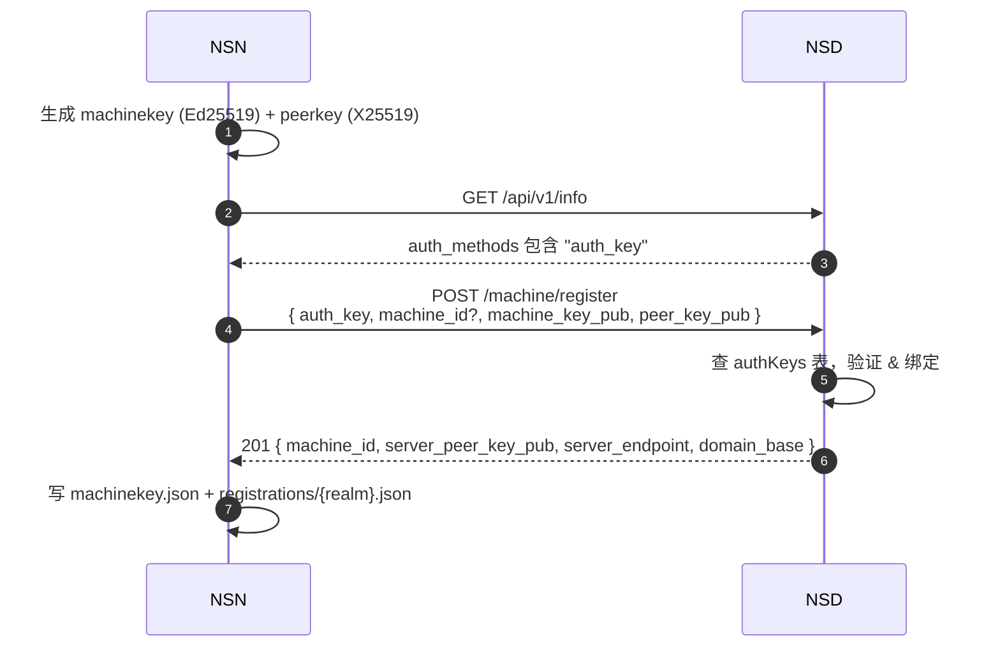
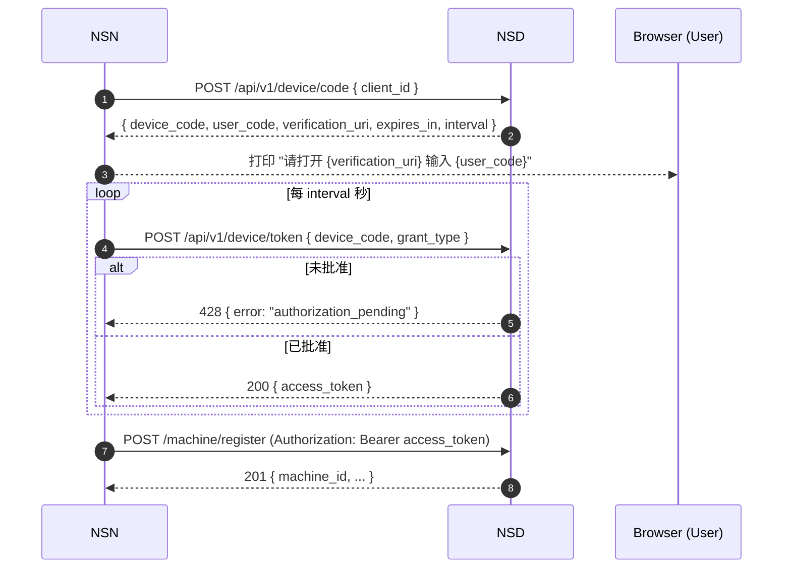
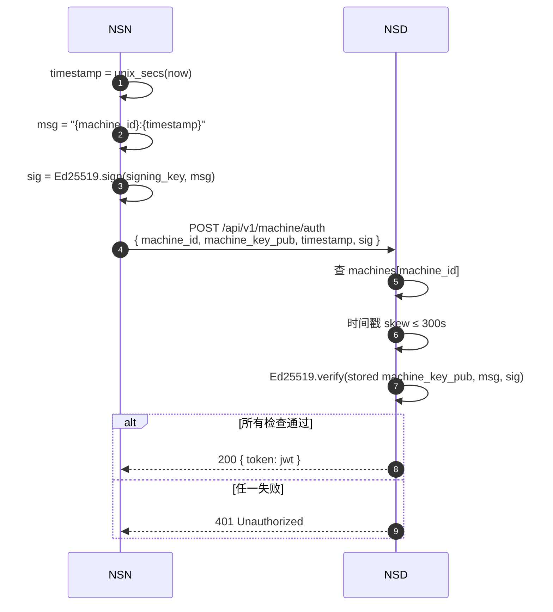
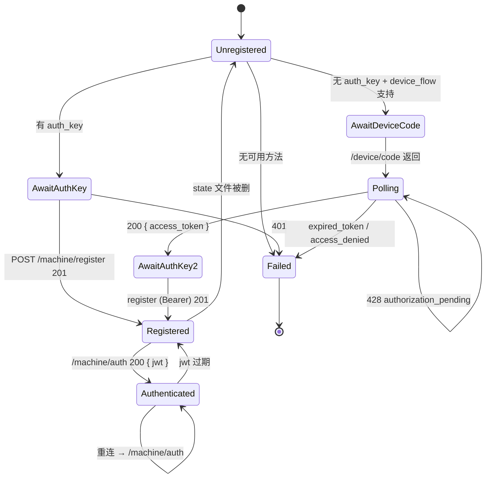

# NSD 认证体系

> NSD 的认证体系由三组要素组成：**密钥**（machinekey / peerkey / authkey）、**协议流程**（device flow / signature auth）、**凭证**（JWT）。本章把它们拆开讲，并给出每一步的源码定位与验证义务。

## 1. 三把密钥

NSN / NSC 在本地生成两把永久密钥（私钥永远不出机器），接收一把一次性预共享密钥：

| 密钥 | 算法 | 私钥去向 | 公钥用途 | NSD 侧存储 |
|------|------|---------|---------|-----------|
| **machinekey** | Ed25519 | 永远不离开节点 `{state_dir}/machinekey.json`（0600） | 签名 `"{machine_id}:{timestamp}"` 用于认证 | 存储 `machine_key_pub` 到 machines 表 |
| **peerkey** | X25519 | 永远不离开节点（同一文件） | 作为 WireGuard peer 公钥下发给对端 | 存储 `peer_key_pub` 到 machines 表 |
| **authkey** | 预共享字符串 | 注册成功后由 NSN 侧丢弃 | 证明注册请求来自授权方 | 生产态查 `authKeys` 表并 mark-as-used |

> mock 实现不区分 machinekey 与 peerkey 字段以外的语义——它按接收顺序存储而不做额外校验。生产实现通过数据库表实现两者的唯一约束与反重放。



**关键不变式**：NSD 永远不应收到、存储、转发任何**私钥**。`WgConfig` 故意不含 `private_key` 字段（`crates/control/src/messages.rs:12`，测试见 `messages.rs:263-269`）。

## 2. 首次注册路径 A：authkey



mock 的 authkey 校验极度简化：只要 `body.auth_key` 非空字符串即通过（`tests/docker/nsd-mock/src/auth.ts:107`）。生产 NSD 在此处必须：
- 查数据库，确认 authkey 存在且未过期、未用尽。
- 原子地减次数 / 打上"已使用"标记。
- 将本次注册绑定到 authkey 所属的 org / site。

## 3. 首次注册路径 B：OAuth2 Device Flow（RFC 8628）

当节点没有 authkey 又不在交互终端（例如 CI runner）时使用。



- `DeviceCodeResponse.user_code` 是 8 字符带分隔（如 `ABCD-1234`），mock 从 `ABCDEFGHJKLMNPQRSTUVWXYZ23456789` 字母表随机（`auth.ts:79-87`）。
- `interval` 是 NSN 轮询间隔；客户端在 428 响应时可扩展为 slow_down（`crates/control/src/device_flow.rs:120`）。
- mock 在代码生成后 2 秒自动批准（`auth.ts:247`），生产必须等用户在浏览器完成授权。

错误字符串集合来自 RFC 8628：`authorization_pending`、`slow_down`、`expired_token`、`access_denied`（`crates/control/src/device_flow.rs:120-135`）。

## 4. 续签路径：Ed25519 Signature Auth

已注册节点的每次启动、每次 JWT 过期、每次 SSE 重连都走这条路径。它是 NSN 与 NSD 之间最频繁的鉴权动作。



签名消息的格式是**字面量字符串** `"{machine_id}:{timestamp}"`（`crates/control/src/auth.rs:251` 与 `tests/docker/nsd-mock/src/auth.ts:199` 完全对称），没有额外的 domain separator。这是 mock 与生产必须保持一致的契约。

### 时钟漂移容忍

mock 常量 `CLOCK_SKEW_TOLERANCE_SECS = 300`（`auth.ts:172`）。客户端和 NSD 之间的 NTP 偏差不能超过 5 分钟。这也限制了签名的最大有效期：一条签名**最多**在 10 分钟窗口（±300s）内可以重放。

生产要进一步收紧这个窗口，或者引入 nonce 列表来彻底禁止重放。

## 5. JWT

mock 的 JWT 是未签名的（`alg: none`），只拿来测试 sub 解析：

```typescript
// tests/docker/nsd-mock/src/auth.ts:61
function makeMockJwt(sub: string): string {
  const header  = btoa(JSON.stringify({ alg: "none", typ: "JWT" }));
  const payload = btoa(JSON.stringify({ sub, iat, exp: iat + 3600 }));
  return `${header}.${payload}.mock-signature`;
}
```

生产 NSD 的 JWT 必须满足：
- `alg`: RS256 / ES256（绝对不能 `none`）。
- `iss`: NSD realm URL。
- `sub`: `machine_id`（服务端据此路由 SSE 订阅）。
- `exp`: 短期（≤ 1 小时），配合 `ControlMessage::TokenRefresh` 续签（见 [sse-events.md](./sse-events.md) §3.7）。
- `realm`: 明确标记 realm，防止跨 realm 的 token 复用。

NSN 侧收到 `TokenRefresh` 事件后通过 `SseControl::set_token()` 更新（`crates/control/src/sse.rs:95`），不需要重新签名。

## 6. 认证状态机



## 7. 多 realm 下的认证边界

同一台物理机器可以向多个 NSD（多个 realm）同时注册，但：

- `machinekey.json`（全局密钥对）**只有一份**。
- `registrations/{realm}.json` **每个 realm 一份**（`machine_id`、`domain_base`、`nsd_pubkey` 不同）。
- 每个 realm 的 authkey / device_flow token 严格隔离——一个 realm 的 authkey 不能用在另一 realm。

cloud shared realm 的特殊性（`docs/task/AUTH-002.md`）：所有 cloud NSD 实例共享同一 realm，所以**注册一次就对所有 cloud 实例生效**。self-hosted realm 没有这个假设，每个实例独立注册。详见 [multi-realm.md](./multi-realm.md)。

## 8. 威胁模型速查

| 威胁 | mock 现状 | 生产应对 |
|------|----------|---------|
| 私钥泄漏到 NSD | 不可能（`WgConfig` 不含 private_key） | 同左 + 强制 TLS 传输 |
| 签名重放 | ±300s 窗口内可重放 | 收窗 + nonce 列表 |
| authkey 泄漏 | authkey 可无限次使用 | 一次性 / 限用次数 / 可撤销 |
| JWT 伪造 | `alg: none` 可伪造任何 `sub` | RS256 + JWKs + `iss`/`aud` 校验 |
| machine_id 冒充 | 无 | 注册时绑定 `machine_key_pub`，未来 auth 必须同 key |
| device_code 中间人 | `verification_uri` 走 mock 明文 | 生产 TLS + 用户视觉校验 `user_code` |
| 控制流量嗅探 | 明文 HTTP | Noise IK / QUIC（`tests/docker/nsd-mock/src/noise-listener.ts`） + TLS |
