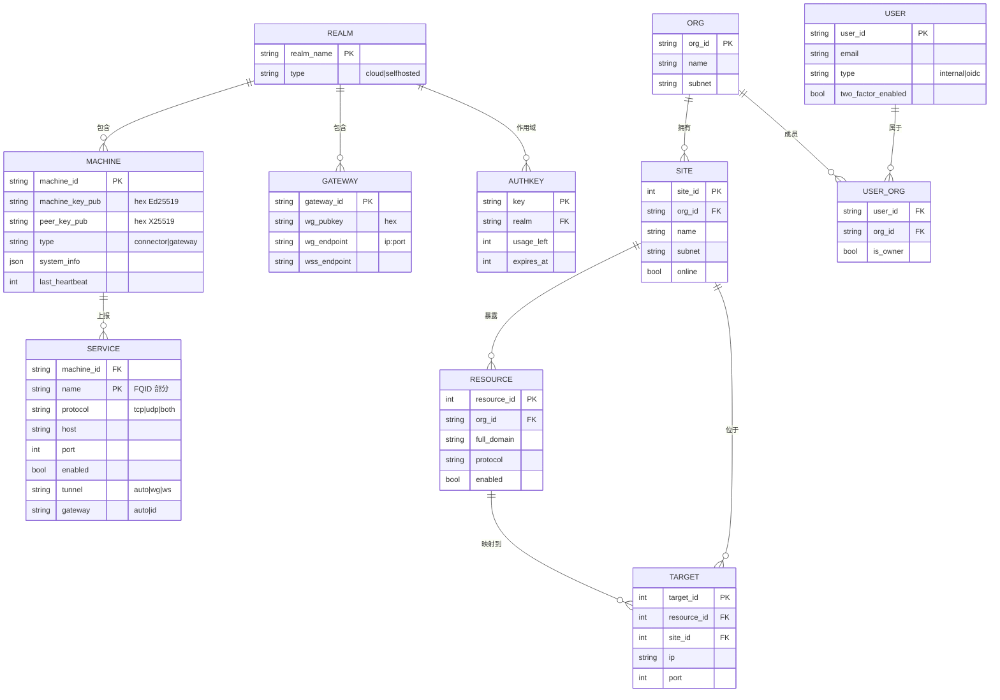

# NSD 数据模型

> mock 实现把状态放在进程内 `Map`（`tests/docker/nsd-mock/src/registry.ts` / `auth.ts`）。生产实现（`tmp/control/server/db/pg/schema/schema.ts`）用 drizzle ORM 管理 70+ 张 PostgreSQL / SQLite 表。本章抽取**数据面真正会"看到"的核心实体**，并标注哪些是 mock 必须的、哪些是生产 NSD 的扩展。

## 1. 核心实体 ER 图



> 这是 mock 与生产共有的最小核心实体子集。完整的生产 ER（含 SESSION / DEVICE_CODE / PORT_MAPPING / SUBNET_RULE 等 20+ 实体）见 [`diagrams/entity-relation.mmd`](./diagrams/entity-relation.mmd)。

## 2. mock 实体（内存结构）

### 2.1 MachineRecord

```typescript
// tests/docker/nsd-mock/src/auth.ts:35
interface MachineRecord {
  machine_id: string;
  machine_key_pub: string;            // hex
  peer_key_pub:    string;            // hex
  type: "connector" | "gateway";
  system_info?: SystemInfo;
  last_heartbeat?: number;            // ms since epoch
}
```

容器：`const machines = new Map<string, MachineRecord>();`

### 2.2 GatewayRecord

```typescript
// tests/docker/nsd-mock/src/registry.ts:41
interface GatewayRecord {
  gateway_id: string;
  wg_pubkey:  string;   // hex
  wg_endpoint: string;  // "ip:port"（DNS 解析后）
  wss_endpoint: string;
}
```

容器：`const gateways = new Map<string, GatewayRecord>();`

### 2.3 NSN 的服务表

```typescript
// tests/docker/nsd-mock/src/registry.ts:51
const nsnServices = new Map<string, Record<string, ServiceInfo>>();
```

键是 `machine_id`，值是该 NSN 的 services map（来自 `ServiceReport.services`）。

### 2.4 VIP 与 virtual port 分配器

```typescript
// tests/docker/nsd-mock/src/registry.ts:53-74
let vipCounter = 2;
const nsnVips = new Map<string, string>();                     // machine_id → 10.0.0.X
let virtualPortCounter = 10000;
const serviceVirtualPorts = new Map<string, number>();         // FQID → virtual port
```

这是**数据面寻址的核心**：

- **NSN VIP**：`10.0.0.2` 开始递增，每个 NSN 对应一个在 overlay 网络上的 WG IP。
- **Virtual port**：每个 `(machine_id, service_name)` FQID 对应一个 ≥ 10000 的唯一端口。NSN 在 VIP 上监听这个端口，NSGW 通过 traefik 转发入站流量到 `nsn_wg_ip:virtual_port`。

### 2.5 DeviceRecord（device flow）

```typescript
// tests/docker/nsd-mock/src/auth.ts:46
interface DeviceRecord {
  device_code: string;
  user_code:   string;
  access_token: string | null;
  expires_at:   number;
  approved_at:  number | null;
}
```

容器：`const deviceCodes = new Map<string, DeviceRecord>();`

### 2.6 SSE 订阅者

```typescript
// tests/docker/nsd-mock/src/registry.ts:82
interface Subscriber {
  controller: ReadableStreamDefaultController<Uint8Array>;
  machineId: string;
}
const subscribers = new Map<string, Subscriber>();
```

## 3. 生产实体（PostgreSQL / SQLite）

生产 NSD 的 schema 定义在 `tmp/control/server/db/pg/schema/schema.ts`（1108 行，70+ 张表）。下面只列和数据面强相关的核心表：

### 3.1 身份与组织

| 表 | 行 | 作用 |
|----|---|-----|
| `orgs` | `schema.ts:42` | 多租户组织。每个 org 有独立的 `subnet` / SSH CA。 |
| `userOrgs` | `schema.ts:336` | 用户 ↔ 组织的 M:N 关联，含 `isOwner` / `autoProvisioned`。 |
| `users` | `schema.ts:277` | 用户账号：`type = internal/oidc`、2FA、IdP 绑定。 |
| `sessions` | `schema.ts:318` | 浏览器会话（非 machine session）。 |
| `idp` / `idpOidcConfig` / `idpOrg` | `schema.ts:636 / 646 / 702` | OIDC 身份提供者及其绑定到 org。 |

### 3.2 机器与站点

| 表 | 行 | 作用 | 对应 mock |
|----|---|-----|----------|
| `sites` | `schema.ts:78` | 一台 NSN 对应的"站点"元数据：`subnet`、`exitNodeId`、`pubKey`、`endpoint`、`online`、`lastPing`、`listenPort`。 | `MachineRecord`（但更丰富） |
| `newts` | `schema.ts:300` | `newt`（NSN 旧命名）登录凭证：`secretHash`、`version`、`siteId`。 | — |
| `newtSessions` | `schema.ts:328` | NSN 的 session。 | — |
| `olms` | `schema.ts:780` | NSC 客户端（旧名 `olm`）。 | — |
| `olmSessions` | `schema.ts:908` | NSC session。 | — |
| `exitNodes` | `schema.ts:207` | NSGW 网关节点。 | `GatewayRecord` |

### 3.3 资源与路由

| 表 | 行 | 作用 | 对应 mock |
|----|---|-----|----------|
| `resources` | `schema.ts:107` | 暴露的 URL 资源：`fullDomain`、`protocol`、`ssl`、`blockAccess`、`applyRules`。 | `RouteEntry` |
| `targets` | `schema.ts:159` | 资源的后端目标：`ip`、`port`、`method`、`path`、`priority`。 | `ServiceInfo.{host,port}` |
| `targetHealthCheck` | `schema.ts:183` | Target 级别健康检查。 | — |
| `siteResources` | `schema.ts:222` | Site ↔ Resource 关联（RBAC 的一条边）。 | — |
| `domains` / `dnsRecords` / `orgDomains` | `schema.ts:17 / 31 / 69` | 域名管理与 DNS 验证。 | `DnsConfig.records` |

### 3.4 权限与规则

| 表 | 行 | 作用 |
|----|---|-----|
| `roles` / `roleActions` / `actions` | `schema.ts:376 / 409 / 370` | 基于动作的 RBAC。 |
| `roleSites` / `userSites` / `roleResources` / `userResources` / `roleClients` / `userClients` | 多个 | 角色和用户对各类对象的访问授权表（N:M）。 |
| `resourceRules` | `schema.ts:615` | 资源级规则（IP 白名单 / 国家封锁 / ASN）。 |
| `resourcePincode` / `resourcePassword` / `resourceHeaderAuth` | `schema.ts:492 / 501 / 509` | 单资源附加认证。 |

这些生产表最终聚合成 NSN 收到的 `AclConfig`——mock 没有实现 ACL 下发，所以该路径在 mock 中是**占位**。

### 3.5 凭证与 API key

| 表 | 行 | 作用 |
|----|---|-----|
| `apiKeys` / `apiKeyActions` / `apiKeyOrg` | `schema.ts:673 / 682 / 691` | 第三方 API 集成的 key。 |
| `resourceAccessToken` | `schema.ts:534` | 资源级短期 token。 |
| `setupTokens` | `schema.ts:960` | 首次 admin 创建的 one-time setup token。 |
| `deviceWebAuthCodes` | `schema.ts:1019` | device flow 对应表（生产版 `deviceCodes`）。 |
| `supporterKey` | `schema.ts:627` | 社区赞助者 license。 |
| `licenseKey` | `schema.ts:662` | 商业 license。 |

### 3.6 审计与运维

| 表 | 行 | 作用 |
|----|---|-----|
| `requestAuditLog` | `schema.ts:983` | 全量请求审计。 |
| `hostMeta` | `schema.ts:668` | 运行时元数据快照。 |
| `versionMigrations` | `schema.ts:610` | schema 迁移状态。 |
| `currentFingerprint` / `fingerprintSnapshots` | `schema.ts:798 / 851` | 客户端指纹（设备姿态 posture）。 |

## 4. 数据面真正依赖的最小集合

如果仅从数据面角度看，NSD 必须存储的是：

1. **MachineRecord**（`machine_id`, `machine_key_pub`, `peer_key_pub`, `type`, `realm`）——用于 `machine/auth` 验签和 SSE 身份路由。
2. **GatewayRecord**（`gateway_id`, `wg_pubkey`, `wg_endpoint`, `wss_endpoint`）——用于 `wg_config` / `gateway_config` 事件的 peer 列表。
3. **ServiceSnapshot**（最近一次 `services_report` 按 `machine_id` 存起）——用于组装 `proxy_config` / `routing_config` / `dns_config`。
4. **AuthKey 表 + SessionToken 表**——注册与 JWT 续签。
5. **AclPolicy 规则**（可选，但没有它的话 ACL 强度为零）。

其他 70+ 张表解决的是 Web UI、多租户、计费、审计——不影响数据面协议契约。

## 5. FQID / Domain 命名约定

- NSN 从 NSD 收到 `domain_base = "{machine_id}.n.ns"`（`registry.ts:161`）。
- 每个服务的 FQID（Fully Qualified ID）= `{service_name}.{machine_id}.n.ns`（`registry.ts:76`）。
- FQID 同时作为 `SubnetRule.resource_id`（merge 去重键，`crates/control/src/merge.rs:63`）、`DnsRecord.domain`、`RouteEntry.domain`。

这让同一个字符串在 NSD 的策略、NSGW 的 traefik 规则、NSC 的 DNS 记录里保持完全一致，是 NSIO 命名空间设计的核心。

## 6. mock → 生产映射速查

| mock 内存结构 | 生产表 | 语义增量 |
|--------------|-------|---------|
| `machines[machine_id]` | `sites` + `newts`（NSN）/ `exitNodes`（NSGW）/ `olms`（NSC）| 按角色拆分 + 绑定 `orgId` + 带 session |
| `gateways[gateway_id]` | `exitNodes` | 加上地理区域、容量、状态 |
| `nsnServices[machine_id]` | `resources` + `targets` + `siteResources` | 策略的来源来自 UI，不是 NSN 上报 |
| `subscribers` | 内存 Map（同样不持久化） | 生产通常配合 Redis pub/sub 做多实例分布 |
| `deviceCodes` | `deviceWebAuthCodes` | 持久化 + 绑定 userId |

NSD 是否需要关系数据库的决定因素：你是否要支持 Web UI + 多用户 + 多组织 + 审计。对最小数据面场景，一个 KV 存储加一份热备就足以运行 NSIO。
