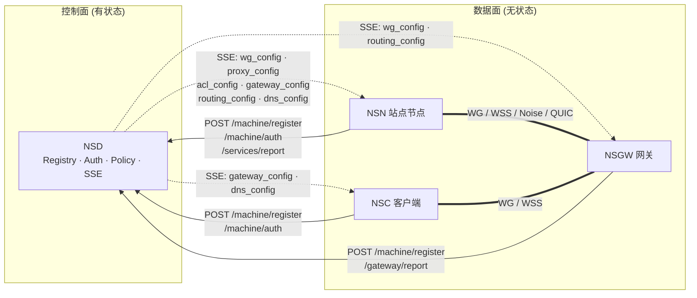

# 08 · NSD 控制中心

> 适用读者：NSIO 架构师 / NSD 运维负责人 / 需要二次开发控制面的工程师。
>
> 目标：从"独立系统"的视角理解 NSD（Network Service Director）——它是 NSIO 生态里**唯一有状态的强一致组件**，负责设备注册、认证、策略合并与配置分发，但不承载任何业务流量。读完这一章你应当能回答：NSD 对外暴露了哪些契约、这些契约如何被 NSN/NSC/NSGW 消费、如何部署多 realm 与多实例、以及 mock 与生产实现之间的差距在哪里。

## 为什么需要 NSD

NSIO 的数据面（NSN / NSGW / NSC）被刻意做成**无状态的对称节点**：它们只知道"此时此刻我应该与谁建立 WireGuard peer、流量应走哪条规则、哪些 ACL 生效"。这些"此时此刻"的知识完全由 NSD 下发。把所有策略和身份集中在 NSD 的收益：

1. **凭证一次性化**：authkey / device-flow token 只在注册期间出现，之后全部换成 NSD 签发的 JWT。
2. **策略强一致**：同一 realm 下所有节点看到相同的 `chain_id`，NSN 侧合并规则按 `resource_id` 去重（`crates/control/src/merge.rs:56`）。
3. **拓扑透明升级**：新增 NSGW 只需其 `POST /api/v1/gateway/report`，NSD 立刻通过 SSE 把新 peer 推给全体 NSN，无需重启数据面。
4. **控制 / 数据解耦**：NSD 宕机期间已建立的隧道继续工作；NSD 恢复后通过幂等注册与 SSE 重连无感续流。

## NSD 在 NSIO 中的位置

图中实线是 HTTP POST（一次性请求），虚线是长连 SSE（NSD → Client 的单向推送），粗线是数据面隧道（不经过 NSD）。

## 三种角色下的 NSD

| 角色 | NSD 的作用 | 关键交互 |
|------|-----------|---------|
| NSN（站点节点） | 身份签发者 + 服务白名单审核者 + peer 列表下发者 | `register` → `auth` → `services/report` → SSE 接收 `wg_config/proxy_config/acl_config/gateway_config/dns_config` |
| NSGW（网关） | 身份签发者 + NSN peer 清单下发者 + HTTP 路由表下发者 | `register`（type=gateway）→ `gateway/report` → SSE 接收 `wg_config`（NSN 全量）+ `routing_config` |
| NSC（客户端） | 身份签发者 + 可用网关列表下发者 + DNS 记录下发者 | `register`（device-flow）→ `auth` → SSE 接收 `gateway_config/dns_config` |

这三条路径共用同一套 HTTP + SSE API，NSD 根据注册时的 `type` 字段（`connector` 或 `gateway`）和 SSE 订阅时的 `machine_id` 决定推送哪些事件——这是 NSD 可以"一套代码服务三种对端"的关键。

## 本章阅读顺序

如果你要理解 NSD 的全貌，按顺序读：

1. **[responsibilities.md](./responsibilities.md)** —— NSD 的五大核心职责：设备注册表、策略引擎、配置分发、认证、Web UI。
2. **[api-contract.md](./api-contract.md)** —— REST + SSE 接口清单（Method / Path / Request / Response / Auth / 触发时机）。
3. **[sse-events.md](./sse-events.md)** —— 所有 SSE 事件类型与字段表，以及消费者是谁。
4. **[auth-system.md](./auth-system.md)** —— machinekey / peerkey / authkey 三要素，device flow（RFC 8628），签名认证，JWT。
5. **[data-model.md](./data-model.md)** —— 核心实体：Machine / User / Realm / Site / Resource / Target / Gateway。
6. **[multi-realm.md](./multi-realm.md)** —— cloud shared realm vs self-hosted realm，多 NSD 并发，policy merge 语义。
7. **[deployment.md](./deployment.md)** —— mock vs 生产的差距，依赖（DB / 传输），可观测性，扩缩容。

### 跨章节链接

- [../01-overview/index.md](../01-overview/index.md) — NSD 在四组件 NSIO 生态中的定位。
- [../02-control-plane/index.md](../02-control-plane/index.md) — NSN 侧的控制面实现（`crates/control/`），本章的"对端"视角。
- [../09-nsgw-gateway/index.md](../09-nsgw-gateway/index.md) — NSGW 消费的 NSD 事件如何转化为 traefik 路由。

## 权威资料来源

NSD 的源码并不在 `/app/ai/nsio/` 主工程中。本章所有契约来自以下三个位置：

| 源 | 路径 | 用途 |
|----|------|------|
| **NSD mock 实现** | `tests/docker/nsd-mock/src/` | 权威 API 契约，E2E 测试使用 |
| **NSN 侧对端** | `crates/control/src/` | 证明契约被真实消费 |
| **生产 NSD 参考** | `tmp/control/` | 功能维度（RBAC / IdP / 审计日志 / Web UI） |

引用格式：mock 用 `tests/docker/nsd-mock/src/auth.ts:42`；NSN 对端用 `crates/control/src/sse.rs:50`；生产参考用 `tmp/control/server/routers/site/createSite.ts`。
