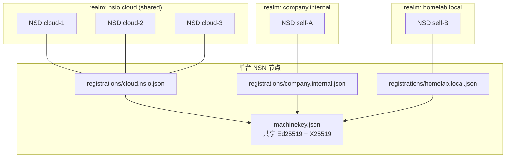
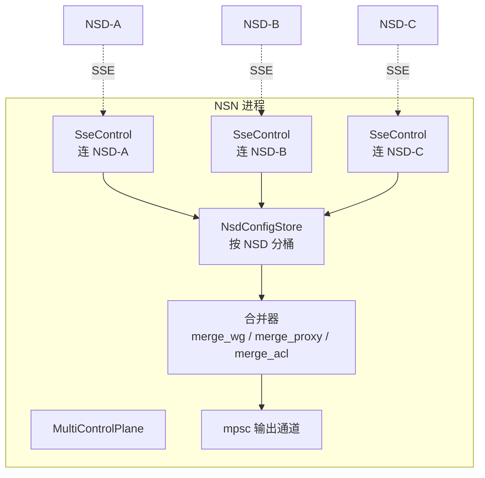
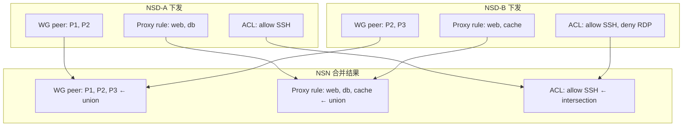

# 多 Realm 与多 NSD 并发

> NSIO 的控制面被刻意设计成"单节点可接入多个独立的 NSD"：一台 NSN 可以同时注册到云端的 cloud realm 和企业自托管的 self-hosted realm，双方的 ACL、WG peer、路由在 NSN 内部**智能合并**——union 扩大连通性、intersection 收紧安全边界。本章讲清楚三件事：realm 的定义、多 NSD 的合并语义、部署模式。

## 1. Realm 是什么

**Realm** 是认证与状态的隔离域。它由 NSD 在 `GET /api/v1/info` 里自报：

```jsonc
// tests/docker/nsd-mock/src/auth.ts:323
{ "type": "selfhosted", "realm": "company.internal", ... }
{ "type": "cloud",      "realm": "nsio.cloud",       ... }
```

Realm 的边界决定了：

- **认证隔离**：一个 realm 的 authkey / device_flow token 只能用于该 realm。
- **注册状态**：同一台机器的 `machine_id` 在不同 realm 之间可以不同。
- **策略独立**：realm A 的 ACL 不泄漏到 realm B。



机器的 **machinekey 全局唯一**，但**每个 realm 一份注册状态**。这让"一台机器 = 一个身份 × N 个 realm"成为可能——详见 `docs/task/AUTH-002.md` 与 [../02-control-plane/design.md](../02-control-plane/design.md) §多 Realm。

## 2. Cloud Shared Realm vs Self-Hosted Realm

两种 NSD 部署类型在 realm 管理上差异显著：

| 维度 | Cloud (nsio.cloud) | Self-Hosted |
|------|-------------------|-------------|
| Realm 名称 | 固定 `nsio.cloud` | 运营者自定义，如 `company.internal` |
| Realm 成员 NSD 数量 | 多个（负载均衡 / 多区域） | 通常单个，多实例时共享 DB |
| 注册行为 | **一次注册对所有 cloud NSD 实例生效** | 每个实例独立注册 |
| Auth 方式 | OAuth2 / SSO / 组织账户 | authkey / device flow / 自定义 IdP |
| JWT 签发者 | 共享 JWKs | 每个 realm 独立 JWKs |
| 控制平面发现 | DNS SRV / 固定 URL 池 | 运营者配置 URL 列表 |

"一次注册对所有 cloud NSD 生效"的实现要点：

1. cloud NSD 集群必须共享后端数据库，使得所有实例看到同一 `machines` 表。
2. `machine_id` 命名空间在 realm 内唯一，NSN 用同一 `machine_id` 在不同 cloud NSD 实例上走 `machine/auth` 都应成功。
3. JWT 由 realm 共享的签名密钥签发，任意 cloud NSD 实例都能验证。

self-hosted 放弃这些假设，换取完全的本地自治：运营者只需运行一台 NSD + 一份数据库，不需要分布式账户系统。

## 3. 多 NSD 并发下的 NSN 逻辑

NSN 通过 `MultiControlPlane`（`crates/control/src/multi.rs:51`）同时连接多个 NSD。每个 NSD 连接独立：



收到事件后的行为：

1. `SseControl::next_message()` 返回一条 `ControlMessage`。
2. `MultiControlPlane` 根据来源 NSD id 更新 `NsdConfigStore`（每 NSD 一份最新配置）。
3. 触发 re-merge，产出合并后的 `WgConfig` / `ProxyConfig` / `AclConfig`，经 mpsc 发给 NSN 的下游（数据面）。

## 4. 合并语义（权威定义）

合并语义定义在 `crates/control/src/merge.rs`——这是多 NSD 场景下"谁的策略最终生效"的答案。

### 4.1 WgConfig：peer union

```rust
// merge.rs:27-45
pub fn merge_wg_configs(configs: &[WgConfig]) -> Option<WgConfig> {
    // ip_address / listen_port 取第一个
    // peers 按 public_key 去重 union
}
```

**语义**：任一 NSD 推过来的 NSGW peer 都被接受。如果两个 NSD 推同一个 peer（同一 `public_key`），只保留一条——避免 WireGuard 的重复 peer 错误。

**影响**：连通性放大。只要有一个 NSD 告诉 NSN "这个 NSGW 可用"，NSN 就会尝试连它。

### 4.2 ProxyConfig：rule union（按 resource_id 去重）

```rust
// merge.rs:56-73
pub fn merge_proxy_configs(configs: &[ProxyConfig]) -> Option<ProxyConfig> {
    // chain_id 取第一个
    // rules 按 resource_id 去重，首个出现的胜
}
```

**语义**：DNAT 规则 union。同一个 `resource_id`（= FQID）只保留第一条——避免"两个 NSD 为同一服务下发了不同的 rewrite 目标"。

**影响**：命名空间扩大。任一 NSD 新增一个服务 rule，NSN 就有能力代理它；两个 NSD 声明同一 FQID 时取"先到先得"，所以**多 NSD 环境下命名要避免冲突**。

### 4.3 AclConfig：policy intersection

```rust
// merge.rs:75-82（继续）
/// Keeps only host aliases, ACL rules, and policy tests that appear
/// identically in every NSD config. When NSDs disagree, the merged policy
/// denies rather than widening access.
```

**语义**：ACL 规则交集。一条规则必须在**所有** NSD 的 `AclConfig` 中以**完全相同**的形态出现，才会保留。

**影响**：授权收紧。任何一个 NSD "不同意"某条规则，该规则就被丢弃——默认拒绝，防止 NSD 之间的策略漂移扩大攻击面。

### 4.4 合并语义对比



## 5. 设计权衡：为什么用这三种语义

| 对象 | 合并方向 | 原因 |
|------|---------|------|
| WG peer | union | 连通失败的代价可以恢复（换一条路），拒绝连接的代价是真正的中断 |
| Proxy rule | union（带去重） | 新增服务是常态，两个 NSD 都承认同一个 FQID 意味着资源是合法公共的 |
| ACL policy | intersection | 策略分歧意味着未对齐的授权，默认拒绝比默认允许安全 |

单向的选择让"多 NSD 并发"不是灾难——而是一种**容错机制**：一个 NSD 挂了，它的规则会从合并结果中消失（下次 re-merge），但只要另一个 NSD 还在运行，数据面继续工作。

## 6. 多 NSD 的部署模式

### 6.1 Cloud + Self-Hosted 双 NSD（典型开发者场景）

```
NSN 配置:
  control_centers:
    - url: "https://nsd.nsio.cloud"    # cloud realm
      auth: { method: "oauth2" }
    - url: "https://nsd.company.internal"  # self-hosted realm
      auth: { method: "auth_key", key: "ak_..." }
```

- Cloud 负责跨公司 / 跨个人的协作资源。
- Self-hosted 负责公司内部私有服务（严格 ACL）。
- ACL intersection 确保 cloud 不能"放宽"self-hosted 的规则。

### 6.2 主备 NSD（HA）

两台 NSD 共享数据库。NSN 同时连两台，任一宕机不影响控制面。

- 两 NSD 的事件应当一致 → merge 结果不抖动。
- 不一致时（数据库复制延迟）短暂出现"ACL 规则临时丢失"——故意的保守行为。

### 6.3 分片 NSD（超大规模）

按 realm 分片（`us-east` / `eu-west`），NSN 按地理位置接入对应 realm。不同 realm 本质上是不同的 tenant，互不影响。

## 7. Realm 错误场景

| 场景 | 症状 | 根因 |
|------|-----|------|
| authkey 跨 realm 使用 | `POST /machine/register` 401 | authkey 绑定在 realm，不可通用 |
| cloud NSD 实例拒绝 auth | `POST /machine/auth` 401 | 该实例还没同步到 machines 表（复制延迟） |
| self-hosted realm 的 `machine_id` 在 cloud 上访问 | 404/401 | machine_id 命名空间不通 |
| 两 NSD 推送冲突的 FQID rewrite | 生效规则不可预期 | 第一个到达的版本胜——应通过 realm 隔离避免冲突 |
| JWT refresh 在 realm B 签发但用于 realm A | `401 invalid token` | JWT `iss` / `realm` 校验失败 |

## 8. 多 realm 的最小治理规则

- **FQID 命名空间按 realm 隔离**。cloud realm 的 `web.abc.n.ns` 不应与 self-hosted realm 的同名 FQID 互相覆盖；可以在 domain_base 里加 realm 前缀（如 `abc.company.n.ns` vs `abc.cloud.n.ns`）。
- **JWT 明示 realm claim**。NSD 必须写 `realm` claim，并拒绝 `iss` 与自身 realm 不符的 token。
- **state 文件权限 0600**。`machinekey.json` + `registrations/*.json` 不能对 other 可读。
- **authkey 一次性**。生产 NSD 在首次成功 register 后立即把 authkey 标记为已用或减少 usage 次数。
