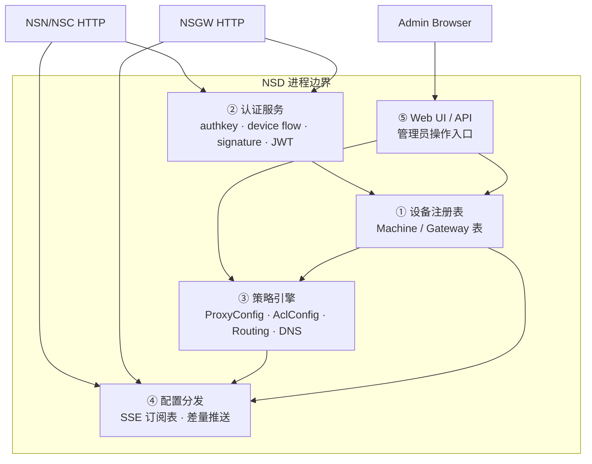
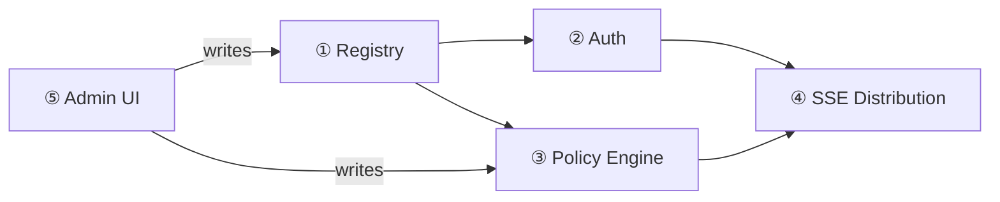

# NSD 的五大核心职责

NSD（Network Service Director）是 NSIO 生态里唯一需要持久化状态的组件。它可以拆分成五条相对独立的职责线——mock 实现把它们全部塞进一个 Bun 进程；生产实现（`tmp/control/`）通过 drizzle ORM + Next.js 把它们分解到若干路由器（router）与服务层中。



## ① 设备注册表（Registry）

NSD 维护两类核心设备记录：

- **Machine** —— 由 `POST /api/v1/machine/register` 创建，字段见 `tests/docker/nsd-mock/src/auth.ts:35`。关键列：`machine_id`、`machine_key_pub`（Ed25519）、`peer_key_pub`（X25519/WG）、`type`（`connector` / `gateway`）、`system_info`、`last_heartbeat`。
- **Gateway** —— 由 `POST /api/v1/gateway/report` 创建，字段见 `tests/docker/nsd-mock/src/registry.ts:41`。关键列：`gateway_id`、`wg_pubkey`、`wg_endpoint`（DNS 解析后的 `ip:port`）、`wss_endpoint`。

注册是**幂等**的：客户端可以在请求里预先指派 `machine_id`，NSD 必须采纳并更新既有记录（`tests/docker/nsd-mock/src/auth.ts:138-149`）。这一点是多 NSD 场景下 `MachineState::from_credentials()` 幂等派生模式的基础（`crates/common/src/state.rs:215`）。

**mock 简化**：registry 只是进程内 `Map<string, MachineRecord>`，重启即丢失。**生产实现**用 drizzle ORM 将记录持久化到 PostgreSQL / SQLite，见 `tmp/control/server/db/pg/schema/schema.ts:277` 的 `users` 表、`:300` 的 `newts` 表、`:780` 的 `olms` 表——生产态把"设备"进一步拆成多个子实体以支持 RBAC（见 [data-model.md](./data-model.md)）。

## ② 认证服务（Auth）

NSD 支持三条首次注册路径 + 一条续签路径，全部通过 HTTP POST：

| 路径 | 端点 | 凭证 |
|------|------|------|
| **authkey（首次）** | `POST /api/v1/machine/register` body.auth_key | 一次性预共享密钥 |
| **device-flow（首次）** | `POST /api/v1/device/code` → 轮询 `POST /api/v1/device/token` → 用 Bearer token 调 `register` | OAuth2 access_token（RFC 8628） |
| **signature（每次启动）** | `POST /api/v1/machine/auth` | Ed25519 签名 `"{machine_id}:{unix_secs}"` 换 JWT |
| **token_refresh（运行中）** | SSE 推送 `ControlMessage::TokenRefresh` | NSD 主动续签，客户端无需重新签名 |

详见 [auth-system.md](./auth-system.md)。

## ③ 策略引擎（Policy）

NSD 的策略引擎把"人类意图"（管理员在 Web UI 上设定的站点、资源、访问规则）翻译成数据面能直接执行的结构：

- **`ProxyConfig`** —— `chain_id` + 一组 `SubnetRule`，每条规则声明 `source_prefix → dest_prefix` 的 DNAT 和 `port_range`。由 NSN 侧的 Proxy 模块消费（见 `crates/control/src/messages.rs:28-52`）。
- **`AclConfig`** —— `chain_id` + `AclPolicy`，由 NSN 侧 `ipv4-acl` crate 执行。多 NSD 场景下按**并集**合并（`crates/control/src/merge.rs:77`），每条规则带来源 NSD 标注；**最终放行还要与本地 `services.toml` ACL 取交集** —— NSD 只能建议，站点主人在本地保留最终否决权（详见 [multi-realm.md §4.5](./multi-realm.md#45-本地-acl-作为保底)）。
- **`RoutingConfig`** —— 每条 `RouteEntry` 声明 `domain`（如 `web.ab3xk9mnpq.n.ns`）→ `(site, service, port)` 的映射，同时 mock 额外下发 `nsn_wg_ip` 和 `virtual_port` 供 NSGW traefik 使用（`tests/docker/nsd-mock/src/registry.ts:188-205`）。
- **`DnsConfig`** —— 全局 DNS 记录表，NSC 消费后注入本地解析器。
- **`GatewayConfig`** —— 已注册 NSGW 的 `wg_endpoint` + `wss_endpoint` 列表，供 NSN/NSC 选路。

**mock 简化**：策略来源于 NSN 上报的 `services_report` 自动合成——把每个服务自动变成一条规则、一个路由、一条 DNS 记录。**生产**的策略来自管理员显式配置：资源 / 角色 / 用户三表联动产生 ACL（见 `tmp/control/server/db/pg/schema/schema.ts:107` resources、`:376` roles、`:460` userResources）。

## ④ 配置分发（SSE Distribution）

NSD 不主动拨号到数据面节点；它打开 `GET /api/v1/config/stream`（SSE），等订阅者连进来，然后在订阅者生命周期内按需推送事件。核心数据结构（`tests/docker/nsd-mock/src/registry.ts:82`）：

```typescript
interface Subscriber {
  controller: ReadableStreamDefaultController<Uint8Array>;
  machineId: string;
}
const subscribers = new Map<string, Subscriber>();
```

触发推送的三类事件：

1. **订阅刚建立**：NSD 查 registry，如果该 `machine_id` 已上报 services，立即 push 全套配置（`tests/docker/nsd-mock/src/registry.ts:317-347`）。
2. **NSN 上报 services**：`handleServicesReport` 同步 push 对应 NSN 的 `wg_config + proxy_config + services_ack + dns_config`，再全量 broadcast `wg_config + routing_config` 给所有 NSGW（`registry.ts:364-388`）。
3. **NSGW 上报 gateway**：`handleGatewayReport` broadcast `wg_config`（NSN 侧的 peer 列表） + `gateway_config`（NSC 侧的网关列表）（`registry.ts:395-412`）。

事件列表与触发条件表见 [sse-events.md](./sse-events.md)。

## ⑤ Web UI / Admin API

mock 实现里 UI 几乎为空（只有一个 `GET /api/v1/services` 快照端点，`tests/docker/nsd-mock/src/index.ts:77`）。生产 NSD（`tmp/control/`）是一个 **Next.js 15 + Drizzle ORM** 应用，组件包括：

- **actions/** —— React Server Actions，封装业务操作。
- **server/routers/** —— tRPC-like 路由集（`auth/`、`site/`、`resource/`、`target/`、`billing/`、`idp/`、`ws/`、`traefik/` 等共 30+ 路由组）。
- **server/db/pg/schema/schema.ts** —— 70+ 张表覆盖组织、用户、站点、资源、策略、审计日志、证书、IdP、计费、license。
- **server/auth/sessions/** —— session / 2FA / WebAuthn / device web auth。
- **server/routers/traefik/** —— 向 traefik provider 暴露动态配置。

UI 功能与 Machine 注册协议并无直接绑定：UI 修改数据库 → 数据库变更触发 broadcast → SSE 推送到对应 subscriber。

## 五职责的依赖顺序



- Auth 不能在 Registry 之前存在（验证签名需要存储的 `machine_key_pub`）。
- SSE 分发依赖 Registry（决定订阅者身份）和 Policy Engine（决定推什么）。
- Admin UI 是唯一的写路径——所有策略变更最终都要写回 Registry / Policy 存储。

这个拓扑决定了 NSD 的数据库只读副本（read replica）扩展有意义，而纯粹 stateless 的横向扩展需要共享存储（见 [deployment.md](./deployment.md)）。
