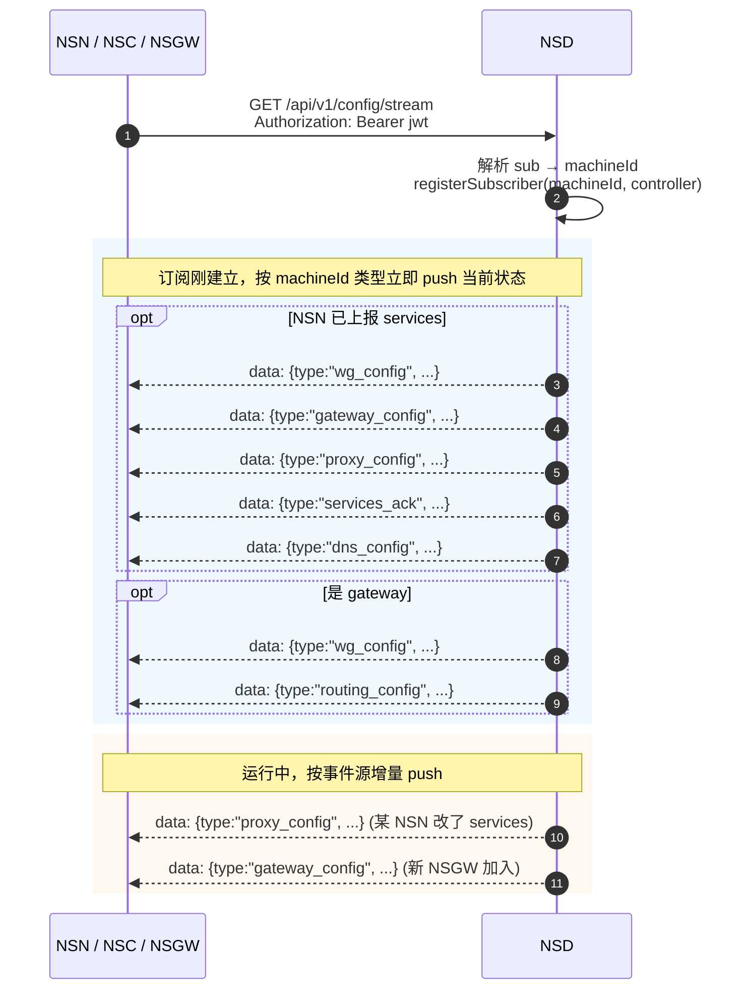
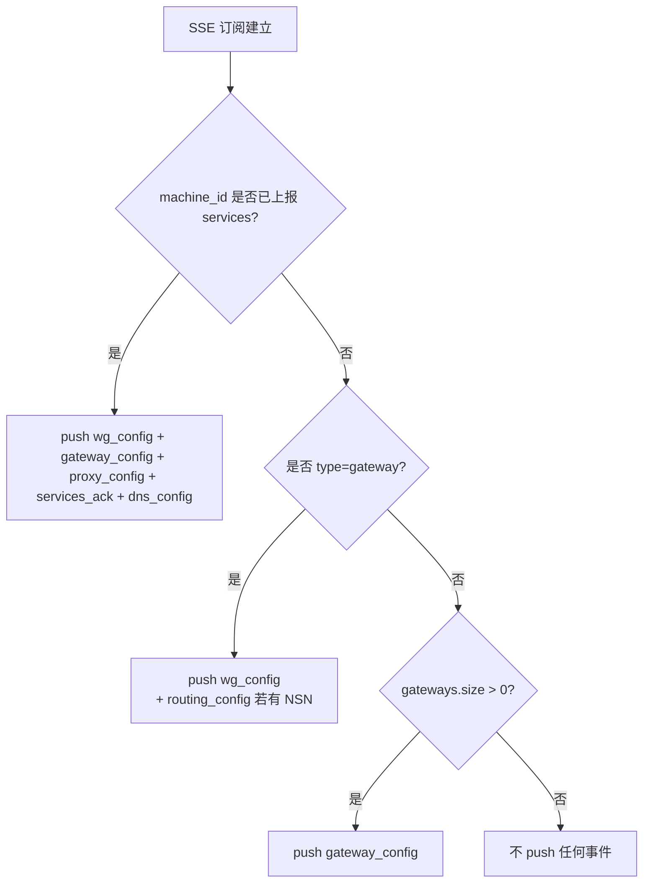

# NSD SSE 事件字典

> NSD 通过 `GET /api/v1/config/stream` 暴露一条单向事件流。所有事件都是 `{ "type": "…", …字段 }` 形式的 JSON，封装在 SSE 帧 `data: <json>\n\n` 里（`tests/docker/nsd-mock/src/registry.ts:92`）。本章给出完整事件表、payload 结构、触发条件、消费者。

## 1. 事件流的结构



消费者解码：`crates/control/src/messages.rs:207-228` 定义 `ControlMessage` 枚举，使用 `#[serde(tag = "type", rename_all = "snake_case")]`，所以 JSON 里的 `type` 字段对应枚举变体名的 snake_case 形式。

## 2. 事件清单

| 事件 `type` | 方向 | payload 结构 | 触发条件 | 消费者 | 源 |
|------------|------|-------------|---------|-------|---|
| `wg_config` | NSD → 订阅者 | `WgConfig`（`ip_address`, `listen_port`, `peers[]`） | NSN 上报 services / NSGW 上报 gateway / NSN 订阅建立时 | NSN、NSGW | `crates/control/src/messages.rs:12` · `registry.ts:106` |
| `proxy_config` | NSD → NSN | `ProxyConfig`（`chain_id`, `rules[]`, `port_mappings[]`） | NSN 上报 services 后立即 push | NSN（`Proxy` / `ServiceRouter`） | `messages.rs:28` · `registry.ts:139` |
| `acl_config` | NSD → NSN | `AclConfig`（`chain_id`, `policy`, `groups`） | 管理员变更 ACL 时（生产） | NSN（`ipv4-acl`，终决者） | `messages.rs:56` |
| `acl_projection` | NSD → NSGW | `AclProjection`（`chain_id`, `groups`, `acls[]`，仅 Subject::User/Group/Nsgw 维度） | 同 `acl_config` 触发后同步 push 给 NSGW | NSGW（`/client` ingress 预过滤，见 [../09-nsgw-gateway/responsibilities.md §⑤](../09-nsgw-gateway/responsibilities.md#-client-ingress-的-acl-预过滤两级信任的前一级)） | 生产契约（mock 未实现） |
| `services_ack` | NSD → NSN | `ServicesAck`（`matched[]`, `unmatched[]`, `rejected[]`） | 每次 `services_report` 之后 | NSN（报日志 / 告警） | `messages.rs:126` · `registry.ts:164` |
| `gateway_config` | NSD → NSN/NSC | `GatewayConfig`（`gateways[]`） | 新 NSGW `gateway_report` / 订阅建立时 | NSN、NSC（选路/失败回退） | `messages.rs:200` · `registry.ts:170` |
| `routing_config` | NSD → NSGW | `RoutingConfig`（`routes[]`） | NSN 上报 services / 订阅建立时 | NSGW（traefik provider） | `messages.rs:157` · `registry.ts:187` |
| `dns_config` | NSD → NSN/NSC | `DnsConfig`（`records[]`） | NSN 上报 services 后 | NSC（本地 DNS 注入）、NSN（调试） | `messages.rs:178` · `registry.ts:207` |
| `token_refresh` | NSD → 任意 | `{ token: "jwt" }` | JWT 快过期时 NSD 主动下发 | 全体（SseControl 更新 header） | `messages.rs:213` · `sse.rs:95` |
| `ping` | NSD → 任意 | `{}` | 空闲心跳（mock 未实现） | 全体（更新 last_seen） | `messages.rs:216` |
| `pong` | NSD → 任意 | `{}` | 回应客户端 ping（mock 未实现） | 全体 | `messages.rs:217` |

> mock 目前没有主动触发 `ping` / `pong` / `token_refresh` / `acl_projection` 的代码路径，但 NSN 侧的解码器支持前三个（`crates/control/src/messages.rs:216-218`），`acl_projection` 是生产新增事件，只对 machine_type=gateway 的订阅者 push，NSN/NSC 不应收到。

## 3. 核心事件详解

### 3.1 `wg_config`

对 NSN：`peers[]` 是该 NSN 应连接的 NSGW peer 清单，`ip_address` 是 NSN 在 overlay 网络内的虚拟 IP（`10.0.0.X`）。

对 NSGW：`peers[]` 是该 NSGW 应接受的 NSN peer 清单，每个 peer 的 `allowed_ips` 是 NSN 的 `/32` 虚拟 IP。

```jsonc
// tests/docker/nsd-mock/src/types.ts:14
{
  "type": "wg_config",
  "ip_address": "10.0.0.2",
  "listen_port": 0,
  "peers": [
    {
      "public_key": [ /* 32 bytes as number[] */ ],
      "endpoint":   "172.18.0.5:51820",
      "allowed_ips": ["0.0.0.0/0"],
      "persistent_keepalive": 25
    }
  ]
}
```

**兼容性要点**：`endpoint` 是 `SocketAddr` 字符串（Rust 侧 `crates/control/src/messages.rs:24`），所以 mock 在 `handleGatewayReport` 里显式 DNS 解析 hostname 到 IP（`registry.ts:229-246`）。

### 3.2 `proxy_config`

```jsonc
{
  "type": "proxy_config",
  "chain_id": "test-chain-001",
  "rules": [
    {
      "resource_id": "web.ab3xk9mnpq.n.ns",
      "source_prefix": "0.0.0.0/0",
      "dest_prefix":   "0.0.0.0/0",
      "rewrite_to":    { "type": "domain", "value": "127.0.0.1" },
      "port_range":    [80, 80],
      "protocol":      "tcp"
    }
  ],
  "port_mappings": [
    { "listen_port": 10000, "target_host": "127.0.0.1", "target_port": 80, "protocol": "tcp" }
  ]
}
```

`port_mappings` 是 NSN 的 `ServiceRouter` 虚拟端口表：NSN 在自己的 WG VIP 上监听 `listen_port`，把连接代理到 `target_host:target_port`。**这个字段只在 mock 的 registry 里出现，生产契约可能会迭代**（`tests/docker/nsd-mock/src/types.ts:49-51`）。

### 3.3 `services_ack`

```jsonc
{
  "type": "services_ack",
  "matched":   ["web", "ssh"],
  "unmatched": ["dns"],
  "rejected":  []
}
```

- `matched`: 有至少一条 proxy_rule 命中的服务名。
- `unmatched`: 上报了但 NSD 没给出对应 rule（通常是 `enabled: false`）。
- `rejected`: NSD 有 rule 但客户端没上报对应服务——意味着策略悬空。

NSN 在 `strict_mode=true` 下遇到非空 `rejected` 会告警（见 `crates/common/src/services.rs`）。

### 3.4 `routing_config`

```jsonc
{
  "type": "routing_config",
  "routes": [
    {
      "domain":  "web.ab3xk9mnpq.n.ns",
      "site":    "ab3xk9mnpq",
      "service": "web",
      "port":    80,
      "nsn_wg_ip":    "10.0.0.2",  // mock only; 见下
      "virtual_port": 10000         // mock only
    }
  ]
}
```

`nsn_wg_ip` / `virtual_port` 字段是 mock 的扩展（`tests/docker/nsd-mock/src/types.ts:110-118`），NSN 侧的 Rust `RouteEntry` 不包含它们（`crates/control/src/messages.rs:142-151`）——这些字段只被 NSGW 的 traefik 配置 provider 消费。生产 NSD 可以用同样的结构，或改用独立的 `traefik_config` 事件。

### 3.5 `dns_config`

```jsonc
{
  "type": "dns_config",
  "records": [
    { "domain": "web.ab3xk9mnpq.n.ns", "site": "ab3xk9mnpq", "service": "web", "port": 80 }
  ]
}
```

NSC 的本地 DNS 服务器读取这份 records 表生成 A 记录（虚拟 IP，如 `127.11.x.x`）——**NSD 不关心本地解析 IP**，NSC 自行分配。

### 3.6 `gateway_config`

```jsonc
{
  "type": "gateway_config",
  "gateways": [
    { "id": "nsgw-1", "wg_endpoint": "172.18.0.5:51820", "wss_endpoint": "wss://nsgw-1:9443" }
  ]
}
```

消费者：
- NSN 把 `gateways[]` 作为 peer 候选池，结合 `gateway_config` + `TunnelPreference` 选路。
- NSC 用它在首要 WSS 失败时换到备选网关。

### 3.7 `token_refresh`

```jsonc
{ "type": "token_refresh", "token": "eyJhbGciOi..." }
```

消费者通过 `SseControl::set_token(token)`（`crates/control/src/sse.rs:95`）更新内部 JWT，之后所有新的 HTTP 请求（含再次 connect SSE 时的 header）都会用新 token。

## 4. 订阅时的初始推送

不同 machine 类型得到的初始事件集合不同。以下规则来自 `tests/docker/nsd-mock/src/registry.ts:317-347`：



这让"先订阅后上报"和"先上报后订阅"两种启动顺序都能得到一致的最终状态。

## 5. 事件广播语义表

| 触发动作 | NSN 订阅者 | NSGW 订阅者 | NSC 订阅者 |
|---------|-----------|------------|-----------|
| 某 NSN 上报 `services_report` | 仅该 NSN：`wg_config + gateway_config + proxy_config + services_ack + dns_config` | 全体：`wg_config + routing_config` | 全体：`dns_config` |
| 某 NSGW 上报 `gateway_report` | 已有 services 的 NSN：`wg_config` | — | 全体：`gateway_config` |
| 订阅建立（已有 services） | 该 NSN：完整 5 事件 | — | — |
| 订阅建立（是 gateway） | — | 该 gateway：`wg_config + routing_config` | — |
| 订阅建立（仅 NSC） | — | — | 该订阅者：`gateway_config`（若有） |

> 生产实现应额外支持：管理员在 UI 修改资源 / ACL → 只 push 受影响的订阅者，不必全量广播。mock 没有"受影响集"计算，每次都 broadcast 到所有 NSGW / NSC。

## 6. 限流与可靠性

NSN 侧（`crates/control/src/sse.rs:9-47`）为 SSE 入站事件设置了：

- **Token bucket**: `max_events_per_sec` 默认 10；超出速率的事件被直接丢弃（WARN 日志），不会断连。
- **最大 payload**: `max_message_size`；超过限制的事件丢弃，不断连。
- **重连**: 流 `chunk()` 返回 `None` / `Err` 时，`SseControl::response = None`，上层 reactor 自行重建连接。

NSD 侧需要：

- 在订阅者不消费时对 `controller.enqueue` 的堆积做限制——mock 用 `tryEnqueue` catch 异常但不做显式背压（`registry.ts:250-256`）。
- 在流关闭时清理 `subscribers.delete(subId)`（`registry.ts:350-357`）。

## 7. 实现 NSD 时的最小事件集

如果你要替换 mock 自己实现一个 NSD，最小必须实现的事件：

| 必须 | 可选 |
|------|------|
| `wg_config`、`proxy_config`、`gateway_config`、`dns_config`、`routing_config`、`services_ack` | `acl_config`、`acl_projection`、`token_refresh`、`ping`、`pong` |

可选事件的缺失不会让数据面立即不可用，但会显著削弱运行时安全性（无 ACL / 无 NSGW 预过滤）和 JWT 的有效运维（无 token_refresh → 必须定期重连重鉴权）。注意 `acl_config` 和 `acl_projection` 语义绑定：生产实现应在同一事务里推给 NSN 和 NSGW，避免两侧版本漂移造成的短暂不一致（见 [../05-proxy-acl/acl.md §4.6](../05-proxy-acl/acl.md#46-两级信任nsgw-预拒--nsn-终决)）。
