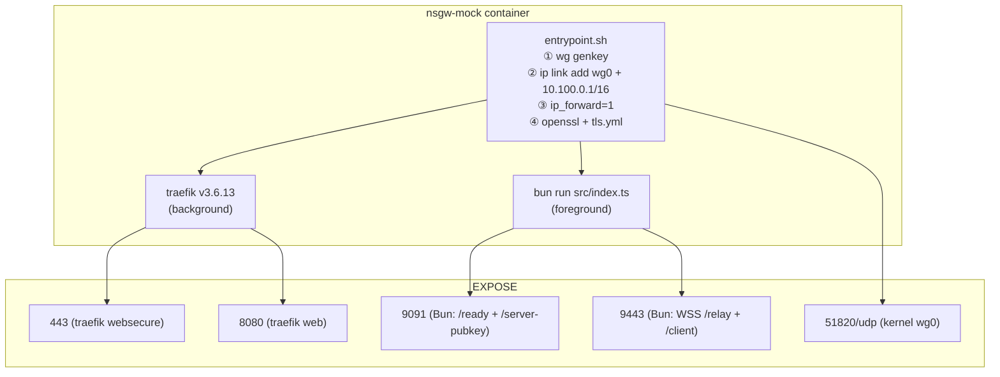

# NSGW 部署

> 本文讲 NSGW 的**两种**部署形态(测试 mock / 生产 gerbil),启动顺序、依赖、容器能力需求,以及与 NSD 的注册握手。

## 两种实现并列

NSIO 仓库里同时存在两套 NSGW 实现,用途不同:

| 实现 | 路径 | 语言 | 用途 | 特点 |
|------|------|------|------|------|
| **mock** | `tests/docker/nsgw-mock/` | Bun + TypeScript | Docker E2E 测试 | 使用标准 traefik,易读易改 |
| **生产参考** | `tmp/gateway/` (基于 fosrl/gerbil) | Go | 生产 Pangolin 系统参考 | 自研 SNI 代理 + UDP 中继,低依赖 |

两者**遵循同一套外部协议**:都暴露 UDP WG + HTTPS + 某种 WSS/SNI 代理,都用 SSE/HTTP 跟 NSD 对表。区别在内部实现——本文档聚焦 **mock**(协议更透明 + 与当前 NSD 完全对齐);生产参考的差异单列在最后。

## mock 的容器构成



## 文件清单

```
tests/docker/nsgw-mock/
├── Dockerfile            # bun base + wireguard-tools + traefik v3.6.13 下载
├── entrypoint.sh         # WG 接口 + TLS 证书 + traefik + bun 串联
├── traefik.yml           # entryPoints + file provider (静态)
├── package.json          # 依赖 bun 运行时
├── tsconfig.json
└── src/
    ├── index.ts           # 主入口 (Bun.serve × 2)
    ├── config.ts          # env → Config
    ├── wg-setup.ts        # wg set wg0 peer ... CLI 包装
    ├── wss-relay.ts       # WsFrame 解析 + 会话管理
    └── traefik-config.ts  # routing_config → routes.yml 生成
```

## 启动顺序(entrypoint 视角)

`tests/docker/nsgw-mock/entrypoint.sh`:

```bash
① wg genkey                            # 每启动生成新密钥
② wg pubkey < priv > pub
③ ip link add wg0 type wireguard       # 需要 NET_ADMIN
④ wg set wg0 private-key ... listen-port $WG_PORT
⑤ ip addr add 10.100.0.1/16 dev wg0
⑥ ip link set wg0 up
⑦ echo 1 > /proc/sys/net/ipv4/ip_forward
⑧ openssl req -x509 → 自签证书
⑨ cat > /etc/traefik/dynamic/tls.yml
⑩ traefik --configFile=/etc/traefik/traefik.yml &    # 后台
⑪ exec bun run src/index.ts                           # 前台
```

`exec` 的作用是让 Bun 成为 PID 1 的直接子进程——接收 SIGTERM 时 Bun 能优雅退出(`src/index.ts:386-387`),但 **traefik 子进程不会优雅退出**。这是 mock 的已知小缺陷,生产建议用 supervisord 或 s6。

## Bun 进程启动后的动作(`src/index.ts`)

顺序:

1. **加载配置**(`loadConfig()`, `config.ts:29-44`):从 env 读 `INSTANCE_ID` / `WG_PORT` / `WSS_PORT` / `KEY_API_PORT` / `CONTROL_CENTERS` / `ENABLE_WSS_RELAY` / `CONNECTOR_PUBKEY_HEX`。
2. **读公钥**(`index.ts:38`):读 `/tmp/wg-public.key`(entrypoint 生成),同时算 hex 版用于注册。
3. **可选 pre-add peer**(`index.ts:47-54`):若提供 `CONNECTOR_PUBKEY_HEX` 则预挂 NSN connector 为 peer。
4. **启动健康 API**(`index.ts:58-81`):`Bun.serve` 在 `KEY_API_PORT`,暴露 `/ready` / `/server-pubkey` / `/admin/shutdown`。
5. **启动 WSS relay**(`index.ts:87-178`):当 `ENABLE_WSS_RELAY=true` 才启动;双路径 `/relay` + `/client` + 测试 `/probe-open`。
6. **注册 + SSE**(`index.ts:372-376`):对每个 `controlCenter` 调用 `registerWithNsd()`:
   - `POST /api/v1/machine/register` 带 `type: "gateway"`(10 次重试)
   - `POST /api/v1/gateway/report` 带 `wg_pubkey` + `wg_endpoint` + `wss_endpoint`(5 次重试)
   - 成功后 **`subscribeToNsdSse()` 异步长连接**消费 `wg_config` / `routing_config`

## docker-compose 示例(mock)

`tests/docker/docker-compose.nsgw.yml` 定义双 NSGW:

```yaml
services:
  nsgw-1:
    build: ./nsgw-mock
    cap_add: [NET_ADMIN]                 # kernel WG 必需
    sysctls: [net.ipv4.ip_forward=1]     # traefik → NSN backend 转发
    environment:
      - INSTANCE_ID=nsgw-1
      - WG_PORT=51821
      - WSS_PORT=9443
      - KEY_API_PORT=9091
      - CONTROL_CENTERS=http://nsd-1:3001,http://nsd-2:3002
    networks: [traefik]
    healthcheck:
      test: ["CMD", "curl", "-sf", "http://localhost:9091/ready"]
      interval: 2s
      timeout: 5s
      retries: 15
      start_period: 5s
    depends_on:
      nsd-1: { condition: service_healthy }
      nsd-2: { condition: service_healthy }

  nsgw-2:
    # 同 nsgw-1,但端口错开:51822 / 9444 / 9092
```

**关键点**:
- `cap_add: [NET_ADMIN]` —— 创建 wg0 接口必需。
- **不需要** `SYS_MODULE`——宿主机已加载 wireguard 内核模块。若容器内 `ip link add wg0 type wireguard` 失败,需要 `modprobe wireguard` on host。
- `sysctls: [net.ipv4.ip_forward=1]` —— 允许 NSGW 在 eth0(入)和 wg0(出)之间转发 IP 包。
- `CONTROL_CENTERS` —— 双 NSD 写法(HA);每个都独立注册。
- `depends_on ... condition: service_healthy` —— 等 NSD ready 才启动,避免注册 10 次失败。

## 注册+订阅时序(端到端)

```mermaid
sequenceDiagram
    participant EP as entrypoint.sh
    participant BU as bun index.ts
    participant TR as traefik
    participant ND as NSD
    participant NSN as NSN (已在运行)

    EP->>EP: wg genkey
    EP->>EP: ip link add wg0 + 10.100.0.1/16
    EP->>EP: openssl self-signed cert
    EP->>EP: tls.yml → /etc/traefik/dynamic/
    EP->>TR: traefik --configFile=/etc/traefik/traefik.yml
    TR->>TR: watch /etc/traefik/dynamic/ (empty routes.yml)
    EP->>BU: exec bun run src/index.ts

    BU->>BU: loadConfig() + getServerPubkey()
    BU->>BU: Bun.serve health on :9091
    BU->>BU: Bun.serve WSS on :9443 (conditional)

    par for each NSD in CONTROL_CENTERS
        BU->>ND: POST /api/v1/machine/register (type=gateway)
        ND-->>BU: 200
        BU->>ND: POST /api/v1/gateway/report (pubkey + endpoints)
        ND-->>BU: 204
        ND->>NSN: broadcast gateway_config
        ND->>NSN: broadcast wg_config (NSN's peer list includes this NSGW)
        BU->>ND: GET /api/v1/config/stream?machine_id=nsgw-1-gw (SSE)
        ND-->>BU: immediate wg_config (NSN peer list)
        ND-->>BU: immediate routing_config (domain → nsn_wg_ip:port)
    end

    BU->>BU: handleRoutingConfig → write routes.yml
    TR->>TR: file watcher reload
    NSN-->>BU: WG handshake (now works; peer just added)
```

## 配置变量一览

| ENV | 默认 | 说明 |
|-----|------|------|
| `INSTANCE_ID` | `nsgw-1` | gateway_id,也是 hostname 标识 |
| `WG_PORT` | `51820` | wg0 UDP listen |
| `WSS_PORT` | `9443` | Bun WSS 端口;生产应放 443 |
| `KEY_API_PORT` | `9091` | Bun 健康 API |
| `CONTROL_CENTERS` | `""` | 逗号分隔的 NSD base URL(支持多个) |
| `ENABLE_WSS_RELAY` | `false` | 关则不启动 WSS,仅做 WG 网关 |
| `CONNECTOR_PUBKEY_HEX` | `""` | 可选,启动时预挂单个 NSN peer |

## 生产参考(gerbil)的显著差异

`tmp/gateway/` 来自 Pangolin 的 gerbil 项目(fosrl/gerbil),用 Go 实现。关键差异:

| 维度 | mock | gerbil |
|------|------|--------|
| 语言 | Bun + TS | Go 1.23 |
| WG 管理 | `wg` CLI(shell out) | `wgctrl` Go 库(内核 netlink) |
| HTTPS 反代 | 标准 traefik v3.6.13 | 自研 SNI proxy(port 8443)+ PROXY protocol v1 |
| 配置同步 | SSE 订阅 NSD | HTTP POST/GET(pull based,无 SSE) |
| peer 变更 | SSE 推 → diff apply | HTTP endpoint `/peer` POST/DELETE |
| 带宽上报 | (无) | 10 秒周期 `POST /receive-bandwidth` |
| MTU/MSS 处理 | 未显式 | `ensureMSSClamping()` 改 iptables mangle(`main.go:642-728`) |
| UDP hole-punch | 无 | `relay/relay.go` 支持,监听 21820/udp |
| 私钥持久化 | 不持久(每次新生成) | `--generateAndSaveKeyTo=/var/config/key` |

**选型建议**:
- 新部署、需要跟 NSD 控制面原生对接 → mock 的模型(Bun + traefik + SSE)
- 已有 Pangolin/gerbil 基础 → 保留 gerbil,写适配层把 NSD 的 SSE 翻译成 gerbil 的 HTTP API

## 故障排查 checklist

| 症状 | 排查路径 |
|------|---------|
| 容器起不来 / wg0 创建失败 | 宿主 `modprobe wireguard`;`docker run --cap-add=NET_ADMIN`;查 dmesg |
| NSN 永远 UDP 失败 | exec 进容器 `wg show wg0`,peer 列表里有没有 NSN pubkey;端口是否对外开放 |
| traefik 返回 404 | `cat /etc/traefik/dynamic/routes.yml` 是不是空;SSE 长连接是否保持 |
| TLS 握手失败 | `cat /etc/traefik/dynamic/tls.yml` + `ls /etc/traefik/certs/` |
| `/ready` 通但业务不通 | 健康端点在 Bun,不代表 traefik 或 wg0 正常;分别检查 |
| `/admin/shutdown` 被意外调用 | 生产**必须禁用**该路径;mock 没做保护 |

## 参考

- 所有 mock 源文件: `tests/docker/nsgw-mock/`
- 双 NSGW compose: `tests/docker/docker-compose.nsgw.yml`
- 生产 gerbil: `tmp/gateway/` + `tmp/gateway/README.md`
- 注册时序的 NSD 侧: `tests/docker/nsd-mock/src/registry.ts:317-347` + `:395-412`
