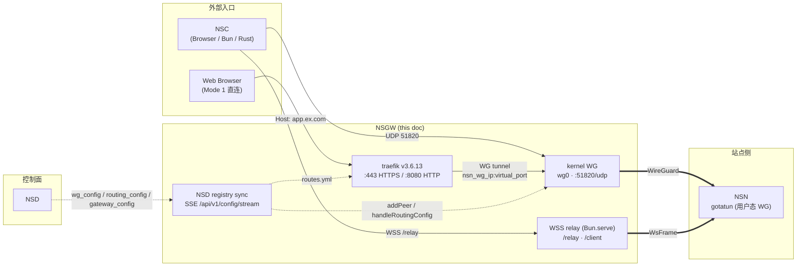

# 09 · NSGW 数据网关

> 适用读者: 想理解 NSGW 作为**独立数据面系统**的边界、职责与部署形态的架构师。
>
> 关键定位: NSGW 是 NSIO 生态里**不懂业务、只懂路由**的桥接层。它终结 WireGuard UDP、终结 WSS 长连接、通过 traefik 做 HTTPS 反向代理;但**不做认证、不合并策略、不生成虚拟 IP**——那些是 NSD / NSN / NSC 的事。

## NSGW 是什么

NSGW（Network Service Gateway）是 NSIO 生态的数据网关。对外它暴露三个监听端口:

| 端口 | 协议 | 进入方 | 用途 |
|------|------|--------|------|
| `51820/udp` | WireGuard | NSC / NSN | L3 全隧道,最低延迟路径 |
| `443/tcp` | HTTPS (traefik) | Browser / NSC / 外部用户 | 基于 Host 头的 HTTPS 反代,终结 TLS 后经 WG 隧道送达 NSN |
| `9443/tcp`(mock) / `443/wss`(prod) | WSS (WsFrame) | NSN (连接器) / NSC (轻量客户端) | TCP/UDP 多路复用中继,UDP 被阻断时的 fallback |

对内它维护:

- `wg0` 内核态 WireGuard 接口及其 peer 表(来源: NSD SSE 推送的 `wg_config`)。
- traefik 动态 HTTP 路由表(来源: NSD SSE 推送的 `routing_config`)。
- 活跃的 WSS 连接器会话表(`activeSessions`)与客户端会话表(`clientSessions`),用于把 NSC 的逻辑流"缝合"到某个 NSN 连接器会话上。

**一句话**: NSGW 把"NSD 告诉我谁是 peer、谁路由到哪"翻译成 WG peer 表 + traefik 路由表 + WSS 会话。

## 本目录索引

| 文档 | 内容 |
|------|------|
| [index.md](./index.md) | 本文件: NSGW 总览 + 读者路径 |
| [responsibilities.md](./responsibilities.md) | NSGW 四条核心职责;与 NSD / NSN / NSC 的边界 |
| [wg-endpoint.md](./wg-endpoint.md) | kernel WG 的设置、peer 同步、与 NSN 用户态 gotatun 的对比 |
| [wss-relay.md](./wss-relay.md) | WSS 中继的会话模型、"连接器↔客户端"缝合、fallback 直连 |
| [traefik-integration.md](./traefik-integration.md) | traefik v3.6.13 能力清单、EntryPoints、TLS store、动态 file provider(含 IngressRoute 为何未用) |
| [multi-region.md](./multi-region.md) | 多区域部署、NSN 侧 `MultiGatewayManager` 选路、failover 时序 |
| [deployment.md](./deployment.md) | mock(tests/docker) vs 生产(gerbil)的差异;启动顺序与注册流程 |
| [diagrams/](./diagrams/) | 本目录所有 Mermaid 源文件 |

## 读者路径

- **想快速入门**: 本文 → [responsibilities.md](./responsibilities.md) → [deployment.md](./deployment.md)。
- **理解数据面协议**: [../03-data-plane/tunnel-ws.md](../03-data-plane/tunnel-ws.md)(WsFrame 权威定义) → [wss-relay.md](./wss-relay.md)(NSGW 侧终结逻辑)。
- **部署/运维**: [deployment.md](./deployment.md) → [traefik-integration.md](./traefik-integration.md) → [multi-region.md](./multi-region.md)。
- **排查多网关 failover**: [multi-region.md](./multi-region.md) + [../03-data-plane/connector.md](../03-data-plane/connector.md)。

## 与其他组件的链接锚点

- 生态总览与四组件边界: [../01-overview/ecosystem.md](../01-overview/ecosystem.md)。
- WsFrame 协议(本目录引用而非重复): [../03-data-plane/tunnel-ws.md](../03-data-plane/tunnel-ws.md)。
- 多网关选路(NSN 侧的 `MultiGatewayManager`): [../03-data-plane/connector.md](../03-data-plane/connector.md)。
- 控制面 SSE 事件定义(`wg_config` / `routing_config` / `gateway_config` / `gateway_report`): [../08-nsd-control/](../08-nsd-control/)。

## 重要提醒:NSGW 不是什么

为避免把 NSD 的职责误分配给 NSGW,这里明确 **NSGW 不做**:

1. **认证**——不校验 JWT、不发放 token;所有身份验证由 NSD 完成。
2. **策略合并**——不合并多 NSD 的配置;NSN 侧的 `MultiControlPlane` 才做。
3. **ACL**——ACL 引擎在 NSN 内,NSGW 不执行任何过滤(`crates/acl/` 属于 NSN)。
4. **TCP 状态机**——HTTPS 路径由 traefik 终结 TLS;WSS 路径只做字节中继,不维护应用层状态。
5. **虚拟 IP 分配**——`127.11.x.x` 是 NSC 的概念,`10.0.0.x` 的分配在 NSD。

NSGW 只知道两件事:"这个公钥对应这段 `allowed-ips`" 和 "这个 domain 对应那个 `nsn_wg_ip:virtual_port`"。其他一切都来自 NSD SSE 推送(`tests/docker/nsgw-mock/src/index.ts:201-292`)。
