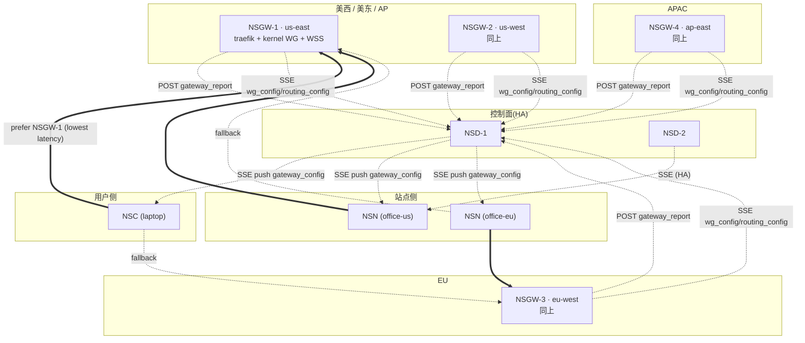
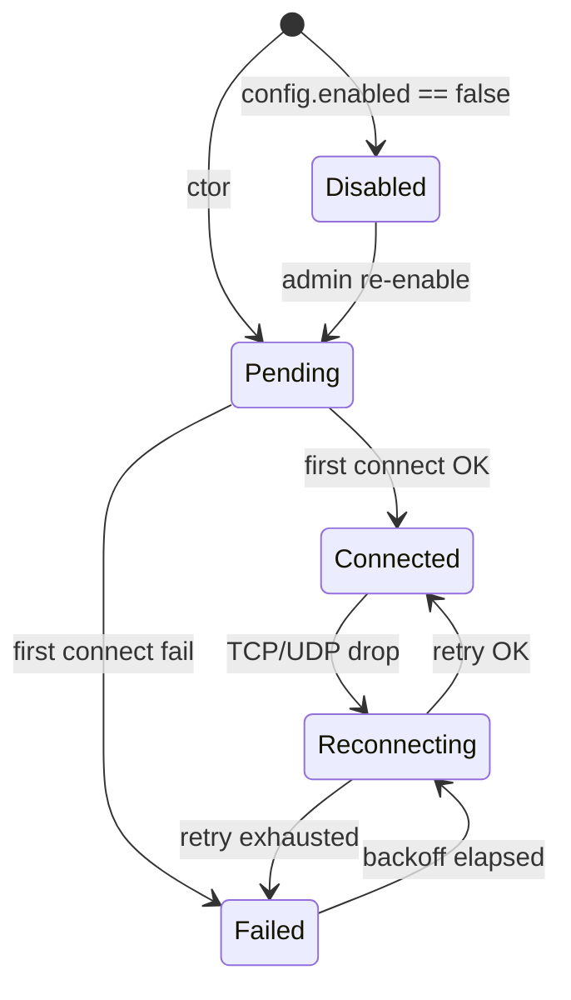
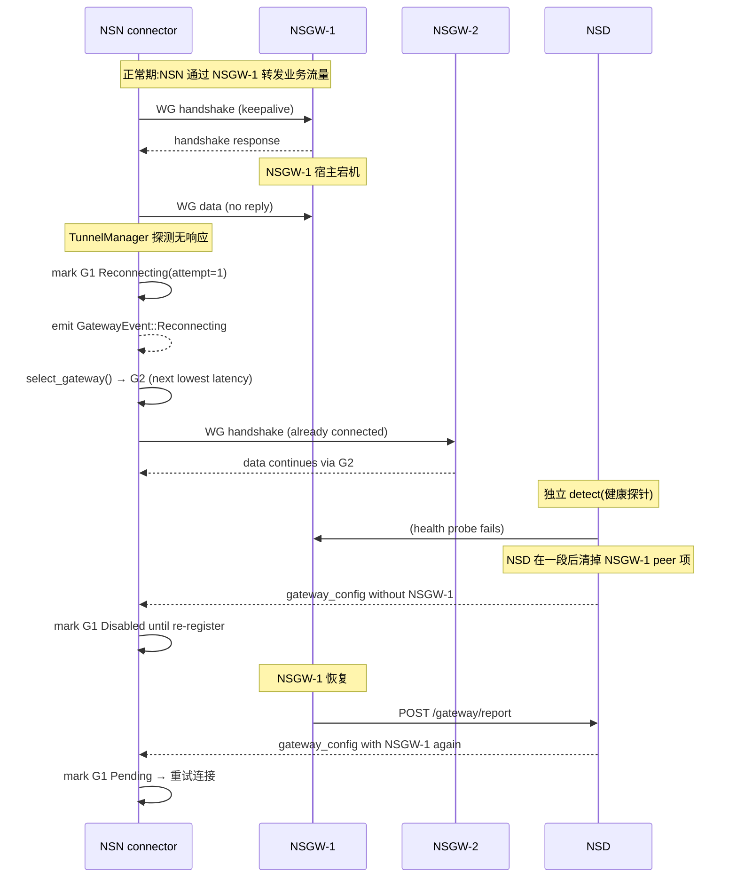

# NSGW 多区域部署

> 多 NSGW 的目标:**覆盖全球低延迟路径 + 单节点故障时 NSN 无缝 failover**。本文讲部署模型、选路策略、健康检查、以及 NSN 侧如何处理多网关。**NSGW 自己并不做全局选路决策**——它只被动响应 NSD SSE 推送的 peer / 路由表,把"该去哪个 NSGW"的决策权交给 NSN 侧的 `MultiGatewayManager`。

## 部署拓扑

一个典型的跨洲部署:



**核心观察**:
- 每个 NSGW 是**独立进程**,只跟 NSD 对话;NSGW 之间不互相知道对方存在。
- 所有"哪个用户走哪个 NSGW"的决策都是**客户端侧**(NSN / NSC)做的——参考 `crates/connector/src/multi.rs:270-277` 的 `select_gateway()`。

## 区域选路的典型表

| Region | 典型 RTT 到客户端 | 推荐链路(primary → fallback) | 容灾场景 |
|--------|-------------------|-------------------------------|----------|
| 北美 西海岸 | 20-40 ms | NSGW-2 (us-west) → NSGW-1 (us-east) | us-west 故障,退回 us-east,+50ms |
| 北美 东海岸 | 20-40 ms | NSGW-1 (us-east) → NSGW-2 (us-west) | 镜像 |
| EU | 30-60 ms | NSGW-3 (eu-west) → NSGW-1 (us-east) | eu-west 故障,跨大西洋,+100ms |
| APAC | 40-80 ms | NSGW-4 (ap-east) → NSGW-3 (eu-west) → NSGW-1 (us-east) | 多级 fallback |
| 中国大陆 | 100-200 ms | NSGW-4 → (WSS 模式优先) | 国际出口限制,UDP 常失败,依赖 WSS fallback |

这张表是**运维语义**,不在代码里硬编码;实际的"哪个 NSGW 离我最近"由 NSN 侧的 `LowestLatency` 策略(默认,`multi.rs:87`)根据 UDP 探测 RTT 动态决定。

## NSN 侧的 `MultiGatewayManager`

NSN(以及 NSC)侧用 `crates/connector/src/multi.rs` 管理多 NSGW。

### 三种选路策略

| 策略 | 定义位置 | 适用场景 |
|------|---------|---------|
| `LowestLatency`(默认) | `multi.rs:87` | 常规生产;按探测到的 RTT 选最低 |
| `RoundRobin` | `multi.rs:89` | 测试场景,确保流量均匀分布 |
| `PriorityFailover` | `multi.rs:91` | 明确主备——只在主挂掉时才切备 |

### 每个 NSGW 的状态机

```rust
// crates/connector/src/multi.rs:49-61
pub enum GatewayStatus {
    Connected { since: Instant },
    Reconnecting { attempt: u32 },
    Failed { reason: String, since: Instant },
    Disabled,
    Pending,
}
```

从 `Pending` → 首次 `connect()` 成功 → `Connected`;失败 → `Failed`;重连中 → `Reconnecting`;管理员关闭 → `Disabled`。



### 每个网关的事件

每次状态变化,`MultiGatewayManager` 通过 `GatewayEvent`(`multi.rs:24-44`)广播:

- `Connected { id, transport, latency }`
- `Disconnected { id, error }`
- `Reconnecting { id, attempt }`
- `LatencyUpdate { id, latency }`
- `HandshakeCompleted { id, timestamp }`
- `BytesTransferred { id, tx, rx }`

这些事件让监控面(NSN 的 `/api/gateways` 端点)可以实时观察所有 NSGW 的健康状态。

## NSN 连接器与单个 NSGW 的 UDP→WSS fallback

**不要混淆两层 fallback**:

1. **网关级 fallback**(本文重点):NSGW-1 整体挂了 → 切换到 NSGW-2。由 `MultiGatewayManager` 管。
2. **传输级 fallback**:NSGW-1 的 UDP 不通但 TCP 通 → 对该 NSGW 用 WSS 模式。由 `ConnectorManager::connect()` 管(`crates/connector/src/lib.rs:205`)。

两层正交。举例:"NSGW-1 走 WSS + NSGW-2 走 UDP" 同时存在是完全可能的(见 `transport-design.md` §"Independent Hop Transport")。

## Failover 时序(单网关失联)



**关键时间参数**(来自代码):
- `ConnectorManager::connect()` UDP 探测超时 5 s(`lib.rs:241` 注释所在 `probe_udp` 函数,见 [connector.md §1.3](../03-data-plane/connector.md#13-udp-探活probe_udp))。
- `MultiGatewayManager::health_interval = 30s`(`multi.rs:176`)——健康检查周期。
- NSD 侧的健康探针节奏由 NSD 实现,不在本文范围。

## 健康检查设计

NSGW 侧的健康端点:

- `GET /ready`(`nsgw-mock/src/index.ts:64-65`)— Docker healthcheck 用,返回 `"ok"`
- `GET /server-pubkey`(`nsgw-mock/src/index.ts:68-70`)— 返回 base64 pubkey,用于 NSD 验证一致性
- `POST /admin/shutdown`(`nsgw-mock/src/index.ts:74-77`)— **测试专用**,强制退出进程;用来注入"网关硬故障"场景

docker-compose 里的 healthcheck(`docker-compose.nsgw.yml:22-27`):

```yaml
healthcheck:
  test: ["CMD", "curl", "-sf", "http://localhost:9091/ready"]
  interval: 2s
  timeout: 5s
  retries: 15
  start_period: 5s
```

## NSD 与 NSGW 的健康协议

```
① NSGW 启动 → POST /api/v1/gateway/report(自我声明)
② NSD 持久登记 gateways[id] = { pubkey, endpoint, wss_endpoint }
③ NSD 主动探活(心跳 / 失联标记)
④ NSD 通过 SSE gateway_config 事件把网关列表广播给所有 NSN/NSC
⑤ NSGW 挂了 → NSD 从 gateways 中移除 → 广播新 gateway_config(空缺该项)
⑥ NSN/NSC 收到 → 从 MultiGatewayManager 把该网关标记 Disabled
```

**没有"心跳从 NSGW 主动推给 NSD"的机制**——NSGW 被动。NSD 的健康检测实现在 `tests/docker/nsd-mock/` 下(超出本文范围)。

## 多区域路由与 `routing_config`

NSD 的 `routing_config` 是**全局域名路由表**——"`app.example.com` 应该映射到哪个 NSN 的什么服务"。这张表被**所有** NSGW 共享,不是每个 NSGW 独有的。

含义:

- 从 us-east 进入的用户访问 `app.example.com` → NSGW-1 的 traefik 查 `routes.yml`,loadBalancer 送到 NSN 的虚 IP
- 从 eu-west 进入同样的 `app.example.com` → NSGW-3 的 traefik 查**相同内容**的 `routes.yml`,送到同一个 NSN 虚 IP

**NSGW 层不做 GeoDNS**——域名到 NSGW 的选择是上游(用户 DNS / CDN 层)做的;域名到 NSN 的解析是 NSD 统一做的。

## 部署 checklist

- [ ] 每个 NSGW 有独立的公网 IP + DNS(`gw-1.example.com`, `gw-2.example.com`, ...)
- [ ] WG UDP 51820 防火墙放行(或改端口)
- [ ] TCP 443 防火墙放行(traefik + 可能的 WSS)
- [ ] 区域内部到 NSD 的出向 HTTP/HTTPS 畅通(注册 + SSE 订阅)
- [ ] 主机支持 `wireguard` 内核模块(`modprobe wireguard`)
- [ ] `NET_ADMIN` + `SYS_MODULE`(生产 gerbil 的 docker-compose 里 `cap_add` 两个;mock 只需 `NET_ADMIN`)
- [ ] TLS 证书(mock 自签;生产用 Let's Encrypt 或商业)
- [ ] 监控 `GET /ready` + pubkey 是否稳定

## 参考

- NSN 侧多网关管理: `crates/connector/src/multi.rs`
- 两层 fallback 架构: `docs/transport-design.md`
- NSD 健康探测实现(mock): `tests/docker/nsd-mock/src/registry.ts`
- 典型 compose(双网关): `tests/docker/docker-compose.nsgw.yml`
