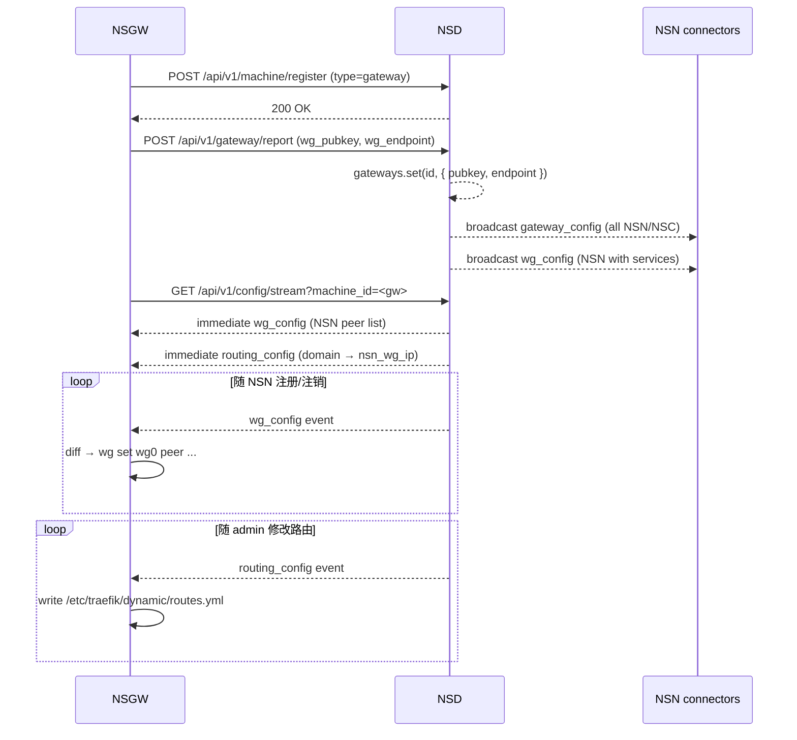

# NSGW 核心职责

> NSGW 只做四件事:**终结 WG**、**中继 WSS**、**反代 HTTPS**、**跟 NSD 对表**。本文把每一条的输入、输出、代码位置摊开讲清楚。

```mermaid
graph TB
    subgraph NSD["NSD 控制面"]
        SSE["SSE /api/v1/config/stream<br/>wg_config · routing_config"]
    end

    subgraph NSGW["NSGW"]
        subgraph R1["① WG endpoint · :51820/udp"]
            WG["kernel wg0<br/>peer table"]
        end

        subgraph R2["② WSS relay · :9443"]
            WSS["Bun.serve&lt;WsDataTagged&gt;<br/>/relay · /client"]
        end

        subgraph R3["③ HTTPS reverse proxy · :443"]
            TRA["traefik v3.6.13<br/>routes.yml + tls.yml"]
        end

        subgraph R4["④ Registry sync"]
            REG["subscribeToNsdSse()<br/>addPeer · handleRoutingConfig"]
        end
    end

    subgraph NSN["NSN"]
        N["gotatun WG peer<br/>(user-space)"]
    end

    SSE --> REG
    REG -->|addPeer(pubkey, allowed-ips)| WG
    REG -->|routes.yml atomic write| TRA
    TRA -->|"http://nsn_wg_ip:virtual_port"| WG
    WG ==> N
    WSS ==> N
```

## ① WireGuard UDP 端点(Mode 3: 重 NSC / NSN)

**输入**: NSC 或 NSN 通过 UDP 51820 发来 WG 握手 + 加密包。
**输出**: 解密后的 IP 包经 `wg0` 接口转发到 NSN 的虚拟 IP(由 `allowed-ips` 决定路由)。

**核心代码**:
- `tests/docker/nsgw-mock/entrypoint.sh:13-17` 在启动前用 `ip link add wg0 type wireguard` + `wg set wg0 private-key ... listen-port ...` 创建内核接口,并赋 `100.64.0.1/16`。
- `tests/docker/nsgw-mock/src/wg-setup.ts:24` 的 `addPeer()` 用 `wg set wg0 peer <pubkey> allowed-ips <cidr>` 动态增删 peer。
- `tests/docker/nsgw-mock/src/index.ts:248-278` SSE 消费 `wg_config` 事件后 diff-apply peer 集合。

**为什么用内核 WG**: NSGW 是静态常驻节点,有 root + `cap_add: NET_ADMIN`(见 [deployment.md](./deployment.md))。内核 WG 零拷贝、最低延迟,是 hub 的最佳选择。对比 NSN 选用 `gotatun` 用户态实现是为了 "无 root 也能部署"——边界见 [wg-endpoint.md](./wg-endpoint.md)。

**数据**: 参见 [../03-data-plane/tunnel-wg.md](../03-data-plane/tunnel-wg.md)。NSGW 不参与任何 WG 帧解析,内核直接投递。

## ② WSS 中继(Mode 2: 轻 NSC / NSN fallback)

**输入**: NSC 或 NSN 通过 WebSocket 建立长连接(`/client` 或 `/relay`),发来 `WsFrame` 二进制帧。
**输出**:
- NSN 侧(`/relay`)的帧转发到匹配的 NSC 客户端(`/client`)或 NSGW 直连 socket;
- NSC 侧(`/client`)的帧转发到活跃 NSN 连接器会话,或 fallback 为 NSGW 本地 TCP/UDP 直连。

**核心代码**:
- `tests/docker/nsgw-mock/src/index.ts:98-175` `Bun.serve<WsDataTagged>` 监听,用 `data.kind` 区分 `"relay"` / `"client"` 会话。
- `tests/docker/nsgw-mock/src/wss-relay.ts:281-363` `handleClientFrame()` 是"缝合点"——收到 NSC 的 `Open` 就分配 `connectorStreamId`,插入 `connectorStreamToClient` 反查表,转发给 NSN。
- `tests/docker/nsgw-mock/src/wss-relay.ts:365-421` 当无 NSN 会话可用时,`openDirectStreamForClient()` 在 NSGW 本地建立 TCP/UDP 直连——兜底路径,见 [wss-relay.md](./wss-relay.md) §fallback。

**注意: WsFrame 协议定义唯一来源**: `crates/tunnel-ws/src/lib.rs:86-94` 与 `tests/docker/nsgw-mock/src/wss-relay.ts:36-42`(两者必须字节级一致)。详细字段见 [../03-data-plane/tunnel-ws.md](../03-data-plane/tunnel-ws.md#2-wsframe-二进制协议)——本目录**引用**而不重复。

## ③ HTTPS 反向代理(Mode 1: 无 NSC 的浏览器直连)

**输入**: 外部浏览器访问 `https://app.example.com`,TCP 443 进入 traefik。
**输出**: TLS 在 traefik 终结,基于 `Host` header 选中对应 router,proxy 到 `http://<nsn_wg_ip>:<virtual_port>`——此 URL 的下一跳**经由 NSGW 的 wg0 接口**,通过 WG 隧道送达 NSN 的 ServiceRouter。

**核心代码**:
- `tests/docker/nsgw-mock/traefik.yml` 静态配置两个 entryPoint: `web:8080`(明文)/ `websecure:443`(TLS)。
- `tests/docker/nsgw-mock/entrypoint.sh:30-40` 生成 `tls.yml` 默认证书 store(mock 用自签,生产可换 Let's Encrypt)。
- `tests/docker/nsgw-mock/src/traefik-config.ts:32-68` `handleRoutingConfig()` 原子写 `/etc/traefik/dynamic/routes.yml`——每个 domain 产两个 router(HTTPS + HTTP)+ 一个 service,loadBalancer 指向 `http://${nsn_wg_ip}:${virtual_port}`。

**流量链路**:
```
Browser → :443 (traefik) → TLS 终结 → Host rule 匹配
  → http://<nsn_wg_ip>:<virtual_port>
    → 经 wg0 (kernel WG 加密)
      → NSN gotatun 解密
        → NSN ServiceRouter(ACL + 服务表查询)
          → 127.0.0.1:80 真实服务
```

这条路径上 NSGW **不懂 HTTP**——只做 TLS 终结 + Host 路由 + TCP 代理,所有应用层策略在 NSN 侧。详见 [traefik-integration.md](./traefik-integration.md)。

## ④ 与 NSD 的注册表同步

NSGW 启动时要让 NSD 知道"我是谁",并订阅 peer 变更:

**双向握手流程** (`tests/docker/nsgw-mock/src/index.ts:300-370`):

1. `POST /api/v1/machine/register` — 带上 `machine_key_pub`(hex)、`type: "gateway"`、`hostname`、`version`;最多 10 次重试,间隔 500 ms。
2. `POST /api/v1/gateway/report` — 上报 `gateway_id` + `wg_pubkey` + `wg_endpoint` + `wss_endpoint`,NSD 收到后解析 `wg_endpoint` 到 IP,广播 `wg_config` 到所有已订阅的 NSN(`tests/docker/nsd-mock/src/registry.ts:395-412`)。
3. 订阅 SSE `GET /api/v1/config/stream?machine_id=<instance>-gw` — 后续接收:
   - `wg_config` → diff-apply `wg set peer` (`nsgw-mock/src/index.ts:248-278`)
   - `routing_config` → `handleRoutingConfig()` 写 `routes.yml` (`nsgw-mock/src/index.ts:236-247`)



**SSE 事件对照表**(来自 `tests/docker/nsd-mock/src/types.ts:144-153`):

| 事件 | 方向 | 载荷 | NSGW 动作 |
|------|------|------|-----------|
| `wg_config` | NSD → NSGW | `{ ip_address, listen_port, peers: [{ public_key, allowed_ips }] }` | diff + `wg set peer / wg set peer ... remove` |
| `routing_config` | NSD → NSGW | `{ routes: [{ domain, nsn_wg_ip, virtual_port }] }` | 原子写 `routes.yml`,traefik 自动 reload |
| `gateway_config` | NSD → NSN/NSC(非 gateway) | `{ gateways: [...] }` | (NSGW 不消费;这是给 NSN/NSC 用的) |

## 这些职责之间的边界

| 场景 | 责任组件 | 为什么 |
|------|---------|-------|
| 用户登录、颁发 JWT | NSD | 所有证书/token 签发都在控制面 |
| "这个 NSC 能访问 ssh:22 吗?" | NSN 内的 `acl` crate | ACL 在离服务最近处执行 |
| 把 NSC 127.11.1.5 映射到某服务 | NSC 自身 | NSGW 不知道 VIP 的存在 |
| "北京用户应该走哪个 NSGW?" | NSN 内的 `MultiGatewayManager` | NSGW 自己不做全局选路;详 [multi-region.md](./multi-region.md) |
| TLS 终结 + Host 路由 | NSGW (traefik) | 唯一拥有公网 IP + 证书的组件 |
| TCP/UDP 字节中继 | NSGW (WSS relay or kernel WG) | 数据面桥接就是 NSGW 的核心职责 |

## 参考

- mock 实现入口: `tests/docker/nsgw-mock/src/index.ts`
- 生产参考(Go, 基于 fosrl/gerbil): `tmp/gateway/main.go` — `proxy/` 做 SNI 代理,`relay/` 做 UDP hole-punch 中继;总体设计与 NSGW mock 接近,但把 "SSE 订阅 NSD" 换成了"POST 给 `remoteConfig` URL"。差异见 [deployment.md](./deployment.md)。
