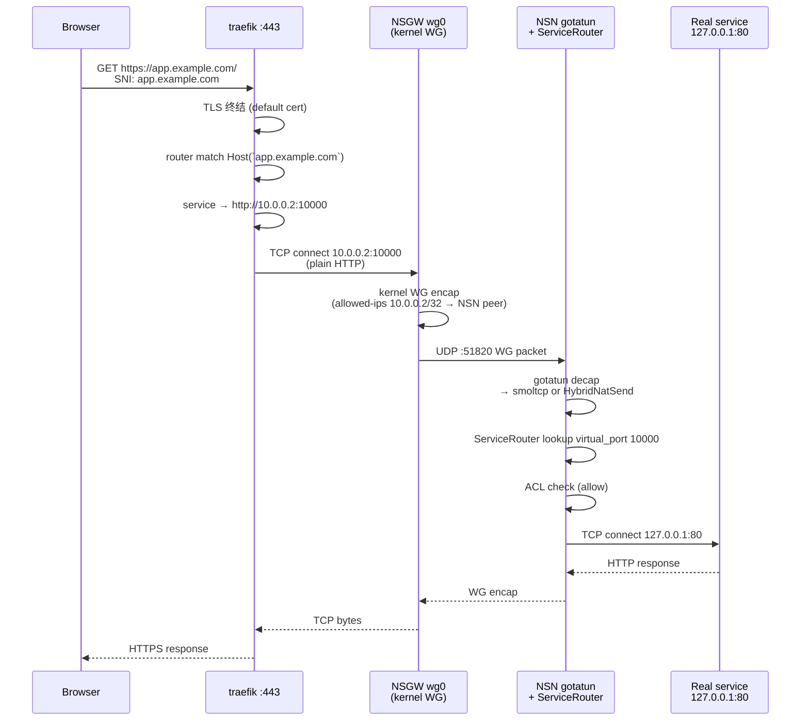

# NSGW 与 traefik v3.6.13 集成

> NSGW 的 HTTPS 入口层用 [traefik](https://traefik.io/) v3.6.13(Dockerfile 固定版本 — `tests/docker/nsgw-mock/Dockerfile:11`)。traefik 负责 TLS 终结 + Host 路由;NSGW 负责把"NSD 告诉我该路由到哪"翻译成 traefik 能吃的 YAML。本文讲**具体用了 traefik 的哪几个能力**,以及为什么。

## 用到的 traefik 能力清单

| 能力 | 是否用到 | 来源 |
|------|---------|-----|
| EntryPoints(端口映射) | ✅ | `traefik.yml:1-5`:`web :8080` + `websecure :443` |
| File provider(静态 + 动态) | ✅ | `traefik.yml:7-10`:`directory: /etc/traefik/dynamic` + `watch: true` |
| TLS store(默认证书) | ✅ | `entrypoint.sh:29-40` 动态生成 `tls.yml` |
| HTTP Routers with `Host()` rule | ✅ | `traefik-config.ts:38-47` |
| HTTP Services (loadBalancer) | ✅ | `traefik-config.ts:50-57` |
| Dynamic reload(文件 watch 热加载) | ✅ | 依赖 file provider 的 `watch: true` |
| **IngressRoute(CRD)** | ❌ | 未用——此模式仅在 K8s 部署时启用,mock 是 Docker |
| **Kubernetes provider** | ❌ | 同上 |
| Middleware(rateLimit/auth 等) | ❌ | mock 没有;生产可接入 |
| Let's Encrypt ACME | ❌ | mock 用自签;生产可用 certResolver |
| Plugins(traefik-plugin) | ❌ | 未用 |

**结论**:mock 只用了 traefik 的**最基础能力集**:entryPoints + file provider + HTTP router + TLS store。足以演示 "domain → NSN 服务" 的端到端路径,不引入 Traefik 生态的额外复杂度。

> **关于 IngressRoute**:任务书提及要讲 IngressRoute,事实是 mock 基于 Docker + file provider 而非 K8s,**没有使用 IngressRoute CRD**。若将来部署到 K8s,对等做法是:`kind: IngressRoute` + `match: Host(\`app.example.com\`)` + `services: [{ name: nsn-service, port: 10000 }]` + TLSOption,但目前代码库里没有这部分。

## 静态配置 `traefik.yml`

```yaml
# tests/docker/nsgw-mock/traefik.yml
entryPoints:
  web:
    address: ":8080"         # 明文 HTTP
  websecure:
    address: ":443"          # HTTPS(TLS 在这里终结)

providers:
  file:
    directory: /etc/traefik/dynamic
    watch: true              # 文件变更自动 reload

log:
  level: INFO
```

两个 entryPoint:
- `web:8080` — E2E 测试专用(无 TLS 复杂度);
- `websecure:443` — 生产意义上的 HTTPS 入口。

`watch: true` 是 NSD → NSGW → traefik 这条热更新链路的基础;没有它就必须重启 traefik。

## TLS store(默认证书)

entrypoint 启动时生成自签证书并写进 dynamic config:

```bash
# entrypoint.sh:22-40
openssl req -x509 -newkey rsa:2048 \
    -keyout /etc/traefik/certs/server.key \
    -out /etc/traefik/certs/server.crt \
    -days 365 -nodes \
    -subj "/CN=${INSTANCE_ID}"

cat > /etc/traefik/dynamic/tls.yml <<EOF
tls:
  stores:
    default:
      defaultCertificate:
        certFile: /etc/traefik/certs/server.crt
        keyFile: /etc/traefik/certs/server.key
  certificates:
    - certFile: /etc/traefik/certs/server.crt
      keyFile: /etc/traefik/certs/server.key
EOF
```

在 `default` store 里登记 `defaultCertificate`——所有 `tls: {}` 但没指定证书的 router 都会 fallback 到它。生产里这里应该替换为 Let's Encrypt HTTP-01 或 DNS-01(traefik 的 `certificatesResolvers.myresolver.acme.*`),或者挂载已有的商业证书。

## 动态路由 `routes.yml`

NSGW 进程根据 NSD SSE `routing_config` 事件**实时生成**这份文件。生成器见 `tests/docker/nsgw-mock/src/traefik-config.ts:32-68`:

```yaml
# 示例 /etc/traefik/dynamic/routes.yml (自动生成)
http:
  routers:
    app-example-com:
      entryPoints: [websecure]
      rule: "Host(`app.example.com`)"
      service: app-example-com
      tls: {}
    app-example-com-http:
      entryPoints: [web]
      rule: "Host(`app.example.com`)"
      service: app-example-com
  services:
    app-example-com:
      loadBalancer:
        servers:
          - url: "http://10.0.0.2:10000"
```

### 关键设计:每个 domain 两个 router,一个 service

- **HTTPS router** `{name}`:走 `websecure` + `tls: {}`(用默认 store 的证书);
- **HTTP router** `{name}-http`:走 `web`(E2E 测试便利——跳过 TLS 握手复杂度);
- **单 service**:两个 router 指向同一个 backend,减少重复。

`name` 就是 domain 把 `.` 替换成 `-`(`traefik-config.ts:36`),保证合法的 YAML key。

### 原子写,防止部分读

```typescript
// traefik-config.ts:60-64
const tmpPath = "/etc/traefik/dynamic/routes.yml.tmp";
const finalPath = "/etc/traefik/dynamic/routes.yml";
await Bun.write(tmpPath, yaml);
await $`mv ${tmpPath} ${finalPath}`.quiet();
```

先写 `.tmp` 再 `mv` —— POSIX `rename(2)` 在同一文件系统下是原子的。traefik 的 file watcher 不会读到半成品。

## backend URL 的关键约束

`loadBalancer.servers[].url` 必须是 `http://<nsn_wg_ip>:<virtual_port>`——**两个字段都不能随意选**:

| 字段 | 要求 | 为什么 |
|------|------|-------|
| `nsn_wg_ip` | NSN 在 WG 子网里的虚 IP(例如 `10.0.0.2`) | NSGW 发给这个 IP 的包会被内核 WG encap 送到 NSN;用 `127.0.0.1` / `192.168.x.x` 从 NSGW 根本 unreachable |
| `virtual_port` | NSD 给 NSN ServiceRouter 分配的虚拟端口(例如 `10000`) | NSN 的 ServiceRouter 在这个端口 listen;真实服务端口(80 / 5432)不暴露 |

`tests/docker/nsgw-mock/src/traefik-config.ts:5-17` 的 `RouteConfig` 接口注释里明确说了**不要用真实服务地址**:

```typescript
export interface RouteConfig {
  domain: string;
  /**
   * NSN's WG virtual IP (e.g. "10.0.0.2"), assigned by NSD.
   * Reachable from NSGW via the WG tunnel.  Never use the raw service
   * address here (127.0.0.1 / 192.168.x.x are unreachable from NSGW).
   */
  nsn_wg_ip: string;
  /**
   * NSD-assigned virtual port on NSN's WG IP.
   * NSN's ServiceRouter listens here and proxies to the actual service.
   * e.g. 10.0.0.2:10000 → 127.0.0.1:80
   */
  virtual_port: number;
}
```

## 端到端数据流



注意 NSGW 在这条链路上**不碰 HTTP**——它只做:① TLS 终结 → ② Host 路由 → ③ plain HTTP 转发。HTTP body、header 解析都交给 backend;ACL 在 NSN 上做。

## 监听端口占用

在 `Dockerfile:30-33`:
```
EXPOSE 443    # traefik websecure
EXPOSE 8080   # traefik web
EXPOSE 9091   # Bun: health + /server-pubkey
EXPOSE 9443   # Bun: WSS relay (/relay + /client)
```

traefik 进程和 Bun 进程**绑定不同端口,互不干扰**。Bun.serve WSS 不在 traefik 后面——直接面向外部。

## 生产实现的差异(gerbil SNI proxy)

生产参考 `tmp/gateway/proxy/proxy.go` **不用 traefik**,而是自己实现了 SNI 代理:

- 监听 `:8443`(由 `SNI_PORT` 可配);
- 读 TLS ClientHello 的 SNI 扩展提取 hostname;
- 查 remote config 得到路由目标,再 `net.Dial` 过去做字节透传;
- 可选 PROXY protocol v1 透传客户端 IP。

**为什么有两套**:mock 追求"跟 traefik 标准对齐",便于读者用熟悉的工具验证;生产的 gerbil 更原始——只做字节中继,不 TLS 终结,保留端到端加密(适合 HTTPS passthrough + 多租户场景)。

## 故障模式

| 现象 | 可能原因 | 排查点 |
|------|---------|-------|
| 404 Not Found(来自 traefik) | `routes.yml` 里没有该 domain | 容器内 `cat /etc/traefik/dynamic/routes.yml` 看有没有对应 router |
| 502 Bad Gateway | backend `http://<wg_ip>:<port>` 连不上 | NSN 的 ServiceRouter 是否 listen;`wg show wg0` 看 peer 是否有该 IP |
| TLS 握手失败 | `tls.yml` 没写进来 | `ls /etc/traefik/dynamic/` 看是否有 `tls.yml` |
| 新路由没生效 | traefik file watcher 没触发 | 看 traefik log:`provider: file, type: dynamic`;或验证原子 mv 是否同文件系统 |

## 参考

- 静态配置: `tests/docker/nsgw-mock/traefik.yml`
- 动态路由生成: `tests/docker/nsgw-mock/src/traefik-config.ts`
- TLS 证书初始化: `tests/docker/nsgw-mock/entrypoint.sh:22-40`
- SSE `routing_config` 消费: `tests/docker/nsgw-mock/src/index.ts:236-247`
- Dockerfile 固定版本: `tests/docker/nsgw-mock/Dockerfile:11`
- 生产 SNI 代理替代品: `tmp/gateway/proxy/proxy.go`
