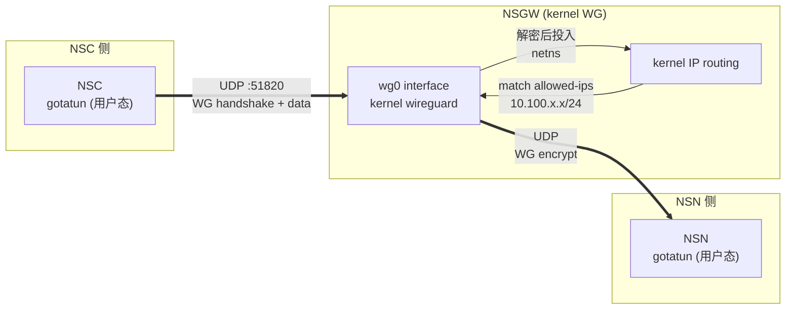

# NSGW WireGuard 端点

> 本文讲 NSGW 侧的 WireGuard 终结:为什么用**内核态 WG**,peer 如何从 NSD SSE 同步,`allowed-ips` 如何控制路由,以及与 NSN 侧**用户态 gotatun** 的边界为何不同。

## 为什么 NSGW 用 kernel WG 而 NSN 用 gotatun

这是 NSIO 里最容易被误解的一条边界:同一个协议(WG),两端选了不同实现。

| | NSGW | NSN |
|---|------|-----|
| WG 实现 | **内核 WireGuard**(`ip link add ... type wireguard`) | **gotatun**(`gotatun` 用户态 UAPI) |
| 需要的权限 | `NET_ADMIN` + 内核模块(已是常驻服务) | 任意用户均可(容器/无 root 场景) |
| 拷贝次数 | 0(内核 XDP / netstack 直接投递) | 至少 1(用户态 decrypt → `VirtualDevice`) |
| 接口名 | `wg0`(真实内核 link) | 无真实接口(纯软件 stack) |
| 原因 | 固定基础设施,最低延迟 | 站点侧要能在用户容器里跑,兼容所有 Linux |

**结论**:
- NSGW 是"一直在运行的中转 PoP",部署时确定可拿到 `NET_ADMIN`,内核 WG 是零妥协最优解。
- NSN 是"用户要自己部署的节点",不能要求他们有 root,必须走 gotatun。

代码证据:
- NSGW mock 的 `entrypoint.sh:13-17` 明确创建 **kernel interface**(`ip link add wg0 type wireguard`)。
- NSGW mock Dockerfile:`RUN apt-get install ... wireguard-tools iproute2 ...` + compose `cap_add: [NET_ADMIN]`。
- NSN 侧的 WG 接入走 `crates/tunnel-wg/` + `gotatun`(见 [../03-data-plane/tunnel-wg.md](../03-data-plane/tunnel-wg.md))。



中间的"内核 IP routing"是 kernel WG 的核心价值:同一条加密包可以在**不离开内核**的情况下选路,对比用户态实现需要在应用层再决策一次。

## wg0 接口的设置

`entrypoint.sh:7-21` 是唯一的 WG 初始化入口:

```bash
# 1. 生成 keypair
wg genkey > /tmp/wg-private.key
wg pubkey < /tmp/wg-private.key > /tmp/wg-public.key

# 2. 创建内核接口
ip link add wg0 type wireguard
wg set wg0 private-key /tmp/wg-private.key listen-port "${WG_PORT}"
ip addr add 10.100.0.1/16 dev wg0
ip link set wg0 up

# 3. 打开 IP 转发
echo 1 > /proc/sys/net/ipv4/ip_forward
```

几个不易察觉的点:

1. **keypair 每次启动都重新生成**——NSGW 不保留私钥状态,因为启动后会主动 POST `gateway_report` 把新公钥上报给 NSD;NSD 再把它分发给所有 NSN 的 `wg_config`。运维上意味着"重启 NSGW → NSN 自动拿到新 peer,几秒内恢复"。
2. **`10.100.0.1/16` 是 NSGW 自身在 WG 子网的地址**——traefik 反代到 NSN 时,源 IP 就是这个地址(NSN 侧 iptables 可据此识别流量来自哪个 NSGW)。
3. **`ip_forward=1`**——因为 traefik 的 loadBalancer URL `http://<nsn_wg_ip>:<virtual_port>` 需要 NSGW 内核转发这些 IP 包出 `wg0`。

## Peer 的动态同步

NSGW 的 peer 列表不在配置文件里写死,而是 **100% 由 NSD 通过 SSE 事件推送**。

### 两个入口都走同一个 CLI 动作

```typescript
// tests/docker/nsgw-mock/src/wg-setup.ts:24
export async function addPeer(pubkeyBase64: string, allowedIps: string): Promise<void> {
  await $`wg set wg0 peer ${pubkeyBase64} allowed-ips ${allowedIps}`.quiet();
}

// tests/docker/nsgw-mock/src/wg-setup.ts:30
export async function removePeer(pubkeyBase64: string): Promise<void> {
  await $`wg set wg0 peer ${pubkeyBase64} remove`.quiet();
}
```

入口 A(冷启动):`INSTANCE_ID=nsgw-1` + `CONNECTOR_PUBKEY_HEX=<hex>` 环境变量存在时,`index.ts:47-54` 在启动时 pre-add 单个 peer,便于 E2E 测试。

入口 B(热路径):`subscribeToNsdSse()` 消费 `wg_config` 事件 → diff 当前 `sseTrackedPeers` Map → `addPeer` / `removePeer`。

### diff 逻辑的细节

`tests/docker/nsgw-mock/src/index.ts:248-278` 的对齐逻辑:

```
newPeers = { pubkey → allowed_ips CSV }  (事件中声明的期望状态)

for each (pubkey, ips) in newPeers:
    if sseTrackedPeers[pubkey] != ips:
        wg set wg0 peer <pubkey> allowed-ips <ips>   # add/update

for each pubkey in sseTrackedPeers:
    if pubkey not in newPeers:
        wg set wg0 peer <pubkey> remove              # delete

sseTrackedPeers = newPeers
```

**只 diff `allowed-ips` 字符串**而不是其他字段,因为 `wg set peer` 是幂等的——同 pubkey 重发会覆盖 `allowed-ips`。

### 公钥编码的两头转换

WG CLI 用 base64,NSD 事件里用 hex(for JSON friendliness),所以:

| 场景 | 代码 | 方向 |
|------|------|------|
| SSE 事件里的 `public_key: number[]`(字节数组) | `bytesToBase64()` — `index.ts:185-187` | 转 base64 交给 `wg set` |
| 环境变量 `CONNECTOR_PUBKEY_HEX` | `hexToBase64()` — `wg-setup.ts:39-41` | hex → base64 |
| `gateway_report.wg_pubkey` | `base64ToHex()` — `wg-setup.ts:47-49` | NSGW 读的是 base64(wg pubkey 文件),上报时转 hex |

这种 hex/base64 双重编码源于 "WG CLI 历史 vs JSON 友好" 的现实。**生产实现(gerbil)避开了这层**——它直接用 `wgctrl`(Go 库)操作,全流程是字节:`tmp/gateway/main.go:883-925` 的 `addPeerInternal()` 用 `wgtypes.ParseKey(peer.PublicKey)` 解析文本,再用 `wgClient.ConfigureDevice()` 写进内核。

## Peer 的 `allowed-ips` 与路由

`allowed-ips` 决定**内核 WG 在收发两个方向的行为**:

- **收包**(decap):来自 `<pubkey>` 加密通道的 IP 包,其源 IP 必须在 `allowed-ips` 内——否则丢弃(防 source routing 攻击)。
- **发包**(encap):走 `wg0` 出去的 IP 包,用其 **目的 IP** 匹配某个 peer 的 `allowed-ips`,投入该 peer 的加密通道。

对 NSGW 来说,期望的 peer 表大致是这样(典型值):

| peer | pubkey 来源 | allowed-ips 典型值 | 含义 |
|------|-------------|-------------------|------|
| NSN-1 | 注册时由 NSD 的 `services_report` 带上 | `10.0.1.2/32`(NSN 的虚 IP) | traefik 访问 `http://10.0.1.2:10000` 会进 NSN-1 的加密通道 |
| NSN-2 | 同上 | `10.0.2.5/32` | 同上 |
| NSC-1(可选) | NSC 自报 | `10.100.1.0/24` | NSC 若走 WG 模式,它的 VIP 段必须在此 |

NSGW mock 在 pre-add 时默认给 connector 一个 `"10.100.1.0/24"`(`index.ts:50`)——这是测试场景下 NSN 连接器的虚 IP 段。

## 与 NSN 侧 gotatun 的握手兼容性

WG 协议是对称的,NSGW(kernel) ↔ NSN(gotatun) 之间完全互通。但有几个实践上要注意的地方:

1. **Handshake 时序**:NSN 的 `ConnectorManager::connect()`(`crates/connector/src/lib.rs:205`)会做三次 UDP 探测,间隔 3 s。原因在 [connector.md §1.2](../03-data-plane/connector.md#12-四种入口) 已注明:**NSGW 需要时间把新 peer 同步到 wg0**——NSD 收到 NSN 的 `services_report` → 推 `wg_config` 给 NSGW → NSGW 跑 `wg set peer`,这中间可能有 1~2 s。

2. **MTU**:内核 WG 默认 1420,gotatun 默认 1280。**以小者为准**,沿途 MSS clamp 也按 1280 做。生产实现 `tmp/gateway/main.go:642-728` `ensureMSSClamping()` 会主动在 iptables mangle 表插 MSS 规则:`MTU - 40`。mock 未做这个,靠 Docker 默认 MTU。

3. **心跳**:内核 WG 的 `PersistentKeepalive` 默认不开,但 gotatun 会按需发握手保活。NSGW 作为被动端,不主动 keepalive。

## 监听端口的可配置性

| 环境变量 | 默认 | 用途 |
|----------|------|------|
| `WG_PORT` | `51820` | UDP 监听端口 |
| `INSTANCE_ID` | `nsgw-1` | 注册时的 gateway_id / 日志前缀 |

多 NSGW 共宿主时要改端口错开(compose 里 nsgw-1 用 51821,nsgw-2 用 51822,见 [deployment.md](./deployment.md))。

## 故障模式

| 现象 | 可能原因 | 排查点 |
|------|---------|-------|
| NSN 一直在 WSS 模式,UDP 上不去 | NSD 没把 NSN 的 pubkey 推给 NSGW;或 UDP 51820 被防火墙丢 | NSGW 容器内 `wg show wg0` 看 peer 是否存在;sniff UDP 51820 |
| 握手成功但数据包不通 | `allowed-ips` 与 NSN 虚 IP 不一致 | `wg show wg0 allowed-ips` vs NSN 的 `10.0.x.y/32` |
| 切换 NSGW 时 NSN 掉线几秒 | NSGW 重启丢私钥,NSN 的旧 peer 项作废 | 等 `gateway_report` 重放完成(通常 < 3s) |

## 参考

- NSGW mock `entrypoint.sh` + `src/wg-setup.ts` + `src/index.ts`
- NSGW 生产(gerbil)对应: `tmp/gateway/main.go:489-587` `ensureWireguardInterface()` / `assignIPAddress()` / `ensureMSSClamping()`
- NSN 侧 WG 用户态: [../03-data-plane/tunnel-wg.md](../03-data-plane/tunnel-wg.md)
- WsFrame 协议(不属于此通道但同组件并列提供): [../03-data-plane/tunnel-ws.md](../03-data-plane/tunnel-ws.md)
