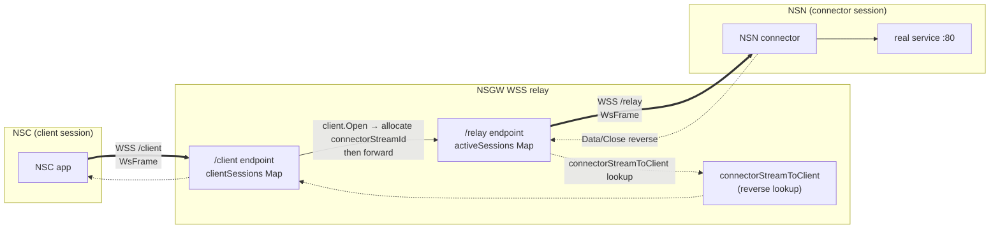
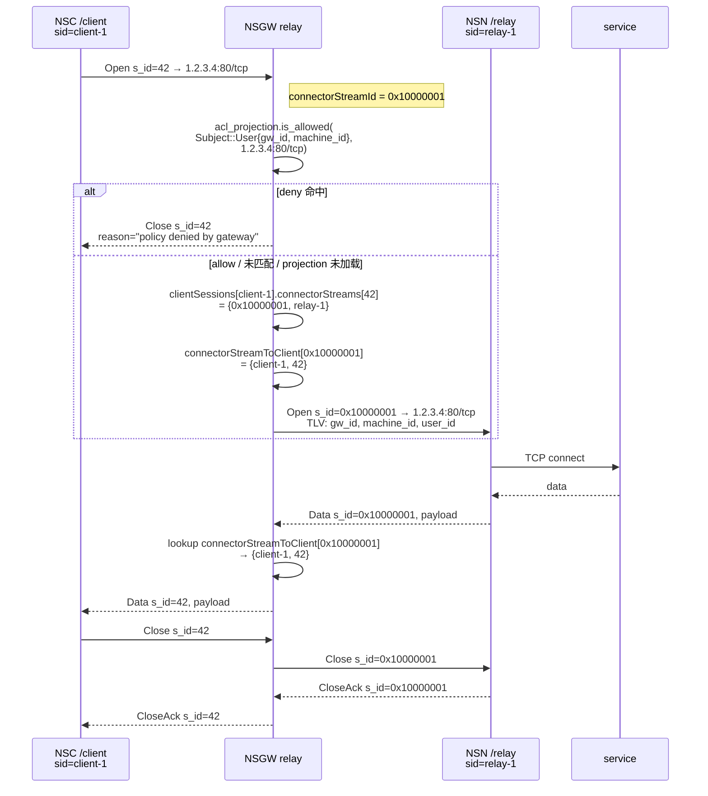

# NSGW WSS 中继

> 本文讲 NSGW 侧的 WSS 中继实现——**会话模型**、"连接器↔客户端" 缝合逻辑、反压与超时、以及 NSN 未接入时的 fallback 直连。
>
> **WsFrame 协议的字节级定义不在本文重复**——权威位置在 [../03-data-plane/tunnel-ws.md §2 WsFrame 二进制协议](../03-data-plane/tunnel-ws.md#2-wsframe-二进制协议)。NSGW 端的编解码实现在 `tests/docker/nsgw-mock/src/wss-relay.ts:74-141`,与 Rust 端 `crates/tunnel-ws/src/lib.rs:140-250` 必须字节级一致。

## 为什么需要 WSS 中继

WireGuard 基于 UDP。但很多用户网络(酒店 WiFi、企业代理、移动网络 DPI)会:

- 完全丢弃 UDP(只放行 TCP 443);
- 只允许 HTTPS(SNI 白名单);
- 限制 UDP 包大小。

NSIO 的对策是让 NSN / NSC 都能 **fallback 到 WSS**(`wss://<gw>/relay`)。WSS 是 WebSocket over TLS,跟普通 HTTPS 在网络上看起来完全一样,穿透能力最强。NSGW 在 WSS 上**终结并转发** WsFrame 帧。



## 会话模型

NSGW 启动单一 `Bun.serve<WsDataTagged>` 实例(`tests/docker/nsgw-mock/src/index.ts:98-175`),监听两个 path,用 `WsDataTagged.kind: "relay" | "client"` 区分。

### 两类会话表

| 表 | 位置 | 键 | 值 |
|----|------|----|----|
| `activeSessions` | `wss-relay.ts:195` | `sessionId`(`relay-<n>`) | `RelaySession` = `{ sendBinary, streams: Map<streamId, StreamState> }` |
| `clientSessions` | `wss-relay.ts:219` | `sessionId`(`client-<n>`) | `ClientSession` = `{ sendBinary, connectorStreams, directStreams }` |
| `connectorStreamToClient` | `wss-relay.ts:225` | `connectorStreamId` | `{ clientSessionId, clientStreamId }` |

`connectorStreamToClient` 是**反查表**——当 NSN 发来 `Data/Close/CloseAck` 时,NSGW 用这个表在 O(1) 时间找到对应的 NSC 客户端会话。

### 握手:/relay vs /client

```typescript
// tests/docker/nsgw-mock/src/index.ts:106-124
if (url.pathname === "/relay") {          // NSN 连接器
  server.upgrade(req, { data: { sessionId, kind: "relay" } });
}
if (url.pathname === "/client") {         // NSC 客户端
  server.upgrade(req, { data: { sessionId, kind: "client" } });
}
```

NSN 走 `/relay` 并被认为是"能触达服务的那一端";NSC 走 `/client` 是"发起请求的那一端"。**NSGW 不维护双向对称:NSC 只能发 Open,NSN 只能被动响应**。这保持了 "ACL 入口在 NSN"的安全模型(`tunnel-ws.md` §1 同义)。

## 核心缝合逻辑:client Open → connector 会话

这是 NSGW 把 "NSC 逻辑流" 绑到 "NSN 会话" 的地方,发生在 `handleClientFrame()` case `"open"`(`tests/docker/nsgw-mock/src/wss-relay.ts:281-316`):

1. 从 `activeSessions` 挑**第一个 NSN 会话**(mock 用 `entries().next()`;生产若有多 NSN,需按 NSD 的路由规则选);
2. 生成**单调递增** `connectorStreamId`(初值 `0x10000000`,`wss-relay.ts:228`,与 NSC 侧 `stream_id` 空间区分开,避免冲突);
3. **ACL 预检(两级信任的前一级)**:用 JWT 里解出的 `(gateway_id, machine_id)` 和 Open 的 `(target_ip, target_port, protocol)` 跑一次本地 `AclEngine::is_allowed(Subject::User{..}, target)`。这个 AclEngine 由 NSD 推送的 `acl_projection` SSE 事件装载(见 [responsibilities.md §⑤](./responsibilities.md#-client-ingress-的-acl-预过滤两级信任的前一级) 与 [../05-proxy-acl/acl.md §4.6](../05-proxy-acl/acl.md#46-两级信任nsgw-预拒--nsn-终决));
   - **命中 `deny`** → 回 `Close{reason: "policy denied by gateway"}` 给 NSC,**不向 NSN 转发任何字节**,流程终止;
   - **命中 `allow`** 或未匹配(默认 allow——NSGW 偏宽)→ 进入 4;
   - **projection 未加载 / NSD SSE 断开** → **fail-open**(让 NSN 兜底,避免 NSD 抖动造成全站 DoS);
4. 双向登记:
   - `client.connectorStreams[frame.streamId] = { connectorStreamId, connectorSessionId }`
   - `connectorStreamToClient[connectorStreamId] = { clientSessionId, clientStreamId: frame.streamId }`
5. 向 NSN 发 `Open` 帧(用 `connectorStreamId`,并在 TLV 里带上 `GATEWAY_ID/MACHINE_ID/USER_ID`,见 [../03-data-plane/tunnel-ws.md §2.4](../03-data-plane/tunnel-ws.md#24-open-帧的-source-identity-扩展));
6. 往后:
   - NSC 发 `Data/Close` → 转发给 NSN,换成 `connectorStreamId`;
   - NSN 发 `Data/Close/CloseAck` → 反查 `connectorStreamToClient` → 换回 `clientStreamId` → 发给 NSC。

> **为什么 NSGW 偏宽、NSN 偏严**:NSGW 的 projection 只是 NSD 推送的 ACL 子集,*没有* NSN 本机 `services.toml` 的"只允许显式服务"地板。如果 NSGW 过严,可能误拒 NSN 本应该允许的流量;而 NSN 是终决者,它有全量 ACL + 本地白名单,拒了的一定拒。所以 **NSGW 只做早拒(kick 掉 99% 明确违规),NSN 永远做最后一次判定**。



## Fallback:NSN 未接入时的直连

当 NSC 发 Open,但 `activeSessions.size === 0`(没有 NSN 连接器)——NSGW 不会直接拒绝。它**在本地建立 TCP/UDP 直连**,自己扮演"到目标服务"的一端。这条路径在 `openDirectStreamForClient()`(`wss-relay.ts:371-421`):

| protocol | 实现 |
|----------|------|
| `tcp` | `net.createConnection({ host, port })` → 字节透传,`socket.on("data")` 回包为 `Data` 帧,`end/error` 回 `Close` |
| `udp` | `dgram.createSocket("udp4")` + `bind(0)` 拿本地端口 → `socket.on("message")` 回包为 `Data` 帧 |

**这是 WG 模式测试场景的兜底路径**——E2E 测试里,当 NSN 通过 WG 隧道接入(而不是 WSS),它不会建立 `/relay` 会话,所以 `clientSessions` 里的 NSC 只能走 NSGW 本地代理。注意**此时流量仍经过 NSGW 节点**,只是没经过 NSN。

生产实现(gerbil)把这个职责拆到独立的 `proxy/proxy.go`(SNI 代理)里,用 PROXY protocol v1 保留客户端真实 IP(`tmp/gateway/proxy/proxy.go:36-72`)。mock 简化成直接 `createConnection`。

## 测试控制面:/probe-open

NSGW mock 还暴露了一个测试专用端点 `POST /probe-open`(`index.ts:130-144`,`wss-relay.ts:439-475`):

```bash
curl -X POST http://nsgw-1:9443/probe-open \
  -H 'Content-Type: application/json' \
  -d '{"target_ip":"1.2.3.4","target_port":80,"protocol":"tcp"}'
```

它的作用:让测试代码能"在服务器侧发一个 Open,看 NSN 返回 `Close`(拒绝)还是 `CloseAck`(接受)"——用来断言 ACL 生效。stream_id 分配到 `0xFFFE0001` 起始的保留段,避开常规流 id。超时 5 s(可由参数覆盖)。

生产环境没有这个端点。

## 反压与超时

当前 mock 实现**无显式反压**:

- `sendBinary` 调用 Bun 的 `WebSocket.sendBinary()`——Bun 侧有内部 send buffer,满时消息被排队;没有 back-pressure 反馈给调用方。
- `socket.on("data")` 推出 `Data` 帧 → 直接 `sendBinary`。在 NSN 处理慢、WebSocket 拥塞时,队列可能增长。

这是 mock 的已知局限。生产设计:

- `crates/tunnel-ws/src/lib.rs` 的 Rust 端用 `mpsc` 通道 + 显式 capacity(参见 [../03-data-plane/tunnel-ws.md](../03-data-plane/tunnel-ws.md) §反压小节)给每个 stream 独立背压。
- gerbil 的 `proxy.go` 用 Go 的 `io.Copy`,依赖 TCP 本身的窗口反压。

超时:

- **连接超时**:`/probe-open` 默认 5 s(`wss-relay.ts:443`);常规 `/client` Open 无自带超时,依赖 NSN 侧 TCP connect 的 OS 默认(~21 s Linux)。
- **会话闲置**:无 idle-timeout;WebSocket 断开由 TCP 层的 TCP-keepalive 决定(Bun.serve 默认)。

## 会话关闭与资源清理

三条清理路径,都会 **级联清理关联资源**:

### A) NSC 客户端断开(`onClientClose`, `wss-relay.ts:252-279`)

```
for each connectorStream owned by this client:
    send Close to NSN (with connectorStreamId)
    remove from connectorStreamToClient
for each directStream:
    destroy TCP socket / close UDP socket
delete clientSessions[sessionId]
```

### B) NSN 连接器断开(`onRelayClose`, `wss-relay.ts:501-525`)

```
destroy all socket streams in this session
for each connectorStream whose connector_id == this session:
    send Close(client_stream_id) to the client
    delete from connectorStreamToClient
connectorConnected = (activeSessions.size > 0)
```

NSN 一掉线,所有走它的 NSC 流**立刻收到 Close**——不会让 NSC 那边悬挂。

### C) 单个 stream 的两阶段关闭

```
side A: Close → side B
side B: CloseAck → side A
删除双方 stream 记录
```

`handleFrame` case `"close"`(wss-relay.ts:559-588)显式回了 `CloseAck`;客户端同样处理(case `"close"` at `wss-relay.ts:336-344`)。

## 监听端口与配置

| 环境变量 | 默认 | 用途 |
|----------|------|------|
| `WSS_PORT` | `9443` | WSS 监听端口(mock);生产通常放在 `443`,由 traefik/SNI 识别 `/relay` 路径 |
| `ENABLE_WSS_RELAY` | `false` | 不开启则不启动 Bun.serve 的 WSS 服务(`index.ts:87`) |
| `KEY_API_PORT` | `9091` | 健康检查 + `/admin/shutdown`(测试用强制退出)+ `/server-pubkey` 端点 |

## 与 traefik 的关系

mock 里 WSS 服务**绕开 traefik**(直接 Bun.serve):traefik 在 `:443` + `:8080`,Bun.serve WSS 在 `:9443`。生产架构图(`docs/architecture.md:45-46`)里 `traefik + kernel WG + WSS Relay` 三者并列,是独立进程。

若要让 WSS 也走 443 端口,需要在 traefik 加一条 IngressRoute 把 `PathPrefix(/relay)` 或 `HostSNI(*wsgw*)` 转发到内部 Bun.serve。mock 未做这层。

## 参考

- 实现: `tests/docker/nsgw-mock/src/wss-relay.ts`(470+ 行)
- 主入口: `tests/docker/nsgw-mock/src/index.ts:87-177`
- 协议定义: [../03-data-plane/tunnel-ws.md](../03-data-plane/tunnel-ws.md)(权威)
- NSN 侧发出方: `crates/tunnel-ws/src/lib.rs` + [../03-data-plane/connector.md](../03-data-plane/connector.md)
- 生产 SNI/WSS 思路: `tmp/gateway/proxy/proxy.go`(独立 SNI 代理 + PROXY protocol v1)
