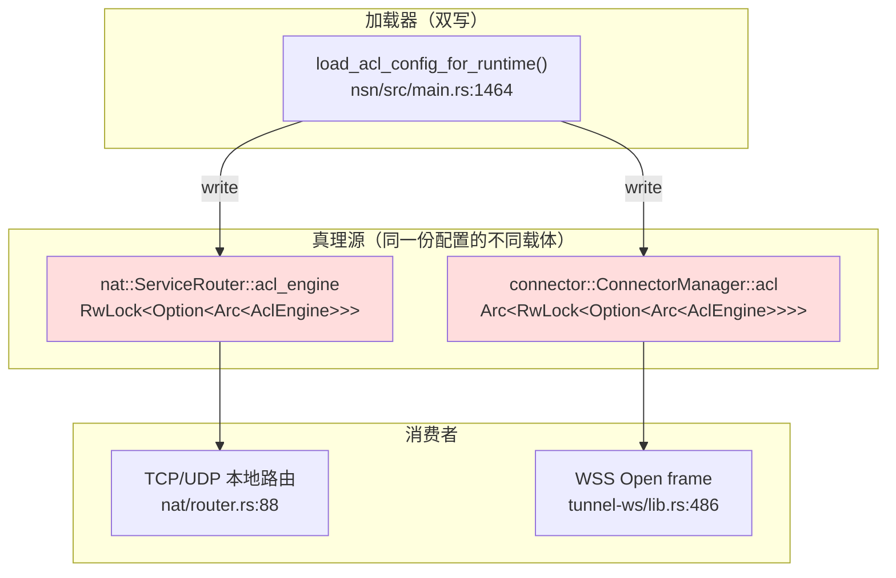

# 架构层缺陷 · ARCH-*

> 这里记录的是**结构性**问题：把所有 TODO 写完、把所有 unimplemented 实现，问题仍然存在。判别规则见 [methodology.md §5](./methodology.md#5-结构性缺陷-vs-未完成实现-判别)。



> 上图：同一份 `AclConfig` 在 NSN 内有**两个独立 Arc**，分别供本地路由和 WSS 路径消费。结构性问题不是"两份"本身，而是它们**对同一种状态采用相反语义**（fail-open vs fail-closed），见 [SEC-001](./security-concerns.md)。

---

## ARCH-001 · ACL 引擎多份持有，语义不统一
- **Severity**: P1
- **Location**: `crates/nat/src/router.rs:40, 56-60, 88-101`；`crates/connector/src/lib.rs:80, 143-145, 152-154`；`crates/tunnel-ws/src/lib.rs:284, 434-466`；装配点 `crates/nsn/src/main.rs:1464-1495`
- **Current**: NSN 内部存在两个独立的 `Arc<RwLock<Option<Arc<AclEngine>>>>`：一个挂在 `ServiceRouter`，一个挂在 `ConnectorManager` 并被 `WsTunnel` 共享。`load_acl_config_for_runtime` 顺序写两份，二者无任何事务保证。
- **Why a defect**: 这是典型的 *"shared state with multiple homes"*。1) 第一个 write 完成、第二个 write 还没完成时，系统进入"半新半旧"状态，并发请求可能命中不同版本；2) 两份持有意味着所有未来扩展（per-tenant ACL、ACL 版本号、ACL audit log）必须改两遍；3) 迫使任何"是否加载"的判断各处独立 — 直接产生了 [SEC-001](./security-concerns.md) 描述的 fail-open vs fail-closed 不一致。
- **Impact**: 维护成本翻倍 + 语义不一致的 corner case 无法在编译期发现。任何引入第三个评估点（例如未来 nsc 端 ACL）都会重蹈覆辙。
- **Fix**: 把 ACL 抽象成单 owner 的 `AclEngineHandle`，对外只暴露 `subscribe()` → `tokio::sync::watch::Receiver<Arc<AclEngine>>`；所有评估点 `borrow().is_allowed(...)`。两个 RwLock 字段下线。装配点变成"创建 watch + 把 receiver 传给所有评估点"。
- **Cost**: 1 个新 crate-level 类型 + 修改 3 处持有 + 修改 5 处读取（路由器、WSS check、未来 NSC ACL）。无对外契约变化。
- **Benefit**: 解锁单一真理源，所有评估点强制同步；版本/审计/per-tenant 切片只在一处实现。
- **Risk**: `tokio::sync::watch` 必须由生产者保证不 drop receiver（drop 会导致永远 pending）；改造时要确保装配 order 正确。

---

## ARCH-002 · ACL 多 NSD 合并使用交集，制造"空配置攻击面"  `[RESOLVED — 决议: 选项 1 并集 + 本地 ACL 保底]`
- **Severity**: P1
- **Location**: `crates/control/src/merge.rs:85-126`；策略文档 [../02-control-plane/design.md](../02-control-plane/design.md)
- **Current**: `merge_acl_configs` 把多个 NSD 推送的 ACL 取**交集** —— 只有"全部 NSD 都包含"的规则才保留。
- **Why a defect**: 这与"add a control plane = expand redundancy"的运维直觉**相反**。peers 用并集合理（多个授权方都说"加这个 peer"则加），但 ACL 用交集意味着：
  - 一个 NSD 由于 bug / config drift / 网络问题返回**空 ACL**，**全局 ACL 立即被清空**。
  - 攻击者只要让一个 NSD 推一个空集（或 `acls = []`）就可以**让站点放行所有流量**（结合 [SEC-001](./security-concerns.md) 的 fail-open，效果是"全开"）。
  - 运维不能"只加 NSD 不影响安全"，反向：**加 NSD 永远只会缩小放行集合**。
  - Self-hosted NSD + cloud NSD 共存时，两边独有的规则互相消失，管理员在 UI 上看不出规则去哪了——排障极为困难。
- **Impact**: 多 NSD 部署的运维心智模型与代码不一致；空配置 = DoS / 提权（取决于是否合 SEC-001）。
- **决议（2026-04-17）**: 采用 **Fix 选项 1：改为并集并附每条规则的 `sources: Vec<NsdId>` 标注**；额外约束：**运行时放行还必须与本地 `services.toml` ACL 取交集作为保底**。NSD 只能"建议放行"，站点主人在本地始终保留最终否决权。这样：
  - 接入新 NSD 只扩不删规则，与 peers/proxy 同向，符合运维直觉。
  - 空 ACL 不再导致全局清空——单个 NSD 故障只让"仅它一家贡献"的规则消失，其他仍然保留。
  - 单 NSD 被入侵下发 `allow all` 也无法超过本地 `services.toml` 的授权范围——安全性由本地 ACL 托底，而不是"多 NSD 互为裁判"。
  - 选 1) 原评估风险（"放行过去被交集裁掉的规则"）被本地 ACL 保底兜住，不再成立。
- **Fix 历史备选（已否）**:
  2. **保留交集**但 *拒绝把空集合并入交集*（empty ACL 视为"未表态"），同时引入 `chain_id` 单调性检查（拒绝倒退到旧版）—— 仍不解决 self-host + cloud 共存的规则消失心智问题。
  3. 用**主从模式**：声明一个 primary NSD，其余只能注解（add-only），不能否决 —— 取消多 NSD 的对等性，与 NSIO "多 realm 并存"的定位冲突。
- **Cost**: 改 30 行 merge 逻辑 + `AclPolicy` 新增 `sources` 字段 + NSN 数据面 hook 本地 `services.toml` ACL 作为最终过滤器（~80 行）+ 跨 docs 更新（已完成）。无线协议变更。
- **Benefit**: 把"多 NSD = 增冗余"做到名副其实；消除 ACL 空集变更的风险；self-host + cloud 共存可运维。
- **Risk**: 本地 `services.toml` 成为安全关键路径，需要文档 / CLI 明确提示管理员"忘了列 = 不可达",并在 `nsn status` 里显式展示"合并规则 X / 本地允许 Y / 实际生效 Z"三列。

---

## ARCH-003 · `nsn/src/main.rs` 里的 `relay_*_connection` 与 `proxy::handle_tcp_connection` 形成两套 TCP relay
- **Severity**: P2（代码重复 + 路径分叉）
- **Location**: `crates/nsn/src/main.rs:1118-1330` 定义 `relay_connection / relay_port_connection / relay_http_connection / relay_https_connection / relay_datagram`；`crates/proxy/src/tcp.rs:12-90` 定义 `handle_tcp_connection`（带 metrics、被自身测试调用）
- **Current**: NSN 真正使用的是 `main.rs:1040` 的 `tokio::spawn(relay_connection(...))`，由 80 / 443 / 其他端口分流到三个不同 relay 函数。`proxy::handle_tcp_connection` 在生产路径上**未被引用**（只有 `proxy/src/tcp.rs:54, 90` 自己的测试在调）。
- **Why a defect**: 两套 TCP relay 实现：(a) `proxy` crate 里那套自带 `ProxyMetrics::bytes_tx/rx` 计数；(b) `nsn/main.rs` 里那套**没有 metrics**，且每个 variant 自己 spawn 两个 task 做 read/write，handle 不到 `bytes_*` 原子计数器。既然有了 80/443 的 Host/SNI 路由，`proxy::handle_tcp_connection` 已经无法直接覆盖，但当前的解法是"完全平行写一份"。
- **Impact**: `/api/metrics` 中的 `nsn_bytes_tx_total` 永远是 0（没有写入路径）；任何想加流量统计 / 流量审计 / 限速 都要在两个地方各加一遍。
- **Fix**: 把 `proxy` crate 的接口重新设计为 *策略驱动*：`relay(stream, target_resolver: impl Fn(...) -> Future, metrics)` —— resolver 接收 first-bytes，返回 `ResolvedTarget`，避免在 80/443 分支 spawn 时再走一遍 connect。`nsn/main.rs` 的 4 个 variant 收敛到 1 个 wrapper，把"嗅探 Host / SNI 后再 resolve"作为 resolver 的参数。
- **Cost**: 重构 `proxy` crate API（约 200 行）+ 替换 `main.rs` 中 4 个函数（约 400 行净下降）。无对外契约变化。
- **Benefit**: 一套 metrics 真实生效；后续做"按 service 限速"、"per-FQID 流量审计"只在一处。
- **Risk**: 嗅探与转发交互复杂，重构需要保留现有 e2e 行为，建议先把现有 4 个 variant 抽测试再重构。

---

## ARCH-004 · `MultiGatewayManager` 健康检查周期被 `#[allow(dead_code)]` 遮蔽
- **Severity**: P1（不是 panic，但是失败模式上的盲区）
- **Location**: `crates/connector/src/multi.rs:156-157`：`#[allow(dead_code)] health_interval: Duration`
- **Current**: 该字段在构造时设为 30 秒（`with_strategy` 默认），但代码中没有任何 `tokio::time::interval` 由它驱动。健康判定靠"WSS 流自然出错"或"upgrade 探测每 300 秒一次"被动触发。
- **Why a defect**: 字段的存在意味着设计原意是"周期主动探活"，但实现逃避了。结果：
  - 一个 NSGW 在 NSN 视角下处于 `Connected`，但实际已经是僵尸（上一次有流量 10 分钟前），策略层选路时仍把它算上。
  - failover 完全靠"下一次实际请求失败"才发生，**首个用户承担探测代价**。
  - `lowest_latency` 选路依赖 `gw.latency = Some(...)`（`multi.rs:216`），但 latency 只在 `mark_connected` 时被写入一次，没有滚动测量。
- **Impact**: 拓扑变化感知滞后 → 用户连接超时；选路策略基于陈旧数据 → 持续命中坏 gateway。
- **Fix**: 实现一个 `health_loop(self, mut shutdown)` 周期任务：每 `health_interval` 对每个 `Connected` gateway 做一次 `connect_timeout=2s` 的轻探（WSS：`/healthz`；UDP：handshake init），更新 latency；连续 N 次失败标 `Failed`，触发 `GatewayEvent::Disconnected`。
- **Cost**: 新加 80~120 行；构造端要保证 `MultiGatewayManager` 被 `Arc<Mutex<_>>` 持有以便 task 持续读写（或重构为 `Arc<RwLock<_>>` + 所有 mutator 内部加锁）。
- **Benefit**: 选路策略基于实时数据；故障 gateway 在用户感知前就被淘汰。
- **Risk**: 探活包频率与 NSGW 端容量需协调（避免 N×M 放大）；要给 health probe 加单独的 metrics。

---

## ARCH-005 · NSC 主循环只 select 3 路 SSE 事件，忽略 4 路接收器
- **Severity**: P1（半实现 + 接口不对称，结构性，因为补全意味着引入新的子系统）
- **Location**: `crates/nsc/src/main.rs:195-296`，特别是 195: `let (control, _wg_rx, _proxy_rx, _acl_rx, mut gw_rx, mut routing_rx, mut dns_rx, _token_rx) = ControlPlane::new(...)`
- **Current**: NSC 的 `ControlPlane::new` 返回 8 个 receiver，但 NSC 仅消费其中 3 个（gateway / routing / dns）。`_wg_rx / _proxy_rx / _acl_rx / _token_rx` 被显式丢弃。
- **Why a defect**: 1) NSC 没有 ACL：客户端→远端服务的访问控制完全在 NSN 侧执行，NSC 自身**无法**根据本地 ACL 拒绝出站请求 — 这与"零信任客户端"的设计直觉不符；2) `_token_rx` 被丢弃意味着 token 刷新事件不会触达 NSC 内部，长时运行需要重连才能更新 token；3) `_wg_rx / _proxy_rx` 被丢弃说明 NSC 永远不能成为"WG 模式真客户端"，TUN 模式只是 placeholder（[FUNC-001](./functional-gaps.md#func-001--nsc-tun-数据面只换前缀未建-tun-设备)）。
- **Impact**: NSC 永远是"瘦客户端"，凡是需要在客户端侧做策略控制的场景（policy-as-code、流量计费、出口审计）必须放到 NSN 上 — 这是**架构限制**而不是配置选项。
- **Fix**: 显式分两步：
  1. 立即：把 `_token_rx` 接到 `proxy_mgr.set_token()` —— 这是 bug 级修复。
  2. 中期：定义 `NscDataPlane` trait（实现：`UserSpaceProxy` / `WssRelay` / `TunDevice`），消费 `_wg_rx / _proxy_rx / _acl_rx`。当前 `proxy::ProxyManager` 只承担 UserSpace；其余两个 placeholder 实现写明 `unimplemented!` + 启动时检查特性开关，**比当前的"静默丢弃 + TUN 模式假装支持"诚实**。
- **Cost**: token: 30 行；trait+UserSpace 抽出: 200 行；TUN 模式真正落地: 不在本审查 cost 内。
- **Benefit**: 接口与实现一致 — 不实现的能力不假装存在；为未来 NSC 端 ACL 留出加载点。
- **Risk**: 没有兼容性破坏（增量），但"TUN 模式不再静默成功"会让现存使用者收到错误 — 这是好事。

---

## ARCH-006 · NSN 单 binary 内 30+ tasks 的装配集中在 `main.rs:300-1100` 一段
- **Severity**: P2
- **Location**: `crates/nsn/src/main.rs:310-1066` 的 `async fn run()` 函数体（约 760 行）
- **Current**: 包含初始化日志、加载 services、加载 machine state、注册、签发心跳、选 transport、装配 ACL handle、绑定 monitor、spawn N 个 task、把 mpsc 在不同 task 间穿线 …… 全部线性铺在一个函数里。
- **Why a defect**: 1) 任何"在 X 之前要 Y"的隐式 ordering 没有类型保证 —— `acl_handle = transport.acl_handle()` 必须在 `transport` 被 move 进 connect/run 之前抓取，注释（`main.rs:791-794`）已经在防御这个陷阱，但下一个修改者还会踩；2) 测试只能 e2e 不能单元覆盖装配错误；3) 30+ task 的 supervision 完全靠 `tokio::spawn`，**无重启策略**，任一 task panic 不会被父任务感知（除非通过 `JoinHandle.await`）；4) `mpsc::Receiver` drop 是 NSN 唯一的"软关停"信号，但 30 个 task 没有统一 cancel token。
- **Impact**: 添加新组件（例如 NSGW 健康探测、Audit log writer）必须在这 760 行里找正确位置插入，且必须手工保持 mpsc 拓扑；任何被 spawn 的 task 死掉，主循环不会重启。
- **Fix**: 拆装配为 builder：
  ```text
  AppBuilder
      .load_state(...)
      .with_control(...)
      .with_transport(...)
      .with_acl_handle()      // 类型上保证它从 transport 派生
      .with_monitor(...)
      .build()                // 返回 App，App::run 里只跑主循环
  ```
  并把所有 spawn 改为 `tokio_util::task::TaskTracker` 或自建 `Supervisor`：每个 task 关联一个 cancel token + restart policy（critical / restart-on-panic / drop-on-panic）。
- **Cost**: 重组 main.rs ~600 行；引入 `tokio-util` 依赖；不破坏对外 HTTP API。
- **Benefit**: 每个组件可单独单测装配；task 生命周期可观测；"幽灵 task" 不再可能。
- **Risk**: 重构面大；建议分阶段：先把 builder 提取，spawn 暂保留；再逐个引入 tracker。

---

## ARCH-007 · `tunnel-wg::AclFilteredSend` 形式上是抽象层，实质是死代码
- **Severity**: P2
- **Location**: `crates/tunnel-wg/src/acl_ip_adapter.rs`（整个文件 188 行）
- **Current**: `AclFilteredSend<S>` 包装任意 `IpSend`，在 `send` 时解析五元组并 `is_packet_allowed`。但 `is_packet_allowed` 实现是"任何 IPv4 TCP/UDP 都过"（line 71-73），未消费 `AclEngine`。整个模块在 `nsn/main.rs` 里**未被实例化**（grep 仅命中本模块自身的 test）。
- **Why a defect**: 1) 模块名暗示"按 ACL 过滤报文"，实际只过滤"是否 IPv4 TCP/UDP"，文档与行为偏离；2) 即便接通，它在 IP 层做 ACL 与现在在"目标解析时做 ACL"是两套语义（前者是 packet drop，后者是 connection deny），二者**不能共存**否则审计日志重复；3) 留在仓库里给未来读者制造"这里好像有 ACL 接入点"的错觉。
- **Impact**: 维护负担 + 误导后来者。如果未来真要在 IP 层做 ACL（例如 site-to-site 模式），这个 helper 也帮不上忙。
- **Fix**: 二选一：
  - **A**：删除整个文件，从 `tunnel-wg::lib.rs` 的 `pub use` 移除（注释/exports 只有 1-2 处用到符号）；释放命名空间，等真要做时重新设计。
  - **B**：让它成为真正的"按 AclEngine 过滤"的层，并在 NSN 装配时启用（适合"site-to-site"场景）。
- **Cost**: A 方案 30 行变更；B 方案 ~150 行 + 在 nsn 启动时做特性开关。
- **Benefit**: 仓库少一个误导符号；如果选 B，则获得 IP 层 ACL 能力（与 connection 层互补）。
- **Risk**: A 方案 = 失去未来选项；B 方案 = 与 ServiceRouter 的 ACL 评估点产生重复，需要明确 audit 路径。

---

## ARCH-008 · 控制面 HTTP API（register/auth/heartbeat）与可插拔 transport 解耦不彻底
- **Severity**: P1（信任边界不对称，与 [SEC-002](./security-concerns.md) 同源）
- **Location**: `crates/control/src/auth.rs:9-23`（`to_http_base`）；`crates/control/src/auth.rs:177, 194, 238` 等所有 HTTP 调用
- **Current**: 控制流的可插拔 transport 设计只覆盖 `/api/v1/config/stream`（SSE）一条长连接。所有"登记 / 认证 / 心跳 / 服务上报 / 设备授权" HTTP 请求一律通过 `to_http_base()` 重写：`noise://X` → `http://X`，`quic://X` → `http://X`。如果运营者把控制中心 URL 写成 `noise://api.example:443`，期望"全程加密"，结果是 register/auth 走 **明文 HTTP**。
- **Why a defect**: 这是"两层信任边界但只保护其中一层"的典型 — Noise/QUIC 的设计意图是抗 DPI、避免普通 TLS 被识别。但 register/auth 是更敏感的数据（pre-shared authkey、Ed25519 签名 challenge），反而走最弱的明文。如果让 transport 系统化，要么**所有**控制面交互都套同一个加密信封，要么明确声明只有 SSE 走加密、其他必须自带 https。
- **Impact**: "可插拔 transport" 这个 selling point 实际只覆盖 8 个 HTTP API 中的 1 个；运营者难以审计真实暴露面。
- **Fix**: 让 `ControlTransport` trait 支持 *unary RPC* 而不止 streaming：
  ```text
  trait ControlTransport {
      async fn unary(&self, req: HttpRequest) -> HttpResponse;
      async fn stream(&self, req: HttpRequest) -> BoxStream<Bytes>;
  }
  ```
  Noise/QUIC 实现把 unary 也封进同一加密通道；SSE 实现继续用 `reqwest`。`AuthClient / HeartbeatClient` 不再持有 `reqwest::Client`，而是持有 `Arc<dyn ControlTransport>`。
- **Cost**: 改动 ~5 个 HTTP 调用点 + Noise/QUIC transport 各加 unary 实现 + auth.rs:9-23 的 hack 删除。线协议不变。
- **Benefit**: 可插拔 transport 名副其实；运营者只需信任一个加密通道；移除"http:// 也算 noise:// 兜底"的歧义。
- **Risk**: Noise/QUIC unary 实现复杂（需要 idempotent retry / timeout 语义）；增量可以先把 auth.rs:9-23 的 `noise://` 改为 `https://`（一行修复 [SEC-002](./security-concerns.md) 的最大窗口）。

---

## ARCH-009 · `connector` 选路策略与 `tunnel-ws` 流路由耦合于 "WSS 单条 TCP 连接"
- **Severity**: P2
- **Location**: `crates/tunnel-ws/src/lib.rs:279-300`（`WsTunnel` struct）；`crates/connector/src/lib.rs:200-228`（connect 选路）
- **Current**: 一个 `ConnectorManager` 同一时刻只能有一个 `Transport::Wss(_)`，对应**一条** WebSocket 连接。所有 WSS 流（`stream_id` 多路复用）都走这条连接。多 NSGW 由 `MultiGatewayManager` 提供选路 *候选*，但 `ConnectorManager::try_wss` 只挑一个。
- **Why a defect**: 1) 单连接是 head-of-line blocking：一条流卡住或大文件下载会降低其他流的吞吐（虽然 WS over TCP 本来就有 HOL，但 NSN 放弃了 HTTP/2 multiplex / QUIC stream 的机会）；2) 不能"主用 GW1，次要用 GW2 平衡"，只能一个挂了切下一个；3) 选路策略 `lowest_latency / round_robin / priority` 本质上变成"挑首选，其余只是 standby"。
- **Impact**: 在 WSS fallback 下，多 NSGW 实际只起冗余、不起负载分担作用。延迟敏感场景下这是一个隐形的性能上限。
- **Fix**: 让 `ConnectorManager` 支持 `Vec<Transport::Wss>`，按 stream-level 选路（同一 service 的流 sticky 到同一 GW 以避免顺序问题）。需要 `WsTunnel` 接口改为"提供一个 `open_stream(target) -> StreamHandle`"由上层挑 tunnel 实例。
- **Cost**: 中等重构（~400 行 connector + tunnel-ws）；监控/路由层接口要扩展"per-stream gateway_id"。
- **Benefit**: 真正的多 NSGW 并行；可做基于 RTT 的动态调度。
- **Risk**: 增加复杂度；需要明确"流粘性"的策略防止协议层乱序。短期不必做，但应在 roadmap 留位。

---

## ARCH-010 · `ServicesConfig` 与 `AclConfig` 是两套独立校验链，缺乏交叉一致性检查
- **Severity**: P2
- **Location**: `crates/common/src/services.rs`（1011 行，含 strict 模式判定）；`crates/acl/src/policy.rs / engine.rs`；装配点 `crates/nsn/src/main.rs:1474-1495`
- **Current**: `services.toml` 定义"哪些本地端口可被代理"，`AclConfig` 定义"哪些目标 IP:port 被允许"。两者由完全不同的 schema、不同的来源（前者本地文件、后者 NSD 推送）维护。NSN 启动时不验证"services 中的端口是否在 ACL 中至少存在一条匹配规则"。
- **Why a defect**: 配置漂移的常见形态是"services 暴露了一个端口，ACL 不允许它"或"ACL 允许的目标 services 没声明" — 二者都导致**静默失败**：用户连接被 close，运维只能从日志一行一行追。
- **Impact**: 配置 bug 难诊断；strict 模式与 ACL 的交互超出文档可读性。
- **Fix**: 在 NSN 启动 / 每次 ACL/services 更新时跑一次 `validate_consistency(services, acl) -> Vec<Warning>`，把不一致项写入 `/api/status` 的 `config_warnings` 字段。算法（伪码）：
  ```text
  for svc in services.enabled():
      if strict and not acl.has_rule_matching(svc.host, svc.port, svc.protocol):
          warn("service {svc.fqid} has no allowing ACL rule")
  for rule in acl.allow_rules():
      if rule.dst_port and not any(svc.port == rule.dst_port for svc in services):
          warn("ACL rule {rule} permits port not declared as service")
  ```
- **Cost**: 新加 ~150 行（1 个验证函数 + 1 个 monitor 字段 + 1 套测试）。
- **Benefit**: 配置漂移在启动期/更新期可发现，避免运行时静默拒绝。
- **Risk**: 警告噪声 — 需要 opt-in 严格度等级。

---

## 跨缺陷主题：抽象的"缝合"代价

把上述缺陷连起来看，可以归纳出一个**架构主题**：

> NSN 选择了"高内聚到 main.rs / 多份持有 + 同步写"的装配方式。结果是任何"跨子系统的不变量"（ACL 同步、token 同步、metrics 一致）都靠**人工记忆 + 注释防御**维持。

这一主题不是单点缺陷，而是 ARCH-001 / ARCH-005 / ARCH-006 / ARCH-008 共同体现的现象。改进方向是：**用类型系统和 channel 拓扑取代"main.rs 手工穿线"**。具体落地见 [improvements.md §2 "Single source of truth"](./improvements.md#2-single-source-of-truth-handle-模式) 与 [roadmap.md Phase 1](./roadmap.md#phase-1--单点真理源--task-supervision)。

## 快速跳转

| 维度 | 文档 |
|------|------|
| 功能未完成 | [functional-gaps.md](./functional-gaps.md) |
| 失败模式 | [failure-modes.md](./failure-modes.md) |
| 性能 | [performance-concerns.md](./performance-concerns.md) |
| 可观测性 | [observability-gaps.md](./observability-gaps.md) |
| 安全 | [security-concerns.md](./security-concerns.md) |
| 改进方案矩阵 | [improvements.md](./improvements.md) |
