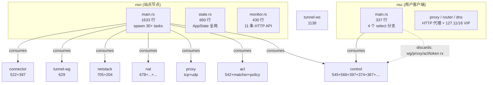
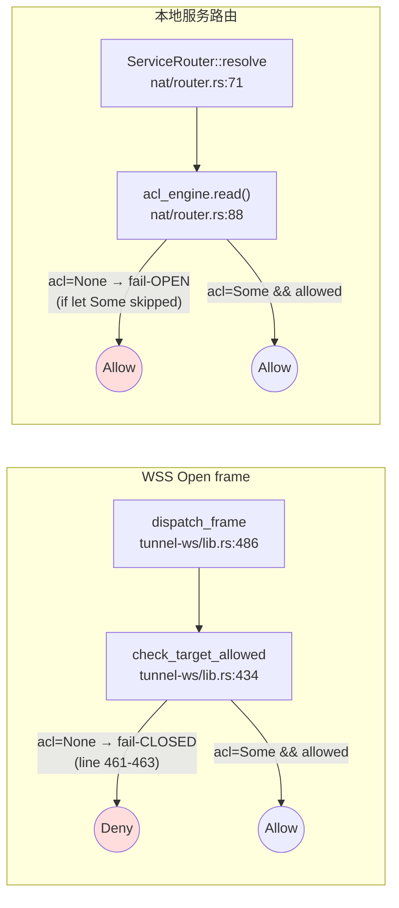

# 现状速览 · NSN + NSC 当前形态

> 一屏看完。本文不替代 [../01-overview/](../01-overview/)，但对审查所需的"判别坐标系"做最小压缩。所有数字基于当前 HEAD：18,037 行 Rust，12 个 crate，2 个二进制（`nsn` / `nsc`）。

## 1. 二进制视角



| 二进制 | 入口 | 接收的 SSE config | 实际消费 |
|--------|------|------------------|---------|
| `nsn` | `main.rs:134` | wg / proxy / acl / gateway / token / routing / dns | **wg + proxy + acl + gateway + token**（routing/dns 给 NSC 用） |
| `nsc` | `main.rs:106` | 同上 7 路 + token | **gateway + routing + dns**（其余 4 路 `_` 丢弃） |

## 2. 数据面三态

| 模式 | 触发条件 | 现状 |
|------|---------|------|
| **WG / TUN** | NSN：root + 内核 TUN 可用 | 用 gotatun + 真 TUN，本地服务走内核协议栈 |
| **WG / UserSpace** | NSN：默认；非 root 或 TUN 不可用 | 用 gotatun + smoltcp，每连接 2 个 TCP 状态机 |
| **WSS** | NSN：UDP 探测 3 次失败 → 自动 fallback；强制：`TRANSPORT_MODE=wss` | tunnel-ws 连接 NSGW 的 `/relay` |
| **NSC TUN** | `nsc --data-plane tun` | **未实际建 TUN**，仅把 VIP 前缀从 `127.11/16` 换成 `10.100/16`（见 [functional-gaps.md FUNC-001](./functional-gaps.md)） |
| **NSC UserSpace / WSS** | 默认 / `--data-plane wss` | 监听 `127.11.x.x` 端口做本地代理 |

## 3. 控制面三传输

```
SSE  (默认)      ── tokio-rustls TLS 之上的 HTTP/1.1 流
Noise            ── Noise_IK over TCP，内层仍是 SSE 解析器
QUIC             ── pubkey-pinned QUIC over UDP，内层仍是 SSE
```

**契约固定点**：内层 `dispatch_message` 始终消费 `ControlMessage` enum；外层换的是加密信封。但 `register / authenticate / heartbeat / discover_nsd_info` 这 4 个 HTTP API 总是经过 `to_http_base()`，把 `noise://` / `quic://` 一律改写成 `http://`（**不是 https**），见 `crates/control/src/auth.rs:15-23`。

## 4. ACL 评估点（两条独立链路）



两条链路对"ACL 引擎尚未加载"采取**相反语义**。这是 [SEC-001](./security-concerns.md) 的核心。

ACL 引擎本身有两份独立 Arc：
- `nat::ServiceRouter::acl_engine` (`nat/router.rs:40`)
- `connector::ConnectorManager::acl` 共享给 `WsTunnel`（`connector/src/lib.rs:80`、`tunnel-ws/src/lib.rs:284`）

`load_acl_config_for_runtime` (`nsn/src/main.rs:1464`) 同时写两份，但失败/部分失败时无回滚，没有事务性。

## 5. 多 NSD / 多 NSGW

| 维度 | NSD（控制面） | NSGW（数据面） |
|------|--------------|---------------|
| 实现 | `MultiControlPlane` (`control/multi.rs:131`) | `MultiGatewayManager` (`connector/multi.rs:152`) |
| 合并语义 | wg = 并集；proxy = 并集；**acl = 交集**；hosts = 交集 | 选路 = lowest_latency / round_robin / priority |
| 异常 NSD 影响 | **任何 NSD 返回空 ACL 即清空全局 ACL**（合集→交集） | 异常 NSGW 标 Failed，不影响其他 |
| 健康检查 | `MultiControlPlane::run` 由 SSE 流自然探活 | `MultiGatewayManager::health_interval` 字段标 `#[allow(dead_code)]`，**未真正定时探活**（`connector/multi.rs:156-157`） |

## 6. 关键 mpsc 缓冲区与 backpressure

| 通道 | 容量 | 行为 |
|------|------|------|
| `WsTunnel::write_tx`（出帧） | 256 | `await` 满则阻塞调用方 |
| 单 stream `data_tx`（每条 WSS 流） | 64 | `await` 满则阻塞 |
| `tunnel-wg::decrypted_tx` / `to_encrypt_tx` | 256 | 同上 |
| `connector::proxy_done_rx` | 1 | 容量 1，仅传一次结束信号 |
| `MultiGatewayManager::event_tx` | 由调用方设置 | `try_send` 失败**静默丢弃**（`connector/multi.rs:190-194`） |

只有 GatewayEvent 是 try_send 静默丢；其余路径采用 await，会反向施压上游 — 但**没有任何 metrics 暴露 channel 占用率**。

## 7. 可观测性快照

| 指标来源 | 暴露形式 |
|---------|---------|
| OTel + Prometheus registry | `init_telemetry()` 注册全局 meter，但仓库中**仅 ProxyMetrics + TunnelMetrics 两个 struct，4+4 个原子计数器**（`telemetry/src/metrics.rs`） |
| `/api/metrics` | 拼接 OTel 输出 + 7 条手写 gauge/counter（uptime / bytes / nat / gateways / control_planes） |
| `/api/status` `/api/healthz` ... | 共 11 条 JSON 端点（`monitor.rs`） |
| tracing | 大量 `info!` `warn!`，**无 span / 无 trace_id 透传** |
| panic 入口 | `nsn/src/main.rs:707` `unreachable!`；`tunnel-ws/src/lib.rs:797..1090` 仅在 `#[cfg(test)]` 里 |

## 8. 半成品 / dead_code 一览

| 位置 | 现象 |
|------|------|
| `crates/connector/src/multi.rs:156-157` | `health_interval` 标 `#[allow(dead_code)]`，30s 周期未驱动任何代码 |
| `crates/tunnel-wg/src/acl_ip_adapter.rs` | `AclFilteredSend` / `is_packet_allowed` 整个模块**仅被自身 test 引用**，未被 `nsn/main.rs` 装配；其 policy 也是"任何 TCP/UDP IPv4 都过"，连 ACL 都没真接 |
| `crates/nat/src/packet_nat.rs:78` | `ConntrackTable` 只有 `insert`，无 cleanup / TTL / 上限 |
| `crates/nsc/src/main.rs:138` | `Status` 子命令明文 `TODO` |
| `crates/nsc/src/main.rs:172` | `--device-flow` 直接 `bail!("not yet implemented")` |
| `crates/nsc/src/main.rs:195` | `_wg_rx, _proxy_rx, _acl_rx, _token_rx` 用下划线**显式丢弃** — 未来要做端到端 NSC ACL 的接口入口未启用 |

## 9. 测试矩阵

- 单元 / 集成测试约 300 个（多数 unwrap/expect 是测试代码，见 [methodology.md §4](./methodology.md#4-缺陷记录格式强制)）
- Docker E2E 4 套：WG / WSS / Noise / QUIC（`tests/docker/docker-compose.*.yml`）
- 测试覆盖率工具未集成 / 未在 CI 报告

## 10. 本文档之外的细节

| 想看什么 | 去哪儿 |
|---------|-------|
| NSN 启动时序、AppState 装配 | [../07-nsn-node/lifecycle.md](../07-nsn-node/lifecycle.md) |
| WSS 帧二进制 / 多路复用 | [../03-data-plane/tunnel-ws.md](../03-data-plane/tunnel-ws.md) |
| ACL 引擎评估算法 | [../05-proxy-acl/](../05-proxy-acl/) |
| NSC VIP / DNS 内部细节 | [../06-nsc-client/vip.md](../06-nsc-client/vip.md) |
| OAuth2 device flow 协议 | [../02-control-plane/design.md](../02-control-plane/design.md) |
