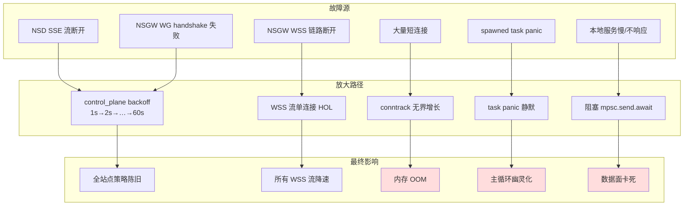

# 失败模式分析 · FAIL-*

> 本文档关注 *"出错时系统如何坏"* — 错误传播、降级路径、雪崩半径、数据一致性。每条缺陷不只问 "会不会出错"，更问 "出错后影响范围多大、运维能否止血"。



---

## FAIL-001 · 任意 spawned task panic 不被父任务感知，无重启策略
- **Severity**: P1
- **Location**: `crates/nsn/src/main.rs` 全文 `tokio::spawn(...)` 出现 30+ 次（如 `:812, :915, :1040, :1048` 等）；`crates/nsc/src/main.rs:210, 217, 236`；spawn 后均**不持有 JoinHandle 也不 await**，结果丢弃
- **Current**: 数据面 task（包括 ACL 配置同步、connector 的 WSS proxy、TCP/UDP relay 的 to_svc/to_stack pair）都靠 `tokio::spawn(...)`，spawn 完即弃。如果某个 task 内部 panic，tokio 默认会把 panic 写入 stderr，但不会影响其他 task；NSN 主进程**继续运行但功能残缺**。
- **Why a defect**: 这是典型的"silent degradation" — 进程没死、`/healthz` 仍 200、但实际配置 / 流量分支已挂。运维只能通过流量异常发现，难以根因定位。
- **Impact**: 关键场景：
  - ACL 配置同步 task panic（line 812）→ ACL 永远停在最后一次成功载入，新规则不生效，但 `/api/acl` 仍返回旧版数据。
  - connector WSS proxy task 内部 panic（被 spawn 在 `connector/src/lib.rs:315`）→ tunnel 无声死亡，`is_wss()` 仍为 true，所有新 Open 都失败但 `/api/status` 仍 connected。
  - relay TCP read/write task panic → 单个连接死，下一个连接照常。但如果是公共代码路径的 panic，每条流都重复 panic。
- **Fix**: 引入 `Supervisor`（或借用 `tokio_util::task::TaskTracker` + 自己的重启策略）：
  ```text
  enum RestartPolicy { OneShot, ExpBackoff{max: Duration}, Critical }
  supervisor.spawn("acl_config_loader", RestartPolicy::ExpBackoff{60s}, async { ... });
  supervisor.spawn("wss_proxy", RestartPolicy::Critical, async { ... });
  ```
  Critical 任务 panic 时主进程优雅退出（让 Kubernetes / systemd 重启）；ExpBackoff 任务 panic 后按指数退避重启；OneShot 任务 panic 后只 log。同时所有 spawn 的 task 都进入 `/api/tasks` 监控（任务名、状态、重启次数）。
- **Cost**: 200~300 行 supervisor + 改 30+ 个 spawn 调用点。
- **Benefit**: panic 不再静默；运维有止血面板。
- **Risk**: panic 后重启可能掩盖根因；建议 panic 触发后 retain stderr trace + metrics 自增 `nsn_task_panic_total{task="..."}`。

---

## FAIL-002 · `acl_config_rx.recv()` 启动期 10s 超时后继续运行，ACL 永久缺失
- **Severity**: P0（与 [SEC-001](./security-concerns.md) 合体后立即导致放行所有流量）
- **Location**: `crates/nsn/src/main.rs:802-810`
- **Current**:
  ```rust
  match tokio::time::timeout(Duration::from_secs(10), acl_config_rx.recv()).await {
      Ok(Some(cfg)) => load_acl_config_for_runtime(...).await,
      Ok(None) => warn!("ACL config channel closed before receiving config"),
      Err(_) => warn!("timed out waiting for initial ACL config; continuing without WSS ACL"),
  }
  ```
  注释说明"必须靠 `/healthz` 与 `/api/status` 的 `acl_status` 来检测；caller 应 gate traffic on those"。但**默认情况下没有任何阻塞** — NSN 继续启动并接受流量。
- **Why a defect**: "ACL 缺失即继续启动" 是 fail-open 的延伸版。即便 `/healthz` 报告 `acl_loaded=false`，没有强制 K8s readiness probe / load balancer 阻塞流量，请求就是会进来。注释把责任推给"caller"，但 NSN 没有任何 caller 教程文档说明这个 readiness 信号是 mandatory。
- **Impact**: 部署在没有 readiness gate 的环境（裸机、单节点、SystemD service）会暴露未保护流量。即便 K8s 部署，大多数运维不会区分 `/healthz` 200 与 `acl_loaded=true`。
- **Fix**: 三层防御：
  1. **配置开关** `nsn.require_acl_on_startup = true`（默认 true）：超时后**进程直接退出**（让 supervisor 重启），而不是继续。
  2. **如果选择继续**（`require_acl_on_startup=false`）：进入"safe mode"，所有新流量返回 `503 Service Unavailable / TCP RST`，metrics 自增 `nsn_safe_mode_rejects_total`，直到 ACL 加载。
  3. **绑定 ServiceRouter fail-closed**：见 [SEC-001](./security-concerns.md)。
- **Cost**: 80 行（超时 → exit 路径 + safe mode 在数据面分支判定）。
- **Benefit**: 默认安全，bug-by-default 转 secure-by-default。
- **Risk**: K8s 部署中 NSN 重启可能进入 CrashLoopBackoff（ACL 来源持续失败时） — 但这正是 readiness 期望的行为。

---

## FAIL-003 · WSS 单连接 head-of-line blocking，所有流共享一个 TCP socket
- **Severity**: P2
- **Location**: `crates/tunnel-ws/src/lib.rs:279-300`（WsTunnel struct）；`crates/tunnel-ws/src/lib.rs:361` 单 `write_tx`；`relay_tcp` / `relay_udp` 写出都通过 `write_tx.send(Message::Binary(...)).await`
- **Current**: 一个 NSGW = 一条 WS over TCP 连接 = 一个 `write_tx`（容量 256）。所有 stream 的 outbound 帧共享这个 channel & 这条 TCP 连接。
- **Why a defect**: 一旦某条流的下游 NSN 端写入慢（例如目标服务 hang），它的 `write_tx.send().await` 会阻塞自己的 task — 这部分不会拖累其他流。但**TCP 层面**，所有流共享同一个 send buffer + congestion window；任意一条大流量传输就会让其他小流的延迟翻倍（HOL）。
- **Impact**: 用户体验：在 WSS fallback 下打开一个大下载会让 SSH 卡顿；在多 NSGW 部署下没法用"另一条腿"减压（[ARCH-009](./architecture-issues.md#arch-009--connector-选路策略与-tunnel-ws-流路由耦合于-wss-单条-tcp-连接)）。
- **Fix**: 中期方案见 [ARCH-009](./architecture-issues.md#arch-009--connector-选路策略与-tunnel-ws-流路由耦合于-wss-单条-tcp-连接)；短期方案：
  - 引入"per-stream priority"：把 `write_tx` 替换为 `tokio::sync::mpsc::Sender<(Priority, Message)>`，写出 task 用优先级队列消费；ACL/control 帧高优先级，data 帧普通优先级，大块数据可以拆 chunk + yield。
  - 监控 `nsn_wss_write_tx_lag_seconds` 直方图，发现 HOL 后告警。
- **Cost**: 100 行（priority queue + metric）；ARCH-009 的多连接方案 ~400 行。
- **Benefit**: 缓解 HOL；为 multi-tunnel 改造留路。
- **Risk**: 优先级反转 — control 帧优先可能让 data 帧饥饿，需要时间窗保护。

---

## FAIL-004 · `connector::ConnectorManager::run` 在 WSS→UDP 升级时 abort 中断所有 WSS 流
- **Severity**: P2
- **Location**: `crates/connector/src/lib.rs:354-362`
- **Current**:
  ```rust
  _ = upgrade_interval.tick() => {
      match self.probe_udp(wg_config).await {
          Ok(()) => {
              info!("UDP recovered; upgrading WSS -> UDP");
              if let Some(h) = proxy_handle.take() {
                  h.abort();         // ← 强制 abort，无 drain
              }
              self.active = Some(Transport::Udp);
              break;
          }
          ...
      }
  }
  ```
- **Why a defect**: 升级路径的设计目标是"恢复到首选 UDP"，但实现是**硬切换**：`h.abort()` 立即终止 WSS proxy task，所有进行中的 WSS 流被斩断，下一秒重新经 UDP 建。对于长流（SSH / 持续 HTTP / WebSocket）这意味着用户感知的连接重置。
- **Impact**: 每 5 分钟的探测窗口都可能制造可见的"卡顿—重连"，UX 退化。运维很难解释"为什么明明 UDP 恢复了，反而出现连接断开"。
- **Fix**: 优雅 drain：
  1. 收到升级信号后，标记 WSS 为 "draining"：拒绝新 Open，但允许已存在的 stream 跑完 / 跑到一个超时（例如 30s）。
  2. `proxy_handle.await` 而非 abort，等所有 stream 自然 close 或超时。
  3. 同时 UDP 已经能接受新流量。
- **Cost**: 80 行（draining state + grace period）。
- **Benefit**: 升级无感；UX 从"连接断开"变为"逐渐迁移"。
- **Risk**: drain 期间内存 / 连接数翻倍；需限制并发 drain。

---

## FAIL-005 · 反向 NAT miss 静默丢包，无 metric 无 log
- **Severity**: P1
- **Location**: `crates/nat/src/packet_nat.rs:376` `let val = conntrack.0.get(&key)?;`
- **Current**: 来自本地服务的 reply 报文进入 `apply_reverse_nat`，若没在 conntrack 表中找到对应 entry，函数 `?` 返回 `None`，调用方丢弃报文。无 log、无 metric。
- **Why a defect**: 攻防权衡的副作用 — 防御视角下"未发起的连接的 reply 应被丢"是对的；运维视角下完全失去诊断能力：
  - conntrack 因 GC 清掉早期 entry → 长流的 reply 被丢，应用层只看到"突然断"。
  - DNAT 表与 conntrack 不一致（双写时序问题，[ARCH-001](./architecture-issues.md#arch-001--acl-引擎多份持有语义不统一) 同源）→ 静默丢包。
  - 流量重定向（NSGW 切换）导致五元组变更 → 反向报文 miss。
- **Impact**: 难诊断；用户报"间歇性断流"运维束手无策。
- **Fix**: 加 metric + sampled log：
  - `nsn_nat_reverse_miss_total{proto,dst_port}` Counter
  - 1% 采样 `tracing::warn!(?key, "reverse NAT miss")`，避免日志爆炸
  - `/api/nat/misses?last=100` 暴露最近 100 条 miss key 用于人工 inspect
- **Cost**: 50 行。
- **Benefit**: 把"静默丢包"变成可观测事件；为 conntrack TTL 调参提供数据。
- **Risk**: 极低 — 只是观测，不改语义。

---

## FAIL-006 · `MultiControlPlane` ACL 交集合并 + 单 NSD 空配置 = 全局策略清空
- **Severity**: P0（与 [ARCH-002](./architecture-issues.md#arch-002--acl-多-nsd-合并使用交集制造空配置攻击面) 同源；列在这里因为它的"故障传播路径"特别短）
- **Location**: `crates/control/src/merge.rs:85-126`；`crates/control/src/multi.rs:131` 主循环
- **Current**: 任一 NSD 推 `AclConfig { acls: [], hosts: {}, tests: [] }`，merge 结果是空 `AclPolicy`。NSN 的 `load_acl_config_for_runtime` 加载空策略，所有规则消失。
- **Why a defect**: 故障传播路径 = "1 个 NSD 出问题 → N 个 NSN 同时丢失全部 ACL"。半径太大、止血窗口太短。
- **Impact**: 多 NSD 场景下，一个 NSD 配置错误立刻通过合并策略影响所有节点。
- **Fix**: 见 [ARCH-002](./architecture-issues.md#arch-002--acl-多-nsd-合并使用交集制造空配置攻击面)。失败模式视角下额外建议：
  - 加监控 `nsn_acl_rule_count{source="merged"}`；运维设告警"骤降 > 50% in 60s"。
  - 引入"sticky" 模式：合并结果若规则数比上一版下降超阈值，**拒绝应用** + 告警，等运维确认。
- **Cost**: 100 行（sticky 检查 + metric）。
- **Benefit**: 把"分钟级全站点失保护"变成"NSD 配置错也要被发现才能扩散"。
- **Risk**: sticky 阈值需要场景化；初版可设 50% 触发 + log only。

---

## FAIL-007 · 控制面 backoff 在指数退避时 token 可能过期，重连后立即 401 再退避
- **Severity**: P2
- **Location**: `crates/control/src/lib.rs:206, 219, 241`（backoff 状态机）；`crates/control/src/auth.rs:238` `authenticate()`
- **Current**: 控制面状态机在 backoff 阶段 `1 → 2 → 4 → … → 60s` 指数退避，每次成功收事件重置回 1s。但 backoff 期间 NSN 不会主动刷新 JWT；如果断流的原因恰好是 token 过期，backoff 60s 后再次 authenticate → 成功 → 立即开始接 SSE → 服务端发现 token 又过期（因为 backoff 太久）→ 401 → 又进入 backoff。
- **Why a defect**: 退避策略与认证状态机解耦，没有"backoff 时间过长则强制重新 authenticate"的逻辑。某些情况下会形成"60s 退避 + 1s 工作"的振荡。
- **Impact**: 控制面长时间不可用却无法报警（重试间隔 60s 看起来"系统在工作"），实际配置 / token 永远不更新。
- **Fix**: 1) 在 SSE 流读取出错时分类 401 vs 网络错；401 走 `re-authenticate` 路径而不是单纯 backoff；2) backoff > 30s 时强制下次先 authenticate；3) metric `nsn_control_plane_backoff_seconds` Gauge + `nsn_control_plane_auth_total{result}` Counter，告警"100% 都是 expired"。
- **Cost**: 80 行 + 一组单测。
- **Benefit**: token 漂移场景下能自愈；运维能在指标里看到"不是网络问题，是 token 问题"。
- **Risk**: 频繁 authenticate 增加 NSD 负载 — 但 401 本就是异常，频率有限。

---

## FAIL-008 · 大量未消费的 mpsc 通道在长跑后可能背压上游而不暴露
- **Severity**: P2
- **Location**: `crates/connector/src/multi.rs:190-194` `try_send` 静默丢；其余通道 `await` 阻塞但无监控
- **Current**: `MultiGatewayManager::emit` 用 `try_send`，channel 满则丢事件（gateway connected/disconnected/upgrade）。其他路径用 `await`，背压时直接阻塞调用方 task。哪种都没有"channel 占用率" metric。
- **Why a defect**: 1) 丢的事件意味着 `/api/gateways` 状态可能与真实 transport 状态短暂不一致；2) 背压阻塞意味着上游 task 看似 healthy 实际卡在 send；3) 没 metric 意味着运维不知道哪条 channel 是瓶颈。
- **Impact**: 性能问题诊断困难；事件丢失后状态机错误不可逆（必须等下一个事件覆盖）。
- **Fix**:
  - 给所有 mpsc 通道命名 + 指标：`nsn_channel_len{name="..."}` Gauge、`nsn_channel_drops_total{name="..."}` Counter（用 try_send 的）、`nsn_channel_send_blocked_seconds{name="..."}` Histogram（用 await 的，可借助 `tokio::sync::mpsc::Sender::reserve`）。
  - emit 失败时不仅丢，还把"missed event"标志写入下次成功事件的 metadata（让消费者知道有过 gap）。
- **Cost**: 150 行（metric wrapper）。
- **Benefit**: 通道行为可观测；从猜测变成数据驱动调容量。
- **Risk**: metric wrapper 引入间接层，需保留原有 await/try_send 语义。

---

## FAIL-009 · `proxy_done_rx` 容量 1，WSS proxy 异常退出后不重连
- **Severity**: P1
- **Location**: `crates/connector/src/lib.rs:309, 314-320, 344-351`
- **Current**:
  ```rust
  let (proxy_done_tx, mut proxy_done_rx) = mpsc::channel::<Result<(), String>>(1);
  ...
  let handle = tokio::spawn(async move {
      let r = proxy.run().await;
      let _ = tx.send(r.map_err(|e| e.to_string())).await;
  });
  ...
  result = proxy_done_rx.recv() => {
      match result {
          Some(Err(e)) => warn!("WSS proxy closed with error: {e}"),
          Some(Ok(())) => info!("WSS proxy closed"),
          None => warn!("WSS proxy task ended unexpectedly"),
      }
      break;
  }
  ```
  收到任何 done 信号即 break — 包括 panic / 网络错。**没有重连** — 等待外层（`run()` 调用方）重新进入 connect 循环。
- **Why a defect**: 看似正确（让上层处理），但上层在哪？grep 表明 `connect()` + `run()` 主要在 `nsn/main.rs` 启动一次，**没有外层重连循环**。WSS proxy 死 = 数据面 WSS 通道永久消失，only fall back 是等到下次 NSN 重启。
- **Impact**: WSS 模式下任何瞬时网络抖动都可能让 NSN 永久退化，直到重启。
- **Fix**: 在 `run()` 内部把 `proxy_done` 路径从 `break` 改为：
  - 进入"reconnect WSS"子状态：`teardown -> try_wss(retry) -> respawn proxy`，重连退避同 [FAIL-007](#fail-007--控制面-backoff-在指数退避时-token-可能过期重连后立即-401-再退避)。
  - 或者把"reconnect" 责任明确推到 NSN 主循环并写文档说明。
- **Cost**: 100 行（reconnect 状态机 + metric）。
- **Benefit**: WSS 数据面具备自愈能力。
- **Risk**: 重连风暴 — 必须有指数退避 + cap。

---

## FAIL-010 · `JoinHandle.abort()` 在升级 / shutdown 时不等 task 完成清理
- **Severity**: P2
- **Location**: `crates/connector/src/lib.rs:339, 358`；`crates/control/src/multi.rs` 中 NSD task 关停
- **Current**: 多处使用 `h.abort()` 强制中止 task。abort 只是发送 cancel，不等 task 完成清理（drop guard / metric -1 / log 收尾）。
- **Why a defect**: 1) ProxyMetrics::active_connections 等计数器可能不会被 -1，造成"幽灵连接"；2) `tokio::sync::mpsc` 在 task abort 后立即 close，残留 in-flight 数据丢失；3) 调试时栈跟踪不完整。
- **Impact**: 指标偏差累积；shutdown 不干净（systemd 看到 graceful timeout 后强杀）。
- **Fix**: 引入"co-operative shutdown"模式：使用 `tokio_util::sync::CancellationToken`；task 内部 select cancel + 自然 work；退出前执行 cleanup。`abort()` 仅作为最后手段（cancel 后超过 grace period 才 abort）。
- **Cost**: 200 行（重构 task lifecycle）。
- **Benefit**: shutdown / 升级行为可预测；指标准确。
- **Risk**: 需要每个 task 主动配合 cancel；不配合的 task 仍要 abort 兜底，不能 100% 净。

---

## FAIL-011 · 本地服务慢响应时 `relay_*_connection` 的 to_svc/to_stack 永久 await
- **Severity**: P2
- **Location**: `crates/nsn/src/main.rs:1161-1183`（relay_port_connection 内的 spawn 对）
- **Current**: 两个内部 task 分别在 `data_rx.recv() / svc_rx.read()` 上 await，没有读写超时。如果本地服务 accept 后不读不写（例如挂死的 java app），两个 task 永远停在 await，conntrack/connection_tracker 不释放。
- **Why a defect**: 本地服务故障会无界占用 NSN 资源（task 数、connection_tracker 计数、conntrack entry）。
- **Impact**: 慢服务 → 资源累积；与 [FUNC-005](./functional-gaps.md#func-005--conntracktable-仅有-insert无-gc无-ttl无容量上限) 共振后扩散更快。
- **Fix**: 给 read/write 加 `tokio::time::timeout`：默认 idle timeout 例如 5 分钟（可配置）；超过后主动 close stream + log + metric。
- **Cost**: 60 行 + 1 个 config 字段。
- **Benefit**: 慢服务自愈；防止资源泄漏。
- **Risk**: 太短的 timeout 误伤合法长连接（SSE、长 SSH idle）；可按 service 类型差异化。

---

## 跨缺陷主题：silent degradation

NSN 的故障模型大量存在 *"健康检查仍 200，但功能已残缺"*：

- task panic 不报（FAIL-001）
- ACL 缺失继续启动（FAIL-002）
- 反向 NAT miss 不报（FAIL-005）
- 通道丢事件不报（FAIL-008）
- WSS proxy 死不重连（FAIL-009）

补救方向不是"加更多 healthz 字段"，而是 *"任何 silent degradation 都应该升格为 metric counter + alert"*。具体落地见 [observability-gaps.md](./observability-gaps.md) 与 [improvements.md §3](./improvements.md#3-silent-degradation--可观测信号).
