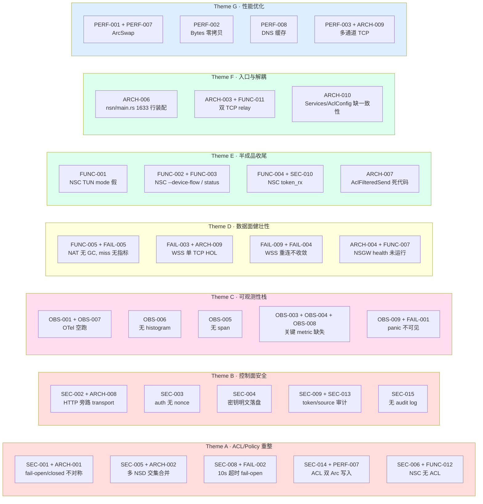

# 改进方案矩阵 · NSN + NSC

> 把前 6 章（architecture / functional / failure / performance / observability / security）共 70+ 条缺陷，**收敛**为可执行的 fix proposals，附成本/收益/风险评估。
> 真实排期见 [roadmap.md](./roadmap.md)；本章只回答"做什么 + 为什么 + 多大代价"。

## 0. 收敛思路：缺陷 → 主题

70+ 条缺陷天然聚成 7 个主题（themes），每个主题用一个或一组改造可同时解决多个缺陷：

---

## 1. 主题级 fix proposals

每个主题给出"目标状态 → 具体改造 → 包含的缺陷"。

### Theme A · ACL / Policy 重整（最高优先）

**目标状态**：所有数据面入口共享同一份 ACL 引擎，任何状态变化都是显式 + 原子 + 可观测；fail-closed 是默认；多 NSD 合并不再有"任一推空即清空"的雪崩。

**具体改造**（按依赖顺序）：

| # | 改造 | 影响文件 | 关闭缺陷 |
|---|------|---------|---------|
| A.1 | `AppState` 增加 `acl: ArcSwap<Option<AclEngine>>`,删除 `nat::ServiceRouter::acl_engine` 和 `connector::ConnectorManager::acl` 两份独立 Arc | `nsn/src/state.rs`, `nat/src/router.rs:40`, `connector/src/lib.rs:80` | SEC-014, ARCH-001 (部分), PERF-007 |
| A.2 | 把 `nat::ServiceRouter::resolve*` 三处 `if let Some(acl)` 改为 `let Some(acl) = ... else { return None; }`,fail-closed | `nat/src/router.rs:88-101, 133-146, 158+` | SEC-001, ARCH-001 |
| A.3 | 启动序列：在 ACL 加载完成前**不绑数据面 listener**;增加 `acl_required: bool` 配置项(默认 true) | `nsn/src/main.rs:790-880` | SEC-008, FAIL-002 |
| A.4 | `AclConfig::Empty`(or `Sentinel::Empty`) ≠ `AclConfig::DenyAll`;merge 时空配置不参与交集 | `control/src/merge.rs:85-145` | SEC-005, ARCH-002, FAIL-006 |
| A.5 | 增加 metric `nsn_acl_load_state` (gauge),`nsn_acl_denials_total{reason,service}` (counter),`nsn_acl_allows_total{service}` (counter) | `nsn/src/state.rs`, `nsn/src/monitor.rs` | OBS-008 |
| A.6 | NSC 接管 `_acl_rx` 并复用 `acl::AclEngine`;NSC 路由全部走 ACL 检查 | `nsc/src/main.rs:195`, `nsc/src/router.rs`, `nsc/src/proxy.rs` | SEC-006, FUNC-012 |
| A.7 | WSS Open frame 增加强制黑名单(loopback/link-local/metadata/multicast) | `tunnel-ws/src/lib.rs:434-466` | SEC-007 |

**总成本**：~12 人日（含集成测试）  
**收益**：消除 4 个 P0 安全缺陷 + 1 个 P0 可用性缺陷 + 解锁后续 ACL 表达力扩展（src 维度等）  
**风险**：中。启动时延变长（需 NSD 可达），需要文档+健康探针配套；既有部署的 ACL 配置可能因新黑名单而拒掉边缘合法连接（需提供 `data_plane.allow_loopback_targets = false` 开关）

---

### Theme B · 控制面安全

**目标状态**：register / authenticate / heartbeat 不再走旁路 HTTP；身份私钥不再以明文落盘；安全事件有独立审计通道。

| # | 改造 | 影响文件 | 关闭缺陷 |
|---|------|---------|---------|
| B.1 | **立刻**：`to_http_base()` 返回 `https://...`(而非 `http://`);reqwest::Client 显式装配 rustls + webpki_roots(与 SseTransport 一致) | `control/src/auth.rs:15-23`,`control/src/auth.rs:67/136/284` | SEC-002 (短期) |
| B.2 | **正确做法**：把 register/auth/heartbeat 4 个 HTTP API 升级为通过 `ControlTransport` trait;noise/quic 部署下走加密信封 | `control/src/auth.rs`,`control/src/transport/mod.rs`,NSD 端协议改造 | SEC-002 (长期), ARCH-008 |
| B.3 | auth 改为 challenge-response;签名嵌入 `nsd_url` + server nonce | `control/src/auth.rs:235-272`,NSD 端 `/api/v1/machine/auth/challenge` | SEC-003 |
| B.4 | 私钥写入前 AEAD 包裹(chacha20poly1305);密钥来自 `NSN_KEY_ENC_KEY` 或 OS keyring;提供 fallback "兼容旧明文文件并升级"路径 | `common/src/state.rs:401-433` | SEC-004 |
| B.5 | 用 `secrecy::SecretString` 包裹 `self.token`;tracing field 强制脱敏(只输出前 6 字符) | `control/src/sse.rs:95-96, 109, 134, 281-282, 304, 342` | SEC-009 |
| B.6 | WSS Open frame 增加 `source: Option<SourceIdentity>`(machine_id/vip);ACL 评估和审计日志透传 | `tunnel-ws/src/lib.rs:480-498`,NSGW 端 | SEC-013 |
| B.7 | 引入 `SecurityEvent` enum + 独立 syslog/file sink | 新建 `crates/audit/`,接入 nsn/main.rs | SEC-015 |

**总成本**：~10 人日（B.1 当下做完;B.2 是大改造,可能需协议版本协商）  
**收益**：闭合最严重的两个 P0 安全缺陷 + 满足合规审计要求  
**风险**：B.1 需 NSD 端配套开 https；B.2/B.3 涉及协议版本协商，需向后兼容

---

### Theme C · 可观测性栈统一

**目标状态**：所有指标统一从 OTel meter 暴露；关键路径有 histogram；spawn 任务有 panic catch + counter；NSC 也有 /metrics。

| # | 改造 | 影响文件 | 关闭缺陷 |
|---|------|---------|---------|
| C.1 | 把 `monitor.rs:344-375` 的手写 format!() 全部改造为通过 `opentelemetry::global::meter("nsn")` 创建 instrument;OTel pipeline 与 prometheus registry 绑定 | `monitor.rs`, `telemetry/src/lib.rs`, 各业务 crate | OBS-001, OBS-007 |
| C.2 | 删除 dead `telemetry::metrics::TunnelMetrics`;`nsn::state::TunnelMetrics` 字段绑 OTel observable gauge | `telemetry/src/metrics.rs`,`nsn/src/state.rs:101-112` | OBS-002 |
| C.3 | 关键路径增加 histogram:WSS Open / ACL is_allowed / ServiceRouter::resolve / SSE dispatch / wg encrypt-decrypt | 各 crate | OBS-006 |
| C.4 | 封装 `MeteredSender<T>`,所有 mpsc 用它包裹;暴露 `nsn_channel_pending{name}` gauge + `nsn_channel_dropped_total{name}` counter | `tunnel-ws/lib.rs:243`, `tunnel-wg/lib.rs`,`connector/multi.rs:190` | OBS-004, FAIL-008 |
| C.5 | 增加 `NatStats::reverse_lookup_miss` + metric `nsn_nat_reverse_miss_total` / `nsn_nat_drops_total` | `nat/src/packet_nat.rs`,`nsn/src/state.rs:117-124`,`monitor.rs` | OBS-003, FAIL-005 |
| C.6 | 封装 `spawn_named(name, fut)`(catch_unwind + panic counter + 关键 task panic 即进程退出);`/api/healthz` 检查关键 task 仍在 | 全仓库 spawn 调用点(~30+) | OBS-009, FAIL-001, FAIL-010 |
| C.7 | 入口 task 创建 root span,绑定 `gateway_id`/`connection_id`/`frame_seq`;`spawn` 用 `Instrument::instrument(span)` 包裹 | 各 crate | OBS-005 |
| C.8 | NSC 增加 minimal /metrics 端点(127.0.0.1) | `nsc/src/main.rs`,新增 monitor 模块 | OBS-010 |
| C.9 | 文档增加 SLI/SLO 章节(4 个核心 SLI) | `docs/01-overview/` | OBS-011 |
| C.10 | 日志 file appender 改为按大小+保留窗口滚动 | `nsn/src/main.rs:243-251` | OBS-012 |

**总成本**：~14 人日  
**收益**：所有后续 perf / 安全 / 故障改造都能被定量验证;MTTR 降低  
**风险**：低,纯增量改造

---

### Theme D · 数据面健壮性

**目标状态**：NAT 表有 GC 不会 OOM；NSGW 健康探活真正运行；WSS 通道断不出现"半瘫痪"。

| # | 改造 | 影响文件 | 关闭缺陷 |
|---|------|---------|---------|
| D.1 | `ConntrackTable` 增加 TTL/cap/cleanup 后台 task;暴露 `nsn_conntrack_evictions_total` | `nat/src/packet_nat.rs:78`,`nsn/src/main.rs` | FUNC-005, FAIL-005 (部分) |
| D.2 | 移除 `MultiGatewayManager::health_interval` 的 `#[allow(dead_code)]`,启动 30s 健康探活 task;Failed gateway 进入指数退避重连 | `connector/multi.rs:152-200`,`nsn/main.rs` | ARCH-004, FUNC-007 |
| D.3 | WSS upgrade 不再 abort 旧 stream;先把旧通道置为 draining,完成 in-flight stream 后再切;或回退/明确放弃 upgrade 能力 | `connector/src/lib.rs:60-378`,`tunnel-ws/src/lib.rs` | FAIL-004, FAIL-009 |
| D.4 | 单 WSS TCP 改为 N 路 TCP(N=cpus 或可配);streams 哈希分散到 N 个 write_tx | `tunnel-ws/src/lib.rs`,WS frame 协议向后兼容协商 | FAIL-003 (HOL), ARCH-009, PERF-003 |
| D.5 | relay_* 任务增加 idle timeout(可配置,默认 5 min);超时关闭 + 计数 | `nsn/src/main.rs:1118-1184` | FAIL-011 |
| D.6 | proxy_done channel 容量从 1 → 4,允许多次重连信号;reconnect 逻辑加上限 | `connector/src/lib.rs` | FAIL-009 |

**总成本**：~10 人日  
**收益**：消除 P0 OOM 风险 + 提升数据面吞吐 + 故障收敛速度  
**风险**：D.4 改动 WSS frame 协议,需要 NSGW 端配套或协议协商;D.3 涉及竞态测试

---

### Theme E · 半成品收尾

**目标状态**：要么实现，要么明确删除并在 docs/CLI 中标记不支持；不存在"看起来支持但实际不工作"的开关。

| # | 改造 | 影响文件 | 关闭缺陷 |
|---|------|---------|---------|
| E.1 | NSC `--data-plane tun` 二选一:(a)真做 TUN,接 gotatun;(b)删除该选项 | `nsc/src/main.rs:172`,`nsc/src/vip.rs` | FUNC-001 |
| E.2 | NSC `--device-flow` 调用已有 `device_flow` crate;`status` 输出 connectivity/peers/dns | `nsc/src/main.rs:138, 172` | FUNC-002, FUNC-003 |
| E.3 | NSC 接管 `_token_rx`/`_wg_rx`/`_proxy_rx`,即便先只是 log+update,后续逐步接 | `nsc/src/main.rs:195` | FUNC-004, SEC-010 |
| E.4 | 删除 `crates/tunnel-wg/src/acl_ip_adapter.rs`(整模块) | `tunnel-wg/src/lib.rs`,`acl_ip_adapter.rs` | ARCH-007, FUNC-008 |
| E.5 | services_ack 在 SSE 收到后写入 `AppState::services_ack`,暴露给 `/api/services` | `control/src/sse.rs`, `nsn/src/state.rs` | FUNC-009 |

**总成本**：E.1=未知（看是否真做 TUN，2~10 人日）；E.2=2 人日；E.3=1 人日；E.4=1 小时；E.5=2 小时  
**收益**：消除"演示能跑生产不能用"的认知陷阱  
**风险**：低

---

### Theme F · 入口拆分与解耦

**目标状态**：`nsn/src/main.rs` 不超过 400 行；启动逻辑按子系统拆分到独立模块；测试可绕过 main 直接组合子系统。

| # | 改造 | 影响文件 | 关闭缺陷 |
|---|------|---------|---------|
| F.1 | 把 `nsn/src/main.rs:300-1100` 按功能拆分:`startup_acl.rs`/`startup_wg.rs`/`startup_proxy.rs`/`startup_monitor.rs`,统一 `AppBuilder` 模式 | `nsn/src/main.rs`,`nsn/src/startup_*.rs` | ARCH-006 |
| F.2 | 删除 `proxy::handle_tcp_connection` 或把 nsn/main.rs 的 TCP relay 替换为 proxy crate | `proxy/src/tcp.rs`,`nsn/src/main.rs:1118-1184` | ARCH-003, FUNC-011 |
| F.3 | 启动后增加 cross-config 一致性校验:`Services` 中引用的 wg 隧道在 `WgConfig` 中存在 | `nsn/src/main.rs`,新建 validator | ARCH-010 |

**总成本**：F.1=8 人日（高风险重构）；F.2=2 人日；F.3=1 人日  
**收益**：测试覆盖度可跃迁;后续添加子系统(IPv6/QUIC over WSS)的成本降低  
**风险**：F.1 是大动手术,必须分多次小 PR + 大量集成测试

---

### Theme G · 性能优化

**目标状态**：达成可量化的 baseline（p99 latency / throughput）后做针对性优化；不做无证据的"热点"猜测。

| # | 改造 | 影响文件 | 关闭缺陷 |
|---|------|---------|---------|
| G.1 | ACL 引擎统一用 `arc_swap::ArcSwap` 包裹,读路径无锁 | `nsn/src/state.rs`,`tunnel-ws/src/lib.rs:434-466`,`nat/src/router.rs:88+` | PERF-001, PERF-007 (与 SEC-014 同改) |
| G.2 | WSS data frame 用 `bytes::Bytes` 做零拷贝;消除 `payload.to_vec()` | `tunnel-ws/src/lib.rs` data 路径 | PERF-002 |
| G.3 | services hostname DNS 缓存(TTL 30s);新增 `DnsCache` 给 `check_target_allowed` 调用 | `tunnel-ws/src/lib.rs:441+`,新建 cache | PERF-008 |
| G.4 | READ_BUF 从 8192 调到 16384 或动态匹配 TLS frame size;benchmark 验证 | `connector/src/lib.rs` 接收路径 | PERF-006 |
| G.5 | gotatun 加密线程模型评估(criterion bench),如确认单线程瓶颈则改 N 线程 | `tunnel-wg/src/lib.rs` | PERF-004 |
| G.6 | `MultiGatewayManager` 选路从线性扫改 BTreeMap/BinaryHeap 索引 | `connector/multi.rs` | PERF-010 |
| G.7 | 多 WSS TCP(D.4)落地后,benchmark 验证 throughput 提升 | `tunnel-ws/src/lib.rs` | PERF-003 |

**总成本**：~8 人日（含 bench）  
**收益**：取决于实测;预期 p99 ACL eval -50%,WSS 数据面吞吐 +50% (2~4 路 TCP)  
**风险**：低,改动是精确的

---

## 2. 缺陷 → 主题反向索引

按缺陷 ID 查"它会被哪个主题解决"：

| 缺陷 ID | 解决主题 | 改造步骤 |
|---------|---------|---------|
| ARCH-001 | A | A.1 + A.2 |
| ARCH-002 | A | A.4 |
| ARCH-003 | F | F.2 |
| ARCH-004 | D | D.2 |
| ARCH-005 | E | E.3 |
| ARCH-006 | F | F.1 |
| ARCH-007 | E | E.4 |
| ARCH-008 | B | B.2 |
| ARCH-009 | D | D.4 |
| ARCH-010 | F | F.3 |
| FUNC-001 | E | E.1 |
| FUNC-002 | E | E.2 |
| FUNC-003 | E | E.2 |
| FUNC-004 | E + B | E.3 + (与 SEC-010 同) |
| FUNC-005 | D | D.1 |
| FUNC-006 | （IPv6 单列，参见后文） | — |
| FUNC-007 | D | D.2 |
| FUNC-008 | E | E.4 |
| FUNC-009 | E | E.5 |
| FUNC-010 | （独立小修） | — |
| FUNC-011 | F | F.2 |
| FUNC-012 | A | A.6 |
| FAIL-001 | C | C.6 |
| FAIL-002 | A | A.3 |
| FAIL-003 | D | D.4 |
| FAIL-004 | D | D.3 |
| FAIL-005 | C + D | C.5 + D.1 |
| FAIL-006 | A | A.4 |
| FAIL-007 | （独立 backoff fix） | — |
| FAIL-008 | C | C.4 |
| FAIL-009 | D | D.3 + D.6 |
| FAIL-010 | C | C.6 |
| FAIL-011 | D | D.5 |
| PERF-001 | G | G.1 |
| PERF-002 | G | G.2 |
| PERF-003 | D + G | D.4 + G.7 |
| PERF-004 | G | G.5 |
| PERF-005 | （配置项暴露） | — |
| PERF-006 | G | G.4 |
| PERF-007 | G | G.1 |
| PERF-008 | G | G.3 |
| PERF-009 | （/api/* 缓存 wrapper） | — |
| PERF-010 | G | G.6 |
| OBS-001 | C | C.1 |
| OBS-002 | C | C.2 |
| OBS-003 | C | C.5 |
| OBS-004 | C | C.4 |
| OBS-005 | C | C.7 |
| OBS-006 | C | C.3 |
| OBS-007 | C | C.1 |
| OBS-008 | A | A.5 |
| OBS-009 | C | C.6 |
| OBS-010 | C | C.8 |
| OBS-011 | C | C.9 |
| OBS-012 | C | C.10 |
| SEC-001 | A | A.2 |
| SEC-002 | B | B.1 (短) + B.2 (长) |
| SEC-003 | B | B.3 |
| SEC-004 | B | B.4 |
| SEC-005 | A | A.4 |
| SEC-006 | A | A.6 |
| SEC-007 | A | A.7 |
| SEC-008 | A | A.3 |
| SEC-009 | B | B.5 |
| SEC-010 | E | E.3 |
| SEC-011 | （可暂缓） | — |
| SEC-012 | （单独 fix） | — |
| SEC-013 | B | B.6 |
| SEC-014 | A | A.1 |
| SEC-015 | B | B.7 |

---

## 3. 总成本与净收益预算

| Theme | 成本（人日） | 关闭 P0/P1 数 | 解锁能力 |
|-------|-------------|--------------|---------|
| A · ACL/Policy | 12 | 4 P0 + 3 P1 | 多层防御、可审计 |
| B · 控制面安全 | 10 | 2 P0 + 4 P1 | 合规、密钥轮换 |
| C · 可观测性 | 14 | 1 P1 + 4 P2(高) | SLO/MTTR/perf 验证 |
| D · 数据面健壮性 | 10 | 1 P0 + 3 P1 | 吞吐 + 抗故障 |
| E · 半成品收尾 | 4 | 0 P0 + 2 P1 | 文档可信度 |
| F · 入口解耦 | 11 | 0 P0 + 1 P2 | 测试覆盖度 |
| G · 性能优化 | 8 | 0 P0 + 0 P1（多 P2/P3） | 吞吐 + 延迟 |
| **合计** | **~69 人日** | **8 P0 + 13 P1** | — |

> 数字基于"理想串行"，实际并行/复用可压缩 30~40%。

---

## 4. 不做事项的 IPv6 单议

`FUNC-006`（IPv4 only）需要单独决策：

- **现状**：netstack/nat/wg 全部 V4-only；smoltcp 支持 V6 但代码未启用；WSS Open frame 仅 `V4Addr`
- **重新支持 IPv6 的成本**：~15 人日（数据面三模式 + ACL 5-tuple 扩 + 测试 matrix 翻倍）
- **决策点**：
  - 短期不做：在文档明确"only IPv4 for v0.x"，CLI 校验配置时拒绝 V6 地址
  - 中期做：等数据面改造（D.4 多 TCP / G.* perf）落地后再上 V6（避免双重重构）
  - 长期必做：现代云原生场景必然有 v6 流量

---

## 5. 与对标项目的对照（仅作判断参考）

| 项目 | 控制面凭据持久化 | 多策略源合并 | 数据面 ACL fail 语义 | 可观测性 |
|------|-----------------|-------------|---------------------|---------|
| **NSN/NSC（现状）** | 明文 hex JSON + 0600 | 交集（一票否决） | **不对称** | 1 个空 OTel pipeline + 7 行手写 metric |
| Tailscale | 节点密钥 OS keyring(macOS/Win)+ encrypted at rest(linux) | tagOwner / ACL 全量替换 | 全 fail-CLOSED | structured tracing + `tailscale debug metrics` |
| Headscale | DB 中加密存储 | ACL 全量替换(单源) | fail-CLOSED | Prometheus(成熟) |
| ZeroTier | ZT identity in 0600 + secret enc | 单 controller 权威 | fail-CLOSED | 不开放 |
| Nebula | host_key 0600 文件 | YAML 静态合并 | fail-CLOSED | metrics(全) + tracing 完善 |

**结论**：在凭据保护、ACL 合并语义、fail 语义、可观测性 4 个维度，NSN/NSC 都明显落后于业界基线。这正是 Theme A + B + C 的优先级所在。

---

## 6. 改造前必备：决策清单

落地前必须先回答（产品/架构层面）：

1. **多 NSD 合并语义改成什么？**
   - A：保持交集，但加白名单"trusted=true 的 NSD 才参与"
   - B：改成单 authoritative + 其他 advisory
   - C：改成 majority vote
   - 建议：B（最简、最符合多 NSD 的真实部署形态）
2. **noise:// / quic:// 部署下,register/auth/heartbeat 是否必须走加密通道？**
   - 是 → B.2 必须做（牵涉 NSD 端）
   - 否 → B.1 即可（要在文档显眼处声明降级）
3. **NSC 是否提供"真 TUN 模式"？**
   - 是 → E.1 大改造（需调研 macOS/Windows TUN 接入差异）
   - 否 → 删除选项
4. **IPv6 在哪个 milestone 上线？**
5. **OTel 还是裸 Prometheus？** — 决定 Theme C 的方向
6. **是否引入 audit log crate？** — 影响 SEC-015 / 合规承诺

具体落地排期、依赖图、阶段性 deliverables 见 [roadmap.md](./roadmap.md)。
