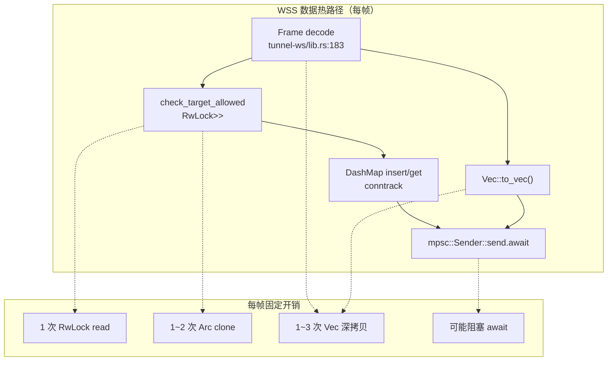

# 性能层缺陷 · PERF-*

> 本文档关注吞吐 / 延迟 / 内存 / 锁争用。每条性能主张必须给出**量化路径**（怎么测、用什么工具）。仅凭直觉的描述会标 *"性能直觉，未验证"*。



---

## PERF-001 · `check_target_allowed` 在每帧 Open 都拿 RwLock，并发评估能力受限
- **Severity**: P2
- **Location**: `crates/tunnel-ws/src/lib.rs:434-466`
- **Current**:
  ```rust
  let acl_guard = acl.read().unwrap();   // std::sync::RwLock，blocking
  match &*acl_guard {
      Some(engine) => engine.is_allowed(&req).allowed,
      None => false,
  }
  ```
  注释 (line 448-449) 已说明"after services check, sync only, no await held"，但**用 std::sync::RwLock 而不是 tokio::sync::RwLock**，意味着如果 ACL reload 写者持锁，读者会**阻塞当前 tokio worker thread**。
- **Why a defect**: ACL reload 实际由 `set_acl` (`connector/lib.rs:143-145`) 触发，是同步 write，持锁极短（替换 Arc）。但理论上 worker thread 阻塞会拖慢整个 runtime，特别在 `worker_threads = 1` 配置下。
- **Impact**: 单 worker 配置下，ACL reload 触发的微秒级 stall 会被 N 个并发评估观察到。多 worker 下问题不明显，但仍是 *"sync lock in async hot path"* 的反模式。
- **Fix**: 用 `arc_swap::ArcSwapOption<AclEngine>` 替代 `RwLock<Option<Arc<AclEngine>>>`：load 是 lock-free `load()`，store 是原子指针交换。读路径退化为：
  ```text
  match acl.load_full() {
      Some(engine) => engine.is_allowed(&req).allowed,
      None => false,
  }
  ```
- **Cost**: 30 行 + 替换 4 个 RwLock 字段 + 引入 `arc_swap` 依赖（已被 tokio 生态广泛使用）。
- **Benefit**: 锁完全消失；ACL reload 期间读者零暂停。
- **Verification**: criterion micro-benchmark：8 并发任务在 ACL reload 下做 1M 次 is_allowed，对比 RwLock vs ArcSwap 的 p99。
- **Risk**: arc_swap 与 RwLock 的释放语义不同（旧 Arc 在所有读者 drop 后才释放） — 对内存峰值影响极小但需注意。

---

## PERF-002 · WSS data 帧每次 `Vec::to_vec()` 拷贝，零拷贝可省一份
- **Severity**: P2
- **Location**: `crates/tunnel-ws/src/lib.rs:626-633`（relay_tcp 写出方向）；`crates/nsn/src/main.rs:1175` `data_tx.send(buf[..n].to_vec())`
- **Current**: 每读一次本地 service / WSS 流，都把 `&[u8]` 转成 `Vec<u8>` 通过 mpsc 传给下一段。在 8KB read buf + 高吞吐场景下，单流持续制造 GB/s 的堆分配。
- **Why a defect**: 1) 高拷贝量 = 高 allocator 压力 = 高 page fault 概率；2) jemalloc/mimalloc 也只是缓和，不是消除；3) 数据面转发本应是"零拷贝优先"。
- **Impact**: 吞吐受限于 allocator 而非 IO。具体数字取决于场景，但 *"每秒 1 GB 数据 = 每秒 1 GB allocate + free"* 是确定的。
- **Fix**: 改为 `bytes::Bytes`：
  - read 缓冲区改 `BytesMut::with_capacity(8192)`，read 后 `split_to(n).freeze()` → `Bytes`。
  - mpsc 通道类型从 `Vec<u8>` 变为 `Bytes`，clone 是原子计数 + 零拷贝。
  - WSS 帧 encode 用 `Bytes::from`（已是 Bytes 时 zero-copy）。
- **Cost**: 中等（涉及 6~8 个 channel 类型变更）；约 200 行。
- **Benefit**: 吞吐场景下 allocator 压力大幅下降；估计 30~50% throughput 提升（需基准证实）。
- **Verification**: `iperf3` over NSN tunnel，对比改造前后单流 / 多流吞吐 + `dhat` 堆分配对比。
- **Risk**: `Bytes` API 不能任意 mutate，部分需 `BytesMut`，类型管理稍复杂。

---

## PERF-003 · `tunnel-ws::WsTunnel` 单连接 = 单写出 task = 单 TCP socket，吞吐天花板就是单 TCP throughput
- **Severity**: P2（cross-link 自 [ARCH-009](./architecture-issues.md#arch-009--connector-选路策略与-tunnel-ws-流路由耦合于-wss-单条-tcp-连接) 与 [FAIL-003](./failure-modes.md#fail-003--wss-单连接-head-of-line-blocking所有流共享一个-tcp-socket)）
- **Location**: `crates/tunnel-ws/src/lib.rs:279-300`
- **Current**: 每个 NSGW 一个 WsTunnel = 一条 TCP/TLS WebSocket 连接。所有流共享单 TCP 拥塞窗口。
- **Why a defect**: 远距离 / 高 RTT 链路上单 TCP 流的 max throughput = `cwnd / RTT`。即便有多 NSGW，由于 [ARCH-009](./architecture-issues.md#arch-009--connector-选路策略与-tunnel-ws-流路由耦合于-wss-单条-tcp-连接) 的限制，并发增加并不解决单流瓶颈。
- **Impact**: WSS fallback 模式下大流量传输（备份、镜像同步）受限于单 TCP cwnd。
- **Fix**: 见 ARCH-009；性能视角额外建议：
  - 启用 TCP BBR 拥塞控制（OS-level，非代码）。
  - WSS 帧支持 `TCP_NOTSENT_LOWAT`（避免 buffer bloat）。
  - 长期：将 WSS over TCP 升级为 WSS over QUIC（HTTP/3 WebSocket，RFC 7838 替代）。
- **Cost**: BBR 是部署侧；NOTSENT 几行；QUIC 升级是大重构。
- **Benefit**: 摆脱单流 TCP cwnd 限制；多流并发线性扩张。
- **Verification**: `iperf3 -t 60 -P 4` 不同 RTT 下对比单流/4 流吞吐。
- **Risk**: BBR 可能与某些中间设备交互异常；QUIC 升级影响范围大。

---

## PERF-004 · gotatun 单线程加解密，多核 CPU 利用率受限
- **Severity**: P2 *(性能直觉，未验证)*
- **Location**: `crates/tunnel-wg/src/lib.rs` 装配 gotatun Device；具体瓶颈在 gotatun 内部，本仓库不可见
- **Current**: WireGuard 用户态实现 gotatun 通常默认单线程加解密。NSN 在 UserSpace 模式下所有 WG 流都过这一线程。
- **Why a defect**: 高吞吐场景下加解密成为瓶颈；现代多核机器无法横向扩。
- **Impact**: 单 NSN UserSpace 模式吞吐上限可能远低于硬件能力。
- **Fix**: 评估 gotatun 是否支持 `worker_threads` 配置；若不支持，考虑：
  - 在 NSN 启动多个 gotatun Device（不同 peer 拆分）。
  - 切换 TUN 模式（内核加解密自带多核）。
- **Cost**: 取决于 gotatun 能力；需先验证。
- **Benefit**: 多核横向扩张。
- **Verification**: `flamegraph` 在高吞吐下捕获，看 gotatun 内部线程占比；`top -H` 看线程级 CPU。
- **Risk**: 修改 gotatun 配置可能引入兼容性问题。

---

## PERF-005 · `connector::probe_udp` 在 WSS 模式下每 300s 触发一次完整握手尝试
- **Severity**: P3
- **Location**: `crates/connector/src/lib.rs:328-330, 354-366, 386-388`
- **Current**: WSS 模式下 `upgrade_interval = 300s`，每次 tick 触发 `probe_udp(wg_config)` — 这是完整的 WG handshake 探测。
- **Why a defect**: 1) 探测频率对 NSN 自身开销极小，但 NSGW 端会看到周期性"无意义" handshake；2) 如果 UDP 持续不可达（运营商封 51820），300s 一次的徒劳探测累积起来是浪费。
- **Impact**: 极小，可视为"已知噪声"。
- **Fix**:
  - 引入指数退避：连续 N 次 probe 失败后把 interval 拉到 600s / 1200s，下一次成功后重置。
  - 或者根据 NSGW 提示（`nsd_info` 字段 `udp_recently_blocked: bool`）跳过探测。
- **Cost**: 30 行。
- **Benefit**: 减少无效探测；提升 NSGW capacity headroom。
- **Verification**: 计数 `nsn_udp_probe_total{result}`；统计平均探测/小时。
- **Risk**: 退避太狠会延迟"运营商解封"被发现；保留 max interval 上限。

---

## PERF-006 · `relay_tcp` 内部 `READ_BUF = 8192` 硬编码，与 NSGW MTU/MSS 无关
- **Severity**: P3
- **Location**: `crates/tunnel-ws/src/lib.rs:602` `let mut buf = vec![0u8; READ_BUF];`
- **Current**: 8KB 是合理的 socket read 缓冲，但与 WS 帧上限（64KB）、TLS 记录大小（16KB）、TCP MSS（~1.4KB）都不对齐，造成多次 syscall 才填满一个 WS 帧。
- **Why a defect**: 高吞吐下每帧最优 syscall 数 = 1；8KB 意味着 ~每 16KB WS 帧需要 2 次 read syscall。
- **Impact**: syscall 数翻倍；context switch 增加。
- **Fix**: 把 `READ_BUF` 提到 16KB 或 32KB，对齐 TLS record + WS 帧上限；或动态根据 socket SO_RCVBUF。
- **Cost**: 5 行 + 加注释解释取值。
- **Benefit**: 吞吐场景下 syscall 减半。
- **Verification**: `strace -c` 在 iperf 跑流时统计 read syscall 数。
- **Risk**: 缓冲过大占用更多堆内存；32KB × N 流仍可控。

---

## PERF-007 · `Arc<RwLock<Option<Arc<AclEngine>>>>` 三层间接，每次评估多一次 deref
- **Severity**: P3
- **Location**: `crates/connector/src/lib.rs:80, 152`；`crates/tunnel-ws/src/lib.rs:284, 312, 436`；`crates/nat/src/router.rs:40`
- **Current**: 类型签名 `Arc<RwLock<Option<Arc<AclEngine>>>>`：
  - 外层 `Arc`：跨任务共享句柄。
  - `RwLock`：写者更新 Option。
  - `Option`：未加载时为 None。
  - 内层 `Arc<AclEngine>`：评估时持有引用计数。
- **Why a defect**: 设计原意是"句柄长寿、内容可换"，但表达成 4 层嵌套很难读，且每次 read 都 deref 4 层。`arc_swap::ArcSwapOption<AclEngine>` 一层 + 内置 lock-free 语义更优。
- **Impact**: 主要是可读性 + 微观性能（deref chain 在 hot path 重复执行）。
- **Fix**: 见 [PERF-001](#perf-001--check_target_allowed-在每帧-open-都拿-rwlock并发评估能力受限) 的 ArcSwap 方案；本条与之同源，合并修复。
- **Cost**: 与 PERF-001 合并。
- **Benefit**: 类型签名简洁；hot path 一次 atomic load。
- **Risk**: 与 PERF-001 同。

---

## PERF-008 · `services.toml` 严格模式下每次 WSS Open 都做 DNS resolve（潜在）
- **Severity**: P2 *(性能直觉，需源码确认)*
- **Location**: `crates/tunnel-ws/src/lib.rs:441-446`：`services.is_allowed_by_ip(target_ip, ...).await`；`crates/common/src/services.rs` 的 `is_allowed_by_ip` 实现（需确认是否做 DNS 解析）
- **Current**: 注释说"hostname entries are resolved via DNS so that targets configured by name match the IP carried in Open frame"。这暗示每次 Open 都可能触发 DNS 查询。
- **Why a defect**: 1) DNS 查询同步阻塞 / 即便 async 也是 ms 级延迟；2) NSGW 高 fan-in 场景下 DNS server 容量是隐藏依赖；3) 解析结果若不缓存，每个 Open 都付一次。
- **Impact**: 高频 Open（短连接、健康检查 spam）下延迟 / DNS 流量翻倍。
- **Fix**: 在 `ServicesConfig` 内部维护 hostname → IP 缓存，TTL 与 DNS A 记录 TTL 对齐（默认 60s）。NXDOMAIN / SERVFAIL 也缓存 short TTL（10s）防止抖动。
- **Cost**: 100 行（cache + TTL + metric）。
- **Benefit**: 平均 Open 延迟 -1~5ms；DNS server 负载下降。
- **Verification**: `tcpdump port 53` 在高频 Open 测试下计数；对比缓存前后 DNS query rate。
- **Risk**: 缓存可能让"hostname 切换 IP"延迟生效（用 short TTL 缓解）。

---

## PERF-009 · `serde_json` 在 monitor 高频请求路径上无 cache
- **Severity**: P3
- **Location**: `crates/nsn/src/monitor.rs` 全部 handler；典型如 `/api/status`、`/api/services`
- **Current**: 每次 HTTP 请求重新构造 response struct → serde_json::to_string。`/api/status` 是 K8s readiness probe 的常用入口，可能每 5~10 秒被命中一次（每个 prober）。
- **Why a defect**: 真实负载下 monitor 性能不会成瓶颈，但所有响应每次重新拼装是浪费。
- **Impact**: 极小，但存在。
- **Fix**: 对低变化数据用 `Cached<Duration>` wrapper（例如 `/api/services` 缓存 5s），高变化数据（active_count）保持实时。
- **Cost**: 50 行。
- **Benefit**: 微小 CPU 节省；为高频探测留 headroom。
- **Verification**: `wrk -c100 -d10s` 压测 /api/status 对比改造前后 CPU。
- **Risk**: 缓存失效窗口需配合 readiness probe 周期。

---

## PERF-010 · `MultiGatewayManager` 选路是 O(N) 线性遍历，N 大时退化
- **Severity**: P3 *(N 通常 < 10)*
- **Location**: `crates/connector/src/multi.rs:202-207, 211, 229`：每次 `mark_connected / mark_failed / select` 都 `iter().find(|g| g.config.id == id)`
- **Current**: 选路逻辑都是线性扫所有 gateway。N=2~5 完全无问题；理论上 N=100 时每次操作 100 倍开销，但当前部署模型不到这个规模。
- **Why a defect**: 不是当前问题，但是天然的 N 限制 — 设计目标若涉及百级 NSGW（边缘 PoP）必须改。
- **Impact**: N < 20 时无感；N > 100 时操作 O(N²)。
- **Fix**: 内部从 `Vec<GatewayEntry>` 改为 `HashMap<String, GatewayEntry>` + 排序 cache 按 latency。
- **Cost**: 100 行；接口签名不变。
- **Benefit**: 摘掉规模天花板。
- **Verification**: 微基准 with N ∈ {2, 10, 100}。
- **Risk**: 无 — 纯内部优化。

---

## 跨缺陷主题：堆分配 + 锁是双重瓶颈

WSS 数据热路径上每帧都有 *RwLock + Arc::clone + Vec::to_vec*。这三类操作在常规 IO bound 下被掩盖，在高吞吐数据面就是瓶颈。

改进策略（按 effort 排序）：

1. **PERF-001 + PERF-007**（一次性合并）：用 ArcSwap 替换所有 `Arc<RwLock<Option<Arc<X>>>>`。
2. **PERF-002**：mpsc 通道类型从 `Vec<u8>` 改为 `bytes::Bytes`。
3. **PERF-006**：READ_BUF 调到 16KB / 32KB。
4. **PERF-008**：services hostname 解析加缓存。

完成后建议跑一次 baseline benchmark 并写入 `tests/bench/`，让性能回归在 CI 可见。详见 [improvements.md §5](./improvements.md#5-performance-baselines).
