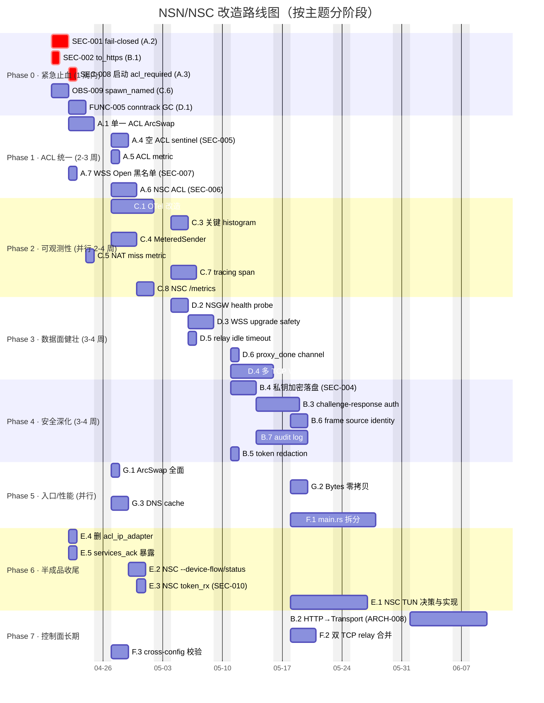
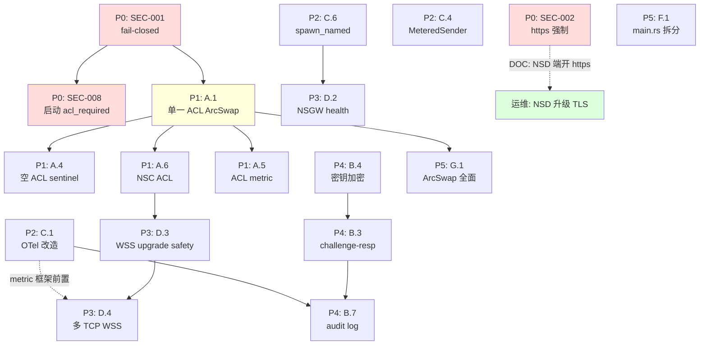
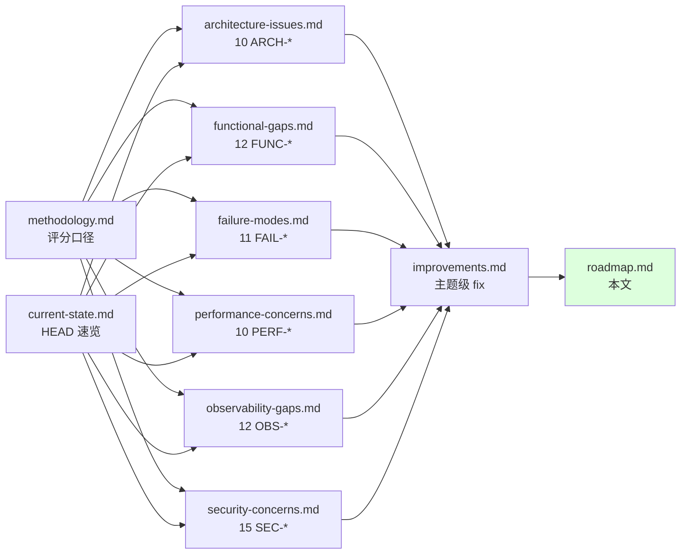

# 改造路线图 · NSN + NSC

> 把 [improvements.md](./improvements.md) 的 7 个 Theme 排期成可执行的阶段计划。
> 本文不替代项目管理工具的工单池，但定义"哪些事必须串行 / 哪些可并行 / 哪些是阻塞前置"。

## 0. 路线图总览

> 上图日期是相对锚点（以 2026-04-20 为 Phase 0 起点）；实际上线时间取决于团队规模与并行度。

---

## 1. 阶段拆解与目标

### Phase 0 · 紧急止血（第 1 周）

**目标**：72 小时内消除最严重的两个 P0 安全洞 + 1 个 P0 OOM 风险。

| Workstream | Owner 建议 | Deliverable |
|-----------|-----------|------------|
| SEC-001 fail-closed (A.2) | 后端 | PR：`nat::ServiceRouter::resolve*` 三处改 fail-closed |
| SEC-002 强制 https (B.1) | 后端 | PR：`to_http_base` → https + reqwest TLS 校验配套 + 部署文档 |
| SEC-008 启动 acl_required (A.3) | 后端 | PR：启动序列等 ACL，配置 `startup.acl_required = true` |
| OBS-009 spawn_named (C.6) | 后端 | PR：封装 `spawn_named`,关键 task 替换;新增 `nsn_task_panics_total` |
| FUNC-005 conntrack GC (D.1) | 后端 | PR：TTL/cap/cleanup task |

**Phase 0 准入条件（gating criteria）**：
- 所有 PR 通过现有 4 套 Docker E2E
- 增加新 E2E 验证 fail-closed 行为（启动期间数据面拒绝）
- 性能回归 < 5%（用 D.4 之前的简单 baseline）

**Phase 0 完成后的状态**：
- 启动期、ACL 加载窗口不再 fail-open
- Token 不再走明文 HTTP（前提：NSD 端开 https）
- NAT 表不再无限增长
- 任意 spawn task panic 可被监控告警

---

### Phase 1 · ACL/Policy 统一（第 2-3 周）

**目标**：消除 ACL "两份 Arc + 两个语义" 的根因，多 NSD 合并不再有空 ACL 雪崩，NSC 进入 ACL 体系。

**前置依赖**：Phase 0 SEC-001 必须完成（否则 A.2 无法落地）

**新增 metric**（Phase 1 与 Phase 2 并行启动）：
- `nsn_acl_load_state` (gauge)
- `nsn_acl_denials_total{reason,service,src_id}` (counter)
- `nsn_acl_allows_total{service}` (counter)
- `nsn_acl_merge_sources` (gauge)
- `nsn_acl_merge_empty_skipped_total` (counter)

**Phase 1 准入条件**：
- 单元测试：ACL 引擎切换在并发读路径下不 lost-update
- 集成测试：3 个 NSD 中 1 个推空 ACL 不影响其他两个
- E2E：NSC 也走 ACL 路径

---

### Phase 2 · 可观测性栈（第 2-4 周，并行）

**目标**：所有指标统一从 OTel meter 暴露；关键路径有 histogram；spawn task 安全；NSC 有 /metrics。

**前置依赖**：可与 Phase 1 完全并行（不同代码区域）

**Phase 2 准入条件**：
- `/api/metrics` 不再含 `format!()` 拼接（搜索关键字校验）
- 关键路径有至少 5 个 histogram（WSS Open / ACL eval / ServiceRouter / SSE dispatch / wg encrypt）
- NSC 暴露 `/metrics` 至少 8 个 metric
- 文档增加 SLI/SLO 章节（4 个 SLI）

---

### Phase 3 · 数据面健壮性（第 3-5 周）

**目标**：WSS 通道断后能快速收敛、NSGW 健康真实探活、单 TCP HOL 缓解。

**前置依赖**：
- D.2/D.3/D.5/D.6 与 Phase 1/2 可并行
- D.4 多 TCP 必须等 Phase 2 的 metric 框架（用于 benchmark 验证）

**Phase 3 准入条件**：
- 杀掉一条 NSGW TCP 后，30 秒内重连成功率 > 99%
- ConntrackTable evict 行为可在 metric 上看到
- D.4 落地后 iperf3 测试 throughput 至少提升 30%（双 TCP vs 单 TCP）

---

### Phase 4 · 安全深化（第 5-7 周）

**目标**：闭合 SEC-003/SEC-004/SEC-013/SEC-015 等 P1 项；引入 audit log；密钥不再明文。

**前置依赖**：
- B.4（密钥加密）需要决定密钥来源（环境变量 vs OS keyring）— 是 Phase 0 决策清单之一
- B.3 challenge-response 需要 NSD 端配套（跨团队协调）

**Phase 4 准入条件**：
- 旧 `machinekey.json` 可平滑升级到加密格式（reload 测试）
- challenge-response 兼容旧 NSD（版本协商）
- audit event 流可在独立 file 看到，含 SecurityEvent 4 类至少
- token 不再出现在任何 RUST_LOG=debug 输出

---

### Phase 5 · 入口拆分与性能（第 5-8 周，并行）

**目标**：`nsn/src/main.rs` 拆出可测试子模块；性能 baseline 达成。

**前置依赖**：
- F.1 是大重构，必须**多次小 PR**，每次 < 200 行 diff
- G.* 性能改造必须有 Phase 2 的 baseline 对比

**Phase 5 准入条件**：
- `nsn/src/main.rs` ≤ 400 行
- 子模块各自有 unit test
- 性能 metric 有 before/after 对比报告

---

### Phase 6 · 半成品收尾（贯穿）

**目标**：消除 "看起来支持但没实现" 的 CLI/feature。

| Item | 时机 |
|------|------|
| E.4 删 acl_ip_adapter | Phase 0 顺手 |
| E.5 services_ack | Phase 0 顺手 |
| E.2 NSC --device-flow/status | Phase 1 期间 |
| E.3 NSC token_rx | 与 A.6 (NSC ACL) 一起 |
| E.1 NSC TUN 决策与实现 | Phase 3 之后（依赖 D.* 改造稳定） |

---

### Phase 7 · 控制面长期改造

**目标**：B.2 把 register/auth/heartbeat 真正纳入 ControlTransport；F.2 合并双 TCP relay；F.3 cross-config 校验。

这些是"做完就好,但不紧急"的改造,排在最后。

---

## 2. 关键依赖关系

---

## 3. 跨团队/跨组件协调点

某些改造**必须协调 NSD/NSGW 端**，不能孤立做：

| 改造 | NSN/NSC 改动 | NSD/NSGW 配套改动 | 协调点 |
|------|-------------|------------------|-------|
| B.1 强制 https | reqwest scheme | NSD 端必须开 8443/https | 部署文档同步发布 |
| B.2 加密通道承载 HTTP API | ControlTransport 扩展 | NSD 端实现 transport 适配器 | 跨团队 spec 评审 |
| B.3 challenge-response | 增加 challenge POST | NSD 端 `/api/v1/machine/auth/challenge` 端点 | API 版本协商 |
| D.4 多 TCP WSS | 多通道 frame 协议 | NSGW 端识别多通道协商 | WS frame v2 spec |
| B.6 frame source identity | 新增 `source` 字段 | NSGW 端填入 NSC 身份 | frame schema bump |
| A.4 ACL sentinel | merge 算法 | NSD 端可标记"empty 是真实意图" vs "空因失败" | API 行为约定 |

---

## 4. 风险与回滚预案

| 高风险改造 | 风险描述 | 回滚预案 |
|-----------|---------|---------|
| A.1 单一 ACL Arc | 并发读写竞态难调试 | feature flag `acl.use_arcswap = false` 保留旧路径 |
| A.2/A.3 fail-closed | 启动时延变长，旧部署可能告警 | 配置 `acl_required = false` 开关临时关闭 |
| B.1 https 强制 | NSD 端未开 https → register 失败 | 增加 `auth.allow_plaintext_for_legacy = true` 开关；过渡期 |
| B.4 密钥加密 | 升级时旧明文密钥被误删 | 永远 read 兼容 + write 加密；`machinekey.legacy.json` 备份 |
| D.4 多 TCP WSS | NSGW 不识别 → 所有 WSS 失败 | frame v2 协商失败回退 v1 |
| F.1 main.rs 拆分 | 大重构容易引入回归 | 每次 PR < 200 行,大 E2E 全跑;失败立刻 revert |

---

## 5. 不在路线图内的事项（明确放弃 / 延后）

| 事项 | 理由 |
|------|------|
| FUNC-006 IPv6 全栈支持 | 单独 milestone（>=15 人日）；先把 v4 体系打稳 |
| 控制面 GraphQL/gRPC 升级 | 没有需求驱动 |
| 把 NSD 也纳入仓库管理 | 跨服务，超出 NSN/NSC 范围 |
| WG 协议升级（如改 WG2/Boring） | gotatun 已可用，性能改造优先级低于 D/G |
| 完整 chaos engineering 框架 | 投入产出比低，FAIL-001/D.2 配套基础混沌测试足够 |
| 把 ACL 改为 OPA / Cedar | 表达力够用，引入新依赖维护成本高 |

---

## 6. 监控与回顾

每个 Phase 结束时必须做：

1. **回归测试**：4 套 Docker E2E + 新增 E2E 全绿
2. **性能基线**：与 Phase 之前的 perf snapshot 对比（吞吐 / p99 / OOM 行为）
3. **安全审计 dry-run**：用 [security-concerns.md](./security-concerns.md) 的清单逐项验证
4. **文档同步**：受影响章节（`docs/01-09`）由对应 owner 更新；本目录文档保持不变（这是审查记录）
5. **缺陷关闭确认**：在 [improvements.md §2 反向索引](./improvements.md#2-缺陷--主题反向索引)上勾掉

---

## 7. Phase 0 紧急行动清单（24 小时内）

如果只能做一件事：

1. **冷启动 → 把 SEC-001 的 fail-closed 改造合并**（A.2，~1 人日）
2. 同步把 [SECURITY.md](./security-concerns.md) 的 P0 4 项发给安全/运维 owner

如果有 1 周：完成 Phase 0 全部 5 项。

如果有 1 月：Phase 0 + Phase 1 + Phase 2 关键改造（C.1 / C.6 / C.4 / C.5）。

如果有 1 季度：完成 Phase 0~4 全部 P0/P1。

如果有 1 年：完成全部 Theme A~G。

---

## 8. 与本目录其他文档的关系

读 README → methodology → current-state → 各分章节 → improvements → roadmap，是推荐的全量阅读路径。
