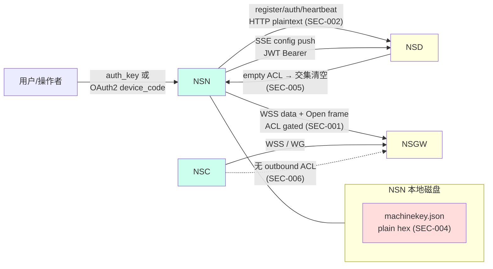
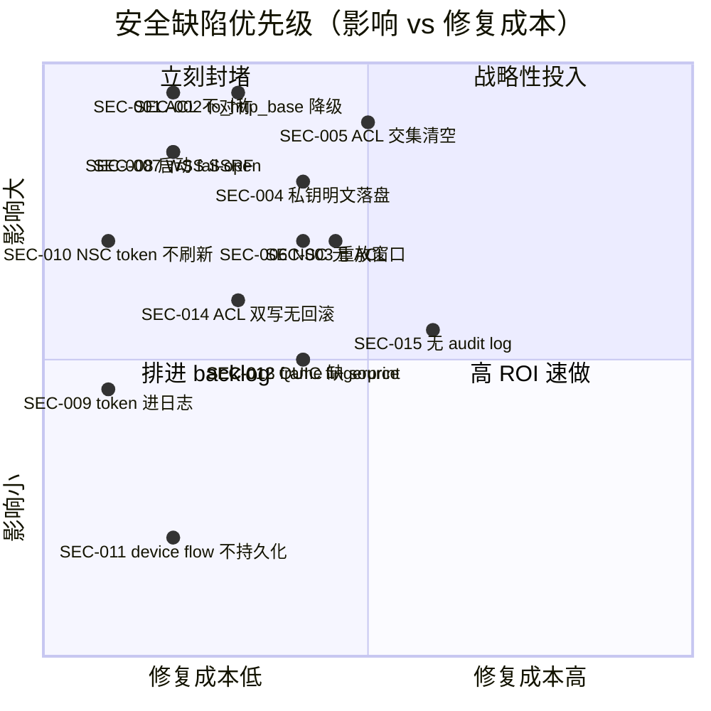

# 安全缺陷清单 · NSN + NSC

> 评审范围：信任边界、密钥/凭据生命周期、传输保密性、ACL 一致性、auth 协议、日志泄密。
> 评分口径：见 [methodology.md](./methodology.md)。
> 注：本文是**白盒缺陷分析**而非完整威胁建模。仅列出可在源码中**直接定位证据**的安全问题。

## 0. 信任边界全景与失守点



**核心观察**：NSN 与 NSD/NSGW 之间名义上有 SSE/Noise/QUIC 三种"加密"传输；但 register / authenticate / heartbeat 这 3 个最敏感的 HTTP API **总是被 `to_http_base()` 改写为 `http://`**，使得在 noise:// 或 quic:// 部署下，初始信任建立反而走明文 — 见 SEC-002。

---

## SEC-001 · ACL 引擎语义不对称：WSS 路径 fail-CLOSED, 本地服务路由 fail-OPEN

- **Severity**: P0（致命 - 安全）
- **Location**:
  - WSS 入口：`crates/tunnel-ws/src/lib.rs:434-466`（`check_target_allowed` 中 `acl=None` 返回 `false`）
  - 本地服务路由：`crates/nat/src/router.rs:88-101`、`:133-146`、`:158-...`（`if let Some(acl) = acl_guard.as_ref()`，`acl=None` 时**跳过整个 ACL 检查**直接 `target = resolve_host(...)`）
- **Current behavior**：同一个 ACL 引擎尚未加载时（启动早期、SSE 重连中、合并 NSD 失败），两条数据面入口给出**相反裁决**：
  - 来自 NSGW 的 WSS Open frame → **拒绝**（fail-closed，安全）
  - 来自本地用户主动连接（NSC HTTP proxy / NSN 本机 socket）→ **放行**（fail-open，**危险**）
- **Why it's a defect**：
  - 部署文档承诺"启动后 ACL 即生效"，但用户主动入站方向的策略在 ACL 加载窗口完全开放
  - 一旦 NSD 长时间不可达，ACL 引擎可能从未加载或在 reload 失败后变为 `None`，本地代理仍会工作
  - 两套语义无法在文档/审计/单测中统一推理
- **Impact**：
  - **直接绕过策略**：在 ACL 加载前的窗口（启动 0~30s、reload 失败任意长度），NSC/NSN 本地用户可以连接到任何 service，而日志中只有 `target: nat` 的 debug 信息（甚至 debug 关闭则无任何痕迹）
  - 合规审计无法证明"全程被 ACL 保护"
- **Fix**：
  - 在 `nat::ServiceRouter::resolve` 三个变种中，把 `if let Some(acl) = acl_guard.as_ref()` 改为：
    ```rust
    let Some(acl) = acl_guard.as_ref() else {
        warn!(target: "nat", %src_ip, dst_port, "ACL 未加载, 拒绝连接 (fail-closed)");
        return None;
    };
    if !acl.is_allowed(&req).allowed { ... }
    ```
  - 同步在 `AppState` 增加 `acl_loaded: AtomicBool`，启动时写入 `false`，第一次成功 compile 后写入 `true`。所有数据面入口（WSS / nat / 后续端口扫描）统一查询此 flag
  - 增加 metric `nsn_acl_load_state`（gauge：0=loading, 1=loaded, 2=stale）
- **Cost vs Benefit**：~1 人日；**封堵最高优先级安全漏洞**
- **Migration risk**：中
  - 启动早期 0~30s 内主动连接将被拒（行为变化）
  - 必须配套在 NSC 端做"等 NSN /api/healthz 200 + acl_status=loaded 才上线"的健康检查
  - 见 [ARCH-001](./architecture-issues.md#arch-001) 和 [FAIL-002](./failure-modes.md#fail-002)（同源问题不同视角）

---

## SEC-002 · `to_http_base()` 在 noise:// / quic:// 部署下静默降级到明文 HTTP

- **Severity**: P0（致命 - 安全）
- **Location**: `crates/control/src/auth.rs:15-23`
  ```rust
  pub fn to_http_base(url: &str) -> String {
      if let Some(rest) = url.strip_prefix("noise://") {
          format!("http://{rest}")
      } else if let Some(rest) = url.strip_prefix("quic://") {
          format!("http://{rest}")
      } else {
          url.to_string()
      }
  }
  ```
- **Current behavior**：当用户配置 `server_url = "noise://nsd.example.com:8443"` 或 `quic://...`，控制流（SSE 子集 + dispatch）走加密通道；但**第一波身份建立** — `register` / `authenticate` / `heartbeat` / `discover_nsd_info` 4 个 HTTP API — 全部走 `to_http_base()` 改写后的 `http://`（**注意：是 http,不是 https**）
- **Why it's a defect**：
  - `noise://` 用户期望的是端到端加密；现实是 `auth_key` / `Ed25519 签名` / `Bearer token` 全部在公网走明文
  - 同样的 host:port 同时承载 plaintext HTTP 和 noise，部署上等于"多开一个 8443/HTTP 后门"
  - QUIC 同理 — quic:// 暗示 UDP+TLS, 但 register 走 TCP+HTTP
- **Impact**：
  - **凭据嗅探**：`auth_key` 一次泄露即可永久注册任意 machine
  - **会话劫持**：`Authorization: Bearer <jwt>` 可被中间人窃取
  - **服务端 metadata 探测**：`/api/v1/info` 回显 `nsd_type` / `realm`，攻击者可枚举部署形态
  - 安全审查会直接判定不合规（PCI/SOC2 等）
- **Fix**：分两步
  1. **立刻**：把 `format!("http://{rest}")` 改为 `format!("https://{rest}")`，并在 `reqwest::Client` 上确保使用同一个 `rustls` provider（与 SseTransport 一致）
  2. **正确做法**：把 `register` / `auth` / `heartbeat` 设计为通过同一个 `ControlTransport` trait 走加密通道，不再走旁路 HTTP — 见 [ARCH-008](./architecture-issues.md#arch-008)
- **Cost vs Benefit**：第一步 ~0.5 人日；第二步 ~5 人日。第一步即可消除明文凭据泄露
- **Migration risk**：第一步：高 — 需要 NSD 端 8443 同时开 https；现有部署可能只开 http（需在文档+部署指南上配套）；第二步：中 — 涉及 NSD 端协议改造

---

## SEC-003 · `authenticate` 签名仅含本地时间戳, 无 server-supplied nonce → 重放窗口

- **Severity**: P1（高）
- **Location**: `crates/control/src/auth.rs:235-272`
  ```rust
  let timestamp = SystemTime::now().duration_since(UNIX_EPOCH).map(|d| d.as_secs()).unwrap_or(0);
  let message = format!("{machine_id}:{timestamp}");
  let sig_bytes = self.state.sign(message.as_bytes());
  ```
- **Current behavior**：客户端把 `{machine_id}:{epoch_secs}` 用 Ed25519 签名后发送给 `/api/v1/machine/auth`。无服务端挑战、无随机 nonce、无 endpoint 绑定
- **Why it's a defect**：
  - 任何能在传输路径上看到这条请求的攻击者（结合 SEC-002 的明文 HTTP，几乎无门槛），可以在时间戳容差窗口内（通常 30~120s）**完整重放** → 拿到合法 JWT
  - 即使补上 HTTPS（修 SEC-002），仍可能因 NSD 时钟漂移或允许较大窗口被利用
  - 没有把 `target_endpoint`/`audience` 嵌入签名 → 同一签名可被服务端 A 泄露后用于服务端 B（多 NSD 场景下）
- **Impact**：会话级身份冒充；攻击者拿到 JWT 后可以订阅 SSE config，看到本机所有 service / wg / acl 配置
- **Fix**：
  - 改为挑战-响应（challenge-response）：
    1. NSN POST `/api/v1/machine/auth/challenge` → NSD 返回 `{nonce, expires_at}`
    2. NSN sign `BLAKE3("nsio-auth-v1" || machine_id || nonce || nsd_url)`，POST `/api/v1/machine/auth`
  - 在签名 input 中嵌入 `nsd_url` 或 NSD 公钥，防止跨 NSD 重放
  - 服务端验证后立即"消费" nonce
- **Cost vs Benefit**：~2 人日（含 NSD 端配套）；提升认证强度
- **Migration risk**：中 — 需要协议版本协商（旧 NSD 不识别 challenge 端点）

---

## SEC-004 · 身份密钥 `machinekey.json` 以明文 hex JSON 落盘, 仅靠文件权限保护

- **Severity**: P1（高）
- **Location**: `crates/common/src/state.rs:401-433`（`save_identity_to_path` + `write_json_atomic`）
- **Current behavior**：
  ```rust
  let f = IdentityFile {
      signing_key_hex: hex::encode(signing_key.to_bytes()),       // Ed25519 私钥
      machine_key_pub_hex: hex::encode(machine_key_pub),
      peer_key_priv_hex: hex::encode(peer_priv_bytes),            // X25519 私钥
      peer_key_pub_hex: hex::encode(peer_key_pub),
  };
  write_json_atomic(path, &f).await
  ```
  - `write_json_atomic` 仅在 unix 设 `0o600`；windows 无任何权限保护
  - 文件名固定 `{state_dir}/machinekey.json`，常见路径 `/var/lib/nsio/machinekey.json`
- **Why it's a defect**：
  - **任何 root 进程或备份/CI 镜像快照**都可读到完整签名私钥 + WG 静态密钥
  - 私钥泄露 = 攻击者可以注册任意 machine + 接管 WG 隧道 + 解密历史抓包（X25519 私钥用于 Noise 长期身份）
  - 没有用 OS keyring（macOS Keychain / Windows DPAPI / linux secret-service）或 KMS 包裹
  - 没有"密钥轮换"机制 — 一旦泄露除非手动删文件并重新注册无法救
- **Impact**：
  - 容器逃逸/备份泄露场景 → 完整身份盗用
  - **不可否认性**丢失（私钥不能证明只属于该机器）
- **Fix**：
  - 短期：在 `IdentityFile` 上加 AEAD 包裹（`chacha20poly1305`），密钥从环境变量 `NSN_KEY_ENC_KEY` 或 OS keyring 拿
  - 长期：分级密钥 — 设备身份键（roots of trust）放 KMS/HSM/keyring；session-level key 用 derive 出来
  - 文档明确记录"如果 machinekey.json 泄露，必须从 NSD 端 revoke + 删文件 + 重注册"
- **Cost vs Benefit**：短期 ~2 人日；长期 ~5 人日；高 ROI（防逃逸）
- **Migration risk**：中 — 旧文件需要升级路径

---

## SEC-005 · 多 NSD 合并使用**交集**: 任一 NSD 推送空 ACL 即清空全局策略  `[RESOLVED — 合并改并集 + 本地 ACL 保底，见 ARCH-002]`

- **Severity**: P0（致命 - 可用性 + 安全）
- **Location**: `crates/control/src/merge.rs:85-145`（合并算法）；触发面：`crates/control/src/multi.rs:131+`
- **Current behavior**：`MultiControlPlane` 收到 N 个 NSD 推送的 `AclConfig` 后，按"交集"合成最终生效的 ACL；wg/proxy 走"并集"。详见 [current-state.md §5](./current-state.md#5-多-nsd--多-nsgw)
- **Why it's a defect**（安全角度）：
  - 攻击 / 配置错误 / 网络分区导致**任意一个 NSD 返回空 ACL** → 整体策略清空 → 所有连接走 SEC-001 fail-OPEN 路径 → 实际等于无 ACL
  - 若 NSD 中存在恶意/被攻陷实例，可主动推空 ACL "拆掉" 所有其他 NSD 的策略
  - 没有"信任分级"（不能配置某些 NSD 为 advisory-only）
- **Impact**：
  - 单点故障即可导致全局策略瘫痪
  - 不可避免的"配置漂移"会随 NSD 数量递减系统安全
- **决议（2026-04-17）**：采用 [ARCH-002](./architecture-issues.md#arch-002) 的选项 1 —— **合并改并集 + 每条规则 `sources` 标注 + 本地 `services.toml` ACL 作为运行时保底**。空 ACL 不再清空其他 NSD 的规则；单 NSD 被攻陷下发 `allow all` 也无法越过本地 ACL 的授权范围。相应保留此处两条建议：
  - 推送审计日志，每次 ACL 合并前后写入 hash + 来源 NSD 列表 + 规则数 diff（保留，独立于合并语义）。
  - 本地 `services.toml` ACL 在 NSN 启动时若缺失，`nsn` 应 WARN 并拒绝进入 ready 状态，避免新部署因漏配保底而变成"纯 NSD 建议即放行"。
- **Cost vs Benefit**：~3 人日；为多 NSD 部署的核心安全前提
- **Migration risk**：中 — 行为变化需在 release notes 里强调

---

## SEC-006 · NSC 完全没有出站 ACL — 用户客户端可以访问任何 service

- **Severity**: P1（高）
- **Location**: `crates/nsc/src/main.rs:195`（`_acl_rx` 用下划线显式丢弃）；`crates/nsc/src/proxy.rs`、`crates/nsc/src/router.rs`、`crates/nsc/src/dns.rs`（grep `acl::` 在 NSC 树为 0 命中）
- **Current behavior**：
  - NSC 从 SSE 接收 acl 配置流，但**直接丢弃**（`_acl_rx`）
  - NSC 的本地代理（HTTP Proxy / VIP / DNS）路由到 NSGW 时**不做任何 ACL 校验**，完全依赖 NSGW 端 WSS Open frame 的 ACL 兜底
- **Why it's a defect**：
  - 多层防御（defense in depth）原则被破坏 — 客户端侧零策略
  - 下游 NSGW 若被绕过/降级（如 WSS upgrade 失败回到旧路径），无任何边界保护
  - 用户难以"提前看到"某个 service 被禁（必须发起连接才被 reset）
  - 端到端审计/合规：NSC 无策略 = 日志中看不到"用户尝试访问被禁服务"
- **Impact**：
  - 一层兜底不足即穿透
  - 不能阻止 NSC 进程内的恶意脚本利用本地代理探测 service
- **Fix**：
  - 在 NSC 的 SSE 消费路径接管 `acl_rx`：复用 `acl::AclEngine`（与 NSN 同源代码）
  - 在 `nsc::router::resolve_*` 路径加 ACL 检查
  - 与 NSN 一致地处理 fail-CLOSED 启动窗口
  - 见 [FUNC-012](./functional-gaps.md#func-012)
- **Cost vs Benefit**：~2 人日；显著提升 NSC 安全姿态
- **Migration risk**：低 — 增加策略可能让某些"原本能连"的连接被阻；需要文档说明

---

## SEC-007 · WSS Open frame 缺少地址范围限制, 可作为 SSRF 跳板

- **Severity**: P1（高）
- **Location**: `crates/tunnel-ws/src/lib.rs:480-498`（`FrameCommand::Open { target_ip, target_port, protocol }` 直接被 `check_target_allowed` 校验，**仅靠 ACL**）
- **Current behavior**：来自 NSGW 的 WSS Open frame 携带任意 `target_ip`，包括：
  - `127.0.0.0/8`（loopback）
  - `169.254.169.254`（云元数据 IP，AWS / GCP / Azure 都常用）
  - `0.0.0.0`、链路本地、组播
  - 内网 RFC1918 段（若 NSN 主机有内网视野）
  - IPv6 link-local / ULA（即使 stack 不全支持，路由可能存在）
  - 校验完全交给 `AclEngine`；**ACL 默认规则若没显式 deny 这些段，全部放行**
- **Why it's a defect**：
  - **SSRF on demand**：NSGW（或拿到 NSGW 控制权的对手）可指挥 NSN 探测/访问任意内网/云元数据
  - 即使 ACL 配置正确，单纯的"忘记加规则"就可能开洞
  - WSS frame 来源可信度等于 NSGW（一个外部组件），但安全裁决全部委托内部 ACL，无 defense-in-depth
- **Impact**：
  - 云上部署：直接读到 IAM credentials、user-data
  - 企业内网部署：横向扫描跳板
- **Fix**：
  - 在 `check_target_allowed` 入口增加**强制黑名单**（不依赖 ACL）：loopback / link-local / metadata IPs / multicast
  - 暴露配置项 `data_plane.allow_loopback_targets = false`（默认 false）
  - 在 NSGW 端推送 ACL 时强制注入这些 deny 规则作为 baseline
- **Cost vs Benefit**：~1 人日；阻断高危类
- **Migration risk**：低 — 极少有合法场景需要 NSGW 让 NSN 访问 169.254.169.254

---

## SEC-008 · ACL 加载 10 秒超时后**继续启动**, 启动窗口 fail-open

- **Severity**: P0（致命 - 与 SEC-001 / SEC-005 复合）
- **Location**: `crates/nsn/src/main.rs:790-880` 附近（10s timeout + warn + 继续启动），详见 [FAIL-002](./failure-modes.md#fail-002)
- **Current behavior**：启动序列等待"首次 ACL 加载"，超过 10 秒则打 `warn!` 然后继续；之后任何使用 fail-open 路径的子系统（参见 SEC-001）都裸奔
- **Why it's a defect**：
  - 安全控制必须 fail-closed；这里反过来
  - 10s 是个魔术数字，没有可配置；NSD 临时高延迟即可触发
- **Impact**：每次重启都可能制造一个安全窗口
- **Fix**：
  - 启动序列改为：ACL 未加载则**不开放数据面 listener**（不绑端口 / WSS 不接受 Open frame）
  - 配置 `startup.acl_required = true`（默认 true），unset 则保留旧行为，附带显眼 warn
- **Cost vs Benefit**：~1 人日；与 SEC-001 同步落地
- **Migration risk**：中 — 启动时延变长（需 NSD 可达），需要在文档和健康探针上配套

---

## SEC-009 · Bearer token 在多处 `format!()` 拼接, 不在 instrument 的 skip 范围内 → 可能进日志

- **Severity**: P2（中）
- **Location**:
  - `crates/control/src/sse.rs:109`：`.header("Authorization", format!("Bearer {}", self.token))`
  - 同上 `:134`
  - `crates/control/src/sse.rs:304, :342`：`tracing::debug!(token = self.token, ...)` — **直接把 token 作为 structured field 输出**
- **Current behavior**：debug 等级的日志会把完整 token 写入 stdout 和滚动日志文件
- **Why it's a defect**：
  - 安全/合规：Bearer token 是会话凭据，必须当成密码处理（不入日志，不入崩溃 dump）
  - 哪怕 RUST_LOG=debug 是临时开的，stdout 可能被采集到日志聚合系统永久存档
- **Impact**：
  - log 系统/CI 工件/ops 截屏中 token 泄露
  - 配合 SEC-002 的明文 HTTP，会话劫持门槛进一步降低
- **Fix**：
  - 把 `tracing::debug!(token = self.token, ...)` 改为 `token_prefix = &self.token[..6.min(self.token.len())]` 或直接删除
  - 用 `secrecy::SecretString` 包裹 self.token，强制 `.expose_secret()` 才能拼字符串
  - 引入 redaction layer：`tracing_subscriber` filter 把 `Authorization:` 头自动替换
- **Cost vs Benefit**：~0.5 人日；防止低概率高危泄密
- **Migration risk**：无

---

## SEC-010 · Token 刷新通道 `_token_rx` 在 NSC 被丢弃 → 长跑后凭据失效但不感知

- **Severity**: P1（高，安全可用性混合）
- **Location**: `crates/nsc/src/main.rs:195`（`_token_rx` 显式丢弃）
- **Current behavior**：NSC 接收 SSE 推送的新 token 但不应用；旧 token 过期后所有控制流调用 401
- **Why it's a defect**（安全角度）：
  - 一旦 NSD 端因为安全原因（如检测到异常）revoke 当前 token，NSC 应该立刻收新 token；现状是 NSC 用旧 token 持续重试
  - 服务端的"密钥轮换"无法对 NSC 客户端起作用
  - 失败时 NSC 不会主动退出/告警 → 长时间"半瘫痪"
- **Impact**：
  - 凭据轮换策略（典型 24h JWT）无法对 NSC 用户生效
  - 见 [FUNC-004](./functional-gaps.md#func-004)（功能缺陷面）
- **Fix**：在 NSC 的 SSE 消费循环中接管 `token_rx`，调用 `transport.set_token(new_token)`，与 NSN 在 `crates/control/src/lib.rs:307-370` 的处理保持一致
- **Cost vs Benefit**：~0.5 人日；解锁 token 轮换
- **Migration risk**：低

---

## SEC-011 · OAuth2 device-flow access_token 仅在内存中, 进程重启即重新走 device 流程

- **Severity**: P3（低）
- **Location**: `crates/control/src/device_flow.rs:43-113`；`crates/nsn/src/main.rs:404-409`
- **Current behavior**：device flow 拿到 access_token 后立即用 `register_with_token` 注册，不持久化 token；下次重启再走一次 device flow（弹用户手机/邮件确认）
- **Why it's a defect**：
  - 不算严重 — 注册后已有长期 machine identity，重启不再需要 token
  - 但若 device flow 实现了 refresh_token（device_flow.rs 看来没有 — 只 access_token），则错失自动续期能力
  - 若 access_token 的有效期较长，进程重启时它仍可能有效；保留可避免再次 device 弹屏
- **Impact**：用户体验问题 + 重启时的弹窗骚扰
- **Fix**：
  - 选择 A：明确不持久化（当前），在文档上写"第一次注册后无需再走 device flow"
  - 选择 B：把 access_token + refresh_token 加密存到 state_dir，启动时优先用
- **Cost vs Benefit**：~1 人日（B）；ROI 中等
- **Migration risk**：无

---

## SEC-012 · QUIC 信任完全基于 SHA-256 fingerprint pinning, 无法轮换无法吊销

- **Severity**: P2（中）
- **Location**: `crates/control/src/transport/quic.rs:35-107`（`PubkeyVerifier`）
- **Current behavior**：QUIC 客户端验证 NSD 服务端只看 end-entity 证书的 SHA-256 fingerprint 是否匹配预配置值；不校验 CA 链、不校验 SAN/CN、无 OCSP
- **Why it's a defect**：
  - **轮换难**：服务端换证书 → 所有客户端必须先收到新 fingerprint 才能继续连接；没有 grace period 机制
  - **无吊销**：私钥泄露后，无法把 fingerprint 标 revoked；只能让全网客户端改配置
  - 可信链路收窄到一次性配置 = 单点失败
- **Impact**：
  - 运维痛点：证书 rotation 必须停机（或配双 fingerprint）
  - 安全脆弱：私钥泄露的应急响应窗口长
- **Fix**：
  - 短期：支持配置一组 fingerprint（数组）以提供 rotation grace
  - 长期：改为 SPKI pinning（pubkey 而不是 cert）+ 信任 CA 链；或者引入 CRL/OCSP-stapling
- **Cost vs Benefit**：~2 人日；为运维 + 应急响应必需
- **Migration risk**：低（数组兼容单值）

---

## SEC-013 · NSGW 主动推送的 WSS Open frame 缺少 source identity, 无法进行 per-connection 审计

- **Severity**: P2（中）
- **Location**: `crates/tunnel-ws/src/lib.rs:480-498`（`FrameCommand::Open` 仅含 `target_ip / target_port / protocol`）
- **Current behavior**：进入 NSN 的连接，`src_ip` 在 `AccessRequest` 中被硬编码为 `IpAddr::V4(Ipv4Addr::UNSPECIFIED)`（`tunnel-ws/src/lib.rs:454`）；NSGW 知道是哪个 NSC 触发的，但**不在 frame 中传递**
- **Why it's a defect**：
  - ACL 规则里的"src 用户/客户端"维度无法生效（一切都是 `0.0.0.0` 通配）
  - 审计日志 / `AclDenial` 中的 `src_ip` 永远是 `0.0.0.0`，无法回溯"是谁的连接被拒"
  - 多租户/共享 NSGW 场景下无法做 per-tenant 限速/隔离
- **Impact**：
  - 安全审计能力残缺
  - ACL 表达力降级（"src=user-A" 类规则形同虚设）
- **Fix**：
  - 扩展 `FrameCommand::Open` 增加 `source: Option<SourceIdentity>` 字段（向后兼容）
  - NSGW 端在转发时填入 NSC 的 machine_id / vip
  - NSN 端把 source 透传给 ACL 评估和审计日志
- **Cost vs Benefit**：~2 人日；为多租户场景必需
- **Migration risk**：低 — frame 格式向后兼容（Optional 字段）

---

## SEC-014 · `acl_engine` 写两份, 部分失败时无回滚 → 策略不一致

- **Severity**: P1（高）
- **Location**: `crates/nsn/src/main.rs:1464`（`load_acl_config_for_runtime`）；两份 ACL Arc 见 [current-state.md §4](./current-state.md#4-acl-评估点两条独立链路)
- **Current behavior**：把新编译的 `AclEngine` 同时写入 `nat::ServiceRouter::acl_engine` 和 `connector::ConnectorManager::acl`；如果两次写入之间 panic / 一处成功一处失败，**两条数据面入口看到不同策略**
- **Why it's a defect**：
  - WSS 路径用旧 ACL（拒绝了新加 service）/ 本地路径用新 ACL（放行了新加 service）— 用户体验为"看上去配置了规则，部分流量被拒"
  - 没有"双写事务"或"两处都校验通过才切"
  - 也没有指标暴露"两份 ACL 是否同步" — 排障困难
- **Impact**：
  - 偶发的策略漂移，肉眼难发现
  - 安全性退化：可能某条 deny 规则只在一处生效
- **Fix**：
  - 把"两份 ACL"统一为"一份共享 Arc"，由 `AppState::acl: ArcSwap<AclEngine>` 持有，所有消费方借引用
  - 同时移除 `connector::ConnectorManager::acl` 的独立持有
  - 见 [PERF-007](./performance-concerns.md#perf-007) 的 ArcSwap 建议同步覆盖此项
- **Cost vs Benefit**：~1.5 人日；消除一类隐藏漂移
- **Migration risk**：低 — 内部抽象重构

---

## SEC-015 · 没有审计日志 / 没有"安全事件"流出口

- **Severity**: P2（中）
- **Location**: 全仓库；无 `audit` / `security_event` 相关 crate / 模块
- **Current behavior**：
  - ACL deny 仅写 VecDeque（容量上限），暴露在 `/api/acl` JSON
  - 认证失败/重放/异常 frame 仅 `warn!`，与普通 log 混在一起
  - 没有对应的 syslog/SIEM 输出 / 没有结构化 audit event 类型
- **Why it's a defect**：
  - SOC2/PCI/ISO27001 等合规要求"安全相关事件可追溯且不可篡改"
  - 无法对接 SIEM（Splunk/ELK）做关联告警
- **Impact**：合规阻塞 + 安全运维困难
- **Fix**：
  - 定义 `SecurityEvent` enum：`AuthFailed { reason }` / `AclDenied { src, dst }` / `KeyLoadFailed` / `ReplaySuspected` / 等
  - 通过独立 `tracing::Subscriber` 或 OTel log signal 把 SecurityEvent 输出到独立文件 / syslog facility
  - 关联 OBS-008 (ACL deny counter) 与 OBS-009 (panic counter)
- **Cost vs Benefit**：~3 人日；合规前置条件
- **Migration risk**：低（新增能力）

---

## 优先级矩阵（仅本章）



---

## P0 / P1 速览（必修清单）

| ID | 一句话 | 关联 |
|----|--------|------|
| **SEC-001** | ACL 引擎尚未加载时,本地路由 fail-OPEN, WSS fail-CLOSED — 两条入口语义相反 | ARCH-001 / FAIL-002 |
| **SEC-002** | `to_http_base` 把 noise:// / quic:// 改写为 **http://**(非 https) — 凭据明文 | ARCH-008 |
| **SEC-005** | 任一 NSD 推空 ACL → 交集合并清空全局策略 → 触发 SEC-001 fail-open | ARCH-002 / FAIL-006 |
| **SEC-008** | ACL 10s 超时后继续启动 → 启动窗口裸奔 | FAIL-002 |
| **SEC-003** | auth 签名仅 `{machine_id}:{ts}`,无 server nonce → 重放窗口 | — |
| **SEC-004** | 身份私钥 `machinekey.json` 明文 hex 落盘 | — |
| **SEC-006** | NSC 完全无 outbound ACL,只靠 NSGW 兜底 | FUNC-012 |
| **SEC-007** | WSS Open frame 可指任意 target_ip(metadata/loopback) | — |
| **SEC-010** | NSC `_token_rx` 丢弃 → 凭据轮换无法生效 | FUNC-004 |
| **SEC-014** | ACL 双 Arc 写入无事务 → 策略漂移 | — |

---

## 与其他章节的交叉引用

| 本章 | 关联缺陷 | 关系 |
|------|---------|------|
| SEC-001 | [ARCH-001](./architecture-issues.md#arch-001), [FAIL-002](./failure-modes.md#fail-002) | 同一根因(ACL 双 Arc + fail 语义不一)的 3 视角 |
| SEC-002 | [ARCH-008](./architecture-issues.md#arch-008) | HTTP API 旁路 transport 抽象的安全后果 |
| SEC-005 | [ARCH-002](./architecture-issues.md#arch-002), [FAIL-006](./failure-modes.md#fail-006) | 多 NSD 合并策略缺陷 |
| SEC-006 | [FUNC-012](./functional-gaps.md#func-012) | NSC ACL 缺失 |
| SEC-008 | [FAIL-002](./failure-modes.md#fail-002) | 启动窗口失保护 |
| SEC-009 / SEC-015 | [OBS-008](./observability-gaps.md#obs-008), [OBS-009](./observability-gaps.md#obs-009) | 安全事件可见性 |
| SEC-014 | [PERF-007](./performance-concerns.md#perf-007) | ArcSwap 改造同时解决 SEC + PERF |

具体的 fix 工单/成本汇总见 [improvements.md](./improvements.md)，落地排期见 [roadmap.md](./roadmap.md)。
