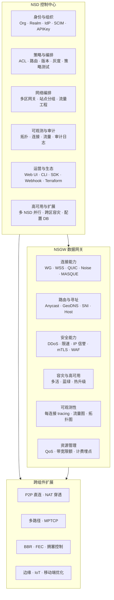

# 11 · NSD + NSGW 生产级愿景

> 适用读者: 产品决策人 / 解决方案架构师 / 平台负责人 / 控制面与网关组件的 Owner。
>
> 目标: 回答一个问题 —— **如果 NSIO 要把 NSD 和 NSGW 做到生产级(tailscale 控制中心 / headscale / zerotier controller / cloudflare WARP 同档次),需要补齐哪些能力?**

## 为什么要写这一章

docs/01 ~ docs/10 描述的是 NSIO 当下的样子:一个 Rust 数据面 (NSN/NSC) 对接最小可运行的控制面/网关 mock。这些 mock 只够跑 E2E 测试,**不够运营**。

- `tests/docker/nsd-mock/` 一共 7 个 `.ts` 文件,`src/index.ts:63-131` 一个 `Bun.serve` 同时处理所有路由,`registry.ts:1-424` 把所有注册状态塞在一个进程内存里 —— 没有持久化、没有多租户、没有审计。
- `tests/docker/nsgw-mock/` 用 `src/wg-setup.ts:1-49` 裸调 `wg` 命令管理内核接口,`src/wss-relay.ts:1-675` 用 `activeSessions` Map 缝合会话 —— 没有多区域、没有 QoS、没有 DDoS 防护、没有热升级。
- 生产 NSD 参考工程 `tmp/control/` 虽然是 **Pangolin fork**,功能已经相当完整 (多租户/组织/RBAC/IdP/billing/blueprint/audit log,见 `tmp/control/src/app/[orgId]/settings/` 下的 14 个子目录),但它**没有和 NSIO 的 Rust 数据面对接**: mock 里演进出来的 API 契约 (`POST /api/v1/machine/register`、`SSE /api/v1/config/stream`) 在 Pangolin 里完全不存在。
- 生产 NSGW 参考工程 `tmp/gateway/` 是 **fosrl/gerbil fork**(见 `tmp/gateway/main.go:27-30` 的 import 路径 `github.com/fosrl/gerbil/*`),它有 SNI 代理、UDP 中继、hole punch,但也**没有与 NSD 的 SSE 协议对齐**。

结论: NSIO 现在是"Rust 数据面 + 轻量 mock + 未对接的老参考实现"三件套。本章要给出**把这三件套融合成一套生产级产品**需要的能力模型、路线图和落地形态。

## 愿景陈述

**NSIO 的独立价值主张** (跟 tailscale / headscale / zerotier 区分):

1. **多 NSD 并行** —— 不是主从集群,而是"同一个 NSN 可以同时向多个 NSD 注册,策略按 `resource_id` 合并去重"。这让企业可以**把一个节点同时接入甲方 cloud NSD 和自建 NSD**,而不需要切换或迁移身份。对应代码: `crates/control/src/merge.rs:56`(`merge_proxy_configs` 入口,去重发生在第 63 行)、`crates/control/src/multi.rs`(`MultiControlPlane` 多控制面聚合)。
2. **协议可插拔的控制面** —— SSE / Noise / QUIC 三套传输共用同一个事件解析器 (`crates/control/src/sse.rs` 与 `crates/control/src/transport/` 下的 Noise/QUIC 实现)。在 DPI 严苛的网络下,NSIO 不需要像其他产品那样"先连一个 bootstrap、再切换协议",可以直接上 QUIC/Noise。
3. **`.ns` 命名空间 + 127.11.x.x VIP** —— 不需要 TUN、不需要改路由、不需要管理员权限,客户端即插即用。这让 NSIO 可以**在受限终端(企业笔记本、CI runner、Android App 沙箱)里运行**,对手产品普遍要求 TUN 权限。
4. **代理即 NAT** —— 站点侧不改 IP 头,只做端口→服务查找。ACL 是"仅允许",默认拒绝。这对"合规审计友好"是天然优势。

这些是 NSIO 的**独立主张**,不可放弃。其余的(多租户、RBAC、IdP、Webhook、Web UI、CLI、Terraform provider、多区域网关、DDoS 防护、边缘发现……)都是**行业共同底线**,做不到就没法卖给企业,也没法运营 SaaS。

## 本章的写法

本章**不描述当前状态**(那是 docs/08 和 docs/09 的职责)。本章是**前向设计**,围绕两个维度展开:

### 维度 A:能力模型 (Capability Model)

把功能按"能力轴"组织,而不是按菜单项。NSD 六大能力轴 / NSGW 六大能力轴 / 跨组件扩展(控制面+数据面)。每个能力轴说清楚:它解决什么场景问题、当前有多少、差距在哪、需要引入什么新概念。

### 维度 B:分级落地 (Tiered Delivery)

每项功能标记落地层级:**MVP** (能部署出去) / **GA** (能卖给中型企业) / **企业级** (能跟 tailscale Enterprise / headscale Pro 正面竞争)。

## 文档索引

| 文档 | 读者 | 内容 |
|------|------|------|
| [README.md](./README.md) | 全体 | 本文件 —— 愿景/对比/索引 |
| [methodology.md](./methodology.md) | 架构师 | 能力建模方法、功能分级标准、竞品调研口径 |
| [nsd-capability-model.md](./nsd-capability-model.md) | NSD owner | NSD 六大能力轴: 身份/策略/编排/可观测/运营/高可用 |
| [nsd-vision.md](./nsd-vision.md) | NSD owner | NSD 逐项功能预测: 50+ 功能 × 价值/挑战/落地级别 |
| [nsgw-capability-model.md](./nsgw-capability-model.md) | NSGW owner | NSGW 六大能力轴: 连接/路由/安全/容灾/观测/资源 |
| [nsgw-vision.md](./nsgw-vision.md) | NSGW owner | NSGW 逐项功能预测: 40+ 功能 × 价值/挑战/落地级别 |
| [control-plane-extensions.md](./control-plane-extensions.md) | 架构师 | 跨 NSD/NSN/NSC 的控制面新能力: 策略 DSL / CLI / SDK / Terraform |
| [data-plane-extensions.md](./data-plane-extensions.md) | 架构师 | 跨 NSGW/NSN/NSC 的数据面新能力: QUIC / MPTCP / P2P 直连 / BBR |
| [feature-matrix.md](./feature-matrix.md) | 产品/销售 | 60+ 行功能矩阵 × 7 列(当前/Sub-8 已规划/MVP/GA/企业/tailscale/headscale) |
| [roadmap.md](./roadmap.md) | PM | 分期交付: MVP → GA → 企业级,含里程碑/依赖/风险 |
| [operational-model.md](./operational-model.md) | SRE | 生产部署形态: 单机 POC / 单区 MVP / 多区 GA / 跨区企业 + SLA |
| [diagrams/](./diagrams/) | 全体 | 所有 Mermaid 源 (nsd-vision / nsgw-vision / capability-map / feature-tiers / roadmap) |

## 对比标杆

本章在引用 tailscale / headscale / zerotier / nebula / cloudflare WARP 等竞品时,遵守以下规则:

1. **确信的特性**才引用 (例如 tailscale 的 MagicDNS、coordination server、DERP 中继;headscale 的 self-hosted coordination、API key;zerotier 的 flow rules、moons)。
2. **不确信但业界通常应该具备的**特性,用"待调研"标注,**不编造**。
3. 所有引用 NSIO 源码的位置都给出 `path:line` 坐标,所有引用 `tmp/control` `tmp/gateway` 的位置都给出真实存在的文件路径。

## 跨章节链接

- [../01-overview/README.md](../01-overview/README.md) — NSIO 四组件全景 (NSD/NSGW/NSN/NSC)
- [../08-nsd-control/README.md](../08-nsd-control/README.md) — NSD 当前契约 (REST + SSE)
- [../09-nsgw-gateway/README.md](../09-nsgw-gateway/README.md) — NSGW 当前形态 (traefik + WG + WSS)
- [../10-nsn-nsc-critique/](../10-nsn-nsc-critique/) — NSN/NSC 视角的 gap 分析 (如 Sub-10 已产出,对照阅读)
- [methodology.md](./methodology.md) — 本章的写法与分级标准

## 能力地图(一张图看全局)

完整能力地图: [diagrams/capability-map.mmd](./diagrams/capability-map.mmd)。
