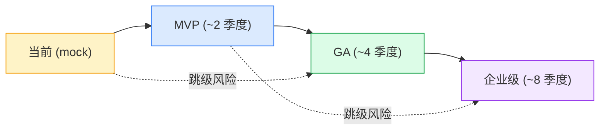

# 能力建模方法论

> 在开始读 nsd-vision.md / nsgw-vision.md 之前,建议先读本文。本文定义了"能力轴""落地层级""竞品调研口径"这三个概念 —— 后续所有功能预测都围绕它们展开。

## 为什么不用"功能清单"而用"能力模型"

产品团队最常见的失误是把功能按 UI 菜单组织:"我们要加一个组织管理页""我们要加一个审计日志页""我们要加一个 API key 页"。这种组织方式的问题:

1. **功能之间的依赖关系消失** —— 组织管理必须先有"身份"(用户/SSO/API key),审计日志必须先有"事件总线";菜单并列的时候看不出谁先谁后。
2. **同一个能力被拆成多个菜单反复开发** —— "ACL 策略"可能同时出现在"资源""站点""用户权限"三个菜单,每个菜单自己写一套规则引擎。
3. **规划时容易漏掉"无 UI 的能力"** —— CLI、Webhook、Terraform provider、SDK 这些功能没有独立菜单,却是企业买单的关键。

## 六大能力轴 (NSD)

把 NSD 的功能组织成 6 条相互正交的"能力轴":

| 轴 | 关键词 | 代表功能 | 跨轴依赖 |
|----|--------|----------|----------|
| **身份与组织** | Identity | Org / Realm / User / IdP / SCIM / API Key / PAT / Service Account | 策略、可观测、运营 |
| **策略与编排** | Policy | ACL / 路由 / 服务发现 / 策略版本 / 灰度 / 策略测试 / 定时策略 | 身份、网络编排 |
| **网络编排** | Topology | 多区 NSGW / 站点分组 / 跨站点直连策略 / 流量工程 | 策略、高可用 |
| **可观测与审计** | Observability | 设备状态 / 连接拓扑 / 流量分析 / 告警 / 审计日志 / SLA 统计 | 所有轴 |
| **运营与生态** | Ecosystem | Web UI / CLI / OpenAPI / 多语言 SDK / Webhook / 插件 / Terraform | 身份、策略 |
| **高可用与扩展** | Reliability | 多 NSD 集群 / 跨区容灾 / 配置 DB 选型 / 读写分离 / 缓存层 | 基础设施 |

**判定一个功能属于哪条轴**:看它解决的"主问题"是什么。审计日志 UI 显示在"运营"菜单下,但它真正的主问题是"合规可见性",所以在**可观测**轴。

## 六大能力轴 (NSGW)

| 轴 | 关键词 | 代表功能 | 跨轴依赖 |
|----|--------|----------|----------|
| **连接能力** | Transport | WG / WSS / QUIC / Noise / MASQUE / STUN / TURN | 安全、资源 |
| **路由与寻址** | Routing | Anycast / GeoDNS / 就近接入 / SNI 路由 / Host 路由 / 跨网关热迁移 | 连接、容灾 |
| **安全能力** | Security | DDoS / 限速 / IP 信誉 / mTLS / WAF / 零信任策略点 | 连接、路由 |
| **容灾与高可用** | Resilience | 多活 / 蓝绿 / 金丝雀 / 热升级 / 流量迁移 | 路由、观测 |
| **可观测性** | Telemetry | 每连接 tracing / 流量图 / 拓扑图 / 指标 / 日志 | 所有轴 |
| **资源管理** | Resource | QoS / 流量整形 / 带宽限额 / 计费埋点 / 配额 / 背压 | 连接、安全 |

## 跨组件能力 (不属于单一组件)

某些能力由 NSD 和 NSGW 共同协作实现,或者同时涉及 NSN/NSC。这些能力单独归类为"跨组件扩展",详见 [control-plane-extensions.md](./control-plane-extensions.md) 和 [data-plane-extensions.md](./data-plane-extensions.md):

- **策略 DSL 与 CLI/SDK** — NSD 提供 API,NSC/NSN 作为策略执行点
- **P2P 直连 / NAT 穿透** — NSGW 协助 STUN,NSN/NSC 直接打洞
- **多路径 / MPTCP** — NSGW/NSN/NSC 三方协商
- **拥塞控制 / BBR / FEC** — 内核和 gotatun 共同调参
- **边缘 / IoT / 移动端优化** — 全链路协作

## 落地层级定义

本章**每一项功能都必须标注**一个落地层级。层级是递进的 —— 标注"企业级"的功能意味着它的前置 MVP 和 GA 必须也完成。

### MVP (Minimum Viable Product)

> **目标客户**:能部署出去给 10 个内部用户用,证明架构成立。
>
> **对标**:headscale 0.x,Fossorial Pangolin 初版。

MVP 的**必要条件**:

- [ ] 单 NSD 实例 + 单 NSGW 实例能启动,并被 NSN/NSC 成功注册
- [ ] 配置用文件 / SQLite 持久化,重启后状态不丢
- [ ] 基本 Web UI: 登录、查看设备、查看隧道状态
- [ ] CLI: `nsdctl site list`、`nsdctl user add` 等 10 条基本命令
- [ ] SSO via OIDC (至少 Keycloak / Authentik)
- [ ] 审计日志落本地磁盘
- [ ] 基本健康检查 + Prometheus 指标

MVP **不必要**:多区域、billing、SAML、webhook、多 NSD 集群、热升级。

### GA (General Availability)

> **目标客户**:卖给中型企业 (100~1000 节点),有 SLA。
>
> **对标**:tailscale free/personal + commercial 过渡期,zerotier 社区版。

GA 的**必要条件**(在 MVP 之上):

- [ ] 多区域 NSGW 部署 (至少 3 区),客户端基于 GeoDNS 就近接入
- [ ] 多 NSD 实例 (active-active),共享后端数据库 (Postgres)
- [ ] SAML SSO + SCIM 用户自动同步
- [ ] 策略版本化 + 灰度发布 (按 10%/50%/100% 推送)
- [ ] Webhook + 事件总线
- [ ] Terraform provider 覆盖 80% 资源
- [ ] 多语言 SDK (TS / Python / Go)
- [ ] 审计日志支持导出到 S3 / 外部 SIEM
- [ ] NSGW 支持热升级 (drain → reload)
- [ ] 基本 DDoS 防护 (限速 + SYN cookies)
- [ ] SLA 99.9% 的 NSD,99.95% 的数据面

### 企业级 (Enterprise)

> **目标客户**:大型企业 / 金融 / 政府,要求合规、定制、私有化。
>
> **对标**:tailscale Enterprise, cloudflare Access, zerotier Business。

企业级的**必要条件**(在 GA 之上):

- [ ] 多 NSD 并行 (同一节点接入多个 NSD,策略合并) — 这是 NSIO 的**差异化主张**
- [ ] 私有化部署 + air-gap 支持 (离线 license,离线 OTA)
- [ ] 合规认证 (SOC2 / ISO27001 / GDPR 数据驻留)
- [ ] 企业级 IdP (SAML 2.0 + Azure AD + Okta 深度集成)
- [ ] RBAC + ABAC 混合权限
- [ ] 策略 DSL (类似 Rego) + 策略仿真 / 回滚
- [ ] Anycast IP / BGP 对等 / DDoS 防护 (Layer 7 + L3/L4)
- [ ] 跨云 (AWS/GCP/Azure) 统一控制面
- [ ] 客户自带 CA (BYO-CA) + 硬件密钥 (HSM/FIDO2)
- [ ] 99.99% SLA + 数据面 < 100ms RTT SLA

## 竞品调研口径

本章在做对比时,**只引用已知事实**,不编造。已知事实来自:

- **tailscale** — 官方文档 https://tailscale.com/kb/ (MagicDNS / DERP / ACL / tailnet / device auth / SSH / Funnel / Exit nodes)
- **headscale** — github.com/juanfont/headscale (self-hosted coordination server, API v1, OIDC)
- **zerotier central** — zerotier.com 文档 (flow rules, moons, managed routes, members)
- **nebula** — github.com/slackhq/nebula (certificate-based identity, lighthouse, P2P overlay)
- **cloudflare WARP / Access / Tunnel** — 有公开文档的部分 (Argo Tunnel, Zero Trust, Magic WAN)

**未知的特性直接标"待调研"**。尤其是 feature-matrix.md 里横向对比,如果某个产品有没有"策略 DSL"我不确定,就写"**?**"而不是猜测。

## 引用格式约束

- 引用 NSIO 主工程: `crates/control/src/merge.rs:56` (相对 `/app/ai/nsio/`)
- 引用 NSD mock: `tests/docker/nsd-mock/src/index.ts:63-131`
- 引用 NSGW mock: `tests/docker/nsgw-mock/src/index.ts:201-292`
- 引用 NSD 参考工程: `tmp/control/src/app/[orgId]/settings/access/page.tsx`
- 引用 NSGW 参考工程: `tmp/gateway/main.go:118-432`
- 引用竞品: "tailscale 官方文档" 或 "待调研"

所有引用的**行号必须真实**。如果在本章写作时无法核实行号,宁可写"见 `xxx.ts`"也不编造数字。

## 图示约定

注意:本图中的"季度"是示意性的**相对间距**,不代表真实日历节奏。真实排期以 [roadmap.md](./roadmap.md) 为准。

## 阅读本章的顺序建议

- 想快速理解**是什么/为什么**: [README.md](./README.md) → 本文 → [feature-matrix.md](./feature-matrix.md)
- 想做**NSD/NSGW 的详细设计**: 先读 [nsd-capability-model.md](./nsd-capability-model.md) / [nsgw-capability-model.md](./nsgw-capability-model.md),再读对应 vision.md
- 想做**排期和资源规划**: [roadmap.md](./roadmap.md) + [operational-model.md](./operational-model.md)
