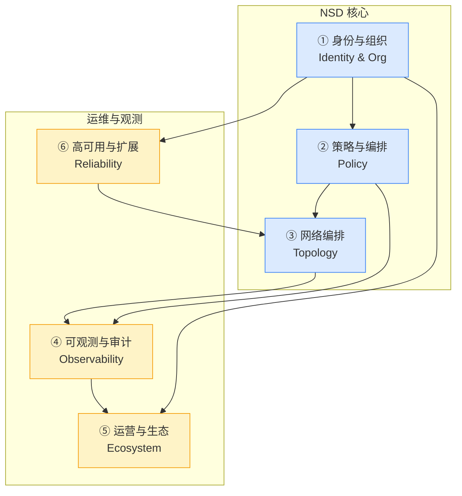

# NSD 能力模型

> **读者**: NSD 的产品/架构 Owner。
>
> **目标**: 把 NSD 的所有生产级能力组织成 6 条正交的能力轴,给每条轴一个"主问题""当前状态""目标形态""与其他轴的依赖"。逐项功能预测见 [nsd-vision.md](./nsd-vision.md)。

## 当前坐标 (Baseline)

今天 NSD 在代码中的形态是 **Bun + TypeScript mock + 内存 registry**:

- `tests/docker/nsd-mock/src/index.ts:63` — 单个 `Bun.serve` 入口
- `tests/docker/nsd-mock/src/registry.ts:1-424` — 所有状态塞在进程内存 (`Map<machineId, MachineState>`)
- `tests/docker/nsd-mock/src/auth.ts:1-443` — authkey 校验 + device flow + Ed25519 签名 + mock JWT
- `tests/docker/nsd-mock/src/noise-listener.ts` / `quic-listener.ts` — 控制面备用传输
- `tests/docker/nsd-mock/src/types.ts:1-266` — 核心实体定义 (Machine / Service / Gateway)

生产参考 `tmp/control/` (Pangolin fork) 提供了完整 Web UI 框架:

- `tmp/control/src/app/[orgId]/settings/` — 14 类设置 (access/api-keys/blueprints/clients/domains/general/logs/provisioning/resources/share-links/sites + private 下的 billing/idp/license/remote-exit-nodes)
- `tmp/control/src/app/admin/` — 全局 admin (api-keys/idp/license/users)
- `tmp/control/src/app/auth/` — 认证页面 (2fa/idp/login/signup/verify-email/reset-password/initial-setup)
- `tmp/control/messages/` — 多语言 (en-US / de-DE / fr-FR / zh-CN / ko-KR / 等)
- `tmp/control/cli/commands/` — 7 条 admin CLI (clearExitNodes / clearLicenseKeys / deleteClient / generateOrgCaKeys / resetUserSecurityKeys / rotateServerSecret / setAdminCredentials)

生产形态要把 mock 的 API 契约("我的 NSN 要什么")和 Pangolin 的 UI/DB 架构("我的管理员要什么")融合起来。

## 六大能力轴 · 一览

---

## 轴 ① 身份与组织 (Identity & Org)

### 主问题

**"谁是谁"以及"谁属于哪个组织"**。一切访问控制的起点。

### 关键子能力

| 子能力 | 当前状态 | 目标形态 |
|--------|----------|----------|
| 机器身份 | ✅ machinekey (Ed25519) + peerkey (Curve25519),见 `tests/docker/nsd-mock/src/auth.ts:1-443` | 保持现有契约;加 PKI 根证书管理、密钥轮转、硬件绑定 |
| 用户身份 | 参考实现有,mock 无 | 本地用户 + OIDC + SAML + SCIM 用户同步 |
| 组织/租户 | 参考实现有 `[orgId]` 路由;mock 里用 "realm" 概念 | 强多租户隔离: 数据库行级 / 独立 schema / 独立 DB |
| Realm | ✅ `tests/docker/nsd-mock/src/types.ts` 里有 realm 字段 | 支持 **cloud shared realm** (多租户共用) 与 **self-hosted realm** (独立实例) 并存 |
| API Key | 参考实现有 (`tmp/control/src/components/ApiKeysTable.tsx`, `OrgApiKeysTable.tsx`),mock 无 | User API Key + Org API Key + Admin API Key 三层 |
| PAT / Service Account | 参考实现有"service account"雏形 | Service account 可注册机器 + 自动化脚本专用 |
| 2FA / WebAuthn | 参考实现有 (`tmp/control/src/app/auth/2fa/`, `tmp/control/src/components/Enable2FaForm.tsx`) | TOTP + FIDO2 (security key) 必选,后者用于特权操作 |
| 邀请与审批 | 参考实现有 (`tmp/control/src/components/InvitationsTable.tsx`, `ApprovalFeed.tsx`) | 邀请链接 + 审批工作流 (见 pending sites 雏形) |
| Device Flow (RFC 8628) | ✅ mock 实现,见 `tests/docker/nsd-mock/src/auth.ts` (POST `/api/v1/device/code` + `/api/v1/device/token`) | 保留并完善:client_id 分配、polling 退避、user_code 到期回收 |

### 与其他轴的依赖

- **策略轴** 要知道"principal = user | machine | service_account"来写规则
- **可观测轴** 要把"谁操作了什么"记到审计日志
- **运营轴** 要在 Web UI / CLI / SDK 都能管理这些身份
- **高可用轴** 要保证身份数据的跨区一致性

### 关键设计决策 (Open)

1. **单一 IdP vs 多 IdP 并存**: 一个 org 是否允许同时挂 OIDC + SAML + 本地账号?Pangolin 参考实现支持 (`tmp/control/src/app/[orgId]/settings/(private)/idp/`)。
2. **SCIM 是否 MVP 必备**: 从"能卖给 1000 人企业"角度看,SCIM 在 GA 必须有,MVP 可以不做。
3. **密钥轮转策略**: NSN/NSGW 的 peer 公钥何时轮转?目前无机制,参考 WireGuard 最佳实践每 90 天。

---

## 轴 ② 策略与编排 (Policy)

### 主问题

**"谁能访问什么"以及"怎么路由"**。策略是 NSIO 的核心差异化,因为它是**仅允许 + 默认拒绝**模型,比 tailscale 的 Allow/Deny 更简单但更严格。

### 关键子能力

| 子能力 | 当前状态 | 目标形态 |
|--------|----------|----------|
| ACL 下发 | ✅ SSE `acl_config` 事件,见 `crates/control/src/sse.rs` 与 mock `registry.ts` | 保持 SSE + 加"ACL 版本号"字段支持回滚 |
| ACL 合并 | ✅ `crates/control/src/merge.rs:56` 按 `resource_id` 去重 | 保留并加"策略冲突检测": 两条规则目标相同但 action 不同时警告 |
| 路由下发 | ✅ `routing_config` 事件,见 `tests/docker/nsd-mock/src/registry.ts` 与 `tests/docker/nsgw-mock/src/traefik-config.ts` | 加"路由优先级"、"回落目标"、"灰度比例" |
| 服务发现 | ✅ `proxy_config` 事件 + NSN 侧 `services.toml` 严格模式 | 加"服务标签"与"环境标签"(prod/staging) |
| DNS 下发 | ✅ `dns_config` 事件 | 加"条件 DNS"(基于 client location / user group) |
| 策略 DSL | ❌ 现在是 JSON 硬编码 | 引入**声明式 DSL**(类似 Rego / CEL),支持 "allow user in group X to access site Y via gateway Z" |
| 策略版本化 | ❌ 每次推送覆盖 | 带版本号,NSN/NSGW 记录当前 version,支持一键回滚 |
| 灰度发布 | ❌ | 按百分比推送: 10% 设备看到新策略,确认无问题后全量 |
| 策略测试 | ❌ 目前没法"假设某请求,看策略是否允许" | 提供 `nsdctl policy test --user alice --target ssh.site.n.ns` |
| 定时策略 | ❌ | "仅工作日 9-18 点允许访问生产数据库" |
| 条件策略 | ❌ | 基于设备 posture (有无 2FA / OS 版本 / 磁盘加密) 授予访问 |
| 策略审批 | ❌ | 高风险策略变更要 2 人审批才能生效 |

### 差异化主张

**NSIO 的 ACL 是"仅允许"模型**,不是 tailscale 的 Accept/Reject 叠加。好处:

- 语义简单: 没写的都是拒绝,不需要读整个规则列表才知道最终效果
- 审计友好: 每条规则都对应"一个具体的允许",合规审计逐条核查
- 支持合并去重 (`resource_id`): 多 NSD 环境下天然幂等

这在 feature-matrix 里要特别强调。

### 与其他轴的依赖

- **身份轴** 提供 principal
- **网络编排轴** 提供 target (站点 / 服务 / 网关)
- **可观测轴** 需要把"哪条策略拦了哪个请求"导出为 ACL log
- **运营轴** 需要 Web UI 编辑器 + CLI 导入/导出 + SDK 批量操作

---

## 轴 ③ 网络编排 (Topology)

### 主问题

**"站点和网关如何组网"**。包括多区域、站点分组、跨站点直连、流量工程。

### 关键子能力

| 子能力 | 当前状态 | 目标形态 |
|--------|----------|----------|
| 多区域 NSGW | ❌ 单区 mock;`/api/v1/gateway/report` 只记录一个 endpoint | 每个 gateway 带 region / zone 标签,NSN 按权重 + 地理就近选择 |
| NSN 侧选路 | ✅ `crates/connector/` 的 `MultiGatewayManager`,多网关选路 | 加 latency 探测 + 自动 failover + 回收时机 |
| 站点分组 | ❌ | "prod-apps""dev-lab""branch-offices" 分组,策略可按组下发 |
| 跨站点直连策略 | ❌ | site A 的 NSN 直接访问 site B 的 NSN,不经过 NSGW (via P2P 或专线) |
| 流量工程 | ❌ | 按源/目的区域强制走特定 gateway; bandwidth class 调度 |
| 拓扑编辑器 | ❌ | 可视化拖拽 gateway / site / user group,生成路由策略 |
| Exit Node | 参考实现有 `tmp/control/src/app/[orgId]/settings/(private)/remote-exit-nodes/` | 用户流量走某个 NSN 出公网,类似 tailscale exit node |
| Subnet Router | 参考实现雏形 | 站点内一个 NSN 代表整个子网,其他设备免客户端 |

### 与其他轴的依赖

- **身份轴** 给出"谁在哪个区域"的线索 (user.home_region)
- **策略轴** 下发路由规则
- **可观测轴** 拓扑可视化、网关健康状态
- **高可用轴** 跨区 failover

---

## 轴 ④ 可观测与审计 (Observability & Audit)

### 主问题

**"现在什么在运行?过去发生过什么?谁做了什么?"**。合规与运维的基石。

### 关键子能力

| 子能力 | 当前状态 | 目标形态 |
|--------|----------|----------|
| 设备实时状态 | ❌ mock 里有 registry 但没 UI | Web UI 全量设备列表 + 过滤 + 实时更新 (SSE/WS 到前端) |
| 连接拓扑 | ❌ | 可视化 "站点↔网关↔客户端" 活跃连接图,带 bandwidth |
| 流量分析 | ❌ | Top N 源/目的/协议,按时间粒度聚合 |
| 告警 | ❌ | 规则化告警 (如"网关下线超过 5 分钟") + 推送到邮件/Slack/PagerDuty |
| 审计日志 (全量) | 参考实现有 `tmp/control/src/app/[orgId]/settings/logs/action/` | 落本地磁盘 + 导出 S3 / 外部 SIEM;字段: who/when/what/from_ip |
| 请求日志 | 参考实现有 `tmp/control/src/app/[orgId]/settings/logs/request/` | HTTP 层请求粒度 (Method/Path/Status/Latency) |
| 连接日志 | 参考实现有 `tmp/control/src/app/[orgId]/settings/logs/connection/` | 4 层会话粒度 (src/dst/bytes/duration) |
| 访问日志 | 参考实现有 `tmp/control/src/app/[orgId]/settings/logs/access/` | ACL 拒绝/允许 + 匹配规则 |
| 流式日志 | 参考实现有 `tmp/control/src/app/[orgId]/settings/logs/streaming/` | 实时日志尾巴 (SSE 到 Web UI) |
| 日志分析 | 参考实现有 `tmp/control/src/app/[orgId]/settings/logs/analytics/` | 统计看板 (按日/周聚合) |
| SLA 统计 | ❌ | 月度 SLA 报告: uptime / p99 latency / failover count |
| OpenTelemetry | NSN 侧有 (`crates/telemetry/`) | NSD/NSGW 统一 OTel: traces 关联 session_id |

### 与其他轴的依赖

- **所有轴都依赖观测**,但观测本身依赖**身份**(记录"谁")和**策略**(记录"为什么")
- 存储/查询是独立能力,需要选型 (ClickHouse / Loki / 自研 timeseries)

---

## 轴 ⑤ 运营与生态 (Ecosystem)

### 主问题

**"运营者能怎么操作,外部系统能怎么集成"**。这条轴决定 NSIO 能不能进入企业 CI/CD、IaC、告警体系。

### 关键子能力

| 子能力 | 当前状态 | 目标形态 |
|--------|----------|----------|
| Web UI | 参考实现完备 `tmp/control/src/app/` + 100+ 组件 | i18n 完善 (已有 10 种语言 `tmp/control/messages/`) + 深色模式 |
| CLI | 参考实现有 7 条 admin CLI `tmp/control/cli/commands/` | 完整 `nsdctl` 覆盖所有资源: site / user / policy / gateway / log |
| OpenAPI | ❌ 目前是 mock 手写 handler | 基于 schema 生成,挂载到 Web UI 的 API docs 页 |
| 多语言 SDK | ❌ | TypeScript / Python / Go / Rust 四个官方 SDK,保证行为一致 |
| Webhook | ❌ | 事件发生时 POST 到客户配置的 URL (site.joined / policy.changed / gateway.down) |
| 事件总线 | ❌ | 内部 Kafka/NATS,支持 fan-out,外部 consumer 可订阅 |
| 插件系统 | ❌ | NSD 暴露扩展点 (authn / authz / webhook filter),可加载第三方插件 |
| Terraform Provider | ❌ | `hashicorp/terraform-provider-nsio` 覆盖核心资源 |
| Pulumi / Ansible | ❌ | (可选) 次要 IaC 生态 |
| Kubernetes Operator | ❌ | CRD: `NsSite` / `NsUser` / `NsPolicy` 在 k8s 内声明式管理 |
| Billing / 计费 | 参考实现有 `tmp/control/src/app/[orgId]/settings/(private)/billing/` | 按带宽 / 按活跃设备 / 按策略数量计费;对接 Stripe |
| License | 参考实现有 `tmp/control/src/app/[orgId]/settings/(private)/license/` | 离线 license key (air-gap 部署专用) |
| Blueprint / 模板 | 参考实现有 `tmp/control/src/app/[orgId]/settings/blueprints/` | 站点部署模板,一键克隆 |
| Share Link | 参考实现有 `tmp/control/src/app/[orgId]/settings/share-links/` | 临时访问链接,带过期时间与权限 |

### 与其他轴的依赖

- **身份轴** — 所有生态集成都要鉴权 (API Key / PAT)
- **策略轴** — Terraform / SDK 的"写入"操作要经过策略校验
- **可观测轴** — Webhook 本质上是**观测事件的对外推送**

---

## 轴 ⑥ 高可用与扩展 (Reliability & Scale)

### 主问题

**"NSD 挂了怎么办?数据量涨到百万节点怎么办?"**

### 关键子能力

| 子能力 | 当前状态 | 目标形态 |
|--------|----------|----------|
| 多 NSD 实例 | ❌ mock 单进程 | 多实例 active-active,共享 Postgres / Redis |
| 多 NSD 并行 (差异化) | ✅ NSN 侧已支持 `MultiControlPlane` | NSD 侧也感知彼此,或者纯粹无状态互不感知 |
| 配置 DB | ❌ mock 内存 | Postgres (主推) + SQLite (单机 MVP);Pangolin 参考实现 drizzle ORM 支持两者 (`tmp/control/drizzle.pg.config.ts`, `drizzle.sqlite.config.ts`) |
| 读写分离 | ❌ | 读走 replica,写走 primary |
| 缓存层 | ❌ | Redis 缓存常被读的 registry / policy |
| 跨区容灾 | ❌ | NSD 部署在多 region,DNS failover |
| 配置 CDN | ❌ | SSE 的"snapshot"部分可以缓存到 CDN/edge,live events 仍走中心 |
| 备份恢复 | ❌ | 每日快照 + PITR |
| 热升级 | ❌ | 滚动升级不断 SSE |
| 负载均衡 | ❌ | SSE 连接数均匀分布到多 NSD 实例 |
| 限流 | ❌ | 每 API Key / 每 IP 的 QPS 限制 |
| 黑白名单 | ❌ | 针对注册端点的 IP 黑白名单 |

### 与其他轴的依赖

- **身份轴** 数据跨区一致性
- **策略轴** 全局策略 vs 区域策略的合并
- **可观测轴** 跨区数据聚合查询

### 多 NSD 并行 —— NSIO 的差异化

`crates/control/src/multi.rs` (`MultiControlPlane`) 允许一个 NSN 同时连多个 NSD,各自下发独立配置,NSN 侧按 `resource_id` 合并去重 (`crates/control/src/merge.rs:63`,函数入口 `merge_proxy_configs` 见 `merge.rs:56`)。

**这是 NSIO 区别于 tailscale / zerotier 的关键能力**:

- 企业既可以接入甲方 cloud NSD(获取公司下发的策略),也可以接入自建 NSD(本地运维专用策略)
- 两个 NSD 互不感知,NSN 侧独立做合并
- 支持"主控制面宕机时备用控制面继续下发"场景

本章 [control-plane-extensions.md](./control-plane-extensions.md) 会展开讲**如何把这种能力打造成对外卖点**。

---

## 能力轴优先级矩阵

| 轴 | MVP 必要性 | GA 必要性 | 企业级必要性 |
|----|-----------|-----------|-------------|
| ① 身份与组织 | 🟢 高 (OIDC + 本地用户) | 🟢 高 (SAML + SCIM) | 🟢 高 (HSM + ABAC) |
| ② 策略与编排 | 🟡 中 (硬编码 ACL) | 🟢 高 (版本 + 灰度) | 🟢 高 (DSL + 仿真) |
| ③ 网络编排 | 🟡 中 (单区) | 🟢 高 (多区) | 🟢 高 (流量工程) |
| ④ 可观测与审计 | 🟡 中 (基础指标) | 🟢 高 (完整日志) | 🟢 高 (SIEM 对接) |
| ⑤ 运营与生态 | 🟡 中 (CLI + Web UI) | 🟢 高 (SDK + TF) | 🟢 高 (k8s operator) |
| ⑥ 高可用与扩展 | 🔴 低 (单实例够用) | 🟢 高 (active-active) | 🟢 高 (多 NSD 并行) |

下一步:按能力轴展开具体功能 → [nsd-vision.md](./nsd-vision.md)。
