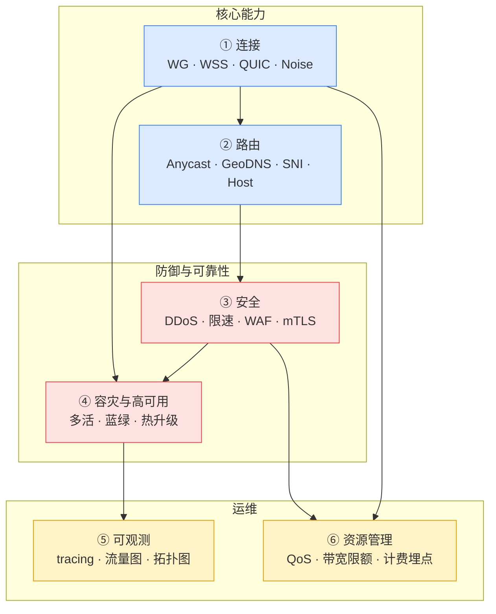

# NSGW 能力模型

> **读者**: NSGW 的 Owner / 数据面架构师。
>
> **目标**: 把 NSGW 的所有生产级能力组织成 6 条能力轴。逐项功能预测见 [nsgw-vision.md](./nsgw-vision.md)。

## 当前坐标 (Baseline)

### Mock 形态

- `tests/docker/nsgw-mock/src/index.ts:1-387` — Bun 单进程,三个监听: health API / WSS relay / SSE 订阅 NSD
- `tests/docker/nsgw-mock/src/wg-setup.ts:1-49` — 用 `wg` 命令行工具管理内核接口
- `tests/docker/nsgw-mock/src/wss-relay.ts:1-675` — "连接器↔客户端"会话缝合的最小实现
- `tests/docker/nsgw-mock/src/traefik-config.ts:1-68` — 把 SSE `routing_config` 事件写成 traefik 动态配置文件
- `tests/docker/nsgw-mock/src/config.ts:1-44` — 从环境变量读配置

### 生产参考 (fosrl/gerbil fork)

- `tmp/gateway/main.go:1-1317` — Go 实现,功能远超 mock:
  - kernel WG via `golang.zx2c4.com/wireguard/wgctrl` (`main.go:28-30`)
  - UDP 中继 (`relay.UDPProxyServer`, `tmp/gateway/relay/relay.go`)
  - SNI 代理 (`proxy.SNIProxy`, `tmp/gateway/proxy/proxy.go`)
  - PROXY protocol v1 支持 (`main.go:134-223`)
  - 周期性带宽上报 (`main.go:345-348`)
  - hole punch 消息 (`main.go:85-88`, `relay/relay.go:21-33`)
  - pprof 监控端点 (`main.go` import `net/http/pprof`)
  - 内存监控 (`main.go:119` `monitorMemory`)
- `tmp/gateway/relay/relay.go:21-100` — `EncryptedHolePunchMessage` / `HolePunchMessage` / `ClientEndpoint` / WireGuardSession / `ProxyMapping` / `PeerDestination`
- `tmp/gateway/proxy/proxy.go:1-60` — `SNIProxy` 结构,支持本地 SNI 白名单 `localSNIs`

### 真实生产 NSGW 是"mock + gerbil 并集"

生产 NSGW 要同时拥有:
- mock 的 **NSD SSE 订阅 + traefik 动态配置** (因为这是 NSIO 的核心契约)
- gerbil 的 **kernel WG + UDP 中继 + SNI 代理 + hole punch** (因为这是真数据面)

目前两者独立,没有融合。

---

## 六大能力轴 · 一览

---

## 轴 ① 连接能力 (Transport)

### 主问题

**"NSC / NSN 用什么协议 + 什么端口接入 NSGW"**。多种协议并存的目的是在不同网络环境下保证可达。

### 关键子能力

| 子能力 | 当前状态 | 目标形态 |
|--------|----------|----------|
| WireGuard UDP | ✅ mock via `wg` 命令 (`tests/docker/nsgw-mock/src/wg-setup.ts:1-49`); 生产 via `wgctrl` (`tmp/gateway/main.go:327-329`) | 生产级内核 WG + 自动 peer reconcile |
| WSS (WsFrame) | ✅ mock `wss-relay.ts:1-675` | 支持 connection multiplexing + 背压控制 |
| QUIC | ❌ NSGW 侧没有;NSD 侧 mock 有 `quic-listener.ts` | NSGW 也接 QUIC,作为 WSS 替代 (更好的 loss 容忍) |
| Noise | ❌ NSGW 侧没有 | 在 WSS/QUIC 之外再加 Noise 直连选项 |
| MASQUE (HTTP/3) | ❌ | 未来支持 HTTP/3 信道,跨 CDN 穿透 |
| UDP Hole Punch (P2P) | 参考实现有 (`tmp/gateway/relay/relay.go:21-33`, `tmp/gateway/main.go:85-88`) | NSC↔NSN 直连,NSGW 只做 signaling |
| STUN 服务 | ❌ | 内置 STUN 让客户端探测 NAT 类型 |
| TURN 服务 | ❌ | 当 P2P 不通时作为中继 fallback |
| PROXY protocol v1 | ✅ `tmp/gateway/main.go:134-223` 有 `proxyProtocol` flag | 默认开启,支持 v2;透传真实 client IP |
| PROXY protocol v2 | ❌ | 支持二进制版本 + TLV 扩展 |
| TLS terminate | ✅ traefik 实现 | 保持 traefik |
| mTLS terminate | ❌ | traefik 加 client cert 校验 |
| SO_REUSEPORT | ❌ | 多进程并发处理同一端口,提高吞吐 |
| 流量封装 (gateway-to-gateway) | ❌ | 多 NSGW 之间的内部 mesh,如 WireGuard mesh |

### 与其他轴的依赖

- **路由轴** — 终结每种协议后路由到后端
- **安全轴** — DDoS 防护要在最外层 (UDP + TCP + QUIC 都要)
- **观测轴** — 每种协议的连接数 / 错误码都要上报

---

## 轴 ② 路由与寻址 (Routing)

### 主问题

**"进来的流量怎么知道送到哪个 NSN 或哪个后端服务"**。

### 关键子能力

| 子能力 | 当前状态 | 目标形态 |
|--------|----------|----------|
| WG AllowedIPs 路由 | ✅ mock `addPeer(pubkeyB64, allowedIps)` (`tests/docker/nsgw-mock/src/index.ts:256-259`) | 保持,加 peer heartbeat 监控 |
| traefik Host 路由 | ✅ mock `handleRoutingConfig` (`tests/docker/nsgw-mock/src/traefik-config.ts:1-68`) 把 SSE 事件转成 traefik 动态配置 | 保持 + 加中间件链 (rate-limit, auth) |
| SNI 路由 | ✅ `tmp/gateway/proxy/proxy.go:1-60` `SNIProxy` | 合并到生产 NSGW |
| 本地 SNI 白名单 | ✅ `tmp/gateway/proxy/proxy.go:40-60` `localSNIs` | 保持 |
| Anycast IP | ❌ | 多区域 NSGW 用相同 IP,BGP 广播,客户端就近接入 |
| GeoDNS | ❌ | 域名解析时按客户端地理位置返回最近 NSGW |
| 跨网关热迁移 | ❌ | 客户端从 NSGW-A 迁到 NSGW-B,现有 TCP 不断 (需要 MPTCP 或连接 handoff) |
| 路由优先级 | ❌ | 多条路由规则时按优先级选择 |
| 路由 A/B 测试 | ❌ | 按请求头 / cookie 分流到不同后端 |
| 回落路由 | ❌ | 主 NSN 不可达时回落到备 NSN |
| Path-based routing | 参考 Pangolin 有 (`tmp/control/src/components/PathMatchRenameModal.tsx`) | HTTP 层按路径前缀路由到不同 NSN resource |
| Header-based routing | 参考 Pangolin 有 (`tmp/control/src/components/HeadersInput.tsx`, `SetResourceHeaderAuthForm.tsx`) | 按 HTTP header 路由 |

### 与其他轴的依赖

- **连接轴** 提供入站流量
- **安全轴** 路由前要做 DDoS / 限速
- **容灾轴** 跨区域路由自动 failover

---

## 轴 ③ 安全能力 (Security)

### 主问题

**"不怀好意的流量怎么挡住,合法流量怎么降速"**。

### 关键子能力

| 子能力 | 当前状态 | 目标形态 |
|--------|----------|----------|
| 基础限速 | ❌ | 按 src_ip / dst_ip / dst_port 限速 |
| SYN cookies | ❌ (内核默认有) | 确保开启 + 监控 |
| UDP flood 防护 | ❌ | 基于 pubkey 的 UDP 速率限制 |
| Conntrack 保护 | ❌ | 限制未认证 peer 的 handshake 速率 |
| TLS SNI filtering | 可借助 traefik | 阻止未授权的 SNI |
| IP 信誉 (feed) | ❌ | 对接 Spamhaus / CrowdSec (参考 `tmp/control/install/crowdsec.go`) |
| WAF | ❌ | traefik 前置 ModSecurity / Coraza |
| Bot 管理 | ❌ | 识别并挡住爬虫 |
| 零信任策略点 | ❌ | NSGW 在终结 TLS 后问 NSD "这个用户能不能访问这个 resource" (类似 Cloudflare Access) |
| mTLS 客户端证书 | ❌ | 特定域名强制客户端出示证书 |
| DDoS L3/L4 | ❌ | 大流量靠上游 (Cloudflare / AWS Shield) |
| DDoS L7 | ❌ | 应用层攻击识别 (challenge, slow loris) |
| Token bucket per peer | ❌ | 每个 WG peer 独立 bucket |
| ACL 执行点 | 目前在 NSN | 可选在 NSGW 执行 (更低延迟,但要 NSD 下发 ACL 到 NSGW) |

### CrowdSec 集成

Pangolin 参考工程 `tmp/control/install/crowdsec.go` 已经有 CrowdSec 集成雏形 —— 这是一个开源的社区驱动威胁情报平台,比独立维护 IP 信誉列表划算。

### 与其他轴的依赖

- **连接轴** 在 TLS 终结前做 L3/L4 防御
- **路由轴** 在路由决策前做 ACL
- **观测轴** 所有拦截事件要记录

---

## 轴 ④ 容灾与高可用 (Resilience)

### 主问题

**"网关挂了怎么办 + 升级期间不断流 + 配置错误能快速回滚"**。

### 关键子能力

| 子能力 | 当前状态 | 目标形态 |
|--------|----------|----------|
| 单实例 | ✅ 当前 mock | — |
| 多实例 (region 内) | ❌ | 同 region 多实例共享 Anycast IP |
| 跨 region 多活 | ❌ | 跨地域部署,客户端 GeoDNS 就近 |
| 热升级 (graceful reload) | ❌ | SIGHUP 触发 drain → swap |
| 连接 handoff | ❌ | 重启前把现有连接 migrate 到邻居实例 (企业级) |
| 蓝绿部署 | ❌ | 两套完整栈并行,DNS 切换瞬间生效 |
| 金丝雀 | ❌ | 按比例分流到新版本 |
| 自动 failover | ❌ | 健康检查失败 → DNS / Anycast 自动切换 |
| 状态快照 | ❌ | WSS relay 的 `activeSessions` 本地快照,重启可恢复 |
| Health check endpoint | ✅ mock `/ready` (`tests/docker/nsgw-mock/src/index.ts:64-66`); 生产 `/healthz` (`tmp/gateway/main.go:396`) | 保持,加详细状态 (WG/WSS/traefik 分别状态) |
| Admin shutdown | ✅ mock `/admin/shutdown` (`tests/docker/nsgw-mock/src/index.ts:73-77`) | 升级为带 drain 超时的 graceful shutdown |

### 与其他轴的依赖

- **路由轴** failover 触发路由变更
- **观测轴** 健康检查数据供上游 LB 消费

---

## 轴 ⑤ 可观测性 (Telemetry)

### 主问题

**"每个连接发生了什么,聚合起来看系统整体状况"**。

### 关键子能力

| 子能力 | 当前状态 | 目标形态 |
|--------|----------|----------|
| pprof | ✅ 生产 `tmp/gateway/main.go` `_ "net/http/pprof"` | 保持,加 token 保护 |
| 内存监控 | ✅ `tmp/gateway/main.go:119` `monitorMemory` | 保持 |
| 周期性带宽上报 | ✅ `tmp/gateway/main.go:345-348` `periodicBandwidthCheck` | 扩展为指标:per-peer 累计 + 当前速率 |
| Prometheus metrics | ❌ | 必备: 连接数、bandwidth、错误率、p99 延迟 |
| OpenTelemetry traces | ❌ | 每个请求一个 trace,跨 NSD/NSGW/NSN 关联 |
| 访问日志 | 参考有 traefik access log | 结构化 JSON,直送 S3 / SIEM |
| 连接日志 | ❌ | 4 层 session 级别 |
| 流量拓扑实时图 | ❌ | NSD 侧汇聚,NSGW 负责上报 |
| 告警指标 | ❌ | 主要指标超阈值触发 NSD 告警 |
| pprof token 保护 | ❌ | pprof 默认不挂公网 |
| 采样率控制 | ❌ | 高 QPS 下采样避免淹没 telemetry 后端 |

### 与其他轴的依赖

- **所有轴** 都生产观测数据
- **资源管理轴** 需要实时数据做 QoS 决策

---

## 轴 ⑥ 资源管理 (Resource)

### 主问题

**"一个 NSGW 能承载多少用户,如何避免少数用户抢占带宽,如何按用量计费"**。

### 关键子能力

| 子能力 | 当前状态 | 目标形态 |
|--------|----------|----------|
| 带宽计量 | ✅ gerbil 有 `periodicBandwidthCheck` | 每 peer 每 org 精确计量 |
| 带宽限额 | ❌ | 按 org / 按用户上限,超额自动降速 |
| QoS 分类 | ❌ | prod > dev > bulk 三级优先级 |
| 流量整形 (tc) | ❌ | 使用 Linux tc 或 eBPF 做精细整形 |
| 计费埋点 | ❌ | bytes_in / bytes_out / duration 上报到 NSD billing (见 [nsd-vision.md](./nsd-vision.md) F5.13) |
| 配额 | ❌ | 每 org 可用带宽配额 |
| 背压 | ❌ | WSS relay 慢消费者时反压到源头 |
| 连接数限制 | ❌ | 每 user / per_IP 最大并发连接 |
| 公平队列 | ❌ | 防止少数大流量用户独占 |
| 优雅降级 | ❌ | 系统过载时优先服务付费用户 |
| 进程/容器资源限制 | 部署层 | cgroups / k8s request/limit |

### 与其他轴的依赖

- **观测轴** 提供实时数据驱动 QoS
- **连接轴** 在连接建立时就打标签 (哪个 org / 哪个优先级)
- **安全轴** 限速与防御是对偶的

---

## 能力轴优先级矩阵

| 轴 | MVP 必要性 | GA 必要性 | 企业级必要性 |
|----|-----------|-----------|-------------|
| ① 连接 | 🟢 高 (WG+WSS) | 🟢 高 (+QUIC) | 🟢 高 (+MASQUE+P2P) |
| ② 路由 | 🟢 高 (Host+SNI) | 🟢 高 (GeoDNS+Anycast) | 🟢 高 (跨区迁移) |
| ③ 安全 | 🟡 中 (基础限速) | 🟢 高 (WAF+IP 信誉) | 🟢 高 (L7 DDoS+mTLS) |
| ④ 容灾 | 🟡 中 (重启即恢复) | 🟢 高 (多实例+热升级) | 🟢 高 (跨区 failover) |
| ⑤ 观测 | 🟡 中 (Prometheus) | 🟢 高 (OTel+日志) | 🟢 高 (SIEM) |
| ⑥ 资源 | 🔴 低 (粗粒度) | 🟢 高 (QoS+计费) | 🟢 高 (精确整形) |

## 关键设计决策 (Open)

1. **Go vs Rust vs Bun** —— 生产 NSGW 应该基于 `tmp/gateway` 的 Go 代码继续演进,还是重写为 Rust? Go 已有 gerbil 基础,Rust 与 NSN 统一但要重写。(建议: Go 做核心数据面,保留 Bun 做控制面 agent)
2. **单进程 vs 多进程** —— WG kernel 接口、traefik、WSS relay、SNI proxy 是否合进一个进程? 参考 gerbil 是单进程(`main.go` 起所有组件)
3. **内置 TURN vs 外部 TURN** —— 是内置 coturn-equivalent,还是让客户自带? (建议: MVP 外部,GA 内置)

下一步: 逐项功能预测 → [nsgw-vision.md](./nsgw-vision.md)
