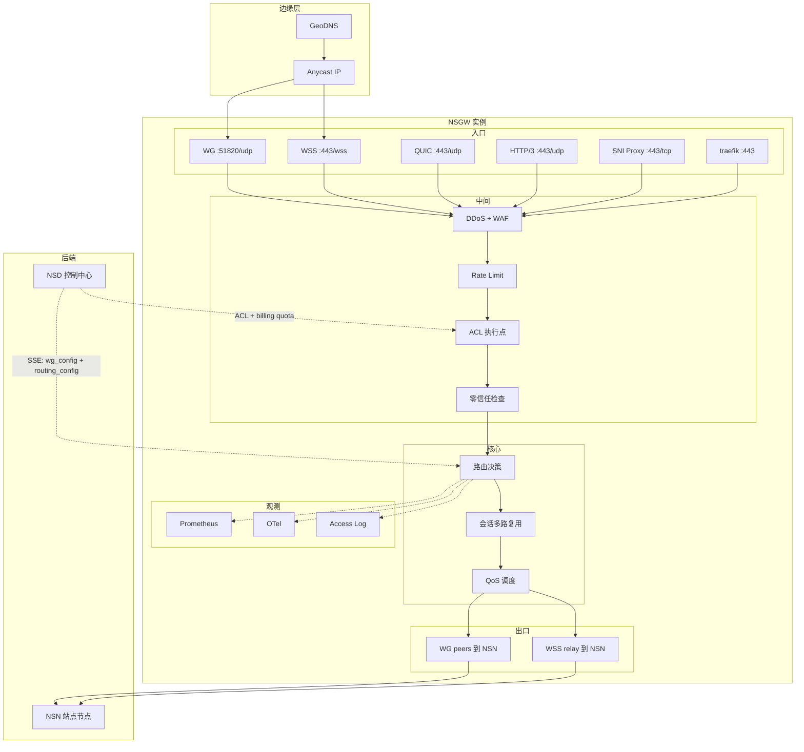

# NSGW 功能预测 · 生产化愿景

> **读者**: NSGW owner / 数据面架构师。
>
> **目标**: 在 [nsgw-capability-model.md](./nsgw-capability-model.md) 的六条能力轴下,逐项给出具体功能预测。格式与 [nsd-vision.md](./nsd-vision.md) 一致 —— **价值 / 用户故事 / 技术挑战 / 架构影响 / 落地级别**。

40+ 项功能。

---

## ① 连接 · 功能清单

### G1.1 WireGuard UDP 终结

- **现状**: ✅ mock `wg-setup.ts`(通过 shell `wg` 命令) + 生产 `tmp/gateway/main.go:327-329` (via `wgctrl-go`)。
- **目标**: 合并为生产 Go 实现,接入 NSIO SSE 契约。
- **技术挑战**: SSE 事件格式 (`wg_config`) 已定义(`tests/docker/nsgw-mock/src/index.ts:189-194`),生产 NSGW 要消费同样的 JSON。
- **落地级别**: MVP。

### G1.2 WSS Relay (WsFrame 协议)

- **现状**: ✅ mock 已完整实现 `wss-relay.ts:1-675`,包括"连接器↔客户端"缝合。
- **目标**: 生产级实现,迁到 Go/Rust;背压 + 多路复用。
- **技术挑战**: `probeOpenOnConnector` (mock `index.ts:130-144`) 这种"测试 NSN 是否接受 open" 的能力要泛化成健康探测。
- **落地级别**: MVP。

### G1.3 QUIC 数据面

- **现状**: NSD mock 侧有 `quic-listener.ts`(控制面用),NSGW 侧**数据面无 QUIC**。
- **价值**: QUIC 自带 loss recovery + 0-RTT,在移动网络下比 WSS 好;同时是 HTTP/3 的基础。
- **技术挑战**: 把 WsFrame 协议映射到 QUIC streams;选择 Go quic-go / Rust quinn 库。
- **落地级别**: GA。

### G1.4 Noise 数据面

- **现状**: NSD mock 有 `noise-listener.ts`(控制面用),NSGW 侧无。
- **价值**: 在 DPI 严苛环境下作为 WSS / QUIC 的替代。
- **落地级别**: 企业级。

### G1.5 MASQUE / HTTP/3 CONNECT-UDP

- **价值**: 通过 CDN 穿透严格防火墙,HTTPS 对外看起来是普通 HTTP/3 流量。
- **落地级别**: 企业级。

### G1.6 UDP Hole Punch Coordinator

- **现状**: ✅ 生产 gerbil 有 `HolePunchMessage` (`tmp/gateway/relay/relay.go:27-33`), `EncryptedHolePunchMessage`。
- **价值**: 两个 NSN / NSC 直连打洞,NSGW 只做 signaling,流量不经过自己。
- **落地级别**: GA。

### G1.7 内置 STUN

- **价值**: 客户端知道自己的公网映射 (用于 hole punch)。
- **落地级别**: GA。

### G1.8 内置 TURN 兜底

- **价值**: 打洞失败时中继。
- **技术挑战**: 引入 coturn-equivalent Go/Rust 实现;或利用现有 WSS relay 作为 TURN-like fallback。
- **落地级别**: 企业级。

### G1.9 PROXY Protocol v1

- **现状**: ✅ 生产 gerbil 已支持 (`tmp/gateway/main.go:134-223`,`proxyProtocol` flag,默认 `true`)。
- **落地级别**: MVP。

### G1.10 PROXY Protocol v2

- **价值**: v2 是二进制版,效率更高,支持 TLV 扩展(如携带 client cert 指纹)。
- **落地级别**: GA。

### G1.11 mTLS 终结

- **价值**: 特定域名强制客户端出示证书。
- **技术挑战**: traefik v3 支持 `clientCerts`,需要在 NSD 侧下发 CA bundle。
- **落地级别**: GA。

### G1.12 SO_REUSEPORT / 多进程负载

- **价值**: 单机多核并发处理 WG UDP,提高吞吐。
- **落地级别**: 企业级。

### G1.13 Gateway-to-Gateway Mesh

- **价值**: 多 NSGW 之间组 mesh,同 org 流量在 mesh 内转发。
- **落地级别**: 企业级。

---

## ② 路由 · 功能清单

### G2.1 WG Peer 动态同步

- **现状**: ✅ mock `subscribeToNsdSse` + 对比 `sseTrackedPeers` 增删 peer (`tests/docker/nsgw-mock/src/index.ts:201-292`)。
- **落地级别**: MVP。

### G2.2 traefik 动态路由

- **现状**: ✅ mock `handleRoutingConfig` 写文件 (`tests/docker/nsgw-mock/src/traefik-config.ts`);traefik 文件 provider watch。
- **扩展**: 中间件链 (rate-limit, auth, headers, retries)。
- **落地级别**: MVP (基础路由),GA (中间件)。

### G2.3 SNI 代理

- **现状**: ✅ 生产 `tmp/gateway/proxy/proxy.go:43-60` `SNIProxy`,含本地 SNI 白名单 `localSNIs`。
- **落地级别**: MVP (迁到 NSIO 栈)。

### G2.4 Anycast IP

- **价值**: 多地区 NSGW 共用一个 IP,BGP 自动就近。
- **技术挑战**: 需要自治系统 (AS) + BGP peering,或用 Cloudflare / AWS Global Accelerator 代做。
- **落地级别**: 企业级。

### G2.5 GeoDNS

- **价值**: 不用 Anycast 也能做地理就近。
- **落地级别**: GA。

### G2.6 跨网关热迁移

- **价值**: 用户从 US-East 挪到 EU-West(差旅),现有 TCP 连接不断。
- **技术挑战**: 需要 session 迁移 + 新 gateway 知道老会话状态。
- **落地级别**: 企业级。

### G2.7 路由优先级 + 回落

- **价值**: 主 NSN 健康时去主,不健康回落到备。
- **技术挑战**: traefik 有 `weighted` strategy,但"健康感知"需要自定义 healthcheck。
- **落地级别**: GA。

### G2.8 Path-based routing

- **价值**: `/api/*` 路由到一个 NSN,`/admin/*` 路由到另一个。
- **参考**: `tmp/control/src/components/PathMatchRenameModal.tsx`, `resource-target-address-item.tsx`。
- **落地级别**: GA。

### G2.9 Header-based routing

- **参考**: `tmp/control/src/components/HeadersInput.tsx`, `SetResourceHeaderAuthForm.tsx`。
- **落地级别**: GA。

### G2.10 A/B 测试路由

- **价值**: 按比例分流到 canary NSN。
- **落地级别**: 企业级。

### G2.11 Virtual Port 路由

- **现状**: ✅ mock `routing_config` 事件有 `virtual_port` 字段 (`tests/docker/nsgw-mock/src/index.ts:237-239`),traefik 把流量转发到 `nsn_wg_ip:virtual_port`。
- **落地级别**: MVP。

---

## ③ 安全 · 功能清单

### G3.1 基础限速

- **价值**: 防止滥用。
- **落地级别**: GA。

### G3.2 UDP flood 防御

- **价值**: WG handshake 是 UDP,易被 amplify 攻击。
- **落地级别**: GA。

### G3.3 IP 信誉 / CrowdSec

- **参考**: `tmp/control/install/crowdsec.go` 已有初步集成。
- **价值**: 借助社区情报挡恶意 IP。
- **落地级别**: GA。

### G3.4 WAF (基础)

- **价值**: 识别 SQL 注入 / XSS / 恶意 UA。
- **技术挑战**: traefik 接 Coraza / ModSecurity。
- **落地级别**: GA。

### G3.5 WAF (企业规则集)

- **价值**: OWASP CRS + 定制规则集。
- **落地级别**: 企业级。

### G3.6 Bot 管理

- **价值**: 挡爬虫 / 扫描器。
- **落地级别**: 企业级。

### G3.7 零信任策略点 (ZT Proxy)

- **价值**: 流量到达 NSGW 后,先问 NSD"这个用户能不能访问这个 resource",再决定放行。
- **参考**: `tmp/control/src/components/OrgPolicyRequired.tsx`, `OrgPolicyResult.tsx`, `ResourceAuthPortal.tsx`, `ResourceAccessDenied.tsx`。
- **落地级别**: 企业级。

### G3.8 Resource 级认证

- **参考**: `tmp/control/src/app/[orgId]/settings/resources/proxy/[niceId]/authentication/page.tsx`, `SetResourcePasswordForm.tsx`, `SetResourcePincodeForm.tsx`。
- **价值**: 某个 resource 访问时要输密码 / PIN / email 验证。
- **落地级别**: GA。

### G3.9 DDoS L3/L4

- **落地级别**: 企业级 (依赖上游)。

### G3.10 DDoS L7

- **价值**: challenge (JS / captcha) 识别机器人。
- **落地级别**: 企业级。

### G3.11 Trusted Upstream

- **现状**: ✅ gerbil 已支持 `trustedUpstreams` (`tmp/gateway/main.go:216`)。
- **价值**: 只有受信任上游能发 PROXY 协议头。
- **落地级别**: GA。

### G3.12 Slow loris 防护

- **价值**: 挡"慢连接攻击"。
- **落地级别**: GA。

---

## ④ 容灾 · 功能清单

### G4.1 健康检查端点

- **现状**: ✅ mock `/ready` + 生产 `/healthz`。
- **扩展**: 分段汇报 (WG / WSS / traefik / SSE 订阅分别状态)。
- **落地级别**: MVP。

### G4.2 Graceful Shutdown

- **现状**: ✅ gerbil `main.go:404-424` 有 `server.Shutdown(shutdownCtx)` 5 秒超时。
- **扩展**: drain 阶段拒新连接继续服务老连接,直到超时。
- **落地级别**: MVP。

### G4.3 热升级 (drain + swap)

- **价值**: 升级无中断。
- **技术挑战**: WG 内核接口的接管 —— 新进程接管同一个 `wg0`。
- **落地级别**: GA。

### G4.4 蓝绿部署

- **价值**: 两套完整栈并行,DNS/Anycast 切换瞬间。
- **落地级别**: GA。

### G4.5 金丝雀

- **价值**: 按比例分流到新版本。
- **落地级别**: 企业级。

### G4.6 跨区 Failover

- **价值**: 单区不可用时整体失败转移。
- **依赖**: Anycast 或 GeoDNS。
- **落地级别**: 企业级。

### G4.7 会话状态快照

- **价值**: WSS `activeSessions` 定期持久化,重启后恢复。
- **落地级别**: 企业级。

### G4.8 自愈 (auto-restart)

- **价值**: 进程崩溃自动重启 (systemd / k8s liveness)。
- **落地级别**: MVP。

### G4.9 配置回滚

- **价值**: traefik 配置写坏了能 rollback。
- **落地级别**: GA。

---

## ⑤ 观测 · 功能清单

### G5.1 Prometheus metrics

- **价值**: 标准指标: connections, bytes_in/out, handshake_success/fail, p99_latency。
- **落地级别**: MVP。

### G5.2 pprof

- **现状**: ✅ gerbil `tmp/gateway/main.go` 直接 `_ "net/http/pprof"` (裸挂)。
- **扩展**: 加 token 保护 + 默认只绑 127.0.0.1。
- **落地级别**: MVP。

### G5.3 OpenTelemetry traces

- **价值**: 每请求 trace_id,和 NSD / NSN 关联。
- **落地级别**: GA。

### G5.4 结构化访问日志

- **价值**: traefik access log JSON 化,送 SIEM。
- **落地级别**: GA。

### G5.5 连接级日志 (WG)

- **价值**: handshake / keepalive / error 事件。
- **落地级别**: GA。

### G5.6 带宽上报

- **现状**: ✅ gerbil `periodicBandwidthCheck` (`tmp/gateway/main.go:345-348`)。
- **扩展**: 改为推 Prometheus + 支持 OTel metrics。
- **落地级别**: MVP。

### G5.7 实时拓扑上报

- **价值**: 上报活跃 peer 到 NSD,NSD 聚合成拓扑图。
- **落地级别**: GA。

### G5.8 采样率控制

- **价值**: 高 QPS 下采样,避免淹没 telemetry。
- **落地级别**: 企业级。

### G5.9 内存 watchdog

- **现状**: ✅ gerbil `monitorMemory(512MB)` (`tmp/gateway/main.go:119`)。
- **落地级别**: MVP。

---

## ⑥ 资源管理 · 功能清单

### G6.1 每 peer 带宽计量

- **价值**: 精确统计每 WG peer 的 bytes_in/out。
- **现状**: ✅ gerbil `relay/relay.go` / `main.go` 已有计量雏形。
- **落地级别**: GA。

### G6.2 每 org 配额

- **价值**: org 超配额自动降速。
- **依赖**: NSD 下发 org 配额。
- **落地级别**: GA。

### G6.3 QoS 分类 (prod / dev / bulk)

- **价值**: 关键业务优先。
- **落地级别**: 企业级。

### G6.4 Linux tc 整形

- **价值**: 精确带宽控制。
- **落地级别**: 企业级。

### G6.5 eBPF 整形

- **价值**: tc 的现代替代。
- **落地级别**: 企业级 (可选)。

### G6.6 计费埋点

- **价值**: bytes / duration / connection 上报到 NSD billing (见 [nsd-vision.md](./nsd-vision.md) F5.13)。
- **落地级别**: GA。

### G6.7 WSS 背压

- **价值**: 慢消费者时向源反压,避免 OOM。
- **落地级别**: GA。

### G6.8 连接数上限 (per IP / per user)

- **价值**: 防止一个 user 吃光所有 socket。
- **落地级别**: GA。

### G6.9 过载降级

- **价值**: 系统过载时优先保证付费 tier。
- **落地级别**: 企业级。

### G6.10 cgroup / k8s limits

- **落地级别**: MVP (部署层)。

---

## 生产化 NSGW 架构全景

完整版本见 [diagrams/nsgw-vision-arch.mmd](./diagrams/nsgw-vision-arch.mmd)。

## 功能数量自检

- 连接: 13
- 路由: 11
- 安全: 12
- 容灾: 9
- 观测: 9
- 资源管理: 10

**合计 64 项 NSGW 功能**。

## 与 NSD 的协作矩阵

| NSGW 能力 | 需要 NSD 配合什么 |
|-----------|------------------|
| WG peer 动态同步 | SSE `wg_config` 事件 (✅ 已有) |
| traefik 动态路由 | SSE `routing_config` 事件 (✅ 已有) |
| mTLS 终结 | NSD 下发 CA bundle (❌ 待设计) |
| 零信任策略点 | NSD 提供 `POST /api/v1/authz` 查询接口 (❌ 待设计) |
| 每 org 配额 | NSD 下发配额配置 (❌ 待设计) |
| 计费埋点 | NSD 提供 `POST /api/v1/billing/ingest` 端点 (❌ 待设计) |
| 跨网关热迁移 | NSD 协调 session 转移 (❌ 待设计) |
| 拓扑上报 | NSD 加 `POST /api/v1/gateway/topology` 端点 (❌ 待设计) |
| CA bundle 更新 | 新 SSE 事件 `ca_bundle_update` (❌ 待设计) |

上述 "❌ 待设计" 事项详见 [control-plane-extensions.md](./control-plane-extensions.md)。

下一章 → [control-plane-extensions.md](./control-plane-extensions.md)
