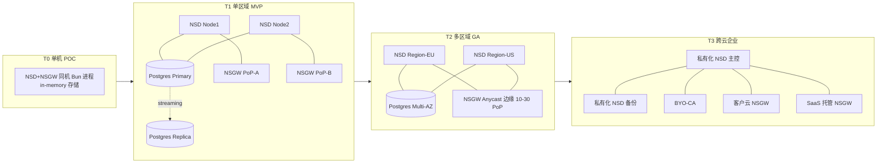
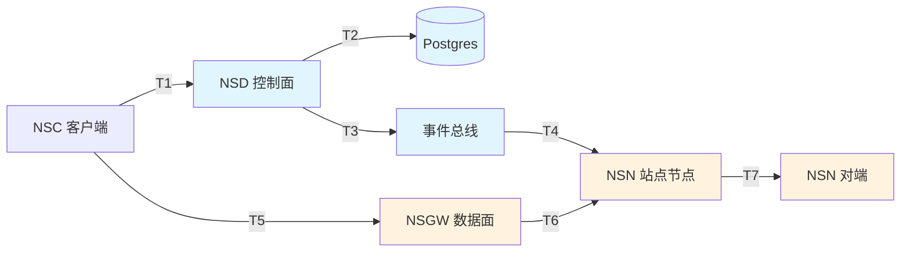
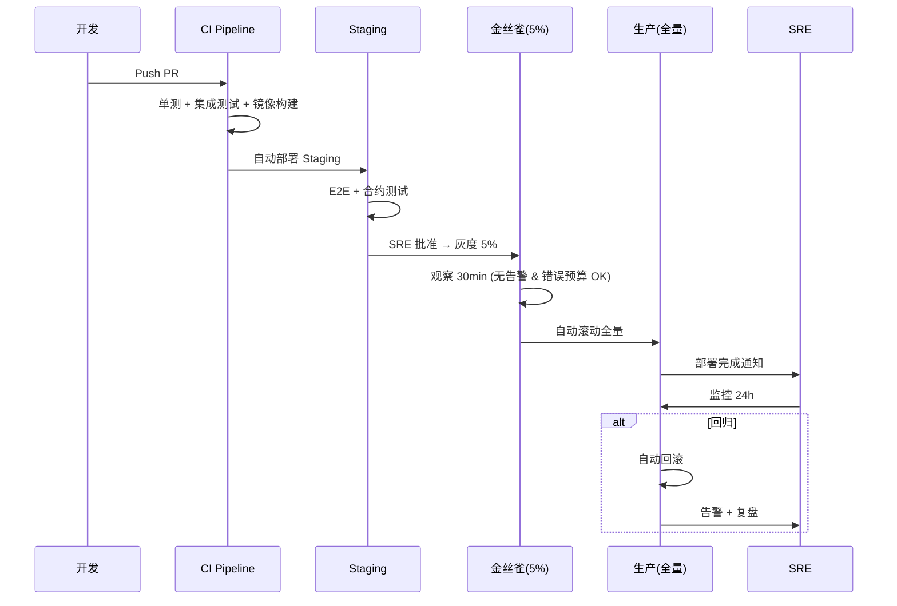
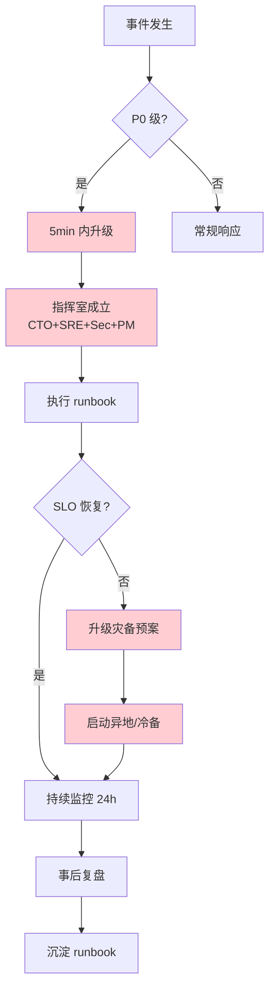

# 生产形态运维模型 (Operational Model)

> 本文件描述 NSD + NSGW 在 MVP / GA / Enterprise 三个阶段对应的 **部署拓扑 / SLA 指标 / 运维模式 / 灾备策略**, 是 Sub-11 愿景文档的运维面补充.
>
> 对照: [nsd-vision.md](./nsd-vision.md) · [nsgw-vision.md](./nsgw-vision.md) · [roadmap.md](./roadmap.md)

---

## 1. 部署拓扑 (Deployment Topology)

### 1.1 形态总览

### 1.2 各形态详细说明

#### T0 单机 POC (当前 mock 形态)

| 项 | 取值 |
|---|---|
| 目标用户 | 开发自测 / 5 以内小型实验 |
| 部署方式 | `docker-compose up` 或 `bun run nsd + bun run nsgw` |
| 存储 | in-memory Map (见 `tests/docker/nsd-mock/src/index.ts`) |
| 持久化 | ❌ 无, 重启清空 |
| 冗余 | ❌ 单点 |
| 运维负担 | ⚪ 无需任何运维动作 |
| 适用场景 | demo / PR 演示 / 单元测试 / 新员工上手 |

#### T1 单区域 MVP (10 人团队)

| 项 | 取值 |
|---|---|
| 目标用户 | 10 人内部团队 / 小型 SaaS 试点 |
| NSD | 2 实例负载均衡 (active-active), 前端 Nginx/Traefik |
| NSGW | 2 PoP (同区域不同 AZ), WG + WSS 双通道 |
| 存储 | Postgres 主从 (streaming replication), 10GB 起 |
| 密钥 | Vault / KMS 或 Postgres + KEK 分层加密 |
| 可观测 | Prometheus + Loki + Grafana 单集群, 保留 30 天 |
| 备份 | Postgres 日备 + WAL 归档至对象存储, RPO ≤ 5min |
| 容量 | ≤ 1k 节点, ≤ 100 QPS 事件, ≤ 10Gbps NSGW 中继 |
| 部署 | Helm chart on K8s 或 systemd on VM |

#### T2 多区域 GA (百 - 千节点企业)

| 项 | 取值 |
|---|---|
| 目标用户 | 100-1000 节点的企业 / 跨区域部署 |
| NSD | 多区域 active-active, 区域内 3 副本, Raft-like 共识 (etcd / Postgres logical replication) |
| NSGW | Anycast DNS 调度, 10-30 PoP 覆盖主要区域, 全球 < 100ms RTT |
| 存储 | Postgres Multi-AZ + 读副本, PITR 回溯 7 天 |
| 密钥 | HSM 托管或 Cloud KMS 硬件支持 |
| 可观测 | OpenTelemetry 全链路 trace, 指标聚合至中心化 Mimir/Thanos, 跨区域告警 |
| 备份 | 对象存储跨区复制, RPO ≤ 1min, RTO ≤ 15min |
| 容量 | 10k 节点, 10k QPS 事件, 100Gbps NSGW 中继总量 |
| 部署 | Terraform + Helm, 主从集群蓝绿发布 |
| 合规 | SOC2 Type II, ISO 27001, GDPR 数据驻留 |

#### T3 跨云企业 / 私有化 (大型 / 金融 / 政府)

| 项 | 取值 |
|---|---|
| 目标用户 | 万级节点 / 金融 / 政府 / 军工 |
| NSD | 完整私有化部署, 支持 air-gapped, NSD 联邦 (multi-NSD 并存, 见 `crates/control/src/multi.rs` `MultiControlPlane`) |
| NSGW | 客户自有 PoP + SaaS 混合, 按合规要求分区 |
| 存储 | Postgres + ETCD + 对象存储, 三地五中心或两地三中心 |
| 密钥 | BYO-CA / HSM (见 [data-plane-extensions.md](./data-plane-extensions.md) D9) |
| 可观测 | 对接客户 SIEM (Splunk / QRadar) + WORM 审计存储 |
| 备份 | 异地冷备 + 定期演练, RPO ≤ 30s, RTO ≤ 5min |
| 合规 | 等保三级 / FedRAMP High / PCI-DSS / HIPAA |
| 运维 | 7x24 on-call + SRE 团队 |

---

## 2. SLA 指标定义

### 2.1 SLA 分级表

| 指标 | MVP | GA | Enterprise |
|---|---|---|---|
| **NSD 控制面可用率** | 99.0% (月度) | 99.9% | 99.99% |
| **NSD API P99 延迟** | < 500ms | < 200ms | < 100ms |
| **配置下发延迟 (NSD → NSN)** | < 60s | < 10s | < 2s |
| **NSGW 数据面可用率** | 99.5% | 99.95% | 99.99% |
| **NSGW 中继附加延迟** | < 50ms | < 20ms | < 10ms |
| **P2P 打洞成功率** | 60% (best effort) | 80% | 90% |
| **事件通知送达** | < 5s | < 1s | < 500ms |
| **审计日志完整性** | 最终一致 | 强一致 | WORM 存储 + 哈希链 |
| **RPO (数据恢复点目标)** | ≤ 5min | ≤ 1min | ≤ 30s |
| **RTO (恢复时间目标)** | ≤ 1h | ≤ 15min | ≤ 5min |

### 2.2 SLA 度量点

| 度量点 | 含义 | SLO 目标 (GA) |
|---|---|---|
| T1 | NSC → NSD API 响应 | P99 < 200ms |
| T2 | NSD → DB 写入 | P95 < 50ms |
| T3 | NSD → 事件总线发布 | P99 < 100ms |
| T4 | 事件总线 → NSN 收到 | P99 < 10s |
| T5 | NSC → NSGW 建连 | P99 < 3s |
| T6 | NSGW → NSN 转发 | P99 延迟叠加 < 20ms |
| T7 | P2P 直连 | 成功率 ≥ 80% |

### 2.3 错误预算 (Error Budget)

- **NSD 99.9% 可用性** → 月度允许停机 ≈ 43 分钟
- **NSGW 99.95% 可用性** → 月度允许中断 ≈ 21 分钟
- 预算耗尽触发自动冻结非紧急发布 (见 [feature-matrix.md](./feature-matrix.md) Reliability R6)

---

## 3. 运维模式 (Operations Model)

### 3.1 团队结构演进

| 阶段 | NSD 团队 | NSGW 团队 | SRE | 安全 | 总计 |
|---|---|---|---|---|---|
| MVP | 2 | 1 | 1 兼职 | 1 兼职 | ≈ 4-5 人 |
| GA | 4-5 | 3 | 2-3 | 1 | ≈ 10-12 |
| Enterprise | 6-8 | 5-6 | 4-5 | 2-3 | ≈ 17-22 |

### 3.2 发布流程

### 3.3 变更管理

| 变更级别 | 审批 | 时间窗 | 回滚要求 |
|---|---|---|---|
| L0 (config 热加载) | 自动 | 任意时段 | 热回滚 < 1min |
| L1 (小版本) | Team Lead | 工作时段 | 滚动回滚 < 15min |
| L2 (大版本 / schema) | Arch + SRE | 维护窗口 | 蓝绿切换 < 5min |
| L3 (架构变更) | CTO + 全体架构 | 维护窗口 + 预通知 | 需演练 + 数据迁移方案 |

### 3.4 On-call 策略

- **MVP**: 工作日 9-21 on-call, 非工作时段 best-effort
- **GA**: 7x24 on-call, 2 人轮班, 响应 P0 < 15min / P1 < 1h / P2 < 4h
- **Enterprise**: 7x24 on-call, follow-the-sun (EU / US / APAC 三地轮值), P0 < 5min

### 3.5 运行手册 (Runbook) 清单

必备 runbook (覆盖能力模型六大轴):

| Runbook | 对应轴 | MVP 需要 | GA 需要 | Enterprise 需要 |
|---|---|---|---|---|
| NSD 启动失败排查 | Reliability | ✅ | ✅ | ✅ |
| Postgres 故障切换 | Reliability | ✅ | ✅ | ✅ |
| NSGW PoP 下线调度 | 资源 | ⚪ | ✅ | ✅ |
| 证书到期轮换 | 安全 | ✅ | ✅ | ✅ |
| 节点吊销 / 紧急封禁 | Policy | ✅ | ✅ | ✅ |
| 审计日志导出合规 | Observability | ⚪ | ✅ | ✅ |
| BYO-CA 密钥轮换 | 安全 | ❌ | ⚪ | ✅ |
| 跨区域脑裂恢复 | Topology | ❌ | ✅ | ✅ |
| 多 NSD 联邦合并冲突 | Ecosystem | ❌ | ⚪ | ✅ |
| 合规数据删除 (GDPR) | Policy | ❌ | ✅ | ✅ |
| 安全事件响应 | 安全 | ⚪ | ✅ | ✅ |
| 灾备演练 | Reliability | ❌ | ✅ | ✅ |

---

## 4. 灾备策略 (Disaster Recovery)

### 4.1 威胁模型

| 威胁 | MVP 对策 | GA 对策 | Enterprise 对策 |
|---|---|---|---|
| 单进程崩溃 | systemd / K8s 自动重启 | 同 + 健康检查 | 同 + 自动故障转移 |
| 节点故障 | 主从切换 | 多副本共识 | 多区域共识 |
| AZ 故障 | ❌ (单 AZ) | Multi-AZ 自动切换 | 同 + 跨 AZ 事务 |
| 区域故障 | ❌ | 区域故障人工切换 | 异地自动切换 |
| 数据误删 | PITR 回溯 | PITR + 逻辑备份 | WORM + 异地冷备 |
| 密钥泄露 | 重新签发 + 轮换 | 同 + HSM | BYO-CA + 立即吊销 |
| DDoS 攻击 | 上游 CDN 过滤 | Anycast + 限流 | 专线 + 清洗中心 |
| 勒索软件 | 离线备份 | 离线 + 版本保留 | WORM + 多副本 + 反勒索沙箱 |
| 内部滥用 | 审计日志 | 审计 + 双人操作 | 审计 + 最小权限 + 行为分析 |
| 供应链攻击 | 依赖锁定 | SBOM + 扫描 | BYO-CA + 签名验证 + 审计供应商 |

### 4.2 备份矩阵

| 数据类别 | 频率 | 保留期 | 存储介质 | 加密 |
|---|---|---|---|---|
| Postgres 全量 | 每日 | 30 天 (MVP) / 90 天 (GA) / 7 年 (ENT) | S3/OSS 冷存储 | AES-256 + KMS |
| Postgres WAL | 连续 | 7 天 | S3 标准存储 | AES-256 |
| 审计日志 | 实时流式 | 90 天 (MVP) / 1 年 (GA) / 7 年 (ENT) | WORM 对象存储 | 客户管理密钥 (CMK) |
| 配置快照 | 每次变更 | 无限 | Git + 对象存储 | 签名链 |
| 密钥材料 | 轮换时 | 3 代历史 | HSM / KMS | 硬件保护 |
| 镜像/二进制 | 每次构建 | 1 年 | Registry | 签名 (cosign) |

### 4.3 灾备演练要求

- **MVP**: 季度演练一次, 覆盖 Postgres 主从切换
- **GA**: 月度演练, 轮流覆盖主从切换 / AZ 故障 / 配置回滚 / 证书轮换
- **Enterprise**: 月度 + 合规季度演练, 覆盖跨区域切换 / BYO-CA 轮换 / 全链路故障注入

### 4.4 业务连续性计划 (BCP)

---

## 5. 成本模型 (Cost Envelope)

> 下面给出典型规模下的**数量级**估算 (仅作规划参考, 非承诺, 不包括人力).

| 规模 | NSD 计算 | NSGW 计算 | 存储 | 带宽 | 合计/月 (参考) |
|---|---|---|---|---|---|
| MVP (1k 节点) | 2 × c6i.large | 2 × c6i.xlarge + 5TB 流量 | 50GB Postgres + 100GB 日志 | 5TB | 低 (数百美元量级) |
| GA (10k 节点) | 6 × c6i.xlarge | 20 PoP × c6in.2xlarge + 100TB 流量 | 500GB + 1TB 日志 | 100TB | 中 (数千美元量级) |
| Enterprise (100k 节点) | 私有化 / 按客户自备 | 私有化 + SaaS 混合 | PB 级 WORM | PB 级 | 高 (依定制范围) |

---

## 6. 关键决策点 (Open Questions)

| 决策 | 影响 | 拟定时机 |
|---|---|---|
| Postgres 是否改用 CockroachDB / Yugabyte (多区域原生) | 大 | GA 立项前 |
| NSGW 是否引入 QUIC 作为主协议 | 中 | Phase 2 初 |
| 事件总线选型 (NATS / Kafka / Redis Stream) | 大 | MVP 收尾前 |
| 审计日志是否入 SIEM (Splunk/ElasticSIEM) | 中 | GA 商业版定义时 |
| 合规认证 (SOC2 / ISO / 等保) 优先级 | 大 | 商业目标锁定后 |
| 多 NSD 联邦的一致性协议 (参考 `crates/control/src/merge.rs`) | 大 | Enterprise 立项前 |

---

## 7. 与其他文档关系

- **上游**: [roadmap.md](./roadmap.md) (阶段划分的时间线)
- **能力对应**: [nsd-capability-model.md](./nsd-capability-model.md) / [nsgw-capability-model.md](./nsgw-capability-model.md) (Reliability / 资源 轴)
- **功能依赖**: [feature-matrix.md](./feature-matrix.md) (逐项 SLA 要求)
- **扩展面**: [control-plane-extensions.md](./control-plane-extensions.md) C6 (Webhook) / C7 (事件总线)
- **下游**: 实际 IaC 模板 / 监控面板 / runbook 会在 Phase 1-3 各项目内沉淀, 不在本愿景文档中展开.
